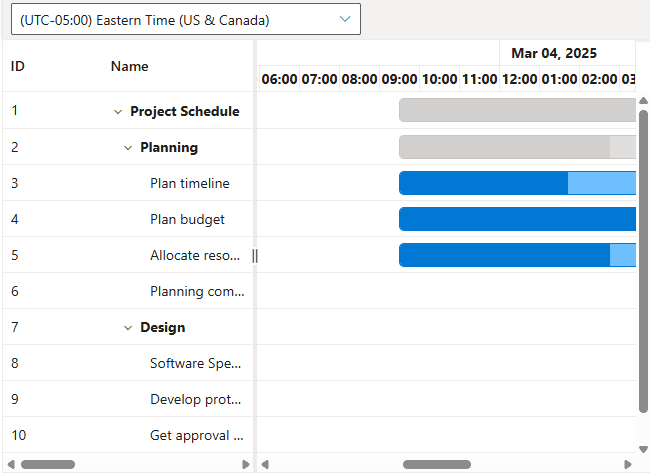

# Timezone support in Blazor Gantt Chart

The [Blazor Gantt Chart](https://www.syncfusion.com/blazor-components/blazor-gantt-chart) component schedules and displays dates and times based on the system timezone. To configure the Gantt Chart to use a specific timezone, assign the desired value to the [Timezone](https://help.syncfusion.com/cr/blazor/Syncfusion.Blazor.Gantt.SfGantt-1.html#Syncfusion_Blazor_Gantt_SfGantt_1_Timezone) property accepts a standard IANA timezone string, such as `UTC` or `America/New_York`. This ensures that task dates, event markers, baseline dates, and indicators are interpreted and rendered in the specified timezone, with automatic handling of daylight saving time (DST) transitions.

## Timezone date conversion

The `Timezone` property enables the Gantt Chart to convert and display all task-related dates, including start dates, end dates, event markers, and baseline dates, in the specified timezone. For example, a `DateTime` value defined as `new DateTime(2025, 2, 4, 8, 0, 0)` in a system set to Pacific Standard Time (PST, UTC-08:00) will be adjusted to `2025-02-03 09:30 PM` when the `Timezone` property is set to `America/New_York` (ET, UTC-05:00 during standard time). This conversion ensures accurate scheduling and visualization of tasks across different timezones, accounting for DST where applicable.

## Setting the timezone

The `Timezone` property can be assigned a standard IANA timezone string, such as `UTC`, `America/New_York`, or `Europe/London`, to control how dates are displayed. The following example demonstrates configuring the Gantt Chart with the `America/New_York` timezone and includes a dropdown to dynamically update the timezone, triggering a re-render of all task dates.




@using Syncfusion.Blazor.Gantt
@using Syncfusion.Blazor.DropDowns
@using Syncfusion.Blazor.Navigations
<SfGantt DataSource="@TaskCollection" Toolbar="@toolbarItems" DateFormat="d MMM yyyy hh:mm tt" IncludeWeekend="true" DurationUnit="DurationUnit.Hour" Height="475px" Width="650px" Timezone="@TimeZone"
         TreeColumnIndex="1">
    <GanttTaskFields Id="TaskID" Name="TaskName" StartDate="StartDate" EndDate="EndDate" Duration="Duration" Progress="Progress"
                     Dependency="Predecessor" ParentID="ParentID"></GanttTaskFields>
    <GanttDayWorkingTimeCollection>
        <GanttDayWorkingTime From="0" To="23"></GanttDayWorkingTime>
    </GanttDayWorkingTimeCollection>
    <GanttTimelineSettings TimelineUnitSize="40">
        <GanttTopTierSettings Unit="TimelineViewMode.Day" Format="MMM dd, yyyy"></GanttTopTierSettings>
        <GanttBottomTierSettings Unit="TimelineViewMode.Hour" Count="1" Format="hh:mm"></GanttBottomTierSettings>
    </GanttTimelineSettings>
</SfGantt>
@code {
    public List<TaskData>? TaskCollection { get; set; }
    private List<Object>? toolbarItems;
    public string TimeZone { get; set; } = "America/New_York";
    public string SelectedTimeZone { get; set; } = "America/New_York";
    public class TimeZoneFields
    {
        public string? Id { get; set; }
        public string? Text { get; set; }
    }
    private static List<TimeZoneFields> TimeZoneValues = new List<TimeZoneFields>()
    {
        new TimeZoneFields { Id = "Etc/UTC", Text = "(UTC) Coordinated Universal Time" },
        new TimeZoneFields { Id = "America/New_York", Text = "(UTC-05:00) Eastern Time (US & Canada)" },
        new TimeZoneFields { Id = "America/Chicago", Text = "(UTC-06:00) Central Time (US & Canada)" },
        new TimeZoneFields { Id = "America/Denver", Text = "(UTC-07:00) Mountain Time (US & Canada)" },
        new TimeZoneFields { Id = "Europe/London", Text = "(UTC+00:00) Dublin, Edinburgh, Lisbon, London" },
        new TimeZoneFields { Id = "Europe/Berlin", Text = "(UTC+01:00) Amsterdam, Berlin, Rome, Vienna, Stockholm" },
        new TimeZoneFields { Id = "Asia/Kolkata", Text = "(UTC+05:30) Chennai, Kolkata, Mumbai, New Delhi" },
        new TimeZoneFields { Id = "Asia/Tokyo", Text = "(UTC+09:00) Osaka, Sapporo, Tokyo" }
    };
    protected override void OnInitialized()
    {
        TaskCollection = GetTaskCollection().ToList();
        toolbarItems = new List<object>()
        {
            new ItemModel
            {
                Id = "TimeZoneDropDown",
                Align = ItemAlign.Left,
                Template = (RenderFragment)(builder =>
                {
                    builder.OpenComponent<SfDropDownList<string, TimeZoneFields>>(0);
                    builder.AddAttribute(1, "Width", "350px");
                    builder.AddAttribute(2, "DataSource", TimeZoneValues);
                    builder.AddAttribute(3, "Placeholder", "Select a Timezone");
                    builder.AddAttribute(4, "Value", SelectedTimeZone);
                    builder.AddAttribute(5, "ValueChanged", EventCallback.Factory.Create<string>(this, v => SelectedTimeZone = v));
                    builder.AddAttribute(6, "Text", "Text");
                    builder.AddAttribute(7, "ValueField", "Id");
                    builder.AddAttribute(8, "TItem", typeof(TimeZoneFields));
                    builder.AddAttribute(9, "ChildContent", (RenderFragment)(childBuilder =>
                    {
                        childBuilder.OpenComponent<DropDownListFieldSettings>(0);
                        childBuilder.AddAttribute(1, "Text", "Text");
                        childBuilder.AddAttribute(2, "Value", "Id");
                        childBuilder.CloseComponent();
                        childBuilder.OpenComponent<DropDownListEvents<string, TimeZoneFields>>(3);
                        childBuilder.AddAttribute(4, "ValueChange", EventCallback.Factory.Create<ChangeEventArgs<string, TimeZoneFields>>(this, OnTimeZoneChanged));
                        childBuilder.CloseComponent();
                    }));
                    builder.CloseComponent();
                })
            },
        };
    }
    public async Task OnTimeZoneChanged(Syncfusion.Blazor.DropDowns.ChangeEventArgs<string, TimeZoneFields> args)
    {
        if (!string.IsNullOrEmpty(args.Value))
        {
            SelectedTimeZone = args.Value;
            TimeZone = args.Value;
        }
        await Task.CompletedTask;
    }
    public class TaskData
    {
        public int TaskID { get; set; }
        public string? TaskName { get; set; }
        public DateTime? StartDate { get; set; }
        public DateTime? EndDate { get; set; }
        public string? Duration { get; set; }
        public int Progress { get; set; }
        public string? Predecessor { get; set; }
        public int? ParentID { get; set; }
    }
    public static List<TaskData> GetTaskCollection()
    {
        List<TaskData> Tasks = new List<TaskData>()
        {
            new TaskData { TaskID = 1, TaskName = "Project Schedule", StartDate = new DateTime(2025, 3, 4, 8, 0, 0), EndDate = new DateTime(2025, 4, 10, 0, 0, 0), Progress = 0 },
            new TaskData { TaskID = 2, TaskName = "Planning", StartDate = new DateTime(2025, 3, 4, 8, 0, 0), EndDate = new DateTime(2025, 3, 10, 0, 0, 0), ParentID = 1, Progress = 0 },
            new TaskData { TaskID = 3, TaskName = "Plan timeline", StartDate = new DateTime(2025, 3, 4, 8, 0, 0), EndDate = new DateTime(2025, 3, 10, 0, 0, 0), Duration = "6", Progress = 60, ParentID = 2 },
            new TaskData { TaskID = 4, TaskName = "Plan budget", StartDate = new DateTime(2025, 3, 4, 8, 0, 0), EndDate = new DateTime(2025, 3, 10, 0, 0, 0), Duration = "6", Progress = 90, ParentID = 2 },
            new TaskData { TaskID = 5, TaskName = "Allocate resources", StartDate = new DateTime(2025, 3, 4, 8, 0, 0), EndDate = new DateTime(2025, 3, 10, 0, 0, 0), Duration = "6", Progress = 75, ParentID = 2 },
            new TaskData { TaskID = 6, TaskName = "Planning complete", StartDate = new DateTime(2025, 3, 6, 8, 0, 0), EndDate = new DateTime(2025, 3, 10, 0, 0, 0), Duration = "0", Predecessor = "3FS,4FS,5FS", ParentID = 2, Progress = 0 },
            new TaskData { TaskID = 7, TaskName = "Design", StartDate = new DateTime(2025, 3, 13, 8, 0, 0), EndDate = new DateTime(2025, 3, 17, 8, 0, 0), ParentID = 1, Progress = 0 },
            new TaskData { TaskID = 8, TaskName = "Software Specification", StartDate = new DateTime(2025, 3, 13, 8, 0, 0), EndDate = new DateTime(2025, 3, 15, 0, 0, 0), Duration = "3", Progress = 60, Predecessor = "6FS", ParentID = 7 },
            new TaskData { TaskID = 9, TaskName = "Develop prototype", StartDate = new DateTime(2025, 3, 13, 8, 0, 0), EndDate = new DateTime(2025, 3, 15, 0, 0, 0), Duration = "3", Progress = 100, Predecessor = "6FS", ParentID = 7 },
            new TaskData { TaskID = 10, TaskName = "Get approval from customer", StartDate = new DateTime(2025, 3, 16, 8, 0, 0), EndDate = new DateTime(2025, 3, 17, 8, 0, 0), Duration = "2", Progress = 100, Predecessor = "9FS", ParentID = 7 },
            new TaskData { TaskID = 11, TaskName = "Design complete", StartDate = new DateTime(2025, 3, 17, 8, 0, 0), EndDate = new DateTime(2025, 3, 17, 8, 0, 0), Duration = "0", Predecessor = "10FS", ParentID = 7, Progress = 0 }
        };
        return Tasks;
    }
}






### CRUD operations with timezone

CRUD operations in the Blazor Gantt Chart respect the configured `Timezone` property, ensuring consistent date and time handling. When adding a task, the start date is calculated based on the minimum start date in the dataset and converted to the specified timezone. Editing or deleting tasks processes `StartDate` and `EndDate` values in the configured timezone, maintaining consistency in visualization, data storage, and export operations.

This following code enables adding, editing, and deleting tasks in the Blazor Gantt Chart, with all operations processed in the `America/New_York` timezone. The `GanttEditSettings` properties (`AllowAdding`, `AllowEditing`, `AllowDeleting`, `AllowTaskbarEditing`) enable CRUD functionality, while the `Timezone` property ensures that task dates are converted and displayed consistently. The `GanttTaskFields` map nullable `StartDate` and `EndDate` properties to handle optional date values, and the `GanttDayWorkingTimeCollection` supports 24-hour scheduling in the specified timezone.




@using Syncfusion.Blazor.Gantt

<SfGantt DataSource="@TaskCollection" Timezone="America/New_York" Toolbar="@(new List<string>() { "Add", "Edit", "Delete" })" DateFormat="d MMM yyyy hh:mm tt" IncludeWeekend="true" DurationUnit="DurationUnit.Hour" Height="475px" Width="650px"
         TreeColumnIndex="1">
    <GanttTaskFields Id="TaskID" Name="TaskName" StartDate="StartDate" EndDate="EndDate" Duration="Duration" Progress="Progress"
                     Dependency="Predecessor" ParentID="ParentID"></GanttTaskFields>
    <GanttDayWorkingTimeCollection>
        <GanttDayWorkingTime From="0" To="23"></GanttDayWorkingTime>
    </GanttDayWorkingTimeCollection>
    <GanttEditSettings AllowAdding="true" AllowDeleting="true" AllowEditing="true" AllowTaskbarEditing="true"></GanttEditSettings>
    <GanttTimelineSettings TimelineUnitSize="40">
        <GanttTopTierSettings Unit="TimelineViewMode.Day" Format="MMM dd, yyyy"></GanttTopTierSettings>
        <GanttBottomTierSettings Unit="TimelineViewMode.Hour" Count="1" Format="hh:mm"></GanttBottomTierSettings>
    </GanttTimelineSettings>
</SfGantt>
@code {
    public List<TaskData>? TaskCollection { get; set; }
    
    protected override void OnInitialized()
    {
        TaskCollection = GetTaskCollection().ToList();
    }
    public class TaskData
    {
        public int TaskID { get; set; }
        public string? TaskName { get; set; }
        public DateTime? StartDate { get; set; }
        public DateTime? EndDate { get; set; }
        public string? Duration { get; set; }
        public int Progress { get; set; }
        public string? Predecessor { get; set; }
        public int? ParentID { get; set; }
    }
    public static List<TaskData> GetTaskCollection()
    {
        List<TaskData> Tasks = new List<TaskData>()
        {
            new TaskData { TaskID = 1, TaskName = "Project Schedule", StartDate = new DateTime(2025, 3, 4, 8, 0, 0), EndDate = new DateTime(2025, 4, 10, 0, 0, 0), Progress = 0 },
            new TaskData { TaskID = 2, TaskName = "Planning", StartDate = new DateTime(2025, 3, 4, 8, 0, 0), EndDate = new DateTime(2025, 3, 10, 0, 0, 0), ParentID = 1, Progress = 0 },
            new TaskData { TaskID = 3, TaskName = "Plan timeline", StartDate = new DateTime(2025, 3, 4, 8, 0, 0), EndDate = new DateTime(2025, 3, 10, 0, 0, 0), Duration = "6", Progress = 60, ParentID = 2 },
            new TaskData { TaskID = 4, TaskName = "Plan budget", StartDate = new DateTime(2025, 3, 4, 8, 0, 0), EndDate = new DateTime(2025, 3, 10, 0, 0, 0), Duration = "6", Progress = 90, ParentID = 2 },
            new TaskData { TaskID = 5, TaskName = "Allocate resources", StartDate = new DateTime(2025, 3, 4, 8, 0, 0), EndDate = new DateTime(2025, 3, 10, 0, 0, 0), Duration = "6", Progress = 75, ParentID = 2 },
            new TaskData { TaskID = 6, TaskName = "Planning complete", StartDate = new DateTime(2025, 3, 6, 8, 0, 0), EndDate = new DateTime(2025, 3, 10, 0, 0, 0), Duration = "0", Predecessor = "3FS,4FS,5FS", ParentID = 2, Progress = 0 },
            new TaskData { TaskID = 7, TaskName = "Design", StartDate = new DateTime(2025, 3, 13, 8, 0, 0), EndDate = new DateTime(2025, 3, 17, 8, 0, 0), ParentID = 1, Progress = 0 },
            new TaskData { TaskID = 8, TaskName = "Software Specification", StartDate = new DateTime(2025, 3, 13, 8, 0, 0), EndDate = new DateTime(2025, 3, 15, 0, 0, 0), Duration = "3", Progress = 60, Predecessor = "6FS", ParentID = 7 },
            new TaskData { TaskID = 9, TaskName = "Develop prototype", StartDate = new DateTime(2025, 3, 13, 8, 0, 0), EndDate = new DateTime(2025, 3, 15, 0, 0, 0), Duration = "3", Progress = 100, Predecessor = "6FS", ParentID = 7 },
            new TaskData { TaskID = 10, TaskName = "Get approval from customer", StartDate = new DateTime(2025, 3, 16, 8, 0, 0), EndDate = new DateTime(2025, 3, 17, 8, 0, 0), Duration = "2", Progress = 100, Predecessor = "9FS", ParentID = 7 },
            new TaskData { TaskID = 11, TaskName = "Design complete", StartDate = new DateTime(2025, 3, 17, 8, 0, 0), EndDate = new DateTime(2025, 3, 17, 8, 0, 0), Duration = "0", Predecessor = "10FS", ParentID = 7, Progress = 0 }
        };
        return Tasks;
    }
}




