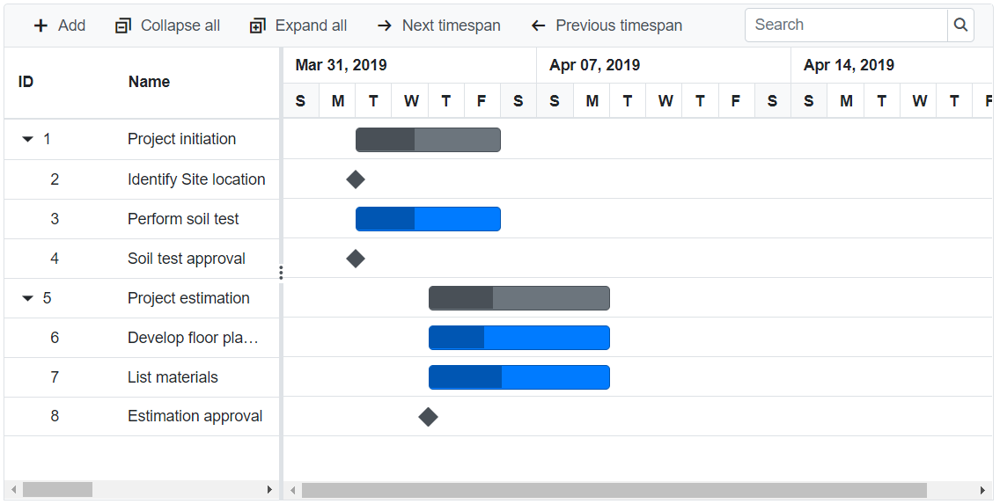
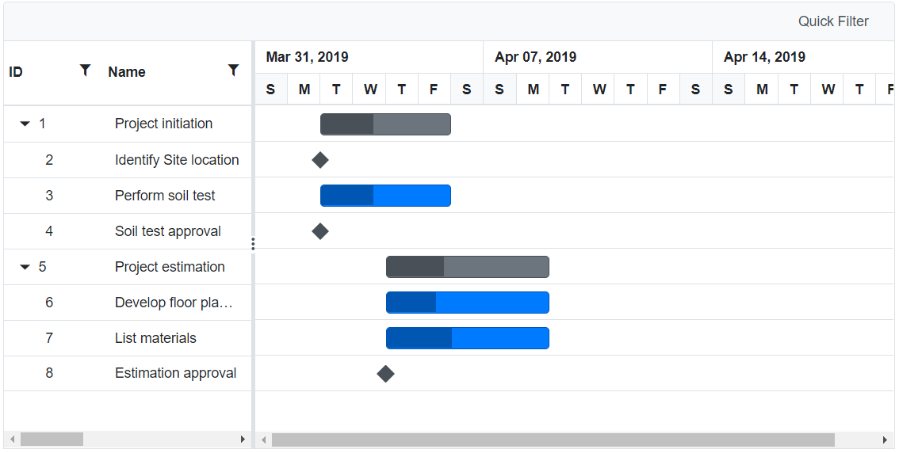
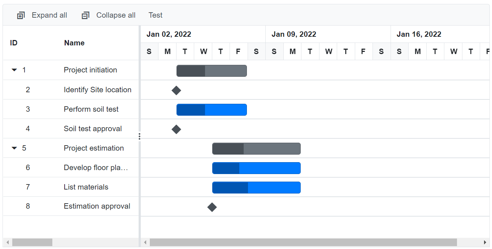
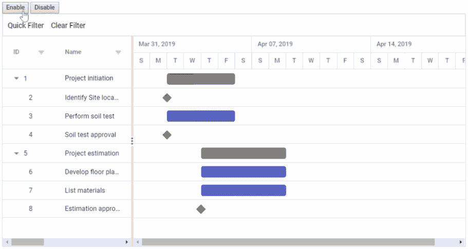

# Toolbar in Blazor Gantt Chart Component

The Gantt Chart component provides the toolbar support to handle Gantt Chart actions. The [Toolbar](https://help.syncfusion.com/cr/blazor/Syncfusion.Blazor.Gantt.SfGantt-1.html#Syncfusion_Blazor_Gantt_SfGantt_1_Toolbar) property accepts the collection of built-in toolbar items and `ToolbarItem` objects for custom toolbar items.

## Built-in toolbar items

Built-in toolbar items execute standard actions of the Gantt Chart component, and these items can be added to toolbar by defining the `Toolbar` as a collection of built-in items. It renders the button with icon and text.

The following table shows built-in toolbar items and its actions.

| Built-in Toolbar Items | Actions |
|------------------------|---------|
| Add | Adds a new record. |
| Cancel | Cancels the edit state. |
| CollapseAll | Collapses all the rows. |
| Delete | Deletes the selected record. |
| Edit | Edits the selected record. |
| Indent | Indent the selected record to one level. |
| Outdent | Outdent the selected record to one level. |
| ExpandAll | Expands all the rows. |
| NextTimeSpan | Navigate the Gantt Chart timeline to next time span. |
| PrevTimeSpan | Navigate the Gantt Chart timeline to previous time span. |
| Search | Searches the records by the given key. |
| Update | Updates the edited record. |
| ZoomIn | To perform zoom-in action on Gantt Chart timeline. |
| ZoomOut | To perform zoom-out action on Gantt Chart timeline. |
| ZoomToFit | To show all tasks with timeline fit into available Chart width. |

```cshtml
@using Syncfusion.Blazor.Gantt
<SfGantt DataSource="@TaskCollection" Toolbar="@(new List<string>() { "Add", "Cancel", "CollapseAll", "Delete", "Edit", "ExpandAll", "NextTimeSpan", "PrevTimeSpan", "Search", "Update", "Indent", "Outdent" })" Height="450px" Width="900px">
    <GanttTaskFields Id="TaskId" Name="TaskName" StartDate="StartDate" EndDate="EndDate"
                     Duration="Duration" Progress="Progress" ParentID="ParentId">
    </GanttTaskFields>
    <GanttSearchSettings Fields="@Searchfields"></GanttSearchSettings>
    <GanttEditSettings AllowEditing="true" AllowAdding="true" AllowDeleting="true">
    </GanttEditSettings>
</SfGantt>

@code{
    public string[] Searchfields = new string[] { "TaskId", "TaskName", "StartDate", "EndDate", "Duration", "Progress" };
    private List<TaskData> TaskCollection { get; set; }
    protected override void OnInitialized()
    {
        this.TaskCollection = GetTaskCollection();
    }

    public class TaskData
    {
        public int TaskId { get; set; }
        public string TaskName { get; set; }
        public DateTime StartDate { get; set; }
        public DateTime? EndDate { get; set; }
        public string Duration { get; set; }
        public int Progress { get; set; }
        public int? ParentId { get; set; }
    }

    private static List<TaskData> GetTaskCollection()
    {
        List<TaskData> Tasks = new List<TaskData>()
        {
            new TaskData() { TaskId = 1, TaskName = "Project initiation", StartDate = new DateTime(2022, 01, 04), EndDate = new DateTime(2022, 01, 17), },
            new TaskData() { TaskId = 2, TaskName = "Identify Site location", StartDate = new DateTime(2022, 01, 04), Duration = "0", Progress = 30, ParentId = 1, },
            new TaskData() { TaskId = 3, TaskName = "Perform soil test", StartDate = new DateTime(2022, 01, 04), Duration = "4", Progress = 40, ParentId = 1, },
            new TaskData() { TaskId = 4, TaskName = "Soil test approval", StartDate = new DateTime(2022, 01, 04), Duration = "0", Progress = 30, ParentId = 1, },
            new TaskData() { TaskId = 5, TaskName = "Project estimation", StartDate = new DateTime(2022, 01, 04), EndDate = new DateTime(2022, 01, 17), },
            new TaskData() { TaskId = 6, TaskName = "Develop floor plan for estimation", StartDate = new DateTime(2022, 01, 06), Duration = "3", Progress = 30, ParentId = 5, },
            new TaskData() { TaskId = 7, TaskName = "List materials", StartDate = new DateTime(2022, 01, 06), Duration = "3", Progress = 40, ParentId = 5, },
            new TaskData() { TaskId = 8, TaskName = "Estimation approval", StartDate = new DateTime(2022, 01, 06), Duration = "0", Progress = 30, ParentId = 5, }
        };
        return Tasks;
    }
}
```



N> The `Toolbar` has options to define both built-in and custom toolbar items.

## Custom toolbar items

Custom toolbar items can be added to the toolbar by defining the `Toolbar` property as a collection of `ItemModels`. Actions for this customized toolbar items are defined in the `OnToolbarClick` event.

By default, the custom toolbar items are at left position. You can change the position by using the `Align` property. In the following sample, the `Quick Filter` toolbar item is positioned at right.

```cshtml
@using Syncfusion.Blazor.Gantt
@using Syncfusion.Blazor.Navigations

<SfGantt @ref="Gantt" DataSource="@TaskCollection" Toolbar="Toolbaritems" Height="450px" Width="900px" AllowFiltering="true">
    <GanttTaskFields Id="TaskId" Name="TaskName" StartDate="StartDate" EndDate="EndDate"
                     Duration="Duration" Progress="Progress" ParentID="ParentId">
    </GanttTaskFields>
    <GanttEvents OnToolbarClick="ToolbarClickHandler" TValue="TaskData"></GanttEvents>
</SfGantt>

@code{
    public SfGantt<TaskData> Gantt;
    public List<ToolbarItem> Toolbaritems = new List<ToolbarItem>() { new ToolbarItem() { Text = "Quick Filter",
    TooltipText = "Quick Filter", Id = "toolbarfilter" } };
    private List<TaskData> TaskCollection { get; set; }

    public void ToolbarClickHandler(ClickEventArgs args)
    {
        if (args.Item.Id == "toolbarfilter")
        {
            this.Gantt.FilterByColumnAsync("TaskName", "startswith", "Identify");
        }
    }
    
    protected override void OnInitialized()
    {
        this.TaskCollection = GetTaskCollection();
    }

    public class TaskData
    {
        public int TaskId { get; set; }
        public string TaskName { get; set; }
        public DateTime StartDate { get; set; }
        public DateTime? EndDate { get; set; }
        public string Duration { get; set; }
        public int Progress { get; set; }
        public int? ParentId { get; set; }
    }

    private static List<TaskData> GetTaskCollection()
    {
        List<TaskData> Tasks = new List<TaskData>()
        {
            new TaskData() { TaskId = 1, TaskName = "Project initiation", StartDate = new DateTime(2022, 01, 04), EndDate = new DateTime(2022, 01, 17), },
            new TaskData() { TaskId = 2, TaskName = "Identify Site location", StartDate = new DateTime(2022, 01, 04), Duration = "0", Progress = 30, ParentId = 1, },
            new TaskData() { TaskId = 3, TaskName = "Perform soil test", StartDate = new DateTime(2022, 01, 04), Duration = "4", Progress = 40, ParentId = 1, },
            new TaskData() { TaskId = 4, TaskName = "Soil test approval", StartDate = new DateTime(2022, 01, 04), Duration = "0", Progress = 30, ParentId = 1, },
            new TaskData() { TaskId = 5, TaskName = "Project estimation", StartDate = new DateTime(2022, 01, 04), EndDate = new DateTime(2022, 01, 17), },
            new TaskData() { TaskId = 6, TaskName = "Develop floor plan for estimation", StartDate = new DateTime(2022, 01, 06), Duration = "3", Progress = 30, ParentId = 5, },
            new TaskData() { TaskId = 7, TaskName = "List materials", StartDate = new DateTime(2022, 01, 06), Duration = "3", Progress = 40, ParentId = 5, },
            new TaskData() { TaskId = 8, TaskName = "Estimation approval", StartDate = new DateTime(2022, 01, 06), Duration = "0", Progress = 30, ParentId = 5, }
        };
        return Tasks;
    }
}
```

N> * The `Toolbar` has options to define both built-in and custom toolbar items.
<br/> * If a toolbar item does not match the built-in items, it will be treated as a custom toolbar item.



## Built-in and custom items in toolbar

The Gantt Chart component has an option to use both built-in and custom toolbar items at the same time.

In the following example, the `ExpandAll` and `CollapseAll` are built-in toolbar items and `Test` is the custom toolbar item.

```cshtml
@using Syncfusion.Blazor.Gantt
@using Syncfusion.Blazor.Navigations

<SfGantt DataSource="@TaskCollection" Toolbar="Toolbaritems" Height="450px" Width="900px">
    <GanttTaskFields Id="TaskId" Name="TaskName" StartDate="StartDate" EndDate="EndDate"
                     Duration="Duration" Progress="Progress" ParentID="ParentId">
    </GanttTaskFields>
    <GanttEvents OnToolbarClick="ToolbarClickHandler" TValue="TaskData"></GanttEvents>
</SfGantt>

@code{
    public SfGantt<TaskData> Gantt;
    public List<Object> Toolbaritems = new List<Object>() { "ExpandAll", "CollapseAll", new ToolbarItem() { Text = "Test", TooltipText = "Test", Id = "Test" } };
    private List<TaskData> TaskCollection { get; set; }

    public void ToolbarClickHandler(ClickEventArgs args)
    {
        if (args.Item.Id == "Test")
        {
            Console.WriteLine("Custom toolbar click...");
        }
    }

    protected override void OnInitialized()
    {
        this.TaskCollection = GetTaskCollection();
    }

    public class TaskData
    {
        public int TaskId { get; set; }
        public string TaskName { get; set; }
        public DateTime StartDate { get; set; }
        public DateTime? EndDate { get; set; }
        public string Duration { get; set; }
        public int Progress { get; set; }
        public int? ParentId { get; set; }
    }

    private static List<TaskData> GetTaskCollection()
    {
        List<TaskData> Tasks = new List<TaskData>()
        {   
            new TaskData() { TaskId = 1, TaskName = "Project initiation", StartDate = new DateTime(2022, 01, 04), EndDate = new DateTime(2022, 01, 17), },
            new TaskData() { TaskId = 2, TaskName = "Identify Site location", StartDate = new DateTime(2022, 01, 04), Duration = "0", Progress = 30, ParentId = 1, },
            new TaskData() { TaskId = 3, TaskName = "Perform soil test", StartDate = new DateTime(2022, 01, 04), Duration = "4", Progress = 40, ParentId = 1, },
            new TaskData() { TaskId = 4, TaskName = "Soil test approval", StartDate = new DateTime(2022, 01, 04), Duration = "0", Progress = 30, ParentId = 1, },
            new TaskData() { TaskId = 5, TaskName = "Project estimation", StartDate = new DateTime(2022, 01, 04), EndDate = new DateTime(2022, 01, 17), },
            new TaskData() { TaskId = 6, TaskName = "Develop floor plan for estimation", StartDate = new DateTime(2022, 01, 06), Duration = "3", Progress = 30, ParentId = 5, },
            new TaskData() { TaskId = 7, TaskName = "List materials", StartDate = new DateTime(2022, 01, 06), Duration = "3", Progress = 40, ParentId = 5, },
            new TaskData() { TaskId = 8, TaskName = "Estimation approval", StartDate = new DateTime(2022, 01, 06), Duration = "0", Progress = 30, ParentId = 5, }
        };
        return Tasks;
    }
}
```



## Enable or disable toolbar items

You can enable or disable the toolbar items by using the `EnableItems` method.

```cshtml
@using Syncfusion.Blazor.Gantt
@using Syncfusion.Blazor.Navigations

<button @onclick="EnableToolbar">Enable</button>
<button @onclick="DisableToolbar">Disable</button>
<SfGantt @ref="Gantt" DataSource="@TaskCollection" Toolbar="Toolbaritems" Height="450px" Width="900px" AllowFiltering = "true">
    <GanttTaskFields Id="TaskId" Name="TaskName" StartDate="StartDate" EndDate="EndDate"
          Duration="Duration" Progress="Progress" ParentID="ParentId">
    </GanttTaskFields>
    <GanttEvents OnToolbarClick="ToolbarClickHandler" TValue="TaskData"></GanttEvents>
</SfGantt>

@code{
    public SfGantt<TaskData> Gantt;
    public List<ToolbarItem> Toolbaritems = new List<ToolbarItem>() { new ToolbarItem() { Text = "Quick Filter", TooltipText = "Quick Filter", Id = "quickfilter" },
    new ToolbarItem() { Text = "Clear Filter", TooltipText = "Clear Filter", Id = "clearfilter" } };
    public void ToolbarClickHandler(Syncfusion.Blazor.Navigations.ClickEventArgs args)
    {
        if (args.Item.Id == "quickfilter")
        {
            this.Gantt.FilterByColumnAsync("TaskName", "startswith", "Identify");
        }
        if (args.Item.Id == "clearfilter")
        {
            this.Gantt.ClearFilteringAsync();
        }
    }
    public void EnableToolbar()
    {
        this.Gantt.EnableItems(new List<int>() { 0,1 }, true);
    }
    public void DisableToolbar()
    {
        this.Gantt.EnableItems(new List<int>() { 0,1 }, false);
    }
    public List<TaskData> TaskCollection { get; set; }
    protected override void OnInitialized()
    {
        this.TaskCollection = GetTaskCollection();
    }

    public class TaskData
    {
        public int TaskId { get; set; }
        public string TaskName { get; set; }
        public DateTime StartDate { get; set; }
        public DateTime? EndDate { get; set; }
        public string Duration { get; set; }
        public int Progress { get; set; }
        public int? ParentId { get; set; }
    }

    private static List<TaskData> GetTaskCollection()
    {
        List<TaskData> Tasks = new List<TaskData>()
        {   
            new TaskData() { TaskId = 1, TaskName = "Project initiation", StartDate = new DateTime(2022, 01, 04), EndDate = new DateTime(2022, 01, 17), },
            new TaskData() { TaskId = 2, TaskName = "Identify Site location", StartDate = new DateTime(2022, 01, 04), Duration = "0", Progress = 30, ParentId = 1, },
            new TaskData() { TaskId = 3, TaskName = "Perform soil test", StartDate = new DateTime(2022, 01, 04), Duration = "4", Progress = 40, ParentId = 1, },
            new TaskData() { TaskId = 4, TaskName = "Soil test approval", StartDate = new DateTime(2022, 01, 04), Duration = "0", Progress = 30, ParentId = 1, },
            new TaskData() { TaskId = 5, TaskName = "Project estimation", StartDate = new DateTime(2022, 01, 04), EndDate = new DateTime(2022, 01, 17), },
            new TaskData() { TaskId = 6, TaskName = "Develop floor plan for estimation", StartDate = new DateTime(2022, 01, 06), Duration = "3", Progress = 30, ParentId = 5, },
            new TaskData() { TaskId = 7, TaskName = "List materials", StartDate = new DateTime(2022, 01, 06), Duration = "3", Progress = 40, ParentId = 5, },
            new TaskData() { TaskId = 8, TaskName = "Estimation approval", StartDate = new DateTime(2022, 01, 06), Duration = "0", Progress = 30, ParentId = 5, }
        };
        return Tasks;
    }
}
```



N> You can refer to our [Blazor Gantt Chart](https://www.syncfusion.com/blazor-components/blazor-gantt-chart) feature tour page for its groundbreaking feature representations. You can also explore our [Blazor Gantt Chart example](https://blazor.syncfusion.com/demos/gantt-chart/default-functionalities?theme=bootstrap5) to know how to render and configure the Gantt.