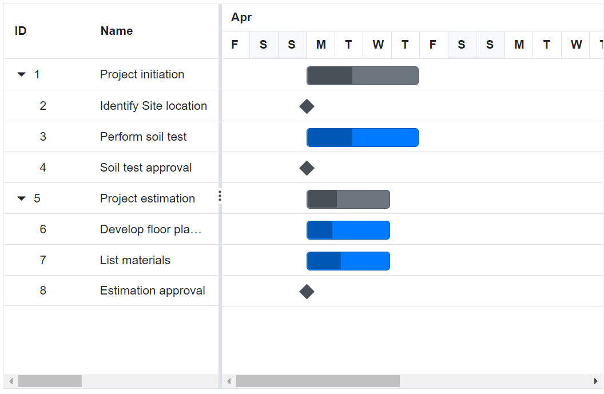
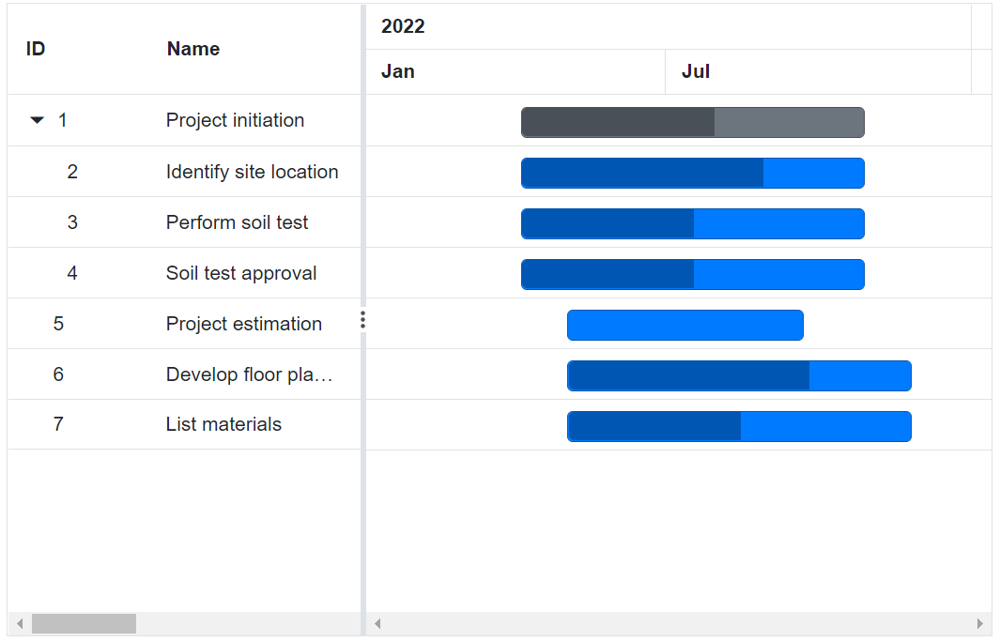
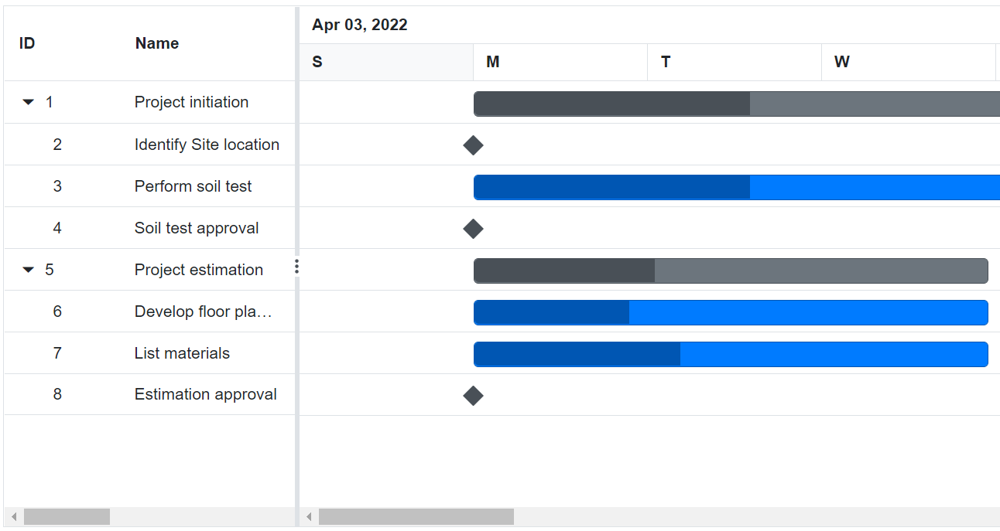

# Top tier and bottom tier

Gantt Chart component contains two tier layout in timeline, you can customize the top tier and bottom tier using [GanttTopTierSettings](https://help.syncfusion.com/cr/blazor/Syncfusion.Blazor.Gantt.GanttTopTierSettings.html) and [GanttBottomTierSettings](https://help.syncfusion.com/cr/blazor/Syncfusion.Blazor.Gantt.GanttBottomTierSettings.html) properties. Timeline tier's unit can be defined by using `Unit` property and `Format` property was used to define date format of timeline cell and `Count` property was used to define how many unit will be combined as single cell.

```cshtml
@using Syncfusion.Blazor.Gantt
<SfGantt DataSource="@TaskCollection" Height="450px" Width="700px">
    <GanttTaskFields Id="TaskId" Name="TaskName" StartDate="StartDate" EndDate="EndDate"
               Duration="Duration" Progress="Progress" ParentID="ParentId">
    </GanttTaskFields>
    <GanttTimelineSettings>
        <GanttTopTierSettings Unit="TimelineViewMode.Month" Format="MMM"></GanttTopTierSettings>
        <GanttBottomTierSettings Unit="TimelineViewMode.Day"></GanttBottomTierSettings>
    </GanttTimelineSettings>
</SfGantt>

@code{
    private List<TaskData> TaskCollection { get; set; }
    protected override void OnInitialized()
    {
        this.TaskCollection = GetTaskCollection();
    }

    public class TaskData
    {
        public int TaskId { get; set; }
        public string TaskName { get; set; }
        public DateTime StartDate { get; set; }
        public DateTime? EndDate { get; set; }
        public string Duration { get; set; }
        public int Progress { get; set; }
        public int? ParentId { get; set; }
    }

    public static List<TaskData> GetTaskCollection()
    {
        List<TaskData> Tasks = new List<TaskData>()
        {
            new TaskData() { TaskId = 1, TaskName = "Project initiation", StartDate = new DateTime(2022, 04, 05), EndDate = new DateTime(2022, 04, 21), },
            new TaskData() { TaskId = 2, TaskName = "Identify Site location", StartDate = new DateTime(2022, 04, 05), Duration = "0", Progress = 30, ParentId = 1 },
            new TaskData() { TaskId = 3, TaskName = "Perform soil test", StartDate = new DateTime(2022, 04, 05), Duration = "4", Progress = 40, ParentId = 1 },
            new TaskData() { TaskId = 4, TaskName = "Soil test approval", StartDate = new DateTime(2022, 04, 05), Duration = "0", Progress = 30, ParentId = 1 },
            new TaskData() { TaskId = 5, TaskName = "Project estimation", StartDate = new DateTime(2022, 04, 06), EndDate = new DateTime(2022, 04, 21), },
            new TaskData() { TaskId = 6, TaskName = "Develop floor plan for estimation", StartDate = new DateTime(2022, 04, 06), Duration = "3", Progress = 30, ParentId = 5 },
            new TaskData() { TaskId = 7, TaskName = "List materials", StartDate = new DateTime(2022, 04, 06), Duration = "3", Progress = 40, ParentId = 5 },
            new TaskData() { TaskId = 8, TaskName = "Estimation approval", StartDate = new DateTime(2022, 04, 06), Duration = "0", Progress = 30, ParentId = 5 },
        };
        return Tasks;
    }
}
```



## Combining timeline cells

In Gantt Chart, timeline cells in top tier and bottom tier can be combined with number of timeline units, this can be achieved by using `GanttTopTierSettings.Count` and `GanttBottomTierSettings.Count` properties. Refer the following sample.

```cshtml
@using Syncfusion.Blazor.Gantt
<SfGantt DataSource="@TaskCollection" Height="450px" Width="700px">
    <GanttTaskFields Id="TaskId" Name="TaskName" StartDate="StartDate" EndDate="EndDate"
            Duration="Duration" Progress="Progress" ParentID="ParentId">
    </GanttTaskFields>
    <GanttTimelineSettings TimelineUnitSize="200">
        <GanttTopTierSettings Unit="TimelineViewMode.Year"></GanttTopTierSettings>
        <GanttBottomTierSettings Unit="TimelineViewMode.Month" Format="MMM" Count="6"></GanttBottomTierSettings>
    </GanttTimelineSettings>
</SfGantt>

@code{
    private List<TaskData> TaskCollection { get; set; }
    protected override void OnInitialized()
    {
        this.TaskCollection = GetTaskCollection();
    }

    public class TaskData
    {
        public int TaskId { get; set; }
        public string TaskName { get; set; }
        public DateTime StartDate { get; set; }
        public DateTime? EndDate { get; set; }
        public string Duration { get; set; }
        public int Progress { get; set; }
        public int? ParentId { get; set; }
    }

    public static List<TaskData> GetTaskCollection()
    {
        List<TaskData> Tasks = new List<TaskData>()
        {
            new TaskData() { TaskId = 1, TaskName = "Project initiation", StartDate = new DateTime(2022, 04, 05), EndDate = new DateTime(2022, 08, 21), },
            new TaskData() { TaskId = 2, TaskName = "Identify site location", StartDate = new DateTime(2022, 04, 05), Duration = "150", Progress = 70, ParentId = 1 },
            new TaskData() { TaskId = 3, TaskName = "Perform soil test", StartDate = new DateTime(2022, 04, 05), Duration = "150", Progress = 50, ParentId = 1 },
            new TaskData() { TaskId = 4, TaskName = "Soil test approval", StartDate = new DateTime(2022, 04, 05), Duration = "150", Progress = 50, ParentId = 1 },
            new TaskData() { TaskId = 5, TaskName = "Project estimation", StartDate = new DateTime(2022, 05, 06), EndDate = new DateTime(2022, 09, 21), },
            new TaskData() { TaskId = 6, TaskName = "Develop floor plan for estimation", StartDate = new DateTime(2022, 05, 06), Duration = "150", Progress = 70, ParentId = 5 },
            new TaskData() { TaskId = 7, TaskName = "List materials", StartDate = new DateTime(2022, 05, 06), Duration = "150", Progress = 50, ParentId = 5 },
        };
        return Tasks;
    }
}
```



## Customize header timeline cells

In the Gantt Chart component, you can format the value of top and bottom timeline cells using the standard date format string or the custom formatter method. This can be done using the `GanttTopTierSettings.Format`, `GanttTopTierSettings.FormatterTemplate`, `GanttBottomTierSettings.Format`, and `GanttBottomTierSettings.FormatterTemplate` properties. The following example shows how to use the formatter method for timeline cells.

```cshtml
@using Syncfusion.Blazor.Gantt
<SfGantt DataSource="@TaskCollection" Height="450px" Width="700px" ProjectStartDate="@ProjectStart" ProjectEndDate="@ProjectEnd">
    <GanttTaskFields Id="TaskId" Name="TaskName" StartDate="StartDate" EndDate="EndDate" Duration="Duration" Progress="Progress" ParentID="ParentId">
    </GanttTaskFields>
    <GanttTimelineSettings TimelineUnitSize=50>
        <GanttTopTierSettings Unit="TimelineViewMode.Month" Count="3">
           <FormatterTemplate >
               @{
                   @if(context.Tier=="top"){
                       @this.Formatter((context.Date))
                   }
               }
           </FormatterTemplate>
        </GanttTopTierSettings>
        <GanttBottomTierSettings Unit="TimelineViewMode.Month" Format="MMM"></GanttBottomTierSettings>
    </GanttTimelineSettings>
</SfGantt>

@code{
    private DateTime ProjectStart = new DateTime(2022, 01, 10);
    private DateTime ProjectEnd = new DateTime(2022, 12, 10);
    private List<TaskData> TaskCollection { get; set; }
    protected override void OnInitialized()
    {
        this.TaskCollection = GetTaskCollection();
    }

    public class TaskData
    {
        public int TaskId { get; set; }
        public string TaskName { get; set; }
        public DateTime StartDate { get; set; }
        public DateTime? EndDate { get; set; }
        public string Duration { get; set; }
        public int Progress { get; set; }
        public int? ParentId { get; set; }
    }
    public string Formatter(DateTime? date) {
        DateTime dateTime=(DateTime)(date);
        var month = dateTime.Month;
        if (month >= 0 && month <= 2) {
            return "Q1";
        } else if (month >= 3 && month <= 5) {
            return "Q2";
        } else if (month >= 6 && month <= 8) {
            return "Q3";
        } else {
            return "Q4";
        }
    }
    public static List <TaskData> GetTaskCollection() {
    List <TaskData> Tasks = new List <TaskData> () {
        new TaskData() { TaskId = 1, TaskName = "Project initiation", StartDate = new DateTime(2022, 04, 05), EndDate = new DateTime(2022, 06, 21) },
        new TaskData() { TaskId = 2, TaskName = "Identify Site location", StartDate = new DateTime(2022, 04, 05), Duration = "20", Progress = 30, ParentId = 1 },
        new TaskData() { TaskId = 3, TaskName = "Perform soil test", StartDate = new DateTime(2022, 04, 05), Duration = "24", Progress = 40, ParentId = 1 },
        new TaskData() { TaskId = 4, TaskName = "Soil test approval", StartDate = new DateTime(2022, 05, 05), Duration = "25", Progress = 30, ParentId = 1 },
        new TaskData() { TaskId = 5, TaskName = "Project estimation", StartDate = new DateTime(2022, 06, 06), EndDate = new DateTime(2022, 09, 21) },
        new TaskData() { TaskId = 6, TaskName = "Develop floor plan for estimation", StartDate = new DateTime(2022, 06, 06), Duration = "33", Progress = 30, ParentId = 5 },
        new TaskData() { TaskId = 7, TaskName = "List materials", StartDate = new DateTime(2022, 07, 06), Duration = "23", Progress = 40, ParentId = 5 },
        new TaskData() { TaskId = 8, TaskName = "Estimation approval", StartDate = new DateTime(2022, 08, 06), Duration = "20", Progress = 30, ParentId = 5 }
    };
    return Tasks;
    }
}
```

## Timeline cell width

In the Gantt Chart component, you can define the width value of timeline cell using the `GanttTimelineSettings.TimelineUnitSize` property. This value will be set to the bottom timeline cell, and the width value of top timeline cell will be calculated automatically based on bottom tier cell width using the `GanttTopTierSettings.Unit` and `GanttTimelineSettings.TimelineUnitSize` properties. Refer the following example.

```cshtml
@using Syncfusion.Blazor.Gantt
<SfGantt DataSource="@TaskCollection" Height="450px" Width="1000px">
    <GanttTaskFields Id="TaskId" Name="TaskName" StartDate="StartDate" EndDate="EndDate"
              Duration="Duration" Progress="Progress" ParentID="ParentId">
    </GanttTaskFields>
    <GanttTimelineSettings TimelineUnitSize=150></GanttTimelineSettings>
</SfGantt>

@code{
    private List<TaskData> TaskCollection { get; set; }
    protected override void OnInitialized()
    {
        this.TaskCollection = GetTaskCollection();
    }

    public class TaskData
    {
        public int TaskId { get; set; }
        public string TaskName { get; set; }
        public DateTime StartDate { get; set; }
        public DateTime? EndDate { get; set; }
        public string Duration { get; set; }
        public int Progress { get; set; }
        public int? ParentId { get; set; }
    }

    public static List<TaskData> GetTaskCollection()
    {
        List<TaskData> Tasks = new List<TaskData>()
        {
            new TaskData() { TaskId = 1, TaskName = "Project initiation", StartDate = new DateTime(2022, 04, 05), EndDate = new DateTime(2022, 04, 21), },
            new TaskData() { TaskId = 2, TaskName = "Identify Site location", StartDate = new DateTime(2022, 04, 05), Duration = "0", Progress = 30, ParentId = 1 },
            new TaskData() { TaskId = 3, TaskName = "Perform soil test", StartDate = new DateTime(2022, 04, 05), Duration = "4", Progress = 40, ParentId = 1 },
            new TaskData() { TaskId = 4, TaskName = "Soil test approval", StartDate = new DateTime(2022, 04, 05), Duration = "0", Progress = 30, ParentId = 1 },
            new TaskData() { TaskId = 5, TaskName = "Project estimation", StartDate = new DateTime(2022, 04, 06), EndDate = new DateTime(2022, 04, 21), },
            new TaskData() { TaskId = 6, TaskName = "Develop floor plan for estimation", StartDate = new DateTime(2022, 04, 06), Duration = "3", Progress = 30, ParentId = 5 },
            new TaskData() { TaskId = 7, TaskName = "List materials", StartDate = new DateTime(2022, 04, 06), Duration = "3", Progress = 40, ParentId = 5 },
            new TaskData() { TaskId = 8, TaskName = "Estimation approval", StartDate = new DateTime(2022, 04, 06), Duration = "0", Progress = 30, ParentId = 5 }
        };
        return Tasks;
    }
}
```


