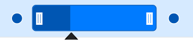

# Touch Interaction in Blazor Gantt Chart Component

The Gantt Chart component supports to perform user interactions in mobile and tablet devices. This section explains how to interact with the Gantt features in touch-enabled devices.

## Tooltip

To perform `touch and hold` action on a element, refer to [Tooltip Popup](tooltip/#tooltip).

## Context Menu

To perform `long press` action on a row, [Context Menu](context-menu/#context-menu) is opened, and then tap a menu item to trigger its action.

## Sorting

To perform `tap` action on a column header, trigger [Sorting](sorting/#sorting) operation to the selected column. A popup is displayed for multi-column sorting. To sort multiple columns, tap the popup, and then tap the desired column headers.

The following screenshot shows Gantt touch sorting,

## Column resize

When the right edge of the column header cell is `tapped`, a floating handler will be visible over the right border of the column. To [Resize](columns/#column-resizing) the column, drag the floating handler as needed.

The following screenshot represents the Gantt column resizing in touch device.

## Editing

The Gantt Chart component editing actions can be achieved using the double tap and tap and drag actions on an element.

The following table describes different types of editing modes available in Gantt.

Action |Description
-----|-----
[Cell editing](managing-tasks/#cell-editing) | To perform `double tap` on a specific cell, initiate the cell to be in edit state.
[Dialog editing](managing-tasks/#dialog-editing) | To perform `double tap` on a specific row, initiate the edit dialog to be opened.
[Taskbar editing](managing-tasks/#taskbar-editing) | Taskbar editing action is initiated using the `tap` action on the taskbar.   **Parent taskbar** : Once you tap on the parent taskbar, it will be changed to editing state. Perform only dragging action on parent taskbar editing.     **Child taskbar** : Once you tap the child taskbar, it will be changed to editing state.      **Dragging taskbar** : To drag a taskbar to the left or right in editing state.     **Resizing taskbar** : To resize a taskbar, drag the left/right resize icon.     **Progress resizing** : To change the progress, drag the progress resize icon to the left or right direction.

### Task Dependency Editing

To initiate dependency editing, you need to tap the taskbar. Once it enters into the edited state, you can `tap` the left/right connector point to initiate [`Task Dependencies`](managing-tasks/#task-dependencies) editing. The dialog will be rendered with a message `Choose the another task` and `Cancel` button.

To cancel edit action click the `Cancel` button, to continue editing, tap another taskbar to establish the dependency line between two taskbars.

Once the second taskbar is tapped, the dialog will display a message `Select the connector position` and `Cancel` button and a tooltip is displayed near the second taskbar with `Left` and `Right` button. Click any button to establish dependency relation betweeen two tasks.

## Selection

When you `tap` gantt row, tapped row will be selected.

[Single selection](selection/#selection-mode) : To select a single row or cell, perform `single tap` on it.

[Multiple selection](selection/#multiple-row-selection) : To perform multiple selection, `tap` on the multiple selection popup, and then tap the desired rows or cells.

> You can refer to our [Blazor Gantt Chart](https://www.syncfusion.com/blazor-components/blazor-gantt-chart) feature tour page for its groundbreaking feature representations. You can also explore our [Blazor Gantt Chart example](https://blazor.syncfusion.com/demos/gantt-chart/default-functionalities?theme=bootstrap4) to know how to render and configure the Gantt.