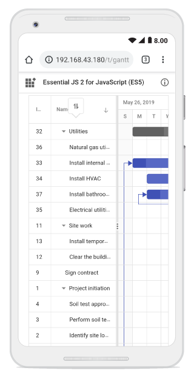
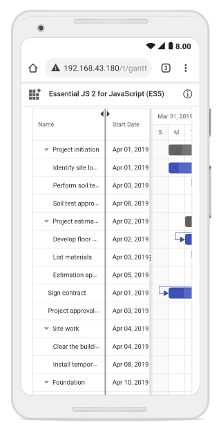
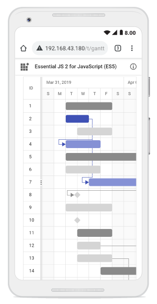
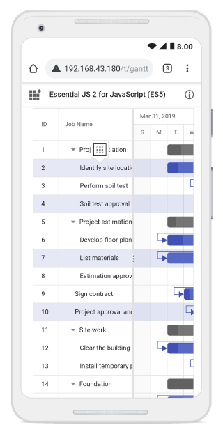

# Touch Interaction

The Gantt Chart component supports to perform user interactions in mobile and tablet devices. This section explains how to interact with the Gantt features in touch-enabled devices.

## Tooltip

To perform `touch and hold` action on a element, refer to [`Tooltip Popup`](tooltip/#tooltip).

## Context Menu

To perform `long press` action on a row, [`Context Menu`](context-menu/#context-menu) is opened, and then tap a menu item to trigger its action.

## Sorting

To perform `tap` action on a column header, trigger [`Sorting`](sorting/#sorting) operation to the selected column. A popup is displayed for multi-column sorting. To sort multiple columns, tap the popup, and then tap the desired column headers.

The following screenshot shows Gantt touch sorting,

## Column Resize

When the right edge of the column header cell is `tapped`, a floating handler will be visible over the right border of the column. To [`Resize`](columns/#column-resizing) the column, drag the floating handler as needed.

The following screenshot represents the Gantt column resizing in touch device.

## Editing

The Gantt Chart component editing actions can be achieved using the double tap and tap and drag actions on a element.

The following table describes different types of editing modes available in Gantt.

Action |Description
-----|-----
[`Cell editing`](managing-tasks/#cell-editing) | To perform `double tap` on a specific cell, initiate the cell to be in edit state.
[`Dialog editing`](managing-tasks/#dialog-editing) | To perform `double tap` on a specific row, initiate the edit dialog to be opened.
[`Taskbar editing`](managing-tasks/#taskbar-editing) | Taskbar editing action is initiated using the `tap` action on the taskbar.   **Parent taskbar** : Once you tap on the parent taskbar, it will be changed to editing state. Perform only dragging action on parent taskbar editing.      **Child taskbar** : Once you tap the child taskbar, it will be changed to editing state.      **Dragging taskbar** : To drag a taskbar to the left or right in editing state.     **Resizing taskbar** : To resize a taskbar, drag the left/right resize icon.     **Progress resizing** : To change the progress, drag the progress resize icon to the left or right direction.

<!-- Task Dependency Editing

You can `tap` the left/right connector point to initiate `Task Dependencies`](managing-tasks/#task-dependencies) edit mode and again tap another taskbar to establish the dependency line between two taskbars.

The following table explains the taskbar state in dependency edit mode.

Taskbar state |Description
-----|-----
`Parent taskbar` | You cannot create dependency relationship to parent tasks.   
`Taskbar without dependency` |  If you tap a valid child taskbar, it will create `FS` type dependency line between tasks, otherwise exits from task dependency edit mode.   
`Taskbar with dependency` | If you tap the second taskbar, which has already been directly connected, it will ask to remove it.   
`Removing dependency` | Once you tap the taskbar with direct dependency, then confirmation dialog will be shown for removing dependency.   

> In mobile device, you cannot create dependency other than `FS` by taskbar editing. By using cell/dialog editing, you can add all type of dependencies. -->

## Selection

When you `tap` gantt row, tapped row will be selected.

[`Single selection`](selection/#selection-mode) : To select a single row or cell, perform `single tap` on it.

[`Multiple selection`](selection/#multiple-row-selection) : To perform multiple selection, `tap` on the multiple selection popup, and then tap the desired rows or cells.

> `Note:` You can refer to our [`Blazor Gantt Chart`](https://www.syncfusion.com/blazor-components/blazor-gantt-chart) feature tour page for its groundbreaking feature representations. You can also explore our [`Blazor Gantt Chart`](https://blazor.syncfusion.com/demos/gantt-chart/default-functionalities?theme=bootstrap4) to knows how to render and configure the gantt.