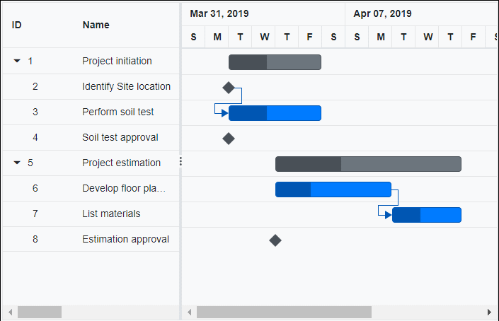
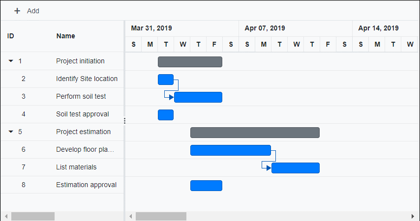

# Validate predecessor links on editing

In Gantt, task relationship link can be broken by editing the start date, end date and duration value of task. When the task relationship broken on any edit action it can be handled in Gantt by following ways.

## Using actionBegin event

### ValidateMode

When editing the tasks with predecessor links, then the [OnActionBegin](https://help.syncfusion.com/cr/blazor/Syncfusion.Blazor.Gantt.GanttEvents-1.html#Syncfusion_Blazor_Gantt_GanttEvents_1_OnActionBegin) event will be triggered with [`RequestType`](https://help.syncfusion.com/cr/blazor/Syncfusion.Blazor.Gantt.GanttActionEventArgs-1.html#Syncfusion_Blazor_Gantt_GanttActionEventArgs_1_RequestType) argument as `ValidateLinkedTask`. You can validate the editing action within the actionBegin event using the [`ValidateMode`](https://help.syncfusion.com/cr/blazor/Syncfusion.Blazor.Gantt.GanttActionEventArgs-1.html#Syncfusion_Blazor_Gantt_GanttActionEventArgs_1_ValidateMode) event argument. The `ValidateMode` event argument has the following properties:

Argument |Default value |Description
-----|-----|-----
args.ValidateMode.RespectLink | false | In this validation mode, the predecessor links get high priority. With this mode enabled, when the successor task is moved before the predecessor task’s end date, the editing will be reverted, and dates will be validated based on the dependency links.
args.ValidateMode.PreserveLinkWithEditing | true | In this validation mode, the taskbar editing will be considered along with the dependency links. This relationship will be maintained by updating the offset value of predecessors.

By default, the `PreserveLinkWithEditing` validation mode will be enabled, so the predecessors are updated with offset values.


The following sample explains enabling the `RespectLink` validation mode while editing the linked tasks in the `OnActionBegin` event.

```cshtml
@using Syncfusion.Blazor.Gantt
<SfGantt DataSource="@TaskCollection" Height="450px" Width="700px">
    <GanttTaskFields Id="TaskId" Name="TaskName" StartDate="StartDate" EndDate="EndDate" Duration="Duration" Progress="Progress"
        Dependency="Predecessor" ParentID="ParentId"></GanttTaskFields>
    <GanttEditSettings AllowTaskbarEditing="true"></GanttEditSettings>
    <GanttEvents TValue="TaskData" OnActionBegin="ActionBegin"></GanttEvents>
</SfGantt>

@code{
    public List<TaskData> TaskCollection { get; set; }
    protected override void OnInitialized()
    {
        this.TaskCollection = GetTaskCollection();
    }
    public void ActionBegin(GanttActionEventArgs<TaskData> args) {
        if(args.RequestType.ToString() == "ValidateLinkedTask") {
            args.ValidateMode.RespectLink = true;
        }
    }
    public class TaskData
    {
        public int TaskId { get; set; }
        public string TaskName { get; set; }
        public DateTime StartDate { get; set; }
        public DateTime EndDate { get; set; }
        public string Duration { get; set; }
        public int Progress { get; set; }
        public string Predecessor { get; set; }
        public int? ParentId { get; set; }
    }

    public static List <TaskData> GetTaskCollection() {
        List <TaskData> Tasks = new List <TaskData> () {
            new TaskData() { TaskId = 1, TaskName = "Project initiation", StartDate = new DateTime(2019, 04, 02), EndDate = new DateTime(2019, 04, 21) },
            new TaskData() { TaskId = 2, TaskName = "Identify Site location", StartDate = new DateTime(2019, 04, 02), Duration = "0", Progress = 30, ParentId = 1 },
            new TaskData() { TaskId = 3, TaskName = "Perform soil test", StartDate = new DateTime(2019, 04, 02), Duration = "4", Progress = 40, Predecessor = "2", ParentId = 1 },
            new TaskData() { TaskId = 4, TaskName = "Soil test approval", StartDate = new DateTime(2019, 04, 02), Duration = "0", Progress = 30, ParentId = 1 },
            new TaskData() { TaskId = 5, TaskName = "Project estimation", StartDate = new DateTime(2019, 04, 02), EndDate = new DateTime(2019, 04, 21) },
            new TaskData() { TaskId = 6, TaskName = "Develop floor plan for estimation", StartDate = new DateTime(2019, 04, 04), Duration = "3", Progress = 30, ParentId = 5 },
            new TaskData() { TaskId = 7, TaskName = "List materials", StartDate = new DateTime(2019, 04, 04), Duration = "3", Progress = 40, Predecessor = "6", ParentId = 5 },
            new TaskData() { TaskId = 8, TaskName = "Estimation approval", StartDate = new DateTime(2019, 04, 04),  Duration = "0", Progress = 30, ParentId = 5 }
        };
        return Tasks;
    }
}
```


### PredecessorOffsetValidation

On taskbar editing, the [OnActionBegin](https://help.syncfusion.com/cr/blazor/Syncfusion.Blazor.Gantt.GanttEvents-1.html#Syncfusion_Blazor_Gantt_GanttEvents_1_OnActionBegin) event will be triggered with [PredecessorOffsetValidation](https://help.syncfusion.com/cr/blazor/Syncfusion.Blazor.Gantt.GanttActionEventArgs-1.html#Syncfusion_Blazor_Gantt_GanttActionEventArgs_1_PredecessorOffSetValidation) argument. When `PredecessorOffsetValidation` is enabled, the taskbar can be dragged such that it does not violate the predecessor value.
i.e. The taskbar can be dragged greater than the given predecessor offset value and it gets reverted to the minimum predecessor value if dragged lesser than the predecessor offset value.

```cshtml
@using Syncfusion.Blazor.Gantt

<SfGantt @ref="Gantt" DataSource="@TaskCollection" Height="450px" Width="1000px" ProjectStartDate="ProjectStart" ProjectEndDate="ProjectEnd"
 Toolbar="@(new List<string>() { "Add", "Edit", "Update", "Cancel"})">
    <GanttTaskFields Id="TaskId" Name="TaskName" StartDate="StartDate"
                     Duration="Duration" Dependency="Predecessor" ParentID="ParentId"></GanttTaskFields>
    <GanttEditSettings AllowTaskbarEditing="true" AllowEditing="true" AllowAdding="true"></GanttEditSettings>
    <GanttEvents OnActionBegin="ActionBegin" TValue="TaskData"></GanttEvents>
</SfGantt>

@code {
    public SfGantt<TaskData> Gantt;
    public DateTime ProjectStart = new DateTime(2019, 3, 24);
    public DateTime ProjectEnd = new DateTime(2019, 07, 06);
    public List<TaskData> TaskCollection { get; set; }

    protected override void OnInitialized()
    {
        this.TaskCollection = GetTaskCollection();
    }

    public void ActionBegin(GanttActionEventArgs<TaskData> args)
    {
        args.PredecessorOffSetValidation = true;
    }

    public class TaskData
    {
        public int TaskId { get; set; }
        public string TaskName { get; set; }
        public DateTime StartDate { get; set; }
        public string Duration { get; set; }
        public string Predecessor { get; set; }
        public int Progress { get; set; }
        public int? ParentId { get; set; }
    }

    public static List<TaskData> GetTaskCollection()
    {
        List<TaskData> Tasks = new List<TaskData>() {
            new TaskData() { TaskId = 1, TaskName = "Project initiation", StartDate = new DateTime(2019, 04, 02)},
            new TaskData() { TaskId = 2, TaskName = "Identify Site location", StartDate = new DateTime(2019, 04, 02), Progress = 30, ParentId = 1},
            new TaskData() { TaskId = 3, TaskName = "Perform soil test", StartDate = new DateTime(2019, 04, 02), Duration = "3", Progress = 40, Predecessor = "2fs", ParentId = 1 },
            new TaskData() { TaskId = 4, TaskName = "Soil test approval", StartDate = new DateTime(2019, 04, 02), Duration = "1", Progress = 30, ParentId = 1 },
            new TaskData() { TaskId = 5, TaskName = "Project estimation", StartDate = new DateTime(2019, 04, 02) },
            new TaskData() { TaskId = 6, TaskName = "Develop floor plan for estimation", StartDate = new DateTime(2019, 04, 04), Duration = "3", Progress = 30, ParentId = 5 },
            new TaskData() { TaskId = 7, TaskName = "List materials", StartDate = new DateTime(2019, 04, 04), Duration = "3", Progress = 40, Predecessor = "6", ParentId = 5 },
            new TaskData() { TaskId = 8, TaskName = "Estimation approval", StartDate = new DateTime(2019, 04, 04), Duration = "2", Progress = 30, ParentId = 5 }
        };
        return Tasks;
    }
}
```


`Note:` When `PredecessorOffsetValidation` is enabled, the predecessor offset will not updated on dragging taskbar. We can update the predecessor offset either by cell edit or dialog edit.

