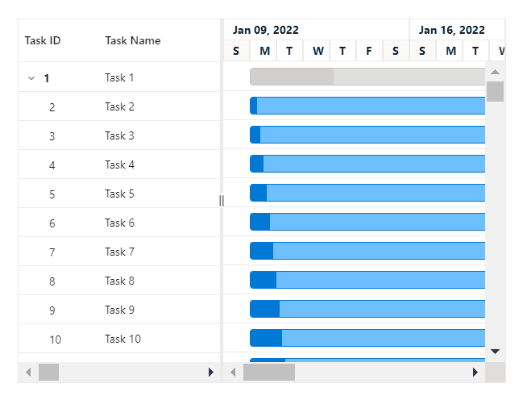

# Virtualization in Blazor Gantt Chart Component

Gantt Chart allows you to load a large amount of data without performance degradation.

## Row virtualization

Row virtualization allows you to render rows only in the content viewport on load time. It is an alternative way of paging in which the rows will be loaded while scrolling vertically. To set up the row virtualization, you need to define `EnableVirtualization` as true and content height by [Height](https://help.syncfusion.com/cr/blazor/Syncfusion.Blazor.Gantt.SfGantt-1.html#Syncfusion_Blazor_Gantt_SfGantt_1_Height) property.

The number of records displayed in the Gantt Chart is determined implicitly by the height of the content area.

```csharp

namespace GanttComponent.Data
{
    public class GanttData
    {
        public class GanttDataSource
        {
            public int TaskId { get; set; }
            public string TaskName { get; set; }
            public DateTime StartDate { get; set; }
            public DateTime EndDate { get; set; }
            public string Duration { get; set; }
            public string Predecessor { get; set; }
            public int Progress { get; set; }
            public int? ParentID { get; set; }

        }

        public static List<GanttDataSource> VirtualData()
        {
            List<GanttDataSource> list = new List<GanttDataSource>();
            for (var i = 0; i < 2; i++)
            {
                var x = list.Count + 1;
                list.Add(new GanttDataSource()
                {
                    TaskId = x,
                    TaskName = "Project " + (i + 1)
                });
                for (var j = 0; j < TempData().ToList().Count; j++)
                {
                    list.Add(new GanttDataSource()
                    {
                        TaskId = TempData()[j].TaskId + x,
                        TaskName = TempData()[j].TaskName,
                        StartDate = TempData()[j].StartDate,
                        Duration = TempData()[j].Duration,
                        Progress = TempData()[j].Progress,
                        ParentID = TempData()[j].ParentID + x,
                        Predecessor = TempData()[j].Predecessor
                    });
                }
            }
            return list;
        }
        public static List<GanttDataSource> TempData()
        {
            List<GanttDataSource> GanttDataSourceCollection = new List<GanttDataSource>();

            GanttDataSource Record1 = new GanttDataSource() { TaskId = 1, TaskName = "Product concept", StartDate = new DateTime(2022, 04, 05), EndDate = new DateTime(2022, 04, 29), ParentID = 0 };
            GanttDataSource Record2 = new GanttDataSource() { TaskId = 2, TaskName = "Defining the product and its usage", StartDate = new DateTime(2022, 04, 05), Duration = "3", Progress = 30, ParentID = 1, };
            GanttDataSource Record3 = new GanttDataSource() { TaskId = 3, TaskName = "Defining target audience", StartDate = new DateTime(2022, 04, 05), ParentID = 1, Duration = "3" };
            GanttDataSource Record4 = new GanttDataSource() { TaskId = 4, TaskName = "Prepare product sketch and notes", StartDate = new DateTime(2022, 04, 05), Duration = "2", ParentID = 1, Predecessor = "2", Progress = 30 };
            GanttDataSource Record5 = new GanttDataSource() { TaskId = 5, TaskName = "Concept approval", StartDate = new DateTime(2022, 04, 08), ParentID = 0, Duration = "0", Predecessor = "3,4" };
            GanttDataSource Record6 = new GanttDataSource() { TaskId = 6, TaskName = "Market research", StartDate = new DateTime(2022, 04, 05), ParentID = 0, EndDate = new DateTime(2022, 04, 21), };
            GanttDataSource Record7 = new GanttDataSource() { TaskId = 7, TaskName = "Demand analysis", StartDate = new DateTime(2022, 04, 04), EndDate = new DateTime(2022, 04, 21), ParentID = 6, };
            GanttDataSource Record8 = new GanttDataSource() { TaskId = 8, TaskName = "Customer strength", StartDate = new DateTime(2022, 04, 11), Duration = "4", Predecessor = "5", ParentID = 7, Progress = 30 };
            GanttDataSource Record9 = new GanttDataSource() { TaskId = 9, TaskName = "Market opportunity analysis", StartDate = new DateTime(2022, 04, 11), Duration = "4", ParentID = 7, Predecessor = "5" };
            GanttDataSource Record10 = new GanttDataSource() { TaskId = 10, TaskName = "Competitor analysis", StartDate = new DateTime(2022, 04, 15), Duration = "4", Predecessor = "7, 8", ParentID = 6, Progress = 30 };
            GanttDataSource Record11 = new GanttDataSource() { TaskId = 11, TaskName = "Product strength analysis", StartDate = new DateTime(2022, 04, 15), Duration = "4", ParentID = 6, Predecessor = "9" };
            GanttDataSource Record12 = new GanttDataSource() { TaskId = 12, TaskName = "Research complete", StartDate = new DateTime(2022, 04, 18), Duration = "0", ParentID = 6, Predecessor = "10" };
            GanttDataSource Record13 = new GanttDataSource() { TaskId = 13, TaskName = "Product design and development", StartDate = new DateTime(2022, 04, 05), ParentID = 0, EndDate = new DateTime(2022, 04, 21), };
            GanttDataSource Record14 = new GanttDataSource() { TaskId = 14, TaskName = "Functionality design", StartDate = new DateTime(2022, 04, 19), Duration = "3", ParentID = 13, Progress = 30, Predecessor = "12" };
            GanttDataSource Record15 = new GanttDataSource() { TaskId = 15, TaskName = "Quality design", StartDate = new DateTime(2022, 04, 19), Duration = "3", ParentID = 13, Predecessor = "12" };
            GanttDataSource Record16 = new GanttDataSource() { TaskId = 16, TaskName = "Define reliability", StartDate = new DateTime(2022, 04, 25), Duration = "2", Progress = 30, ParentID = 13, Predecessor = "15" };
            GanttDataSource Record17 = new GanttDataSource() { TaskId = 17, TaskName = "Identifying raw materials", StartDate = new DateTime(2022, 04, 25), Duration = "2", ParentID = 13, Predecessor = "15" };
            GanttDataSource Record18 = new GanttDataSource() { TaskId = 18, TaskName = "Define cost plan", StartDate = new DateTime(2022, 04, 05), ParentID = 13, EndDate = new DateTime(2022, 04, 21), };
            GanttDataSource Record19 = new GanttDataSource() { TaskId = 19, TaskName = "Manufacturing cost", StartDate = new DateTime(2022, 04, 26), Duration = "2", Progress = 30, ParentID = 18, Predecessor = "17" };
            GanttDataSource Record20 = new GanttDataSource() { TaskId = 20, TaskName = "Selling cost", StartDate = new DateTime(2022, 04, 26), Duration = "2", ParentID = 18, Predecessor = "17" };
            GanttDataSource Record21 = new GanttDataSource() { TaskId = 21, TaskName = "Development of the final design", StartDate = new DateTime(2022, 04, 30), ParentID = 13, EndDate = new DateTime(2022, 04, 21), };
            GanttDataSource Record22 = new GanttDataSource() { TaskId = 22, TaskName = "Defining dimensions and package volume", StartDate = new DateTime(2022, 04, 29), Duration = "2", ParentID = 21, Progress = 30, Predecessor = "19,20" };
            GanttDataSource Record23 = new GanttDataSource() { TaskId = 23, TaskName = "Develop design to meet industry standards", StartDate = new DateTime(2022, 05, 05), Duration = "2", ParentID = 21, Predecessor = "22" };
            GanttDataSource Record24 = new GanttDataSource() { TaskId = 24, TaskName = "Include all the details", StartDate = new DateTime(2022, 05, 06), Duration = "3", ParentID = 21, Predecessor = "23" };
            GanttDataSource Record25 = new GanttDataSource() { TaskId = 25, TaskName = "CAD computer-aided design", StartDate = new DateTime(2022, 05, 09), Duration = "3", ParentID = 13, Progress = 30, Predecessor = "24" };
            GanttDataSource Record26 = new GanttDataSource() { TaskId = 26, TaskName = "CAM computer-aided manufacturing", StartDate = new DateTime(2022, 05, 14), Duration = "3", ParentID = 13, Predecessor = "25" };
            GanttDataSource Record27 = new GanttDataSource() { TaskId = 27, TaskName = "Design complete", StartDate = new DateTime(2022, 05, 15), Duration = "0", ParentID = 13, Predecessor = "26" };
            GanttDataSource Record28 = new GanttDataSource() { TaskId = 28, TaskName = "Prototype testing", StartDate = new DateTime(2022, 05, 18), Duration = "4", Progress = 30, ParentID = 0, Predecessor = "27" };
            GanttDataSource Record29 = new GanttDataSource() { TaskId = 29, TaskName = "Include feedback", StartDate = new DateTime(2022, 05, 18), Duration = "4", ParentID = 0, Predecessor = "28ss" };
            GanttDataSource Record30 = new GanttDataSource() { TaskId = 30, TaskName = "Manufacturing", StartDate = new DateTime(2022, 05, 22), Duration = "5", Progress = 30, ParentID = 0, Predecessor = "28,29" };
            GanttDataSource Record31 = new GanttDataSource() { TaskId = 31, TaskName = "Assembling materials to finished goods", StartDate = new DateTime(2022, 05, 29), Duration = "5", ParentID = 0, Predecessor = "30" };
            GanttDataSource Record32 = new GanttDataSource() { TaskId = 32, TaskName = "Feedback and testing", StartDate = new DateTime(2022, 05, 05), ParentID = 0, EndDate = new DateTime(2022, 05, 21), };
            GanttDataSource Record33 = new GanttDataSource() { TaskId = 33, TaskName = "Internal testing and feedback", StartDate = new DateTime(2022, 06, 06), Duration = "3", ParentID = 32, Progress = 45, Predecessor = "31" };
            GanttDataSource Record34 = new GanttDataSource() { TaskId = 34, TaskName = "Customer testing and feedback", StartDate = new DateTime(2022, 06, 11), Duration = "3", ParentID = 32, Progress = 50, Predecessor = "33" };
            GanttDataSource Record35 = new GanttDataSource() { TaskId = 35, TaskName = "Final product development", StartDate = new DateTime(2022, 06, 06), ParentID = 0, EndDate = new DateTime(2022, 06, 06), };
            GanttDataSource Record36 = new GanttDataSource() { TaskId = 36, TaskName = "Important improvements", StartDate = new DateTime(2022, 06, 14), Duration = "4", Progress = 30, ParentID = 35, Predecessor = "34" };
            GanttDataSource Record37 = new GanttDataSource() { TaskId = 37, TaskName = "Address any unforeseen issues", StartDate = new DateTime(2022, 06, 14), Duration = "4", Progress = 30, ParentID = 35, Predecessor = "36ss" };
            GanttDataSource Record38 = new GanttDataSource() { TaskId = 38, TaskName = "Final product", StartDate = new DateTime(2022, 06, 06), ParentID = 0, EndDate = new DateTime(2022, 06, 06), };
            GanttDataSource Record39 = new GanttDataSource() { TaskId = 39, TaskName = "Branding product", StartDate = new DateTime(2022, 06, 20), Duration = "4", ParentID = 38, Predecessor = "37" };
            GanttDataSource Record40 = new GanttDataSource() { TaskId = 40, TaskName = "Marketing and presales", StartDate = new DateTime(2022, 06, 26), Duration = "4", Progress = 30, ParentID = 38, Predecessor = "39" };
            GanttDataSourceCollection.Add(Record1);
            GanttDataSourceCollection.Add(Record2);
            GanttDataSourceCollection.Add(Record3);
            GanttDataSourceCollection.Add(Record4);
            GanttDataSourceCollection.Add(Record5);
            GanttDataSourceCollection.Add(Record6);
            GanttDataSourceCollection.Add(Record7);
            GanttDataSourceCollection.Add(Record8);
            GanttDataSourceCollection.Add(Record9);
            GanttDataSourceCollection.Add(Record10);
            GanttDataSourceCollection.Add(Record11);
            GanttDataSourceCollection.Add(Record12);
            GanttDataSourceCollection.Add(Record13);
            GanttDataSourceCollection.Add(Record14);
            GanttDataSourceCollection.Add(Record15);
            GanttDataSourceCollection.Add(Record16);
            GanttDataSourceCollection.Add(Record17);
            GanttDataSourceCollection.Add(Record18);
            GanttDataSourceCollection.Add(Record19);
            GanttDataSourceCollection.Add(Record20);
            GanttDataSourceCollection.Add(Record21);
            GanttDataSourceCollection.Add(Record22);
            GanttDataSourceCollection.Add(Record23);
            GanttDataSourceCollection.Add(Record24);
            GanttDataSourceCollection.Add(Record25);
            GanttDataSourceCollection.Add(Record26);
            GanttDataSourceCollection.Add(Record27);
            GanttDataSourceCollection.Add(Record28);
            GanttDataSourceCollection.Add(Record29);
            GanttDataSourceCollection.Add(Record30);
            GanttDataSourceCollection.Add(Record31);
            GanttDataSourceCollection.Add(Record32);
            GanttDataSourceCollection.Add(Record33);
            GanttDataSourceCollection.Add(Record34);
            GanttDataSourceCollection.Add(Record35);
            GanttDataSourceCollection.Add(Record36);
            GanttDataSourceCollection.Add(Record37);
            GanttDataSourceCollection.Add(Record38);
            GanttDataSourceCollection.Add(Record39);
            GanttDataSourceCollection.Add(Record40);
            return GanttDataSourceCollection;
        }
    }
}

```

## Column virtualization

Column virtualization allows you to load more columns with high performance. It renders only the columns in the viewport, while other columns render on-demand during horizontal scrolling.

To set up the column virtualization, set the [EnableVirtualization](https://help.syncfusion.com/cr/blazor/Syncfusion.Blazor.Gantt.SfGantt-1.html#Syncfusion_Blazor_Gantt_SfGantt_1_EnableVirtualization) and [EnableColumnVirtualization](https://help.syncfusion.com/cr/blazor/Syncfusion.Blazor.Gantt.SfGantt-1.html#Syncfusion_Blazor_Gantt_SfGantt_1_EnableColumnVirtualization) properties as **true**.

```csharp

@using Syncfusion.Blazor.Gantt

<SfGantt ID="Gantt" DataSource="@TaskCollection" 
    EnableVirtualization="true" EnableColumnVirtualization="true"  Height="450px" Width="1000px">
    <GanttTaskFields Id="ProjectId" Name="ProjectName" StartDate="ProjectStartDate" EndDate="ProjectEndDate" Duration="ProjectDuration" Progress="ProjectProgress" Dependency="Predecessor" ParentID="ParentId">
    </GanttTaskFields>
     <GanttColumns>
        <GanttColumn Field="ProjectId" HeaderText="Task ID"></GanttColumn>
        <GanttColumn Field="ProjectName" HeaderText="Task Name"> </GanttColumn>
        <GanttColumn Field="ProjectStartDate" HeaderText="Start Date"></GanttColumn>
        <GanttColumn Field="ProjectEndDate" HeaderText="End Date"></GanttColumn>
        <GanttColumn Field="ProjectDuration" HeaderText="Duration"></GanttColumn>
        <GanttColumn Field="Field1" HeaderText="Rebounds" Width="150"></GanttColumn>
        <GanttColumn Field="FIELD2" HeaderText="Year" Width="150"></GanttColumn>
        <GanttColumn Field="FIELD3" HeaderText="Stint" Width="150"></GanttColumn>
        <GanttColumn Field="FIELD4" HeaderText="TMID" Width="150"> </GanttColumn>
        <GanttColumn Field="FIELD5" HeaderText="LGID" Width="150"></GanttColumn>
        <GanttColumn Field="FIELD6" HeaderText="GP" Width="150"></GanttColumn>
        <GanttColumn Field="Field7" HeaderText="GS" Width="150"></GanttColumn>
        <GanttColumn Field="Field8" HeaderText="Minutes" Width="150"></GanttColumn>
        <GanttColumn Field="Field9" HeaderText="Points" Width="150"></GanttColumn>
        <GanttColumn Field="Field10" HeaderText="ORebounds" Width="150"></GanttColumn>
        <GanttColumn Field="Field11" HeaderText="DRebounds" Width="150"></GanttColumn>
    </GanttColumns>
</SfGantt>
@code {
    public List<TaskData> TaskCollection { get; set; }
    protected override void OnInitialized()
    {
        this.TaskCollection = VirtualData.GetTreeVirtualData();
    }
    public class VirtualData
    {
        public static List<TaskData> GetTreeVirtualData()
        {
            string[] Names = new string[] { "VINET", "TOMSP", "HANAR", "VICTE", "SUPRD", "HANAR", "CHOPS", "RICSU", "WELLI", "HILAA", "ERNSH", "CENTC", "OTTIK", "QUEDE", "RATTC", "ERNSH", "FOLKO", "BLONP", "WARTH", "FRANK", "GROSR", "WHITC", "WARTH", "SPLIR", "RATTC", "QUICK", "VINET", "MAGAA", "TORTU", "MORGK", "BERGS", "LEHMS", "BERGS", "ROMEY", "ROMEY", "LILAS", "LEHMS", "QUICK", "QUICK", "RICAR", "REGGC", "BSBEV", "COMMI", "QUEDE", "TRADH", "TORTU", "RATTC", "VINET", "LILAS", "BLONP", "HUNGO", "RICAR", "MAGAA", "WANDK", "SUPRD", "GODOS", "TORTU", "OLDWO", "ROMEY", "LONEP", "ANATR", "HUNGO", "THEBI", "DUMON", "WANDK", "QUICK", "RATTC", "ISLAT", "RATTC", "LONEP", "ISLAT", "TORTU", "WARTH", "ISLAT", "PERIC", "KOENE", "SAVEA", "KOENE", "BOLID", "FOLKO", "FURIB", "SPLIR", "LILAS", "BONAP", "MEREP", "WARTH", "VICTE", "HUNGO", "PRINI", "FRANK", "OLDWO", "MEREP", "BONAP", "SIMOB", "FRANK", "LEHMS", "WHITC", "QUICK", "RATTC", "FAMIA" };
            List<TaskData> DataCollection = new List<TaskData>();
            Random random = new Random();
            var x = 0;
            for (var i = 1; i <= 100; i++)
            {
                var name = random.Next(0, 100);
                TaskData Parent = new TaskData()
                {
                    ProjectId = ++x,
                    ProjectName = "Task " + x,
                    ProjectStartDate = new DateTime(2022, 1, 9),
                    ProjectEndDate = new DateTime(2022, 1, 13),
                    ProjectDuration = "10",
                    ProjectProgress = random.Next(100),
                    ParentId = null,
                    Predecessor = null,
                };
                DataCollection.Add(Parent);
                for (var j = 1; j <= 50; j++)
                {
                    var childName = random.Next(0, 100);
                    DataCollection.Add(new TaskData()
                    {
                        ProjectId = ++x,
                        ProjectName = "Task " + x,
                        ProjectStartDate = new DateTime(2022, 1, 9),
                        ProjectEndDate = new DateTime(2022, 1, 13),
                        ProjectDuration = "10",
                        ProjectProgress = random.Next(100),
                        ParentId = Parent.ProjectId,
                        Predecessor = i + "FS",
                        Field1 = Names[name],
                        FIELD2 = 1967 + random.Next(0, 10),
                        FIELD3 = 395 + random.Next(100, 600),
                        FIELD4 = 87 + random.Next(50, 250),
                        FIELD5 = 410 + random.Next(100, 600),
                        FIELD6 = 67 + random.Next(50, 250),
                        Field7 = (int)Math.Floor(random.NextDouble() * 100),
                        Field8 = (int)Math.Floor(random.NextDouble() * 10),
                        Field9 = (int)Math.Floor(random.NextDouble() * 10),
                        Field10 = (int)Math.Floor(random.NextDouble() * 100),
                        Field11 = (int)Math.Floor(random.NextDouble() * 100),
                        Field12 = (int)Math.Floor(random.NextDouble() * 1000),
                    });
                }
            }
            return DataCollection;
        }
    }
    public class TaskData
    {
        public int ProjectId { get; set; }
        public string ProjectName { get; set; }
        public DateTime ProjectStartDate { get; set; }
        public DateTime ProjectEndDate { get; set; }
        public string ProjectDuration { get; set; }
        public int ProjectProgress { get; set; }
        public int? ParentId { get; set; }
        public string Predecessor { get; set; }
        public string Field1 { get; set; }
        public int FIELD2 { get; set; }
        public int FIELD3 { get; set; }
        public int FIELD4 { get; set; }
        public int FIELD5 { get; set; }
        public int FIELD6 { get; set; }
        public int Field7 { get; set; }
        public int Field8 { get; set; }
        public int Field9 { get; set; }
        public int Field10 { get; set; }
        public int Field11 { get; set; }
        public int Field12 { get; set; }
    }
}
```

N> Column's [Width](https://help.syncfusion.com/cr/blazor/Syncfusion.Blazor.Gantt.GanttColumn.html#Syncfusion_Blazor_Gantt_GanttColumn_Width) is required for column virtualization. If the column's width is not defined, then the Gantt Chart will consider its value as **150px**.



## Timeline virtualization

Timeline virtualization allows you to load data sources having a large timespan with high performance. Initially, it renders the timeline with twice the width of the gantt element, while other timeline cells render on-demand during horizontal scrolling. To set up the timeline virtualization, you need to define [EnableVirtualization](https://help.syncfusion.com/cr/blazor/Syncfusion.Blazor.Gantt.SfGantt-1.html#Syncfusion_Blazor_Gantt_SfGantt_1_EnableVirtualization) as true.


```csharp

@using Syncfusion.Blazor.Gantt

<SfGantt @ref="Gantt" Width="480px" Height="350px" ID="Gantt" DataSource="@TaskCollection"  Toolbar="@(new  List<string>() { "ZoomIn", "ZoomOut", "ZoomToFit"})" GridLines="Syncfusion.Blazor.Gantt.GridLine.Both" ProjectStartDate="@ProjectStart" ProjectEndDate="@ProjectEnd"
        EnableVirtualization="true" EnableColumnVirtualization="true">
    <GanttTaskFields Id="ProjectId" Name="ProjectName" StartDate="ProjectStartDate" EndDate="ProjectEndDate"     Duration="ProjectDuration" Progress="ProjectProgress"  Dependency="Predecessor" ParentID="ParentId">
    </GanttTaskFields>
      <GanttEditSettings 
        AllowTaskbarEditing="true" 
        AllowEditing="true" 
        AllowAdding="true" 
        AllowDeleting="true" 
        Mode="Syncfusion.Blazor.Gantt.EditMode.Auto" 
        ShowDeleteConfirmDialog="true"> </GanttEditSettings >
        <GanttSplitterSettings ColumnIndex=1></GanttSplitterSettings>
     <GanttColumns>
        <GanttColumn Field="ProjectId" HeaderText="Task ID"></GanttColumn>
        <GanttColumn Field="ProjectName" HeaderText="Task Name"> </GanttColumn>
        <GanttColumn Field="ProjectStartDate" HeaderText="Start Date"></GanttColumn>
        <GanttColumn Field="ProjectEndDate" HeaderText="End Date"></GanttColumn>
        <GanttColumn Field="ProjectDuration" HeaderText="Duration"></GanttColumn>
         <GanttColumn Field="Predecessor" HeaderText="Predecessor"></GanttColumn>
        <GanttColumn Field="Field1" HeaderText="Rebounds" Width="150"></GanttColumn>
        <GanttColumn Field="FIELD2" HeaderText="Year" Width="150"></GanttColumn>
        <GanttColumn Field="FIELD3" HeaderText="Stint" Width="150"></GanttColumn>
        <GanttColumn Field="FIELD4" HeaderText="TMID" Width="150"> </GanttColumn>
        <GanttColumn Field="FIELD5" HeaderText="LGID" Width="150"></GanttColumn>
        <GanttColumn Field="FIELD6" HeaderText="GP" Width="150"></GanttColumn>
        <GanttColumn Field="Field7" HeaderText="GS" Width="150"></GanttColumn>
        <GanttColumn Field="Field8" HeaderText="Minutes" Width="150"></GanttColumn>
        <GanttColumn Field="Field9" HeaderText="Points" Width="150"></GanttColumn>
        <GanttColumn Field="Field10" HeaderText="ORebounds" Width="150"></GanttColumn>
        <GanttColumn Field="Field11" HeaderText="DRebounds" Width="150"></GanttColumn>
    </GanttColumns>
</SfGantt>

@code {
    public SfGantt<TaskData> Gantt;
    public DateTime ProjectStart = new DateTime(2000, 2, 6);
    public DateTime ProjectEnd = new DateTime(2100, 12, 31);

    public List<TaskData> TaskCollection { get; set; }
    protected override void OnInitialized()
    {
        this.TaskCollection = VirtualData.GetTreeVirtualData();
    }
    public class VirtualData
    {
        public static List<TaskData> GetTreeVirtualData()
        {
            string[] Names = new string[] { "VINET", "TOMSP", "HANAR", "VICTE", "SUPRD", "HANAR", "CHOPS", "RICSU", "WELLI", "HILAA", "ERNSH", "CENTC", "OTTIK", "QUEDE", "RATTC", "ERNSH", "FOLKO", "BLONP", "WARTH", "FRANK", "GROSR", "WHITC", "WARTH", "SPLIR", "RATTC", "QUICK", "VINET", "MAGAA", "TORTU", "MORGK", "BERGS", "LEHMS", "BERGS", "ROMEY", "ROMEY", "LILAS", "LEHMS", "QUICK", "QUICK", "RICAR", "REGGC", "BSBEV", "COMMI", "QUEDE", "TRADH", "TORTU", "RATTC", "VINET", "LILAS", "BLONP", "HUNGO", "RICAR", "MAGAA", "WANDK", "SUPRD", "GODOS", "TORTU", "OLDWO", "ROMEY", "LONEP", "ANATR", "HUNGO", "THEBI", "DUMON", "WANDK", "QUICK", "RATTC", "ISLAT", "RATTC", "LONEP", "ISLAT", "TORTU", "WARTH", "ISLAT", "PERIC", "KOENE", "SAVEA", "KOENE", "BOLID", "FOLKO", "FURIB", "SPLIR", "LILAS", "BONAP", "MEREP", "WARTH", "VICTE", "HUNGO", "PRINI", "FRANK", "OLDWO", "MEREP", "BONAP", "SIMOB", "FRANK", "LEHMS", "WHITC", "QUICK", "RATTC", "FAMIA" };
            List<TaskData> DataCollection = new List<TaskData>();
            Random random = new Random();
            var x = 0;
            for (var i = 1; i <= 100; i++)
            {
                var name = random.Next(0, 100);
                TaskData Parent = new TaskData()
                {
                    ProjectId = ++x,
                    ProjectName = "Task " + x,
                    ProjectStartDate = new DateTime(2017, 1, 9),
                    ProjectEndDate = new DateTime(2017, 1, 13),
                    ProjectDuration = "10",
                    ProjectProgress = random.Next(100),
                    ParentId = null,
                    Predecessor = null,
                };
                DataCollection.Add(Parent);
                for (var j = 1; j <= 10; j++)
                {
                    var childName = random.Next(0, 100);
                    DataCollection.Add(new TaskData()
                    {
                        ProjectId = ++x,
                        ProjectName = "Task " + x,
                        ProjectStartDate = j <= 3 ? new DateTime(2000, 2, 10) : j > 3 && j <= 6 ? new DateTime(2031, 5, 1) : new DateTime(2061, 8, 1),
                        ProjectEndDate = new DateTime(2021, 1, 13),
                        ProjectDuration = "10650",
                        ProjectProgress = random.Next(100),
                        ParentId = Parent.ProjectId,
                        Field1 = Names[name],
                        FIELD2 = 1967 + random.Next(0, 10),
                        FIELD3 = 395 + random.Next(100, 600),
                        FIELD4 = 87 + random.Next(50, 250),
                        FIELD5 = 410 + random.Next(100, 600),
                        FIELD6 = 67 + random.Next(50, 250),
                        Field7 = (int)Math.Floor(random.NextDouble() * 100),
                        Field8 = (int)Math.Floor(random.NextDouble() * 10),
                        Field9 = (int)Math.Floor(random.NextDouble() * 10),
                        Field10 = (int)Math.Floor(random.NextDouble() * 100),
                        Field11 = (int)Math.Floor(random.NextDouble() * 100),
                        Field12 = (int)Math.Floor(random.NextDouble() * 1000),
                    });
                }
            }
            return DataCollection;
        }
    }
    public class TaskData
    {
        public int ProjectId { get; set; }
        public string ProjectName { get; set; }
        public DateTime ProjectStartDate { get; set; }
        public DateTime ProjectEndDate { get; set; }
        public string ProjectDuration { get; set; }
        public int ProjectProgress { get; set; }
        public int? ParentId { get; set; }
        public string Predecessor { get; set; }
        public string Field1 { get; set; }
        public int FIELD2 { get; set; }
        public int FIELD3 { get; set; }
        public int FIELD4 { get; set; }
        public int FIELD5 { get; set; }
        public int FIELD6 { get; set; }
        public int Field7 { get; set; }
        public int Field8 { get; set; }
        public int Field9 { get; set; }
        public int Field10 { get; set; }
        public int Field11 { get; set; }
        public int Field12 { get; set; }
    }
}
```


## Limitations for virtualization

* Due to the element height limitation in browsers, the maximum number of records loaded by the Gantt chart is limited by the browser capability.
* It is necessary to mention the height of the Gantt in pixels when enabling Virtual Scrolling.
* Cell selection will not be persisted in a row.
* Programmatic selection using the **SelectRows** method is not supported in virtual scrolling.
* Collapse all and expand all actions are performed only for the current view-port data in virtual scrolling.
* While using column virtualization, column width should be in the pixel. Percentage values are not accepted.