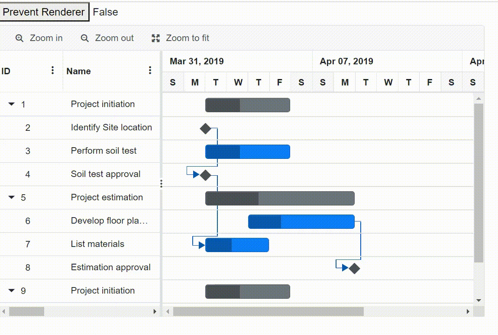

# WebAssembly Performance in Blazor Gantt Component

This section provides performance guidelines for using the Syncfusion Gantt component efficiently in the Blazor WebAssembly application. The general framework Blazor WebAssembly performance guidelines can be found [here](https://docs.microsoft.com/en-us/aspnet/core/blazor/webassembly-performance-best-practices).

> Refer to the Getting Started with [Blazor Server-Side Gantt](https://blazor.syncfusion.com/documentation/getting-started/blazor-server-side-visual-studio-2019/) and [Blazor WebAssembly Gantt](https://blazor.syncfusion.com/documentation/gantt-chart/how-to/blazor-webassembly-gantt-using-visual-studio/) documentation pages for configuration specifications.

## Avoid unnecessary component renders

**PreventRender** method helps to avoid unnecessary re-rendering of the Gantt component. This method internally overrides the **ShouldRender** method of the Gantt to prevent rendering.

In the following example:

* The **PreventRender** method is called in the **ButtonHandler**. The value can be changed by clicking  the**Prevent Render** button.

* While zooming, the Gantt chart component will not re-render if the prevent render value is true. Chart will get updated if prevent render is false.

```cshtml
@using Syncfusion.Blazor.Gantt
@using Syncfusion.Blazor.Grids

<button @onclick="ButtonHandler">Prevent Renderer</button>
<label>@PreventRender</label>

<SfGantt @ref="Gantt"
         DataSource="@TaskCollection"
         Height="450px"
         Width="750px"
         Toolbar="@(new List<string>() {"ZoomIn", "ZoomOut", "ZoomToFit"})"
         AllowReordering="true"
         ShowColumnMenu="true"
         AllowSelection="true"
         EnableContextMenu="true"
         AllowFiltering="true"
         AllowSorting="true"
         AllowResizing="true"
         EnablePredecessorValidation="true">
    <GanttTaskFields Id="TaskId"
                     Name="TaskName"
                     StartDate="StartDate"
                     EndDate="EndDate"
                     Duration="Duration"
                     Progress="Progress"
                     Dependency="Predecessor"
                     Child="SubTasks">
    </GanttTaskFields>
    <GanttSelectionSettings Mode="SelectionMode.Row" Type="Syncfusion.Blazor.Grids.SelectionType.Multiple"></GanttSelectionSettings>
    <GanttEditSettings AllowTaskbarEditing="true"
                       AllowEditing="true"
                       AllowAdding="true"
                       AllowDeleting="true"
                       Mode="Syncfusion.Blazor.Gantt.EditMode.Auto"
                       ShowDeleteConfirmDialog="true">
    </GanttEditSettings>
</SfGantt>

@code{
    public SfGantt<TaskData> Gantt;

    public bool PreventRender { get; set; }

    public List<TaskData> TaskCollection { get; set; }

    protected override void OnInitialized()
    {
        this.TaskCollection = GetTaskCollection();
    }

    public void ButtonHandler()
    {
        PreventRender = !PreventRender;
        Gantt.PreventRender(PreventRender);
    }
    public class TaskData
    {
        public int TaskId { get; set; }
        public string TaskName { get; set; }
        public DateTime StartDate { get; set; }
        public DateTime EndDate { get; set; }
        public string Duration { get; set; }
        public int Progress { get; set; }
        public string Predecessor { get; set; }
        public List<TaskData> SubTasks { get; set; }
    }

    public static List<TaskData> GetTaskCollection()
    {
        List<TaskData> Tasks = new List<TaskData>()
        {
            new TaskData() {TaskId = 1,TaskName = "Project initiation",StartDate = new DateTime(2019, 04, 02),EndDate = new DateTime(2019, 04, 21),SubTasks = (new List <TaskData> () {new TaskData() {TaskId = 2,TaskName = "Identify Site location",StartDate = new DateTime(2019, 04, 02),Duration = "0",Progress = 30},new TaskData() {TaskId = 3,TaskName = "Perform soil test",StartDate = new DateTime(2019, 04, 02),Duration = "4",Progress = 40},new TaskData() {TaskId = 4,TaskName = "Soil test approval",StartDate = new DateTime(2019, 04, 02),Duration = "0",Progress = 30,Predecessor = "2"}})}, 
            new TaskData() {TaskId = 5,TaskName = "Project estimation",StartDate = new DateTime(2019, 04, 02),EndDate = new DateTime(2019, 04, 21),SubTasks = (new List <TaskData> () {new TaskData() {TaskId = 6,TaskName = "Develop floor plan for estimation",StartDate = new DateTime(2019, 04, 04),Duration = "3",Progress = 30},new TaskData() {TaskId = 7,TaskName = "List materials",StartDate = new DateTime(2019, 04, 04),Duration = "3",Progress = 40,Predecessor = "4"},new TaskData() {TaskId = 8,TaskName = "Estimation approval",StartDate = new DateTime(2019, 04, 04),Duration = "0",Progress = 30,Predecessor = "6"}})},
            new TaskData() {TaskId = 9,TaskName = "Project initiation",StartDate = new DateTime(2019, 04, 02),EndDate = new DateTime(2019, 04, 21),SubTasks = (new List <TaskData> () {new TaskData() {TaskId = 10,TaskName = "Identify Site location",StartDate = new DateTime(2019, 04, 02),Duration = "0",Progress = 30,},new TaskData() {TaskId = 11,TaskName = "Perform soil test",StartDate = new DateTime(2019, 04, 02),Duration = "4",Progress = 40,},})}
        };
        return Tasks;
    }
}
```



### Notes

* The **PreventRender** method accepts Boolean argument that accepts true or false to disable or enable rendering respectively.
* The **PreventRender** method can be used only after the Gantt component completed initial rendering. Calling this method during initial rendering will not have any effect.

