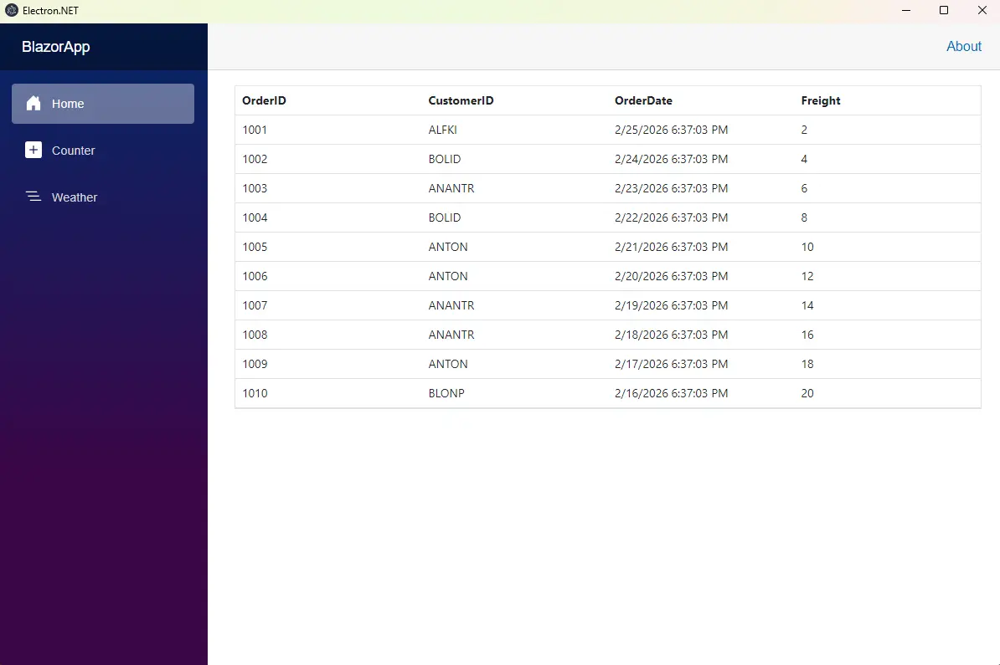

# Creating a Blazor Desktop App with Electron

This guide explains how to create a cross-platform desktop application by combining a **Blazor Web App (Server)** with the **[ElectronNET.Core](https://www.nuget.org/packages/ElectronNET.Core)** framework and integrating **[Syncfusion<sup style="font-size:70%">&reg;</sup> Blazor DataGrid](https://www.syncfusion.com/blazor-components/blazor-datagrid)** within an Electron‑powered desktop environment.

N> ElectronNET.Core is a community-maintained fork of Electron.NET that supports .NET 6 and later versions (including .NET 8, 9, and 10). It is not an official Microsoft package.

## What is Electron?

[Electron](https://www.electronjs.org/) is a framework for building cross-platform desktop applications using web technologies. It uses [Node.js](https://nodejs.org/en/download/) and the [Chromium](https://www.chromium.org/) rendering engine to run a web application inside a desktop environment.

ElectronNET.Core connects a Blazor Web App (Server) with the Electron shell by hosting an internal [ASP.NET Core Kestrel server](https://learn.microsoft.com/en-us/aspnet/core/fundamentals/servers/kestrel) and loading it in a Chromium window. The Electron main process communicates with the Blazor backend through this local server, enabling desktop‑native features without requiring changes to the application’s architecture.

## Prerequisites

- [.NET 8 (LTS) or later](https://dotnet.microsoft.com/en-us/download/dotnet)
- [Node.js 22.x (LTS) or later](https://nodejs.org/en/download/)
- [Visual Studio Code](https://code.visualstudio.com/) with [C# Dev Kit](https://marketplace.visualstudio.com/items?itemName=ms-dotnettools.csdevkit) extension
- **Supported Operating Systems:**
  - **Windows:** Windows 10 or later (x64, ARM64)
  - **macOS:** macOS 12 (Monterey) or later (x64, ARM64)
  - **Linux:** Ubuntu 20.04 or later (or equivalent distributions)

## Create a Blazor web app (Server render mode)

Run the following commands in the **command-line interface (CLI)**.




dotnet new blazor -o BlazorElectronApp -int Server
cd BlazorElectronApp




## Install required packages

From the project folder (where the `.csproj` is located), install the Syncfusion<sup style="font-size:70%">&reg;</sup> **Grid**, **Themes**, and the **ElectronNET.Core** packages.

 * [Syncfusion.Blazor.Grid](https://www.nuget.org/packages/Syncfusion.Blazor.Grid)
 * [Syncfusion.Blazor.Themes](https://www.nuget.org/packages/Syncfusion.Blazor.Themes/)
 * [ElectronNET.Core](https://www.nuget.org/packages/ElectronNET.Core)
 * [ElectronNET.Core.AspNet](https://www.nuget.org/packages/ElectronNET.Core.AspNet)




dotnet add package Syncfusion.Blazor.Grid -v {{ site.releaseversion }}
dotnet add package Syncfusion.Blazor.Themes -v {{ site.releaseversion }}

dotnet add package ElectronNET.Core --version 0.4.1
dotnet add package ElectronNET.Core.AspNet --version 0.4.1

dotnet restore




N> Replace `0.4.1` with the latest stable version. Check [NuGet](https://www.nuget.org/packages/ElectronNET.Core) for the current release.

## Add required namespaces

Add the required Syncfusion<sup style="font-size:70%">&reg;</sup> Blazor namespaces in `~/_Imports.razor`.




@using Syncfusion.Blazor
@using Syncfusion.Blazor.Grids




## Register Syncfusion<sup style="font-size:70%">&reg;</sup> and Electron services

Add the required Syncfusion<sup style="font-size:70%">&reg;</sup> Blazor service and configure ElectronNET.Core in your `~/Program.cs` file.

N> Before using the code snippet, update the namespace `BlazorElectronApp` to match your project's root namespace. You can find this in `App.razor` or `_Imports.razor`. For example, if your project is named `MyApp`, use `MyApp.Components.App`.




...
using Syncfusion.Blazor;
using ElectronNET.API;
using ElectronNET.API.Entities;
...

// Syncfusion services
builder.Services.AddSyncfusionBlazor();
// Electron services
builder.Services.AddElectron();
// Electron window bootstrap (modern ElectronNET.Core)
builder.UseElectron(args, async () =>
{
    var options = new BrowserWindowOptions
    {
        Width = 1200, Height = 800, Show = false, AutoHideMenuBar = true
    };

    var window = await Electron.WindowManager.CreateWindowAsync(options);

    window.OnReadyToShow += () => window.Show();
    window.OnClosed += () => Electron.App.Quit();
});
...

// Required for serving assets like _content/ (Syncfusion)
app.UseStaticFiles();

// Disable HTTPS redirection to avoid certificate issues in Electron apps
// app.UseHttpsRedirection();
...

// Map the root Razor Components app
app.MapRazorComponents<BlazorElectronApp.Components.App>()
    .AddInteractiveServerRenderMode();

app.Run();




## Add stylesheet and script resources

Before adding the stylesheet, ensure that no other Syncfusion<sup style="font-size:70%">&reg;</sup> theme CSS (for example, bootstrap5.css or material.css) is already referenced to avoid conflicts.

Add the following stylesheet and script references in `~/App.razor`.




<!-- Syncfusion theme style sheet -->
<link href="_content/Syncfusion.Blazor.Themes/fluent2.css" rel="stylesheet" />

<!-- Syncfusion Blazor core script (required for most components, including DataGrid) -->
<script src="_content/Syncfusion.Blazor.Core/scripts/syncfusion-blazor.min.js"></script>




## Add RuntimeIdentifiers to support cross-platform builds

The `RuntimeIdentifiers` property specifies the target platforms for the application and enables .NET to restore the necessary platform‑specific assets. This configuration allows the application to be built and packaged for Windows, Linux, and macOS from a single project.

To enable this, add the following property to your project’s `.csproj` file.





<PropertyGroup>
    ...
    <RuntimeIdentifiers>win-x64;win-arm64;linux-x64;osx-x64;osx-arm64</RuntimeIdentifiers>
</PropertyGroup>





N> The example includes x64 and ARM64 architectures for Windows, macOS, and Linux. Adjust runtime identifiers based on your target platforms. See [.NET RID Catalog](https://learn.microsoft.com/en-us/dotnet/core/rid-catalog) for a full list.

## Add Packaging Configuration for ElectronNET.Core

ElectronNET.Core uses the `electron-builder.json` file to configure packaging settings for desktop builds. Create a file named `electron-builder.json` in your project's **root folder** (next to the `.csproj` file) and add the following content.





{
  "appId": "com.companyname.blazorelectronapp",
  "productName": "Blazor Electron App",
  "directories": {
    "output": "dist-electron"
  },
  "files": [
    "**/*"
  ],
  "win": {
    "target": "nsis"
  },
  "mac": {
    "target": "dmg"
  },
  "linux": {
    "target": "AppImage"
  }
}





## Add Syncfusion<sup style="font-size:70%">&reg;</sup> Blazor DataGrid component

Add the Syncfusion<sup style="font-size:70%">&reg;</sup> Blazor DataGrid component to a `.razor` file within your app. For example, update `~/Components/Pages/Home.razor`.




@rendermode InteractiveServer
@using Syncfusion.Blazor.Grids

<SfGrid DataSource="@Orders" />

@code{
    public List<Order> Orders { get; set; }

    protected override void OnInitialized()
    {
        Orders = Enumerable.Range(1, 10).Select(x => new Order()
        {
            OrderID = 1000 + x,
            CustomerID = (new string[] { "ALFKI", "ANANTR", "ANTON", "BLONP", "BOLID" })[new Random().Next(5)],
            Freight = 2 * x,
            OrderDate = DateTime.Now.AddDays(-x),
        }).ToList();
    }

    public class Order {
        public int? OrderID { get; set; }
        public string CustomerID { get; set; }
        public DateTime? OrderDate { get; set; }
        public double? Freight { get; set; }
    }
}




## Run the application

```
dotnet run
```


## Publish and build desktop packages

The following commands publish the application for the x64 architecture. Update the runtime identifier as needed (for example, `osx-arm64` or `linux-arm64`) to target other platforms.




dotnet publish -r win-x64 -c Release





dotnet publish -r osx-x64 -c Release





dotnet publish -r linux-x64 -c Release



