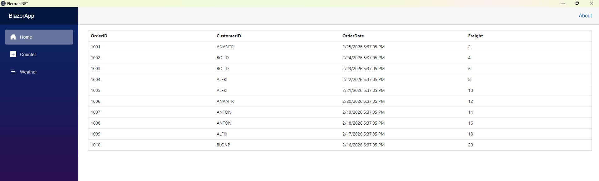

# Creating a Desktop Application using Blazor Web App, Electron, and Syncfusion DataGrid

This section explains how to build a cross‑platform desktop application using a **Blazor Web App with Interactive Server render mode**, the **ElectronNET.Core** framework, and Syncfusion<sup style="font-size:70%">®</sup> Blazor DataGrid inside an Electron shell.

N> ElectronNET.Core is the modern fork of the Electron.NET approach that supports recent .NET versions. 

## What is Electron?

[Electron](https://www.electronjs.org/) is a framework for building cross-platform desktop applications with web technologies. It utilizes `Node.js` and the `Chromium` rendering engine to run a web application in a desktop shell.

## Prerequisites

- .NET 8 or later (LTS)
- Node.js 22.x or later
- Supported OS (for .NET 8 or later): Windows 10+, macOS 12+, Ubuntu 20.04+
- Editor/IDE: Visual Studio 2022 or later, or VS Code

## Create a Blazor Web App (Interactive Server)

Create a new **Blazor Web App** with **Server interactivity** using the .NET CLI or Visual Studio.

N> In .NET 8+, the unified **Blazor Web App** template with **Interactive Server** render mode is the recommended way to build server‑interactive apps that use components like the **Syncfusion Blazor DataGrid**.

- [Create a Blazor Server application by using the CLI](https://blazor.syncfusion.com/documentation/getting-started/blazor-server-side-visual-studio?tabcontent=.net-cli)  
- [Create a Blazor Server application by using Visual Studio](https://blazor.syncfusion.com/documentation/getting-started/blazor-server-side-visual-studio)

## Install Syncfusion<sup style="font-size:70%">&reg;</sup> Blazor DataGrid and Themes NuGet Packages

From the project folder (where the `.csproj` is located), install the **Grid** and **Themes** packages:
 * [Syncfusion.Blazor.Grid](https://www.nuget.org/packages/Syncfusion.Blazor.Grid)
 * [Syncfusion.Blazor.Themes](https://www.nuget.org/packages/Syncfusion.Blazor.Themes/)




dotnet add package Syncfusion.Blazor.Grid -v {{ site.releaseversion }}
dotnet add package Syncfusion.Blazor.Themes -v {{ site.releaseversion }}
dotnet restore




## Add Required Namespaces

Open **~/_Imports.razor** and import the required Syncfusion<sup style="font-size:70%">&reg;</sup> namespaces.




@using Syncfusion.Blazor
@using Syncfusion.Blazor.Grids




## Register Syncfusion<sup style="font-size:70%">&reg;</sup> Blazor Service

Register the Syncfusion<sup style="font-size:70%">&reg;</sup> Blazor service in your app’s **~/Program.cs**.




....
....
using Syncfusion.Blazor;

var builder = WebApplication.CreateBuilder(args);

// Add services to the container.
....
....
builder.Services.AddSyncfusionBlazor();

....




## Add stylesheet and script resources

Before adding the stylesheet, make sure no other Syncfusion<sup style="font-size:70%">&reg;</sup> theme CSS (e.g., bootstrap5.css, material.css) is already referenced to avoid conflicts.

Add the following stylesheet and script references in the `~/App.razor`. 




<head>
    ...
    <!-- Syncfusion theme style sheet -->
    <link href="_content/Syncfusion.Blazor.Themes/bootstrap5.css" rel="stylesheet" />
</head>

<body>
    ...
    <!-- Syncfusion Blazor Core script (required for most components, including DataGrid) -->
    <script src="_content/Syncfusion.Blazor.Core/scripts/syncfusion-blazor.min.js" type="text/javascript"></script>
</body>





## Add Syncfusion<sup style="font-size:70%">&reg;</sup> Blazor DataGrid component

Add the Syncfusion<sup style="font-size:70%">&reg;</sup> DataGrid components to a `.razor` file within your app.




@rendermode InteractiveServer
@using Syncfusion.Blazor.Grids

<SfGrid DataSource="@Orders" />

@code{
    public List<Order> Orders { get; set; }

    protected override void OnInitialized()
    {
        Orders = Enumerable.Range(1, 10).Select(x => new Order()
        {
            OrderID = 1000 + x,
            CustomerID = (new string[] { "ALFKI", "ANANTR", "ANTON", "BLONP", "BOLID" })[new Random().Next(5)],
            Freight = 2 * x,
            OrderDate = DateTime.Now.AddDays(-x),
        }).ToList();
    }

    public class Order {
        public int? OrderID { get; set; }
        public string CustomerID { get; set; }
        public DateTime? OrderDate { get; set; }
        public double? Freight { get; set; }
    }
}




## Configure Electron.NET in Your Blazor App (using ElectronNET.Core)

Run the following commands in either the **Visual Studio Developer Command Prompt** or any **command-line interface (CLI)**.

### 1. Install the ElectronNET.Core NuGet packages





dotnet add package ElectronNET.Core
dotnet add package ElectronNET.Core.AspNet
dotnet restore





### 2. Update Program.cs to Integrate Electron.NET

Replace `YourProjectName` in the code below with your actual root namespace used by the App component (see `App.razor` or `_Imports.razor`).




...
using Syncfusion.Blazor;
using ElectronNET.API;
using ElectronNET.API.Entities;

...
...

// Syncfusion services
builder.Services.AddSyncfusionBlazor();

// Electron services
builder.Services.AddElectron();

// Electron window bootstrap (modern ElectronNET.Core)
builder.UseElectron(args, async () =>
{
    var options = new BrowserWindowOptions
    {
        Width = 1200,
        Height = 800,
        Show = false,
        AutoHideMenuBar = true,
        // IsRunningBlazor = true,   // Optional: enable if Blazor script loading issues occur.
    };

    var window = await Electron.WindowManager.CreateWindowAsync(options);

    window.OnReadyToShow += () => window.Show();
    window.OnClosed += () => Electron.App.Quit();
});

...

app.UseStaticFiles(); // Required for serving assets like _content/ (Syncfusion).

...

// app.UseHttpsRedirection();   <-- Do NOT enable for Electron app

...

// Map the root Razor Components app
app.MapRazorComponents<YourProjectName.Components.App>()
    .AddInteractiveServerRenderMode();

app.Run();




### 3. Add Runtime Identifiers to Support Cross‑Platform Builds

Add the following property to your project’s `.csproj` file:





<PropertyGroup>
    ...
    <RuntimeIdentifiers>win-x64;linux-x64;osx-x64;osx-arm64</RuntimeIdentifiers>
</PropertyGroup>





### 4. Add electron-builder.json (Required for ElectronNET.Core)

ElectronNET.Core requires this file for packaging your desktop application.
Create a file named `electron-builder.json` inside your project’s `Properties` folder and add the following code.





{
  "appId": "com.companyname.blazorelectronapp",
  "productName": "Blazor Electron App",
  "directories": {
    "output": "dist-electron"
  },
  "files": [
    "**/*"
  ],
  "win": {
    "target": "nsis"
  },
  "mac": {
    "target": "dmg"
  },
  "linux": {
    "target": "AppImage"
  }
}





### Run the application

```
dotnet run
```


### Publish and Build Desktop Packages

```
Windows: dotnet publish -r win-x64 -c Release
macOS: dotnet publish -r osx-x64 -c Release
Linux: dotnet publish -r linux-x64 -c Release
``` 

