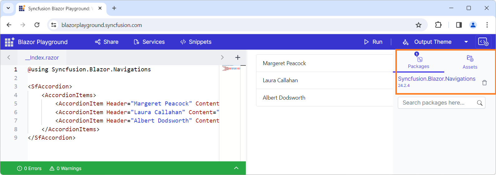

# Getting Started with Blazor Server Side App in .NET CLI

This article provides a step-by-step instructions for building Blazor Server App with `Syncfusion Blazor Component` using the [.NET CLI](https://dotnet.microsoft.com/en-us/download/dotnet).

## Using Playground

[Blazor Playground](https://blazor.syncfusion.com/documentation/blazor-playground/overview) allows you to interact with our Blazor components directly in your web browser without need to install any required NuGet packages. By default, the `Syncfusion.Blazor` package is included in this.

[https://blazorplayground.syncfusion.com/](https://blazorplayground.syncfusion.com/)

To use the individual component in Blazor playground, uninstall the existing package and then install the needed NuGet package.



## Prerequisites

Latest version of the [.NET Core SDK](https://dotnet.microsoft.com/en-us/download). If you previously installed the SDK, you can determine the installed version by executing the following command in a command prompt (Windows) or terminal (macOS) or command shell (Linux).




dotnet --version




## Create a Blazor Server side project using .NET CLI

Run the `dotnet new blazorserver` command to create a new Blazor Server application in a command prompt (Windows) or terminal (macOS) or command shell (Linux).




dotnet new blazorserver -o BlazorApp
cd BlazorApp




This command creates new Blazor app project and places it in a new directory called `BlazorApp` inside your current location. See [Create Blazor app topic](https://dotnet.microsoft.com/en-us/learn/aspnet/blazor-tutorial/create) and [dotnet new CLI command](https://learn.microsoft.com/en-us/dotnet/core/tools/dotnet-new) topics for more details.

N> If you have installed multiple SDK versions and need any specific framework version (net6.0/net7.0) project, then add `-f` flag along with `dotnet new blazorserver` comment. Refer [here](https://learn.microsoft.com/en-us/dotnet/core/tools/dotnet-new) for the available options.

## Install Syncfusion Blazor Calendars and Themes NuGet in the App

Here's an example of how to add **Blazor Calendar** component in the application using the following command in the command prompt (Windows) or terminal (Linux and macOS) to install a [Syncfusion.Blazor.Calendars](https://www.nuget.org/packages/Syncfusion.Blazor.Calendars/) and [Syncfusion.Blazor.Themes](https://www.nuget.org/packages/Syncfusion.Blazor.Themes/) NuGet package. See [Install and manage packages using the dotnet CLI](https://learn.microsoft.com/en-us/nuget/consume-packages/install-use-packages-dotnet-cli) topics for more details.




dotnet add package Syncfusion.Blazor.Calendars -Version {{ site.releaseversion }}
dotnet add package Syncfusion.Blazor.Themes -Version {{ site.releaseversion }}
dotnet restore




N> Syncfusion Blazor components are available in [nuget.org](https://www.nuget.org/packages?q=syncfusion.blazor). Refer to [NuGet packages](https://blazor.syncfusion.com/documentation/nuget-packages) topic for available NuGet packages list with component details.

## Register Syncfusion Blazor Service

Open **~/_Imports.razor** file and import the `Syncfusion.Blazor` and `Syncfusion.Blazor.Calendars` namespace.

```cshtml

@using Syncfusion.Blazor
@using Syncfusion.Blazor.Calendars

```

Now, register the Syncfusion Blazor Service in the **~/Program.cs** file of your Blazor Server App.




using Microsoft.AspNetCore.Components;
using Microsoft.AspNetCore.Components.Web;
using Syncfusion.Blazor;

var builder = WebApplication.CreateBuilder(args);

// Add services to the container.
builder.Services.AddRazorPages();
builder.Services.AddServerSideBlazor();
builder.Services.AddSyncfusionBlazor();
var app = builder.Build();
....




## Add stylesheet and script resources

The theme stylesheet and script can be accessed from NuGet through [Static Web Assets](https://blazor.syncfusion.com/documentation/appearance/themes#static-web-assets). Reference the stylesheet and script in the `<head>` of the main page as follows:

* For **.NET 6** Blazor Server app, include it in **~/Pages/_Layout.cshtml** file.

* For **.NET 7** Blazor Server app, include it in the **~/Pages/_Host.cshtml** file.

```html
<head>
    ....
    <link href="_content/Syncfusion.Blazor.Themes/bootstrap5.css" rel="stylesheet" />
    <script src="_content/Syncfusion.Blazor.Core/scripts/syncfusion-blazor.min.js" type="text/javascript"></script>
</head>
```
N> Check out the [Blazor Themes](https://blazor.syncfusion.com/documentation/appearance/themes) topic to discover various methods ([Static Web Assets](https://blazor.syncfusion.com/documentation/appearance/themes#static-web-assets), [CDN](https://blazor.syncfusion.com/documentation/appearance/themes#cdn-reference), and [CRG](https://blazor.syncfusion.com/documentation/common/custom-resource-generator)) for referencing themes in your Blazor application. Also, check out the [Adding Script Reference](https://blazor.syncfusion.com/documentation/common/adding-script-references) topic to learn different approaches for adding script references in your Blazor application.

## Add Syncfusion Blazor component

Add the Syncfusion Blazor Calendar component in the **~/Pages/Index.razor** file.




<SfCalendar TValue="DateTime" />




* In the command prompt (Windows) or terminal (Linux and macOS) to run the following command to build and start the app. The app listening on `http://localhost:<port number>` and view it in the browser.




dotnet run





## See also

* [Getting Started with Blazor WebAssembly using .NET CLI](https://blazor.syncfusion.com/documentation/getting-started/blazor-webassembly-dotnet-cli)
