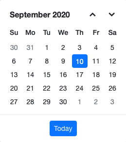

<!-- markdownlint-disable MD024 -->

# Getting Started with Blazor Server Side App in VS for Mac

This article provides a step-by-step instructions for building Blazor Server App with `Blazor Calendar` component using [Visual Studio for Mac](https://visualstudio.microsoft.com/vs/mac/).

## Prerequisites

* [System requirements for Blazor components](https://blazor.syncfusion.com/documentation/system-requirements)

## Create a Blazor Server Side App in Visual Studio for Mac

You can create a **Blazor Server App** using Visual Studio for mac in the following way.

* [Create a project using Microsoft Templates](https://learn.microsoft.com/en-us/aspnet/core/blazor/tooling?view=aspnetcore-7.0&pivots=macos)

## Install Syncfusion<sup style="font-size:70%">&reg;</sup> Blazor packages in the App

Here's an example of how to add **Blazor Calendar** component in the app, open the NuGet package manager in Visual Studio (*Tools → NuGet Package Manager → Manage NuGet Packages for Solution*), search and install [Syncfusion.Blazor.Calendars](https://www.nuget.org/packages/Syncfusion.Blazor.Calendars/) and [Syncfusion.Blazor.Themes](https://www.nuget.org/packages/Syncfusion.Blazor.Themes/).

N> Syncfusion<sup style="font-size:70%">&reg;</sup> Blazor components are available in [nuget.org](https://www.nuget.org/packages?q=syncfusion.blazor). Refer to [NuGet packages](https://blazor.syncfusion.com/documentation/nuget-packages) topic for available NuGet packages list with component details.

## Register Syncfusion<sup style="font-size:70%">&reg;</sup> Blazor Service

Open **~/_Imports.razor** file and import the following namespace.

```cshtml

@using Syncfusion.Blazor
@using Syncfusion.Blazor.Calendars

```
Now, register the Syncfusion<sup style="font-size:70%">&reg;</sup> Blazor Service in the **~/Program.cs** file of your Blazor Server App.




using Syncfusion.Blazor;
....
var builder = WebApplication.CreateBuilder(args);
....
builder.Services.AddSyncfusionBlazor();




## Add stylesheet and script resources

The theme stylesheet and script can be accessed from NuGet through [Static Web Assets](https://blazor.syncfusion.com/documentation/appearance/themes#static-web-assets). Reference the stylesheet and script in the `<head>` of the main page as follows:

* For **.NET 6** Blazor Server app, include it in **~/Pages/_Layout.cshtml** file.

* For **.NET 7** Blazor Server app, include it in the **~/Pages/_Host.cshtml** file.

```html
<head>
    ....
    <link href="_content/Syncfusion.Blazor.Themes/bootstrap5.css" rel="stylesheet" />
    <script src="_content/Syncfusion.Blazor.Core/scripts/syncfusion-blazor.min.js" type="text/javascript"></script>
</head>
```
N> Check out the [Blazor Themes](https://blazor.syncfusion.com/documentation/appearance/themes) topic to discover various methods ([Static Web Assets](https://blazor.syncfusion.com/documentation/appearance/themes#static-web-assets), [CDN](https://blazor.syncfusion.com/documentation/appearance/themes#cdn-reference), and [CRG](https://blazor.syncfusion.com/documentation/common/custom-resource-generator)) for referencing themes in your Blazor application. Also, check out the [Adding Script Reference](https://blazor.syncfusion.com/documentation/common/adding-script-references) topic to learn different approaches for adding script references in your Blazor application.

## Add Syncfusion<sup style="font-size:70%">&reg;</sup> Blazor component

Add the Syncfusion<sup style="font-size:70%">&reg;</sup> Blazor Calendar component in the **~/Pages/Index.razor** file.




<SfCalendar TValue="DateTime" />




* <kbd>⌘</kbd>+<kbd>F5</kbd> to run the app. Then, the Syncfusion<sup style="font-size:70%">&reg;</sup> Blazor Calendar component will be rendered in the default web browser.



N> When utilizing a PDF viewer on macOS (ARM), we highly recommend opting for our [PDF Viewer](https://help.syncfusion.com/document-processing/pdf/pdf-viewer/blazor/migration) since it has excellent compatibility with macOS (ARM) architecture.

## See also

* [Getting Started with Blazor WebAssembly for Mac](https://blazor.syncfusion.com/documentation/getting-started/blazor-webassembly-visual-studio-mac)
