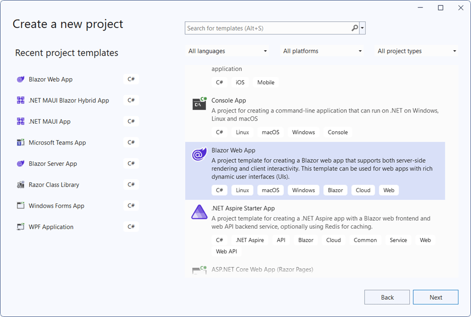
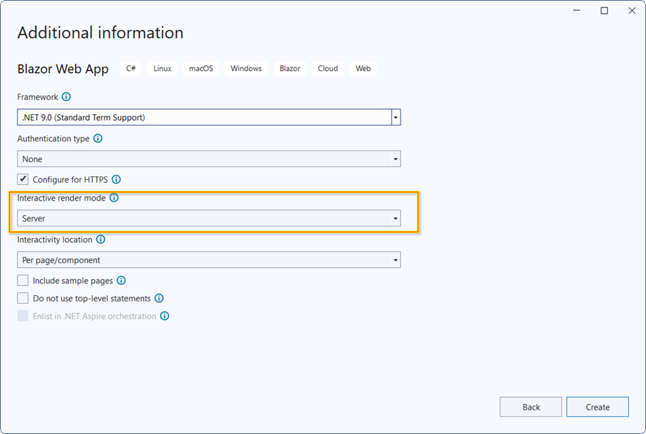

# Getting Started with Blazor Server Side App in Visual Studio

This article provides a step-by-step instructions for building Blazor Server App with `Blazor Calendar` component using [Visual Studio](https://visualstudio.microsoft.com/vs/). 





## Prerequisites

* [System requirements for Blazor components](https://blazor.syncfusion.com/documentation/system-requirements)

## Create a new Blazor Server App in Visual Studio

You can create a **Blazor Server App** using **Blazor Web App** template in Visual Studio via [Microsoft Templates](https://learn.microsoft.com/en-us/aspnet/core/blazor/tooling?view=aspnetcore-9.0&pivots=vs) or the [Syncfusion<sup style="font-size:70%">&reg;</sup> Blazor Extension](https://blazor.syncfusion.com/documentation/visual-studio-integration/template-studio).



You need to configure the corresponding [Interactive render mode](https://learn.microsoft.com/en-us/aspnet/core/blazor/components/render-modes?view=aspnetcore-8.0#render-modes) and [Interactivity location](https://learn.microsoft.com/en-us/aspnet/core/blazor/tooling?view=aspnetcore-9.0&pivots=vs) while creating a Blazor Server Application.



## Install Syncfusion<sup style="font-size:70%">&reg;</sup> Blazor Calendars and Themes NuGet in the App

Here's an example of how to add **Blazor Calendar** component in the app, open the NuGet package manager in Visual Studio (*Tools → NuGet Package Manager → Manage NuGet Packages for Solution*), search and install [Syncfusion.Blazor.Calendars](https://www.nuget.org/packages/Syncfusion.Blazor.Calendars/) and [Syncfusion.Blazor.Themes](https://www.nuget.org/packages/Syncfusion.Blazor.Themes/). Alternatively, you can utilize the following package manager command to achieve the same.




Install-Package Syncfusion.Blazor.Calendars -Version {{ site.releaseversion }}
Install-Package Syncfusion.Blazor.Themes -Version {{ site.releaseversion }}




N> Syncfusion<sup style="font-size:70%">&reg;</sup> Blazor components are available in [nuget.org](https://www.nuget.org/packages?q=syncfusion.blazor). Refer to [NuGet packages](https://blazor.syncfusion.com/documentation/nuget-packages) topic for available NuGet packages list with component details. 





## Prerequisites

* [System requirements for Blazor components](https://blazor.syncfusion.com/documentation/system-requirements)

## Create a new Blazor Server App in Visual Studio Code

You can create a **Blazor Server App** using Visual Studio Code via [Microsoft Templates](https://learn.microsoft.com/en-us/aspnet/core/blazor/tooling?view=aspnetcore-9.0&pivots=vsc) or the [Syncfusion<sup style="font-size:70%">&reg;</sup> Blazor Extension](https://blazor.syncfusion.com/documentation/visual-studio-code-integration/create-project).

Alternatively, you can create a Server application using the following command in the terminal(<kbd>Ctrl</kbd>+<kbd>`</kbd>).




dotnet new blazor -o BlazorApp -int Server
cd BlazorApp




This command creates new Blazor app project and places it in a new directory called `BlazorApp` inside your current location. See [Create Blazor app topic](https://dotnet.microsoft.com/en-us/learn/aspnet/blazor-tutorial/create) and [dotnet new command](https://learn.microsoft.com/en-us/dotnet/core/tools/dotnet-new) topics for more details.

## Install Syncfusion<sup style="font-size:70%">&reg;</sup> Blazor Calendars and Themes NuGet in the App

* Press <kbd>Ctrl</kbd>+<kbd>`</kbd> to open the integrated terminal in Visual Studio Code.
* Ensure you’re in the project root directory where your `.csproj` file is located.
* Run the following command to install a [Syncfusion.Blazor.Calendars](https://www.nuget.org/packages/Syncfusion.Blazor.Calendars/) and [Syncfusion.Blazor.Themes](https://www.nuget.org/packages/Syncfusion.Blazor.Themes/) NuGet package and ensure all dependencies are installed.




dotnet add package Syncfusion.Blazor.Calendars -Version {{ site.releaseversion }}
dotnet add package Syncfusion.Blazor.Themes -Version {{ site.releaseversion }}
dotnet restore




N> Syncfusion<sup style="font-size:70%">&reg;</sup> Blazor components are available in [nuget.org](https://www.nuget.org/packages?q=syncfusion.blazor). Refer to [NuGet packages](https://blazor.syncfusion.com/documentation/nuget-packages) topic for available NuGet packages list with component details.





## Prerequisites

Latest version of the [.NET Core SDK](https://dotnet.microsoft.com/en-us/download). If you previously installed the SDK, you can determine the installed version by executing the following command in a command prompt (Windows) or terminal (macOS) or command shell (Linux).




dotnet --version




## Create a Blazor Server side project using .NET CLI

Run the `dotnet new blazorserver` command to create a new Blazor Server application in a command prompt (Windows) or terminal (macOS) or command shell (Linux).




dotnet new blazorserver -o BlazorApp
cd BlazorApp




This command creates new Blazor app project and places it in a new directory called `BlazorApp` inside your current location. See [Create Blazor app topic](https://dotnet.microsoft.com/en-us/learn/aspnet/blazor-tutorial/create) and [dotnet new CLI command](https://learn.microsoft.com/en-us/dotnet/core/tools/dotnet-new) topics for more details.

## Install Syncfusion<sup style="font-size:70%">&reg;</sup> Blazor Calendars and Themes NuGet in the App

Here's an example of how to add **Blazor Calendar** component in the application using the following command in the command prompt (Windows) or terminal (Linux and macOS) to install a [Syncfusion.Blazor.Calendars](https://www.nuget.org/packages/Syncfusion.Blazor.Calendars/) and [Syncfusion.Blazor.Themes](https://www.nuget.org/packages/Syncfusion.Blazor.Themes/) NuGet package. See [Install and manage packages using the dotnet CLI](https://learn.microsoft.com/en-us/nuget/consume-packages/install-use-packages-dotnet-cli) topics for more details.




dotnet add package Syncfusion.Blazor.Calendars -Version {{ site.releaseversion }}
dotnet add package Syncfusion.Blazor.Themes -Version {{ site.releaseversion }}
dotnet restore




N> Syncfusion<sup style="font-size:70%">&reg;</sup> Blazor components are available in [nuget.org](https://www.nuget.org/packages?q=syncfusion.blazor). Refer to [NuGet packages](https://blazor.syncfusion.com/documentation/nuget-packages) topic for available NuGet packages list with component details.





## Register Syncfusion<sup style="font-size:70%">&reg;</sup> Blazor Service

Open **~/_Imports.razor** file and import the `Syncfusion.Blazor` and `Syncfusion.Blazor.Calendars` namespace.

```cshtml

@using Syncfusion.Blazor
@using Syncfusion.Blazor.Calendars

```
Now, register the Syncfusion<sup style="font-size:70%">&reg;</sup> Blazor Service in the **~/Program.cs** file of your Blazor Server App. 




....
....
using Syncfusion.Blazor;

var builder = WebApplication.CreateBuilder(args);

// Add services to the container.
....
....
builder.Services.AddSyncfusionBlazor();

....




## Add stylesheet and script resources

The theme stylesheet and script can be accessed from NuGet through [Static Web Assets](https://blazor.syncfusion.com/documentation/appearance/themes#static-web-assets). Include the stylesheet and script in the `<head>` and the script reference at the end of the `<body>` in the **App.razor** file as shown below:

```html
<head>
    ....
    <link href="_content/Syncfusion.Blazor.Themes/bootstrap5.css" rel="stylesheet" />
</head>

<body>
    ....
    <script src="_content/Syncfusion.Blazor.Core/scripts/syncfusion-blazor.min.js" type="text/javascript"></script>
</body>
```

N> Check out the [Blazor Themes](https://blazor.syncfusion.com/documentation/appearance/themes) topic to discover various methods ([Static Web Assets](https://blazor.syncfusion.com/documentation/appearance/themes#static-web-assets), [CDN](https://blazor.syncfusion.com/documentation/appearance/themes#cdn-reference), and [CRG](https://blazor.syncfusion.com/documentation/common/custom-resource-generator)) for referencing themes in your Blazor application. Also, check out the [Adding Script Reference](https://blazor.syncfusion.com/documentation/common/adding-script-references) topic to learn different approaches for adding script references in your Blazor application.

## Add Syncfusion<sup style="font-size:70%">&reg;</sup> Blazor component

Add the Syncfusion<sup style="font-size:70%">&reg;</sup> Blazor Calendar component in the **~/Components/Pages/Home.razor** file. If an interactivity location as `per page/component`, define a render mode at the top of the `Home.razor` page.

N> If an Interactivity Location is set to `Global` and the **Render Mode** is set to `Server`, the render mode is configured in the `App.razor` file by default.

```
@* desired render mode define here *@
@rendermode InteractiveServer
```




<SfCalendar TValue="DateTime" />




* Press <kbd>Ctrl</kbd>+<kbd>F5</kbd> (Windows) or <kbd>⌘</kbd>+<kbd>F5</kbd> (macOS) to launch the application. This will render the Syncfusion<sup style="font-size:70%">&reg;</sup> Blazor Calendar component in your default web browser.


