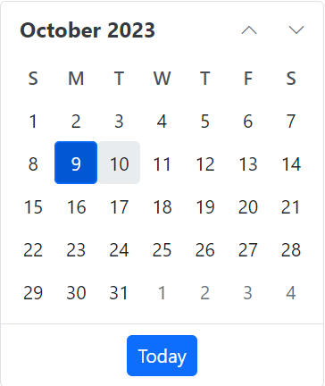

# Getting Started with Blazor Server Side App in Visual Studio

This article provides a step-by-step instructions for building Blazor Server App with `Blazor Calendar` component using [Visual Studio](https://visualstudio.microsoft.com/vs/). 

## Using Playground

[Blazor Playground](https://blazor.syncfusion.com/documentation/blazor-playground/overview) allows you to interact with our Blazor components directly in your web browser without need to install any required NuGet packages. By default, the `Syncfusion.Blazor` package is included in this.

[https://blazorplayground.syncfusion.com/](https://blazorplayground.syncfusion.com/)

To use the individual component in Blazor playground, uninstall the existing package and then install the needed NuGet package.


## Prerequisites

* [System requirements for Blazor components](https://blazor.syncfusion.com/documentation/system-requirements)

## Using Syncfusion Blazor Template

You can create a new Blazor Server App in a command prompt (Windows) or terminal (macOS) or command shell (Linux). Refer this documentation [link](https://blazor.syncfusion.com/documentation/getting-started/blazor-server-side-dotnet-cli#create-a-blazor-server-side-project-using-net-cli).

## Manually creating a project

### Create a new Blazor Server App

You can create a **Blazor Server App** using Visual Studio via [Microsoft Templates](https://learn.microsoft.com/en-us/aspnet/core/blazor/tooling?view=aspnetcore-7.0) or the [Syncfusion Blazor Extension](https://blazor.syncfusion.com/documentation/visual-studio-integration/template-studio).

### Install Syncfusion Blazor Calendars and Themes NuGet in the App

Here's an example of how to add **Blazor Calendar** component in the app, open the NuGet package manager in Visual Studio (*Tools → NuGet Package Manager → Manage NuGet Packages for Solution*), search and install [Syncfusion.Blazor.Calendars](https://www.nuget.org/packages/Syncfusion.Blazor.Calendars/) and [Syncfusion.Blazor.Themes](https://www.nuget.org/packages/Syncfusion.Blazor.Themes/). Alternatively, you can utilize the following package manager command to achieve the same.




Install-Package Syncfusion.Blazor.Calendars -Version {{ site.releaseversion }}
Install-Package Syncfusion.Blazor.Themes -Version {{ site.releaseversion }}




N> Syncfusion Blazor components are available in [nuget.org](https://www.nuget.org/packages?q=syncfusion.blazor). Refer to [NuGet packages](https://blazor.syncfusion.com/documentation/nuget-packages) topic for available NuGet packages list with component details. 

### Register Syncfusion Blazor Service

Open **~/_Imports.razor** file and import the `Syncfusion.Blazor` and `Syncfusion.Blazor.Calendars` namespace.

```cshtml

@using Syncfusion.Blazor
@using Syncfusion.Blazor.Calendars

```
Now, register the Syncfusion Blazor Service in the **~/Program.cs** file of your Blazor Server App. 




using Microsoft.AspNetCore.Components;
using Microsoft.AspNetCore.Components.Web;
using Syncfusion.Blazor;

var builder = WebApplication.CreateBuilder(args);

// Add services to the container.
builder.Services.AddRazorPages();
builder.Services.AddServerSideBlazor();
builder.Services.AddSyncfusionBlazor();

var app = builder.Build();
....




### Add stylesheet and script resources

The theme stylesheet and script can be accessed from NuGet through [Static Web Assets](https://blazor.syncfusion.com/documentation/appearance/themes#static-web-assets). Reference the stylesheet and script in the `<head>` of the main page as follows: 

* For **.NET 6** Blazor Server app, include it in **~/Pages/_Layout.cshtml** file.

* For **.NET 7** Blazor Server app, include it in the **~/Pages/_Host.cshtml** file.

```html
<head>
    ....
    <link href="_content/Syncfusion.Blazor.Themes/bootstrap5.css" rel="stylesheet" />
    <script src="_content/Syncfusion.Blazor.Core/scripts/syncfusion-blazor.min.js" type="text/javascript"></script>
</head>
```
N> Check out the [Blazor Themes](https://blazor.syncfusion.com/documentation/appearance/themes) topic to discover various methods ([Static Web Assets](https://blazor.syncfusion.com/documentation/appearance/themes#static-web-assets), [CDN](https://blazor.syncfusion.com/documentation/appearance/themes#cdn-reference), and [CRG](https://blazor.syncfusion.com/documentation/common/custom-resource-generator)) for referencing themes in your Blazor application. Also, check out the [Adding Script Reference](https://blazor.syncfusion.com/documentation/common/adding-script-references) topic to learn different approaches for adding script references in your Blazor application.

### Add Syncfusion Blazor component

Add the Syncfusion Blazor Calendar component in the **~/Pages/Index.razor** file.




<SfCalendar TValue="DateTime" />




* Press <kbd>Ctrl</kbd>+<kbd>F5</kbd> (Windows) or <kbd>⌘</kbd>+<kbd>F5</kbd> (macOS) to launch the application. This will render the Syncfusion Blazor Calendar component in your default web browser.


