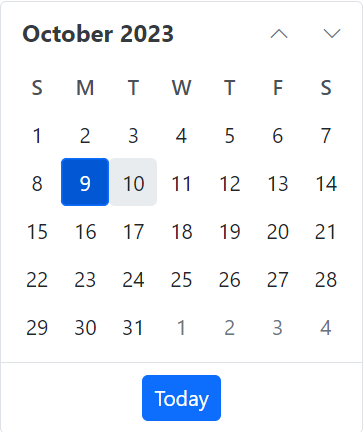

# Getting started with Blazor Component using Syncfusion.Blazor NuGet

This section explains how to add a Blazor component by using the consolidated Syncfusion.Blazor (Single NuGet) package in a Blazor Server App and a Blazor WebAssembly Standalone App in Visual Studio.

## Prerequisites

* [System requirements for Blazor components](https://blazor.syncfusion.com/documentation/system-requirements)

## Create a new Blazor App in Visual Studio

Create a **Blazor Web App (Server Interactive Mode) or WebAssembly Standalone** using Visual Studio via the [Microsoft Templates](https://learn.microsoft.com/en-us/aspnet/core/blazor/tooling?view=aspnetcore-8.0&pivots=vs) or the [Syncfusion<sup style="font-size:70%">&reg;</sup> Blazor extension](https://blazor.syncfusion.com/documentation/visual-studio-integration/template-studio).

## Install Syncfusion<sup style="font-size:70%">&reg;</sup> Blazor Single NuGet in the App

To add the **Blazor Calendar** component to the app, open NuGet Package Manager in Visual Studio (*Tools → NuGet Package Manager → Manage NuGet Packages for Solution*), search for, and install [Syncfusion.Blazor](https://www.nuget.org/packages/Syncfusion.Blazor). Alternatively, use the following Package Manager command.




Install-Package Syncfusion.Blazor -Version {{ site.releaseversion }}




N> Syncfusion<sup style="font-size:70%">&reg;</sup> Blazor components are available in [nuget.org](https://www.nuget.org/packages?q=syncfusion.blazor). Refer to the [NuGet packages](https://blazor.syncfusion.com/documentation/nuget-packages) topic for the available package list with component details. The Syncfusion.Blazor Single NuGet package is a comprehensive package that includes all components, with the exception of PDF Viewer and Document Editor.

## Register Syncfusion<sup style="font-size:70%">&reg;</sup> Blazor Service

Open **~/Components/_Imports.razor** and import the `Syncfusion.Blazor` and `Syncfusion.Blazor.Calendars` namespaces.

```cshtml

@using Syncfusion.Blazor
@using Syncfusion.Blazor.Calendars

```

Now, register the Syncfusion<sup style="font-size:70%">&reg;</sup> Blazor Service in the **~/Program.cs** file of your Blazor WebApp Server Interactive Mode or WebAssembly Standalone app.




using Microsoft.AspNetCore.Components;
using Microsoft.AspNetCore.Components.Web;
using Syncfusion.Blazor;

var builder = WebApplication.CreateBuilder(args);

// Add services to the container.
builder.Services.AddRazorPages();
builder.Services.AddServerSideBlazor();
builder.Services.AddSyncfusionBlazor();

var app = builder.Build();
....




using Microsoft.AspNetCore.Components.Web;
using Microsoft.AspNetCore.Components.WebAssembly.Hosting;
using Syncfusion.Blazor;

var builder = WebAssemblyHostBuilder.CreateDefault(args);
builder.RootComponents.Add<App>("#app");
builder.RootComponents.Add<HeadOutlet>("head::after");

builder.Services.AddScoped(serviceProvider => new HttpClient { BaseAddress = new Uri(builder.HostEnvironment.BaseAddress) });

builder.Services.AddSyncfusionBlazor();
await builder.Build().RunAsync();
....




## Add stylesheet and script resources

The theme stylesheet and script can be accessed from NuGet through [Static Web Assets](https://blazor.syncfusion.com/documentation/appearance/themes#static-web-assets). Reference the stylesheet and script in the `<head>` of the main page as follows:


* For **.NET 8 and .NET 9 WebAssembly Standalone app** , include it in **wwwroot/index.html** file.

* For **.NET 8 and .NET 9 Blazor WebApp Server Interactive Mode**, include it in **~/Components/App.razor**.

```html
<head>
    ....
    <link href="_content/Syncfusion.Blazor/styles/bootstrap5.css" rel="stylesheet" />
    <script  src="_content/Syncfusion.Blazor/scripts/syncfusion-blazor.min.js"  type="text/javascript"></script>
</head>
```
N> If you are using Syncfusion.Blazor single NuGet, you don’t have to refer Syncfusion.Blazor.Themes NuGet. Since style sheets already inside the assets of Syncfusion.Blazor NuGet.
N> Check out the [Blazor Themes](https://blazor.syncfusion.com/documentation/appearance/themes) topic to discover various methods ([Static Web Assets](https://blazor.syncfusion.com/documentation/appearance/themes#static-web-assets), [CDN](https://blazor.syncfusion.com/documentation/appearance/themes#cdn-reference), and [CRG](https://blazor.syncfusion.com/documentation/common/custom-resource-generator)) for referencing themes in your Blazor application. Also, check out the [Adding Script Reference](https://blazor.syncfusion.com/documentation/common/adding-script-references) topic to learn different approaches for adding script references in your Blazor application.

## Add Syncfusion<sup style="font-size:70%">&reg;</sup> Blazor component

* Now, add the Syncfusion<sup style="font-size:70%">&reg;</sup> Blazor Calendar component in the **~/Components/Pages/Index.razor**  file.




<SfCalendar TValue="DateTime" />




* Press <kbd>Ctrl</kbd>+<kbd>F5</kbd> (Windows) or <kbd>⌘</kbd>+<kbd>F5</kbd> (macOS) to run the app. Then, the Syncfusion<sup style="font-size:70%">&reg;</sup> Blazor Calendar component will be rendered in the default web browser.


