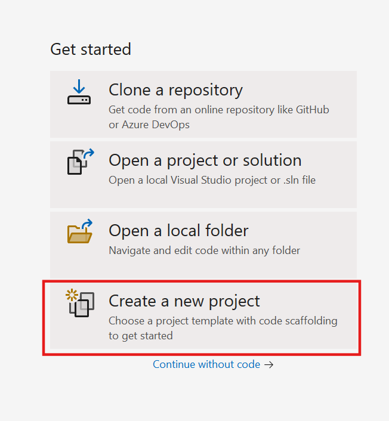
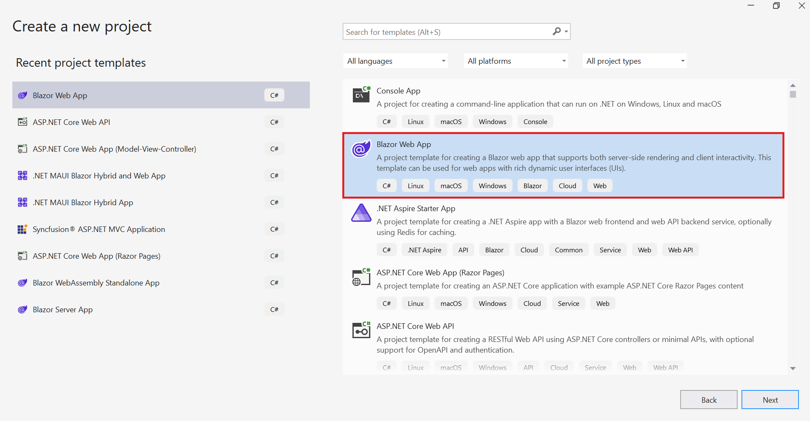
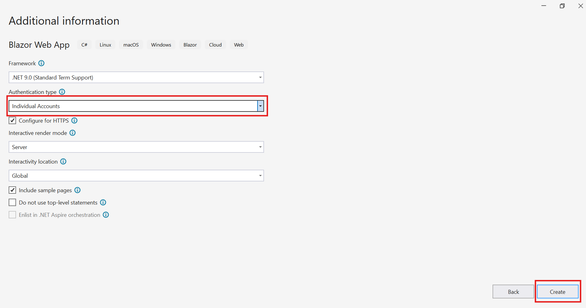
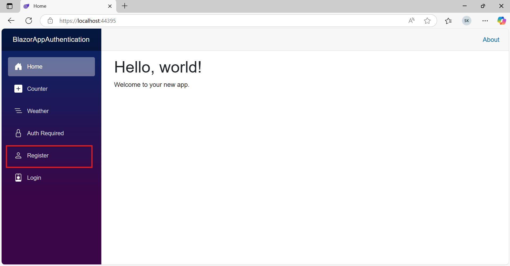
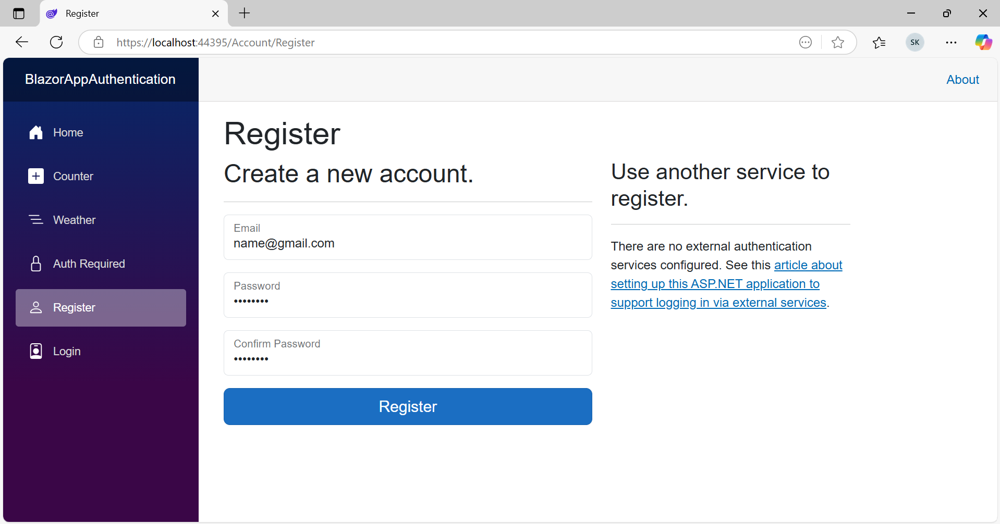
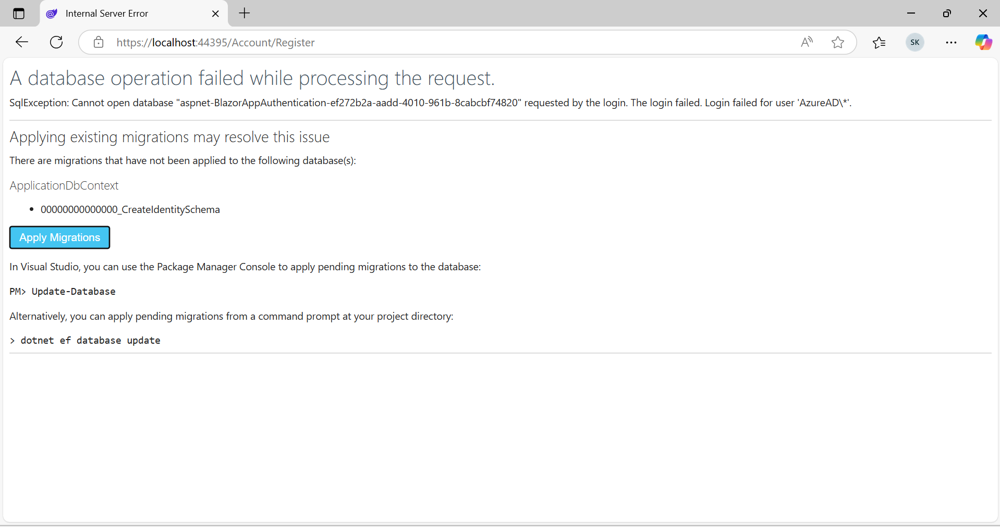
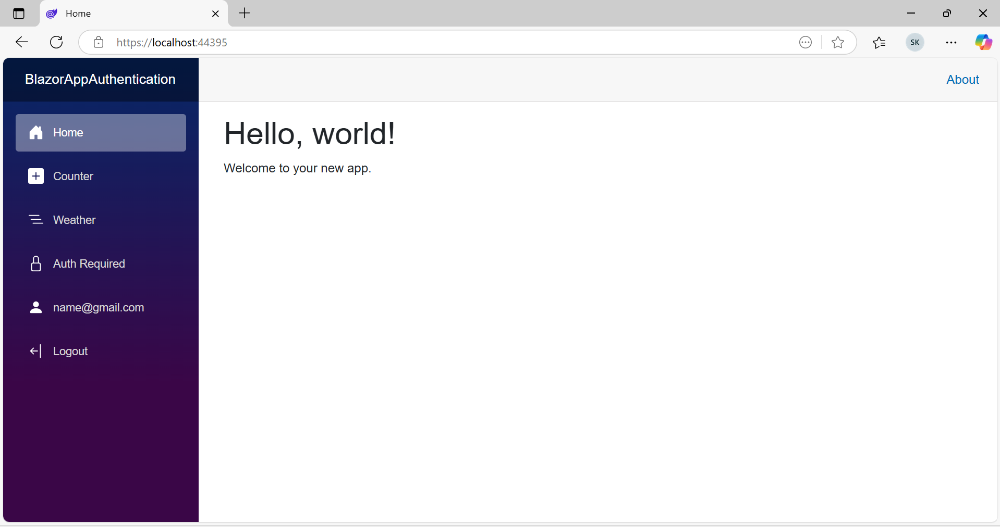
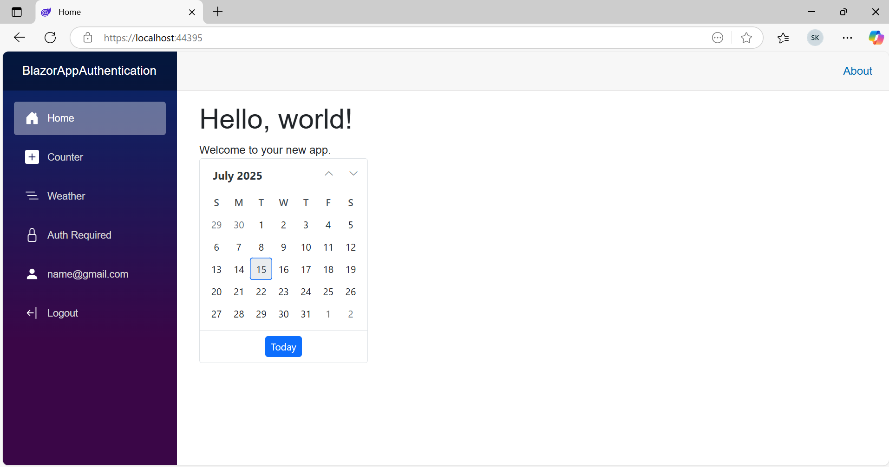

# Getting Started with Blazor Web App with Authentication

This guide demonstrates how to build a Blazor Web App with authentication in .NET 9, utilizing the built-in `AuthenticationStateProvider` to retrieve and manage user identity information directly from the application's authentication context.

## Prerequisites

* [System requirements for Blazor components](https://blazor.syncfusion.com/documentation/system-requirements)

## Create a new Blazor Web App in Visual Studio

* Open Visual Studio 2022 and select **Create a new project** from the start screen.



## Choose Project Template

* Select the **Blazor Web App** template using Visual Studio via [Microsoft Templates](https://learn.microsoft.com/en-us/aspnet/core/blazor/tooling?view=aspnetcore-9.0&pivots=windows) or the [Syncfusion<sup style="font-size:70%">&reg;</sup> Blazor Extension](https://blazor.syncfusion.com/documentation/visual-studio-integration/template-studio) and click **Next**.



## Configure Project Settings

* In the project settings, select **Blazor Server, WebAssembly, or Auto** as the render mode, enable the **Configure for HTTPS** option, and choose **Individual Accounts** as the authentication type before clicking **Create**. This selection adds authentication support and doesn't result in storing users in a database.



## Finalize Project Creation

Click the **Create** button to generate the Blazor Web App. Once created, run the project and locate the **Register** button.



## Register a User

* Fill in the required authentication details (e.g., email and password) in the registration form and click **Register**.



## Apply Database Migrations

After registering, select **Apply Migrations** to configure the database with the account details.



## Verify Login

Once migrations are applied, refresh the page. The home page will display the logged-in user’s email with **Logout** section.



Also, you can integrate Syncfusion Blazor Components within the **AuthorizeView** component using the following steps:

## Install Syncfusion<sup style="font-size:70%">&reg;</sup> Blazor Calendars and Themes NuGet in the App in the App

Here's an example of how to add **Blazor Calendar** component in the app, open the NuGet package manager in Visual Studio (*Tools → NuGet Package Manager → Manage NuGet Packages for Solution*), search and install [Syncfusion.Blazor.Calendars](https://www.nuget.org/packages/Syncfusion.Blazor.Calendars/) and [Syncfusion.Blazor.Themes](https://www.nuget.org/packages/Syncfusion.Blazor.Themes/). Alternatively, you can utilize the following package manager command to achieve the same.




Install-Package Syncfusion.Blazor.Calendars -Version {{ site.releaseversion }}
Install-Package Syncfusion.Blazor.Themes -Version {{ site.releaseversion }}




N> Syncfusion<sup style="font-size:70%">&reg;</sup> Blazor components are available in [nuget.org](https://www.nuget.org/packages?q=syncfusion.blazor). Refer to [NuGet packages](https://blazor.syncfusion.com/documentation/nuget-packages) topic for available NuGet packages list with component details.

## Register Syncfusion<sup style="font-size:70%">&reg;</sup> Blazor Service

Open **~/_Imports.razor** file and import the `Syncfusion.Blazor` and `Syncfusion.Blazor.Calendars` namespace.

```cshtml

@using Syncfusion.Blazor
@using Syncfusion.Blazor.Calendars

```

Now, register the Syncfusion<sup style="font-size:70%">&reg;</sup> Blazor Service in the **~/Program.cs** file of your Blazor WebAssembly Standalone App.

```cshtml

....
using Syncfusion.Blazor;
....
builder.Services.AddSyncfusionBlazor();
....

```

## Add stylesheet and script resources

The theme stylesheet and script can be accessed from NuGet through [Static Web Assets](https://blazor.syncfusion.com/documentation/appearance/themes#static-web-assets). Reference the stylesheet reference in the `<head>` section and the script reference at the end of the `<body>` as follows:

* For **.NET 9 and .NET 8** Blazor Web app, include it in the **~/Components/App.razor** file.

```html
<head>
    ....
    <link href="_content/Syncfusion.Blazor.Themes/bootstrap5.css" rel="stylesheet" />
</head>

<body>
    ....
    <script src="_content/Syncfusion.Blazor.Core/scripts/syncfusion-blazor.min.js" type="text/javascript"></script>
</body>

```
N> Check out the [Blazor Themes](https://blazor.syncfusion.com/documentation/appearance/themes) topic to discover various methods ([Static Web Assets](https://blazor.syncfusion.com/documentation/appearance/themes#static-web-assets), [CDN](https://blazor.syncfusion.com/documentation/appearance/themes#cdn-reference), and [CRG](https://blazor.syncfusion.com/documentation/common/custom-resource-generator)) for referencing themes in your Blazor application. Also, check out the [Adding Script Reference](https://blazor.syncfusion.com/documentation/common/adding-script-references) topic to learn different approaches for adding script references in your Blazor application.

## Add Syncfusion<sup style="font-size:70%">&reg;</sup> Blazor component

Add the Syncfusion<sup style="font-size:70%">&reg;</sup> Blazor Calendar component in the **~/Pages/Home.razor** file under `AuthorizeView`.




<AuthorizeView>
    <Authorized>
        <SfCalendar TValue="DateTime" />
    </Authorized>
    <NotAuthorized>
        <h1>Authentication Failure!</h1>
        <p>You're not signed in.</p>
    </NotAuthorized>
</AuthorizeView>




* Press <kbd>Ctrl</kbd>+<kbd>F5</kbd> (Windows) or <kbd>⌘</kbd>+<kbd>F5</kbd> (macOS) to launch the application. This will render the Syncfusion<sup style="font-size:70%">&reg;</sup> Blazor Calendar component in your default web browser.




N> Download demo from [GitHub](https://github.com/SyncfusionExamples/blazor-authentication)

## See Also

* [Getting Started with Blazor WASM App with Authentication Library](https://blazor.syncfusion.com/documentation/getting-started/blazor-webassembly-authentication)

* [Secure an ASP.NET Core Blazor WebAssembly standalone app with the Authentication library](https://learn.microsoft.com/en-us/aspnet/core/blazor/security/webassembly/standalone-with-authentication-library?view=aspnetcore-8.0&tabs=visual-studio)
