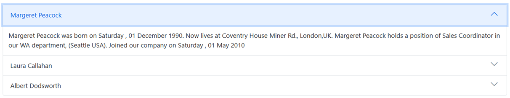

# Getting Started with Blazor Web App

This article provides a step-by-step instructions for building `Blazor Web App` with `Blazor Accordion` component using [Visual Studio](https://visualstudio.microsoft.com/vs/).

## Prerequisites

* [System requirements for Blazor components](https://blazor.syncfusion.com/documentation/system-requirements)

## Create a new Blazor Web App

You can create a **Blazor Web App** using Visual Studio 2022 via [Microsoft Templates](https://learn.microsoft.com/en-us/aspnet/core/blazor/tooling?view=aspnetcore-8.0) or the [Syncfusion Blazor Extension](https://blazor.syncfusion.com/documentation/visual-studio-integration/template-studio). During Blazor Web App Creation, set the `Interactive render mode` and `Interactivity location`.

### Interactive render mode

* By default, interactive server rendering is activated using the `Server` option.
* Opt for the `WebAssembly` option if you prefer exclusively client-side rendering for interactivity.
* For a versatile setup that seamlessly transitions between Interactive Server and client rendering at runtime, choose the `Auto (Server and WebAssembly)` render mode.
* Setting interactivity to `None` results in a generated app with no interactive elements, offering Static Server rendering exclusively.

### Interactivity location

* `Global` - Opting for this setting configures interactivity globally, applying it to the entire app.
* `Per page/component` - The default configuration establishes interactivity individually for each page or component.

## Install Syncfusion Blazor Navigations and Themes NuGet in the Blazor Web App

Here's an example of how to add **Blazor Accordion** component in the app, open the NuGet package manager in Visual Studio (*Tools → NuGet Package Manager → Manage NuGet Packages for Solution*), search and install [Syncfusion.Blazor.Navigations](https://www.nuget.org/packages/Syncfusion.Blazor.Navigations/) and [Syncfusion.Blazor.Themes](https://www.nuget.org/packages/Syncfusion.Blazor.Themes/). Alternatively, you can utilize the following package manager command to achieve the same.




Install-Package Syncfusion.Blazor.Navigations -Version {{ site.releaseversion }}
Install-Package Syncfusion.Blazor.Themes -Version {{ site.releaseversion }}




N> Syncfusion Blazor components are available in [nuget.org](https://www.nuget.org/packages?q=syncfusion.blazor). Refer to [NuGet packages](https://blazor.syncfusion.com/documentation/nuget-packages) topic for available NuGet packages list with component details.

N> In Blazor web app, if you choose `WebAssembly` or `Auto (Server and WebAssembly)` interactive render mode and install Syncfusion Blazor NuGet packages through the package manager command, please ensure that the default project is set to `{your App name}.Client` project in package manager console.

## Register Syncfusion Blazor Service

Open **~/Components/_Imports.razor** file and import the `Syncfusion.Blazor` and `Syncfusion.Blazor.Navigations` namespace if the interactive render mode is `Server`.

```cshtml

@using Syncfusion.Blazor
@using Syncfusion.Blazor.Navigations
```

Here, if you choose `WebAssembly` or `Auto (Server and WebAssembly)` interactive render mode during web app creation, then import the above namspaces in the **~/_Imports.razor** file of `{Your App name}.Client` project

Now, register the Syncfusion Blazor Service in the **~/Program.cs** file of your Blazor Server App.




using Syncfusion.Blazor;

var builder = WebApplication.CreateBuilder(args);

// Add services to the container.
builder.Services.AddRazorComponents()
    .AddInteractiveServerComponents();
builder.Services.AddSyncfusionBlazor();

var app = builder.Build();
....




....
using Syncfusion.Blazor;
....
builder.Services.AddSyncfusionBlazor();
....




N> In Blazor web app, if you choose `WebAssembly` or `Auto (Server and WebAssembly)` interactive render mode, Please register the Syncfusion Blazor Service in the **~/Program.cs** file of both `{Your App name}` & `{Your App name}.Client` projects.

## Add stylesheet and script resources

The theme stylesheet and script can be accessed from NuGet through [Static Web Assets](https://blazor.syncfusion.com/documentation/appearance/themes#static-web-assets). Reference the stylesheet and script in the `<head>` and `<body>` of the **~/Components/App.razor** file as follows:

```html
<head>
    ....
    <link href="_content/Syncfusion.Blazor.Themes/material.css" rel="stylesheet" />
</head>
....
<body>
    ....
    <script src="_content/Syncfusion.Blazor.Core/scripts/syncfusion-blazor.min.js" type="text/javascript"></script>
</body>
```

N> Check out the [Blazor Themes](https://blazor.syncfusion.com/documentation/appearance/themes) topic to discover various methods ([Static Web Assets](https://blazor.syncfusion.com/documentation/appearance/themes#static-web-assets), [CDN](https://blazor.syncfusion.com/documentation/appearance/themes#cdn-reference), and [CRG](https://blazor.syncfusion.com/documentation/common/custom-resource-generator)) for referencing themes in your Blazor application. Also, check out the [Adding Script Reference](https://blazor.syncfusion.com/documentation/common/adding-script-references) topic to learn different approaches for adding script references in your Blazor application.

## Add Syncfusion Blazor Accordion component

Add the Syncfusion Blazor Accordion component in the **~/Components/Pages/Home.razor** file.

* If you choose any interactive render mode with `Per page/component` interactivity location in the web app, please define the render mode at the top of the Syncfusion Blazor component-included page as follows.




@* desired render mode define here *@
@rendermode InteractiveServer







<SfAccordion>
    <AccordionItems>
        <AccordionItem Header="Margeret Peacock" Content="Margeret Peacock was born on Saturday , 01 December 1990. Now lives at Coventry House Miner Rd., London,UK. Margeret Peacock holds a position of Sales Coordinator in our WA department, (Seattle USA). Joined our company on Saturday , 01 May 2010"></AccordionItem>
        <AccordionItem Header="Laura Callahan" Content="Laura Callahan was born on Tuesday , 06 November 1990. Now lives at Edgeham Hollow Winchester Way, London,UK. Laura Callahan holds a position of Sales Coordinator in our WA department, (Seattle USA). Joined our company on Saturday , 01 May 2010"></AccordionItem>
        <AccordionItem Header="Albert Dodsworth" Content="Albert Dodsworth was born on Thursday , 19 October 1989. Now lives at 4726 - 11th Ave. N.E., Seattle,USA.Albert Dodsworth holds a position of Sales Representative in our WA department, (Seattle USA). Joined our company on Friday , 01 May 2009"></AccordionItem>
    </AccordionItems>
</SfAccordion>




N> If you choose `WebAssembly` or `Auto (Server and WebAssembly)` interactive render mode in the web app, please add the Syncfusion Blazor Accordion component in the `~Pages/*.razor` page of `{Your App name}.Client` project.

* Press <kbd>Ctrl</kbd>+<kbd>F5</kbd> (Windows) or <kbd>⌘</kbd>+<kbd>F5</kbd> (macOS) to launch the application. This will render the Syncfusion Blazor Accordion component in your default web browser.

