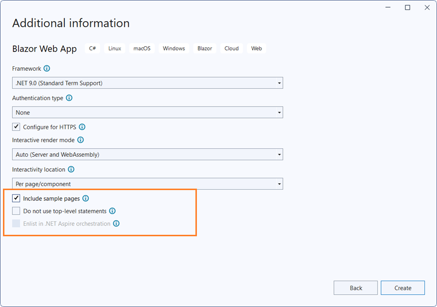

# Getting Started with Blazor Web App

This article provides a step-by-step instructions for building Blazor Web App with `Blazor Accordion` component using [Visual Studio](https://visualstudio.microsoft.com/vs/), [Visual Studio Code](https://code.visualstudio.com/) and [.NET CLI](https://learn.microsoft.com/en-us/dotnet/core/tools/).

To get start quickly with Blazor Web App, you can check on this video.



## Using Playground

[Blazor Playground](https://blazor.syncfusion.com/documentation/blazor-playground/overview) allows you to interact with our Blazor components directly in your web browser without need to install any required NuGet packages. By default, the `Syncfusion.Blazor` package is included in this.



## Using Syncfusion<sup style="font-size:70%">&reg;</sup> Blazor Templates

You can create a Blazor Web App using Syncfusion<sup style="font-size:70%">&reg;</sup> Blazor Templates in both [Visual Studio](https://blazor.syncfusion.com/documentation/visual-studio-integration/template-studio) and [Visual Studio Code](https://blazor.syncfusion.com/documentation/visual-studio-code-integration/create-project).

## Manually Creating a Project

This section provides a brief explanation on how to manually create a Blazor Web App using Visual Studio, Visual Studio Code and .NET CLI.





### Prerequisites

* [System requirements for Blazor components](https://blazor.syncfusion.com/documentation/system-requirements)

### Create a new Blazor Web App in Visual Studio

You can create a **Blazor Web App** using Visual Studio via [Microsoft Templates](https://learn.microsoft.com/en-us/aspnet/core/blazor/tooling?view=aspnetcore-8.0&pivots=vs) or the [Syncfusion<sup style="font-size:70%">&reg;</sup> Blazor Extension](https://blazor.syncfusion.com/documentation/visual-studio-integration/template-studio).

You need to configure the corresponding [Interactive render mode](https://learn.microsoft.com/en-us/aspnet/core/blazor/components/render-modes?view=aspnetcore-8.0#render-modes) and [Interactivity location](https://learn.microsoft.com/en-us/aspnet/core/blazor/tooling?view=aspnetcore-8.0&pivots=vs) while creating a Blazor Web Application.



### Install Syncfusion<sup style="font-size:70%">&reg;</sup> Blazor Navigations and Themes NuGet in the Blazor Web App

Here's an example of how to add **Blazor Accordion** component in the app, open the NuGet package manager in Visual Studio (*Tools → NuGet Package Manager → Manage NuGet Packages for Solution*), search and install [Syncfusion.Blazor.Navigations](https://www.nuget.org/packages/Syncfusion.Blazor.Navigations/) and [Syncfusion.Blazor.Themes](https://www.nuget.org/packages/Syncfusion.Blazor.Themes/).

If you utilize `WebAssembly or Auto` render modes in the Blazor Web App need to be install Syncfusion<sup style="font-size:70%">&reg;</sup> Blazor components NuGet packages within the client project.

Alternatively, you can utilize the following package manager command to achieve the same.




Install-Package Syncfusion.Blazor.Navigations -Version {{ site.releaseversion }}
Install-Package Syncfusion.Blazor.Themes -Version {{ site.releaseversion }}




N> Syncfusion<sup style="font-size:70%">&reg;</sup> Blazor components are available in [nuget.org](https://www.nuget.org/packages?q=syncfusion.blazor). Refer to [NuGet packages](https://blazor.syncfusion.com/documentation/nuget-packages) topic for available NuGet packages list with component details.





### Prerequisites

* [System requirements for Blazor components](https://blazor.syncfusion.com/documentation/system-requirements)

### Create a new Blazor Web App in Visual Studio Code

You can create a **Blazor Web App** using Visual Studio Code via [Microsoft Templates](https://learn.microsoft.com/en-us/aspnet/core/blazor/tooling?view=aspnetcore-8.0&pivots=vsc) or the [Syncfusion<sup style="font-size:70%">&reg;</sup> Blazor Extension](https://blazor.syncfusion.com/documentation/visual-studio-code-integration/create-project).

Configure the appropriate interactive render mode and interactivity location when setting up a Blazor Web Application. For detailed information, refer to the [interactive render mode documentation](https://blazor.syncfusion.com/documentation/common/interactive-render-mode).

For example, in a Blazor Web App with the `Auto` interactive render mode, use the following commands.




dotnet new blazor -o BlazorWebApp -int Auto
cd BlazorWebApp
cd BlazorWebApp.Client




### Install Syncfusion<sup style="font-size:70%">&reg;</sup> Blazor Navigations and Themes NuGet in the App

If you utilize `WebAssembly` or `Auto` render modes in the Blazor Web App need to be install Syncfusion<sup style="font-size:70%">&reg;</sup> Blazor components NuGet packages within the client project.

* Press <kbd>Ctrl</kbd>+<kbd>`</kbd> to open the integrated terminal in Visual Studio Code.
* Ensure you’re in the project root directory where your `.csproj` file is located.
* Run the following command to install a [Syncfusion.Blazor.Navigations](https://www.nuget.org/packages/Syncfusion.Blazor.Navigations) and [Syncfusion.Blazor.Themes](https://www.nuget.org/packages/Syncfusion.Blazor.Themes/) NuGet package and ensure all dependencies are installed.





dotnet add package Syncfusion.Blazor.Navigations -v {{ site.releaseversion }}
dotnet add package Syncfusion.Blazor.Themes -v {{ site.releaseversion }}
dotnet restore





N> Syncfusion<sup style="font-size:70%">&reg;</sup> Blazor components are available in [nuget.org](https://www.nuget.org/packages?q=syncfusion.blazor). Refer to [NuGet packages](https://blazor.syncfusion.com/documentation/nuget-packages) topic for available NuGet packages list with component details.





### Prerequisites

Install latest version of the [.NET SDK](https://dotnet.microsoft.com/en-us/download). If you previously installed the .NET SDK, you can determine the installed version by executing the following command in a command prompt (Windows) or terminal (macOS) or command shell (Linux).




dotnet --version




## Create a Blazor Web App using .NET CLI

Run the following command to create a new Blazor Web App in a command prompt (Windows) or terminal (macOS) or command shell (Linux).

Configure the appropriate interactive render mode and interactivity location when setting up a Blazor Web Application. For detailed information, refer to the [interactive render mode documentation](https://blazor.syncfusion.com/documentation/common/interactive-render-mode).

For example, in a Blazor Web App with the `Auto` interactive render mode, use the following commands.




dotnet new blazor -o BlazorWebApp -int Auto
cd BlazorWebApp
cd BlazorWebApp.Client




This command creates new Blazor Web App and places it in a new directory called `BlazorApp` inside your current location. See [Create Blazor app topic](https://dotnet.microsoft.com/en-us/learn/aspnet/blazor-tutorial/create) and [dotnet new CLI command](https://learn.microsoft.com/en-us/aspnet/core/blazor/tooling?pivots=linux-macos&view=aspnetcore-8.0) topics for more details.

### Install Syncfusion<sup style="font-size:70%">&reg;</sup> Blazor Navigations and Themes NuGet in the App

Here's an example of how to add **Blazor Accordion** component in the application using the following command in the command prompt (Windows) or command shell (Linux) or terminal (macOS) to install a [Syncfusion.Blazor.Navigations](https://www.nuget.org/packages/Syncfusion.Blazor.Navigations/) and [Syncfusion.Blazor.Themes](https://www.nuget.org/packages/Syncfusion.Blazor.Themes/) NuGet package. See [Install and manage packages using the dotnet CLI](https://learn.microsoft.com/en-us/nuget/consume-packages/install-use-packages-dotnet-cli) topics for more details.

If you utilize `WebAssembly or Auto` render modes in the Blazor Web App need to be install Syncfusion<sup style="font-size:70%">&reg;</sup> Blazor components NuGet packages within the client project.




dotnet add package Syncfusion.Blazor.Navigations --version {{ site.releaseversion }}
dotnet add package Syncfusion.Blazor.Themes --version {{ site.releaseversion }}
dotnet restore




N> Syncfusion<sup style="font-size:70%">&reg;</sup> Blazor components are available in [nuget.org](https://www.nuget.org/packages?q=syncfusion.blazor). Refer to [NuGet packages](https://blazor.syncfusion.com/documentation/nuget-packages) topic for available NuGet packages list with component details.





### Add Import Namespaces

Open the **~/_Imports.razor** file from the client project and import the `Syncfusion.Blazor` and `Syncfusion.Blazor.Navigations` namespace.




@using Syncfusion.Blazor
@using Syncfusion.Blazor.Navigations




### Register Syncfusion<sup style="font-size:70%">&reg;</sup> Blazor Service

Register the Syncfusion<sup style="font-size:70%">&reg;</sup> Blazor Service in the **~/Program.cs** file of your Blazor Web App.

If the **Interactive Render Mode** is set to `WebAssembly` or `Auto`, you need to register the Syncfusion<sup style="font-size:70%">&reg;</sup> Blazor service in both **~/Program.cs** files of your Blazor Web App.




...
...
using Syncfusion.Blazor;

var builder = WebApplication.CreateBuilder(args);

// Add services to the container.
builder.Services.AddRazorComponents()
    .AddInteractiveServerComponents()
    .AddInteractiveWebAssemblyComponents();
builder.Services.AddSyncfusionBlazor();

var app = builder.Build();
....




...
using Syncfusion.Blazor;

var builder = WebAssemblyHostBuilder.CreateDefault(args);
builder.Services.AddSyncfusionBlazor();

await builder.Build().RunAsync();




### Add stylesheet and script resources

The theme stylesheet and script can be accessed from NuGet through [Static Web Assets](https://blazor.syncfusion.com/documentation/appearance/themes#static-web-assets). Include the stylesheet reference in the `<head>` section and the script reference at the end of the `<body>` in the **~/Components/App.razor** file as shown below:

```html
<head>
    ....
    <link href="_content/Syncfusion.Blazor.Themes/bootstrap5.css" rel="stylesheet" />
</head>

<body>
    ....
    <script src="_content/Syncfusion.Blazor.Core/scripts/syncfusion-blazor.min.js" type="text/javascript"></script>
</body>

```

N> Check out the [Blazor Themes](https://blazor.syncfusion.com/documentation/appearance/themes) topic to discover various methods ([Static Web Assets](https://blazor.syncfusion.com/documentation/appearance/themes#static-web-assets), [CDN](https://blazor.syncfusion.com/documentation/appearance/themes#cdn-reference), and [CRG](https://blazor.syncfusion.com/documentation/common/custom-resource-generator)) for referencing themes in your Blazor application. Also, check out the [Adding Script Reference](https://blazor.syncfusion.com/documentation/common/adding-script-references) topic to learn different approaches for adding script references in your Blazor application.

### Add Syncfusion<sup style="font-size:70%">&reg;</sup> Blazor Accordion component

Add the Syncfusion<sup style="font-size:70%">&reg;</sup> Blazor Accordion component to a Razor page located under the Pages folder (e.g., Pages/Home.razor) in either the **Server** or **Client** project. If an interactivity location as `Per page/component` in the web app, define a render mode at top of the component, as follows:

<table style="width:100%">
<tr>
<th style="width:30%">Interactivity location</th>
<th style="width:20%">RenderMode</th>
<th style="width:50%">Code</th>
</tr>
<tr>
<td>Per page/component</td>
<td>Auto</td>
<td>@rendermode InteractiveAuto</td>
</tr>
<tr>
<td></td>
<td>WebAssembly</td>
<td>@rendermode InteractiveWebAssembly</td>
</tr>
<tr>
<td></td>
<td>None</td>
<td>---</td>
</tr>
</table>




@* desired render mode define here *@
@rendermode InteractiveAuto







<SfAccordion>
    <AccordionItems>
        <AccordionItem Header="Margeret Peacock" Content="Margeret Peacock was born on Saturday , 01 December 1990. Now lives at Coventry House Miner Rd., London,UK. Margeret Peacock holds a position of Sales Coordinator in our WA department, (Seattle USA). Joined our company on Saturday , 01 May 2010"></AccordionItem>
        <AccordionItem Header="Laura Callahan" Content="Laura Callahan was born on Tuesday , 06 November 1990. Now lives at Edgeham Hollow Winchester Way, London,UK. Laura Callahan holds a position of Sales Coordinator in our WA department, (Seattle USA). Joined our company on Saturday , 01 May 2010"></AccordionItem>
        <AccordionItem Header="Albert Dodsworth" Content="Albert Dodsworth was born on Thursday , 19 October 1989. Now lives at 4726 - 11th Ave. N.E., Seattle,USA.Albert Dodsworth holds a position of Sales Representative in our WA department, (Seattle USA). Joined our company on Friday , 01 May 2009"></AccordionItem>
    </AccordionItems>
</SfAccordion>




N> If an **Interactivity Location** is set to `Global` and the **Render Mode** is set to `Auto` or `WebAssembly`, the render mode is configured in the `App.razor` file by default.

* Press <kbd>Ctrl</kbd>+<kbd>F5</kbd> (Windows) or <kbd>⌘</kbd>+<kbd>F5</kbd> (macOS) to launch the application. This will render the Syncfusion<sup style="font-size:70%">&reg;</sup> Blazor Accordion component in your default web browser.


