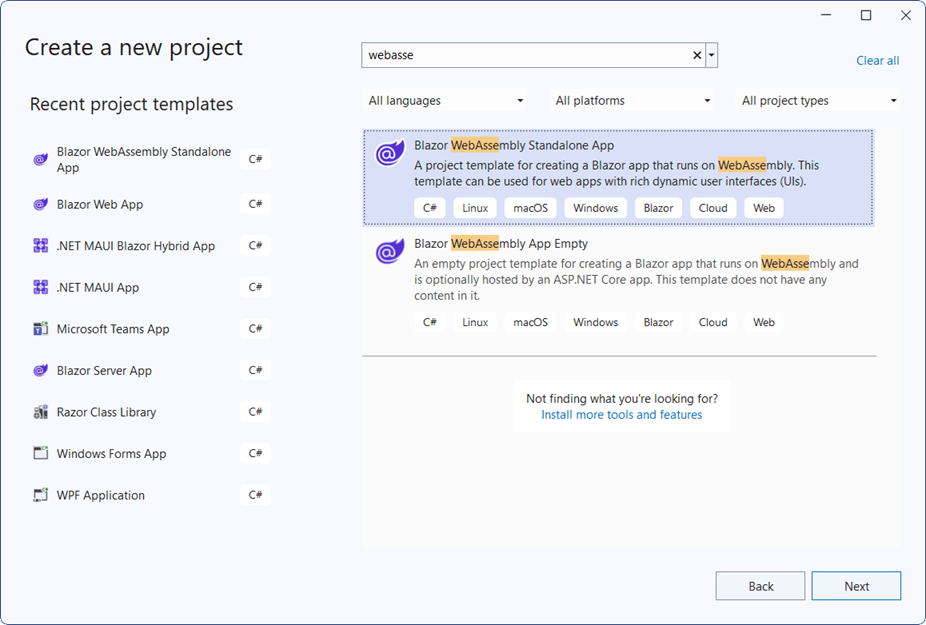

# Getting Started with Blazor WebAssembly Standalone App

This article provides step-by-step instructions for building a Blazor WebAssembly App with the `Blazor DataGrid` component using [Visual Studio](https://visualstudio.microsoft.com/vs/), [Visual Studio Code](https://code.visualstudio.com/), and the [.NET CLI](https://learn.microsoft.com/en-us/dotnet/core/tools/).

## Using Playground

[Blazor Playground](https://blazor.syncfusion.com/documentation/common/playground/getting-started) allows interaction with Syncfusion Blazor components directly in a web browser without needing to install any NuGet packages. By default, the `Syncfusion.Blazor` package is included.



## Using Syncfusion<sup style="font-size:70%">&reg;</sup> Blazor Templates

You can create a Blazor WebAssembly Standalone App using Syncfusion<sup style="font-size:70%">&reg;</sup> Blazor Templates in both [Visual Studio](https://blazor.syncfusion.com/documentation/visual-studio-integration/template-studio) and [Visual Studio Code](https://blazor.syncfusion.com/documentation/visual-studio-code-integration/create-project).

## Manually Creating a Project

This section provides a brief guide on how to manually create a Blazor WebAssembly App using Visual Studio, Visual Studio Code, and the .NET CLI.





### Prerequisites

* [System requirements for Blazor components](https://blazor.syncfusion.com/documentation/system-requirements)

### Create a new Blazor WebAssembly App (Standalone) in Visual Studio

You can create a **Blazor WebAssembly App** using Visual Studio via the [Microsoft Templates](https://learn.microsoft.com/en-us/aspnet/core/blazor/tooling?view=aspnetcore-9.0&pivots=vs) or the [Syncfusion<sup style="font-size:70%">&reg;</sup> Blazor extension](https://blazor.syncfusion.com/documentation/visual-studio-integration/template-studio).



### Install Syncfusion<sup style="font-size:70%">&reg;</sup> Blazor Grid and Themes NuGet in the App

Here's an example of how to add **Blazor DataGrid** component in the app, open the NuGet package manager in Visual Studio (*Tools → NuGet Package Manager → Manage NuGet Packages for Solution*), search and install [Syncfusion.Blazor.Grid](https://www.nuget.org/packages/Syncfusion.Blazor.Grid/) and [Syncfusion.Blazor.Themes](https://www.nuget.org/packages/Syncfusion.Blazor.Themes/). Alternatively, you can utilize the following package manager command to achieve the same.




Install-Package Syncfusion.Blazor.Grid -Version {{ site.releaseversion }}
Install-Package Syncfusion.Blazor.Themes -Version {{ site.releaseversion }}




N> Syncfusion<sup style="font-size:70%">&reg;</sup> Blazor components are available in [nuget.org](https://www.nuget.org/packages?q=syncfusion.blazor). Refer to [NuGet packages](https://blazor.syncfusion.com/documentation/nuget-packages) topic for available NuGet packages list with component details.





### Prerequisites

* [System requirements for Blazor components](https://blazor.syncfusion.com/documentation/system-requirements)

### Create a Blazor WebAssembly App in Visual Studio Code

You can create a **Blazor WebAssembly App** using Visual Studio Code via the [Microsoft Templates](https://learn.microsoft.com/en-us/aspnet/core/blazor/tooling?view=aspnetcore-9.0&pivots=vsc) or the [Syncfusion<sup style="font-size:70%">&reg;</sup> Blazor extension](https://blazor.syncfusion.com/documentation/visual-studio-code-integration/create-project).

Alternatively, create a WebAssembly application by using the following commands in the integrated terminal (<kbd>Ctrl</kbd>+<kbd>`</kbd>).




dotnet new blazorwasm -o BlazorApp
cd BlazorApp




This command creates a new Blazor WebAssembly App and places it in a new directory called `BlazorApp` inside the current location. See [Create a Blazor App](https://dotnet.microsoft.com/en-us/learn/aspnet/blazor-tutorial/create) and the [dotnet new command](https://learn.microsoft.com/en-us/dotnet/core/tools/dotnet-new) for more details.

### Install Syncfusion<sup style="font-size:70%">&reg;</sup> Blazor Grid and Themes NuGet in the App

* Press <kbd>Ctrl</kbd>+<kbd>`</kbd> to open the integrated terminal in Visual Studio Code.
* Ensure you’re in the project root directory where your `.csproj` file is located.
* Run the following commands to install the [Syncfusion.Blazor.Grid](https://www.nuget.org/packages/Syncfusion.Blazor.Grid/) and [Syncfusion.Blazor.Themes](https://www.nuget.org/packages/Syncfusion.Blazor.Themes/) NuGet packages and ensure all dependencies are installed.




dotnet add package Syncfusion.Blazor.Grid -Version {{ site.releaseversion }}
dotnet add package Syncfusion.Blazor.Themes -Version {{ site.releaseversion }}
dotnet restore




N> Syncfusion<sup style="font-size:70%">&reg;</sup> Blazor components are available in [nuget.org](https://www.nuget.org/packages?q=syncfusion.blazor). Refer to [NuGet packages](https://blazor.syncfusion.com/documentation/nuget-packages) topic for available NuGet packages list with component details.





### Prerequisites

Install the latest version of the [.NET SDK](https://dotnet.microsoft.com/en-us/download). If the .NET SDK was previously installed, determine the installed version by running the following command in a command prompt (Windows), terminal (macOS), or command shell (Linux).




dotnet --version




### Create a Blazor WebAssembly App using .NET CLI

Run the `dotnet new blazorwasm` command to create a new Blazor WebAssembly App in a command prompt (Windows) or terminal (macOS) or command shell (Linux).




dotnet new blazorwasm -o BlazorApp
cd BlazorApp




This command creates a new Blazor WebAssembly App and places it in a new directory called `BlazorApp` inside the current location. See [Create a Blazor app](https://dotnet.microsoft.com/en-us/learn/aspnet/blazor-tutorial/create) and the [dotnet new CLI command](https://learn.microsoft.com/en-us/dotnet/core/tools/dotnet-new) for more details.

### Install Syncfusion<sup style="font-size:70%">&reg;</sup> Blazor Grid and Themes NuGet in the App

To add the **Blazor DataGrid** component to the application, run the following commands in a command prompt (Windows), command shell (Linux), or terminal (macOS) to install the [Syncfusion.Blazor.Grid](https://www.nuget.org/packages/Syncfusion.Blazor.Grid/) and [Syncfusion.Blazor.Themes](https://www.nuget.org/packages/Syncfusion.Blazor.Themes/) NuGet packages. See [Install and manage packages using the dotnet CLI](https://learn.microsoft.com/en-us/nuget/consume-packages/install-use-packages-dotnet-cli) for more details.




dotnet add package Syncfusion.Blazor.Grid -Version {{ site.releaseversion }}
dotnet add package Syncfusion.Blazor.Themes -Version {{ site.releaseversion }}
dotnet restore




N> Syncfusion<sup style="font-size:70%">&reg;</sup> Blazor components are available in [nuget.org](https://www.nuget.org/packages?q=syncfusion.blazor). Refer to [NuGet packages](https://blazor.syncfusion.com/documentation/nuget-packages) topic for available NuGet packages list with component details.





### Add Import Namespaces

Open the **~/_Imports.razor** file and import the `Syncfusion.Blazor` and `Syncfusion.Blazor.Grids` namespaces.

```cshtml

@using Syncfusion.Blazor
@using Syncfusion.Blazor.Grids

```

### Register Syncfusion<sup style="font-size:70%">&reg;</sup> Blazor Service

Register the Syncfusion<sup style="font-size:70%">&reg;</sup> Blazor service in the **~/Program.cs** file of the Blazor WebAssembly App.




using Microsoft.AspNetCore.Components.Web;
using Microsoft.AspNetCore.Components.WebAssembly.Hosting;
using Syncfusion.Blazor;

var builder = WebAssemblyHostBuilder.CreateDefault(args);
builder.RootComponents.Add<App>("#app");
builder.RootComponents.Add<HeadOutlet>("head::after");

builder.Services.AddScoped(sp => new HttpClient { BaseAddress = new Uri(builder.HostEnvironment.BaseAddress) });

builder.Services.AddSyncfusionBlazor();
await builder.Build().RunAsync();
....




### Add stylesheet and script resources

The theme stylesheet and script can be accessed from NuGet through [Static Web Assets](https://blazor.syncfusion.com/documentation/appearance/themes#static-web-assets). Reference the stylesheet and script in the `<head>` of the **~wwwroot/index.html** file.

```html
<head>
    ....
    <link href="_content/Syncfusion.Blazor.Themes/bootstrap5.css" rel="stylesheet" />
    <script src="_content/Syncfusion.Blazor.Core/scripts/syncfusion-blazor.min.js" type="text/javascript"></script>
</head>
```

N> Check out the [Blazor Themes](https://blazor.syncfusion.com/documentation/appearance/themes) topic to discover various methods ([Static Web Assets](https://blazor.syncfusion.com/documentation/appearance/themes#static-web-assets), [CDN](https://blazor.syncfusion.com/documentation/appearance/themes#cdn-reference), and [CRG](https://blazor.syncfusion.com/documentation/common/custom-resource-generator)) for referencing themes in a Blazor application. Also, see [Adding Script Reference](https://blazor.syncfusion.com/documentation/common/adding-script-references) to learn different approaches for adding script references in a Blazor application.

### Add Syncfusion<sup style="font-size:70%">&reg;</sup> Blazor component

Add the Syncfusion<sup style="font-size:70%">&reg;</sup> Blazor DataGrid component in the **~/Pages/Index.razor** file.




@using Syncfusion.Blazor.Grids

<SfGrid DataSource="@Orders" />

@code{
    public List<Order> Orders { get; set; }

    protected override void OnInitialized()
    {
        Orders = Enumerable.Range(1, 10).Select(x => new Order()
        {
            OrderID = 1000 + x,
            CustomerID = (new string[] { "ALFKI", "ANANTR", "ANTON", "BLONP", "BOLID" })[new Random().Next(5)],
            Freight = 2 * x,
            OrderDate = DateTime.Now.AddDays(-x),
        }).ToList();
    }

    public class Order {
        public int? OrderID { get; set; }
        public string CustomerID { get; set; }
        public DateTime? OrderDate { get; set; }
        public double? Freight { get; set; }
    }
}




* Press <kbd>Ctrl</kbd>+<kbd>F5</kbd> (Windows) or <kbd>⌘</kbd>+<kbd>F5</kbd> (macOS) to launch the application. This renders the Syncfusion<sup style="font-size:70%">&reg;</sup> Blazor DataGrid component in the default web browser.

