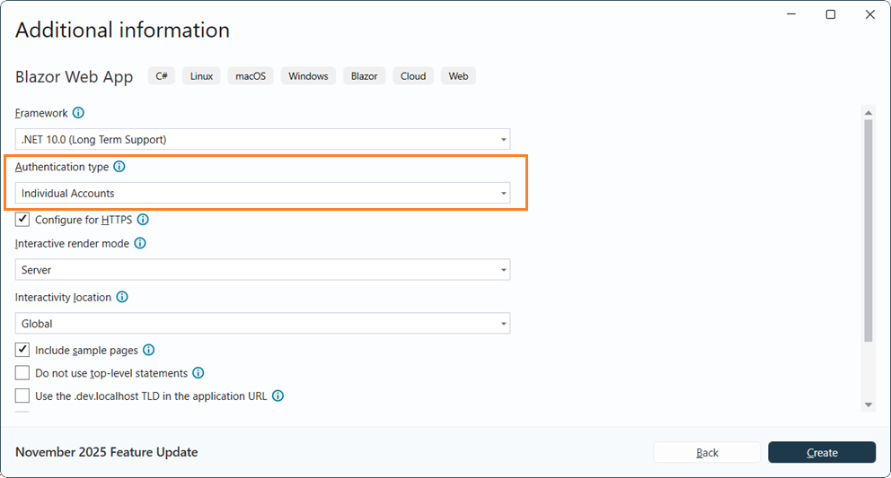
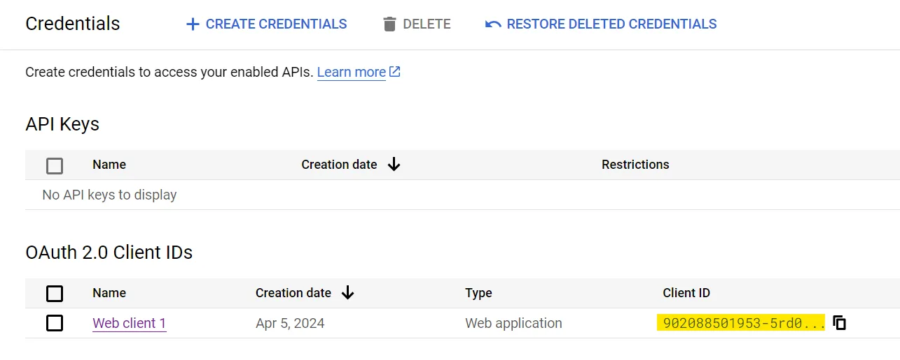
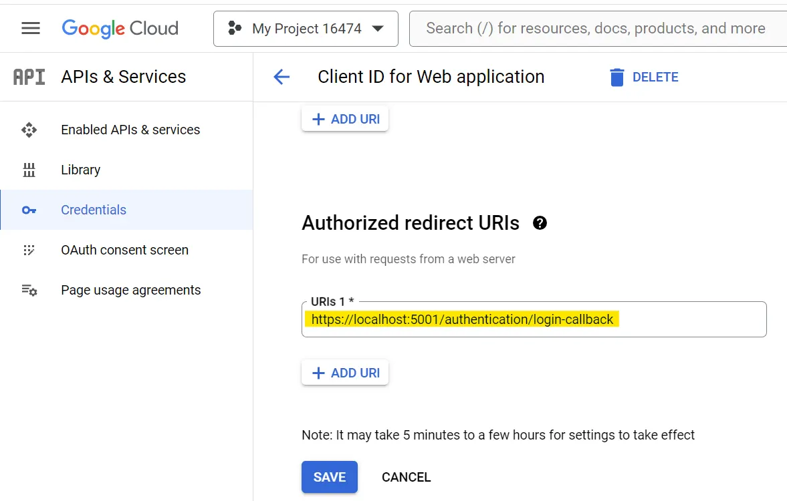
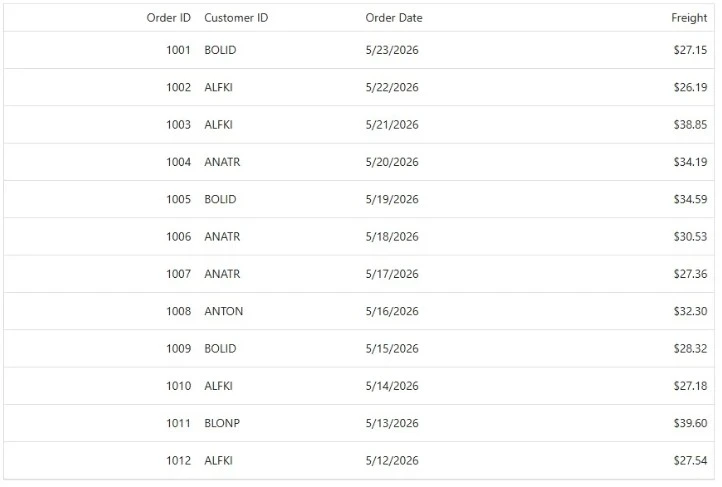

# Getting Started with Blazor WASM App with Authentication Library

This article provides step by step instructions for building and securing a Blazor WebAssembly Standalone App and integrate the [Blazor DataGrid](https://www.syncfusion.com/blazor-components/blazor-datagrid) component for authenticated users.

## Create a new Blazor Web App 

To create a new Blazor Web App, follow the [Blazor getting started guide](https://blazor.syncfusion.com/documentation/getting-started/blazor-web-app?tabcontent=visual-studio-code).

Ensure the **Configure for HTTPS** option is enabled, and select **Individual Accounts** as the authentication type. This enables authentication support without persisting user data in a local database.

If using Visual Studio Code, run the following commands in your command line interface (CLI):




dotnet new blazor -o BlazorAppAuthentication --interactivity Server --auth Individual
cd BlazorAppAuthentication
dotnet run




## Configure the application with Google OAuth 2.0 (OIDC)

* Set up Google OAuth 2.0 authentication. For more information, see the [Google Cloud documentation](https://support.google.com/cloud/answer/6158849?hl=en).

* Replace the `appsettings.json` file with the following content to configure the application with `Google OAuth 2.0`.




{
  "Local": {
    "Authority": "https://accounts.google.com/",
    "ClientId": "2...7-e...q.apps.googleusercontent.com", 
    "PostLogoutRedirectUri": "https://localhost:5001/authentication/logout-callback",  // Replace **5001** with your application’s actual HTTPS port number from launchSettings.json if different.
    "RedirectUri": "https://localhost:5001/authentication/login-callback",
    "ResponseType": "id_token"
  }
}




* Replace the `ClientId` with the OAuth 2.0 client ID of your created project.

* The `RedirectUri` (https://localhost:5001/authentication/login-callback) must be registered in the Google APIs console as shown below.

## Integrating Blazor component

Blazor components can be integrated within the `AuthorizeView` component as shown in the following steps.

### Install NuGet packages

To add the [Blazor DataGrid](https://www.syncfusion.com/blazor-components/blazor-datagrid) component to your application, open the NuGet Package Manager in Visual Studio **(*Tools → NuGet Package Manager → Manage NuGet Packages for Solution*)**. Search and install the [Syncfusion.Blazor.Grid](https://www.nuget.org/packages/Syncfusion.Blazor.Grid/) and [Syncfusion.Blazor.Themes](https://www.nuget.org/packages/Syncfusion.Blazor.Themes/) packages.

Alternatively, install the required packages by using the following .NET CLI commands.




dotnet add package Syncfusion.Blazor.Grid -v {{ site.releaseversion }}
dotnet add package Syncfusion.Blazor.Themes -v {{ site.releaseversion }}




### Register Blazor Service

Register the Blazor service in the **Program.cs** file of the Blazor Web App.




using Syncfusion.Blazor;
....
builder.Services.AddSyncfusionBlazor();
....




### Add required namespaces

Open the `~/_Imports.razor` file and import the namespaces.




@using Syncfusion.Blazor
@using Syncfusion.Blazor.Grids




### Add stylesheet and script resources

Include the theme stylesheet and script references in the `wwwroot/index.html` file.




<head>
    ....
    <!-- Theme stylesheet -->
    <link href="_content/Syncfusion.Blazor.Themes/fluent2.css" rel="stylesheet" />
    ....
</head>

<body>
    ....
    <!-- Blazor core script (required for UI components, including DataGrid) -->
    
    ....
</body>




### Add Blazor component

Add the [Blazor DataGrid](https://www.syncfusion.com/blazor-components/blazor-datagrid) component in the **~/Pages/Home.razor** file within an `AuthorizeView`.




<AuthorizeView>
    <Authorized>
        <SfGrid DataSource="@Orders">
            <GridColumns>
                <GridColumn Field=@nameof(Order.OrderID) HeaderText="Order ID" TextAlign="TextAlign.Right" Width="120" />
                <GridColumn Field=@nameof(Order.CustomerID) HeaderText="Customer ID" Width="100" />
                <GridColumn Field=@nameof(Order.OrderDate) HeaderText="Order Date" Format="d" Type="ColumnType.Date" Width="100" />
                <GridColumn Field=@nameof(Order.Freight) HeaderText="Freight" Format="C2" TextAlign="TextAlign.Right" Width="120" />
            </GridColumns>
        </SfGrid>
    </Authorized>
    <NotAuthorized>
        <h1>Authentication Failure!</h1>
        
You're not signed in.

    </NotAuthorized>
</AuthorizeView>

@code {
    public List<Order> Orders { get; set; }

    protected override void OnInitialized()
    {
        Orders = Enumerable.Range(1, 12).Select(i => new Order
        {
            OrderID = 1000 + i,
            CustomerID = new[] { "ALFKI", "ANATR", "ANTON", "BLONP", "BOLID" }[Random.Shared.Next(5)],
            OrderDate = DateTime.Today.AddDays(-i),
            Freight = Math.Round(25 + 15 * Random.Shared.NextDouble(), 2)
        }).ToList();
    }

    public class Order
    {
        public int OrderID { get; set; }
        public string? CustomerID { get; set; }
        public DateTime OrderDate { get; set; }
        public double Freight { get; set; }
    }
}




### Run the application

To run the application, use the following command:




dotnet run




## See Also

* [Secure an ASP.NET Core Blazor WebAssembly standalone app with the Authentication library](https://learn.microsoft.com/en-us/aspnet/core/blazor/security/webassembly/standalone-with-authentication-library?view=aspnetcore-8.0&tabs=visual-studio)
