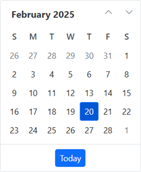

# Getting Started with Blazor WASM App with Authentication Library

This article provides step-by-step instructions for building and securing a Blazor WebAssembly Standalone App with the Blazor WebAssembly Authentication library using [Visual Studio](https://visualstudio.microsoft.com/vs/).

## Prerequisites

* [System requirements for Blazor components](https://blazor.syncfusion.com/documentation/system-requirements)

## Create a new Blazor WebAssembly Standalone App in Visual Studio

You can create a **Blazor WebAssembly Standalone App** using Visual Studio via [Microsoft Templates](https://learn.microsoft.com/en-us/aspnet/core/blazor/tooling?view=aspnetcore-8.0&pivots=windows) or the [Syncfusion<sup style="font-size:70%">&reg;</sup> Blazor Extension](https://blazor.syncfusion.com/documentation/visual-studio-integration/template-studio) by setting the `Authentication type` to `Individual Accounts`. This selection adds authentication support and doesn't result in storing users in a database.

## Configure the application with Google OAuth 2.0 (OIDC)

* Set up Google OAuth 2.0 authentication. For more information, see the [Google Cloud documentation](https://support.google.com/cloud/answer/6158849?hl=en).

* Replace the `appsettings.json` file with the following content to configure the application with `Google OAuth 2.0`.




{
  "Local": {
    "Authority": "https://accounts.google.com/",
    "ClientId": "2...7-e...q.apps.googleusercontent.com",
    "PostLogoutRedirectUri": "https://<example.com>/authentication/logout-callback",
    "RedirectUri": "https://<example.com>/authentication/login-callback",
    "ResponseType": "id_token"
  }
}




* Replace the `ClientId` with the OAuth 2.0 client ID of your created project.


* The `RedirectUri` (https://<example.com>/authentication/login-callback) must be registered in the Google APIs console as shown below.


## Install Syncfusion<sup style="font-size:70%">&reg;</sup> Blazor Calendars and Themes NuGet in the App

Here's an example of how to add **Blazor Calendar** component in the app, open the NuGet package manager in Visual Studio (*Tools → NuGet Package Manager → Manage NuGet Packages for Solution*), search and install [Syncfusion.Blazor.Calendars](https://www.nuget.org/packages/Syncfusion.Blazor.Calendars/) and [Syncfusion.Blazor.Themes](https://www.nuget.org/packages/Syncfusion.Blazor.Themes/). Alternatively, you can utilize the following package manager command to achieve the same.




Install-Package Syncfusion.Blazor.Calendars -Version {{ site.releaseversion }}
Install-Package Syncfusion.Blazor.Themes -Version {{ site.releaseversion }}




N> Syncfusion<sup style="font-size:70%">&reg;</sup> Blazor components are available on [nuget.org](https://www.nuget.org/packages?q=syncfusion.blazor). Refer to the [NuGet packages](https://blazor.syncfusion.com/documentation/nuget-packages) topic for the available package list with component details.

## Register Syncfusion<sup style="font-size:70%">&reg;</sup> Blazor Service

Open the **~/_Imports.razor** file and import the `Syncfusion.Blazor` and `Syncfusion.Blazor.Calendars` namespaces.

```cshtml

@using Syncfusion.Blazor
@using Syncfusion.Blazor.Calendars

```

Now, register the Syncfusion<sup style="font-size:70%">&reg;</sup> Blazor service in the **~/Program.cs** file of the Blazor WebAssembly Standalone App.

```cshtml

....
using Syncfusion.Blazor;
....
builder.Services.AddSyncfusionBlazor();
....

```

## Add stylesheet and script resources

The theme stylesheet and script can be accessed from NuGet through [Static Web Assets](https://blazor.syncfusion.com/documentation/appearance/themes#static-web-assets). Reference the stylesheet in the `<head>` section and the script at the end of the `<body>` of the main page as follows:

* For **.NET 10, .NET 9 and .NET 8** Blazor WebAssembly Standalone app, include it in the **~/Components/App.razor** file.

```html
<head>
    ....
    <link href="_content/Syncfusion.Blazor.Themes/bootstrap5.css" rel="stylesheet" />
</head>

<body>
    ....
    <script src="_content/Syncfusion.Blazor.Core/scripts/syncfusion-blazor.min.js" type="text/javascript"></script>
</body>

```
N> Check out the [Blazor Themes](https://blazor.syncfusion.com/documentation/appearance/themes) topic to discover various methods ([Static Web Assets](https://blazor.syncfusion.com/documentation/appearance/themes#static-web-assets), [CDN](https://blazor.syncfusion.com/documentation/appearance/themes#cdn-reference), and [CRG](https://blazor.syncfusion.com/documentation/common/custom-resource-generator)) for referencing themes in your Blazor application. Also, check out the [Adding Script Reference](https://blazor.syncfusion.com/documentation/common/adding-script-references) topic to learn different approaches for adding script references in your Blazor application.

## Add Syncfusion<sup style="font-size:70%">&reg;</sup> Blazor component

Add the Syncfusion<sup style="font-size:70%">&reg;</sup> Blazor Calendar component in the **~/Pages/Home.razor** file under an `AuthorizeView`.




<AuthorizeView>
    <Authorized>
        <SfCalendar TValue="DateTime" />
    </Authorized>
    <NotAuthorized>
        <h1>Authentication Failure!</h1>
        <p>You're not signed in.</p>
    </NotAuthorized>
</AuthorizeView>




* Press <kbd>Ctrl</kbd>+<kbd>F5</kbd> (Windows) or <kbd>⌘</kbd>+<kbd>F5</kbd> (macOS) to launch the application. This renders the Syncfusion<sup style="font-size:70%">&reg;</sup> Blazor Calendar component in the default web browser.





## See Also

* [Secure an ASP.NET Core Blazor WebAssembly standalone app with the Authentication library](https://learn.microsoft.com/en-us/aspnet/core/blazor/security/webassembly/standalone-with-authentication-library?view=aspnetcore-8.0&tabs=visual-studio)
