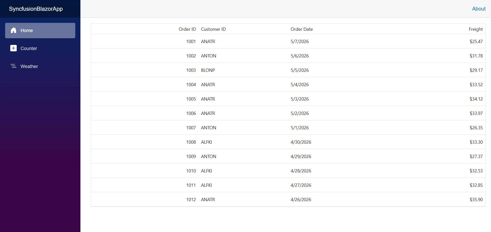

# Getting Started with Blazor WASM App in JetBrains Rider 

This guide explains how to create a Blazor WebAssembly application and integrate [Blazor components](https://www.syncfusion.com/blazor-components) in [JetBrains Rider](https://www.jetbrains.com/rider/).

To quickly get started with a Blazor WebAssembly application in JetBrains Rider with Blazor components, watch the following video:



## Install JetBrains Rider

- Go to the official [JetBrains Rider](https://www.jetbrains.com/rider/) website.
- Download the installer suitable for your operating system.
- Run the installer and follow the on‑screen instructions to complete the installation.
- After installation finishes, launch JetBrains Rider to verify the setup and begin your Blazor development.

## Creating a Blazor application

This section explains how to create a new **Blazor WebAssembly Standalone App** in **JetBrains Rider**.

Follow these steps to create a Blazor application in Rider:

- Open **JetBrains Rider**.
- On the welcome screen, click **New Solution**.
- Select the **.NET SDK version** that you want to use.
- From the available project templates, select **Blazor WebAssembly Standalone App**.
- Enter your project name.
- Click **Create** to generate the project.

Once the project is created, Rider opens the solution and restores the required dependencies automatically.

## Adding Blazor NuGet packages

After creating the Blazor project, you must install the required NuGet packages to use Blazor components.

**Install required NuGet packages**

- In the **Solution Explorer**, right click the project name.
- Select **Manage NuGet Packages** from the context menu.
- In the Browse tab, search for and install the following packages:

    - [Syncfusion.Blazor.Grid](https://www.nuget.org/packages/Syncfusion.Blazor.Grid)
    - [Syncfusion.Blazor.Themes](https://www.nuget.org/packages/Syncfusion.Blazor.Themes/)

Once the installation is complete, the Blazor components are ready to be used in your application.

## Register the Blazor services

Add the Blazor service to the `Program.cs` file to enable Blazor components in the application.




using Microsoft.AspNetCore.Components.Web;
using Microsoft.AspNetCore.Components.WebAssembly.Hosting;
using Syncfusion.Blazor;

var builder =  WebAssemblyHostBuilder.CreateDefault(args);
builder.RootComponents.Add<App>("#app");
builder.RootComponents.Add<HeadOutlet>("head::after");

builder.Services.AddSyncfusionBlazor();
....




## Add stylesheet and script resources

To apply styles and enable features, reference the theme CSS and scripts within the `wwwroot/index.html` file.




<head>
    ....
    <!-- Theme stylesheet -->
    <link href="_content/Syncfusion.Blazor.Themes/fluent2.css" rel="stylesheet" />
    ....
</head>

<body>
    ....
    <!-- Blazor core script (required for UI components, including DataGrid) -->
    
    ....
</body>




## Connect the Blazor DataGrid

Add the **[Blazor DataGrid](https://www.syncfusion.com/blazor-components/blazor-datagrid)** components to a `.razor` file within your app. 




@page "/"

@using Syncfusion.Blazor.Grids

<SfGrid DataSource="@Orders">
    <GridColumns>
        <GridColumn Field=@nameof(Order.OrderID) HeaderText="Order ID" TextAlign="TextAlign.Right" Width="120" />
        <GridColumn Field=@nameof(Order.CustomerID) HeaderText="Customer ID" Width="100" />
        <GridColumn Field=@nameof(Order.OrderDate) HeaderText="Order Date" Format="d" Type="ColumnType.Date" Width="100" />
        <GridColumn Field=@nameof(Order.Freight) HeaderText="Freight" Format="C2" TextAlign="TextAlign.Right" Width="120" />
    </GridColumns>
</SfGrid>

@code{
    public List<Order> Orders { get; set; }

    protected override void OnInitialized()
    {
        Orders = Enumerable.Range(1, 12).Select(i => new Order {
            OrderID = 1000 + i,
            CustomerID = new[] { "ALFKI","ANATR","ANTON","BLONP","BOLID" }[Random.Shared.Next(5)],
            OrderDate = DateTime.Today.AddDays(-i),
            Freight = Math.Round(25 + 15 * Random.Shared.NextDouble(), 2)
        }).ToList();
    }

    public class Order
    {
        public int OrderID { get; set; }
        public string? CustomerID { get; set; }
        public DateTime OrderDate { get; set; }
        public double Freight { get; set; }
    }
}




## Run the application

- In JetBrains Rider, click the **Run** button on the toolbar.
- Rider builds the project and starts the built‑in development server automatically.
- Once the application starts, a local URL is displayed in the Run window.
- The default browser opens the application using this URL. If it does not open automatically, copy the URL and open it manually in a browser.

The app launches and renders the **[Blazor DataGrid](https://www.syncfusion.com/blazor-components/blazor-datagrid)** in your default browser.

## See also

- [Getting started with Blazor DataGrid in WASM App](https://blazor.syncfusion.com/documentation/datagrid/getting-started)
- [Integrating Blazor Components with Azure Functions](https://blazor.syncfusion.com/documentation/common/integration/blazor-azure-functions)
- [Blazor WebAssembly with JetBrains Rider](https://www.syncfusion.com/webinars/blazor-webassembly-with-jetbrains-rider-and-syncfusion)

