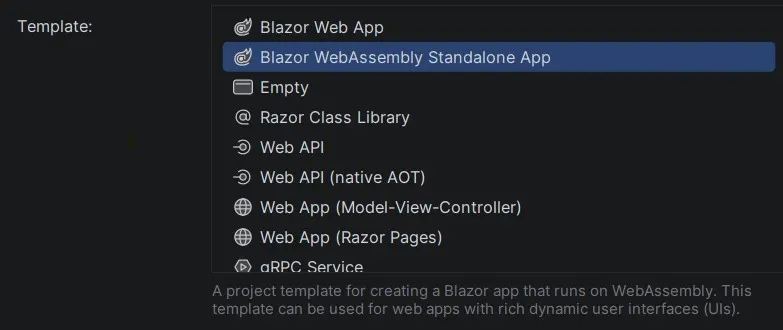
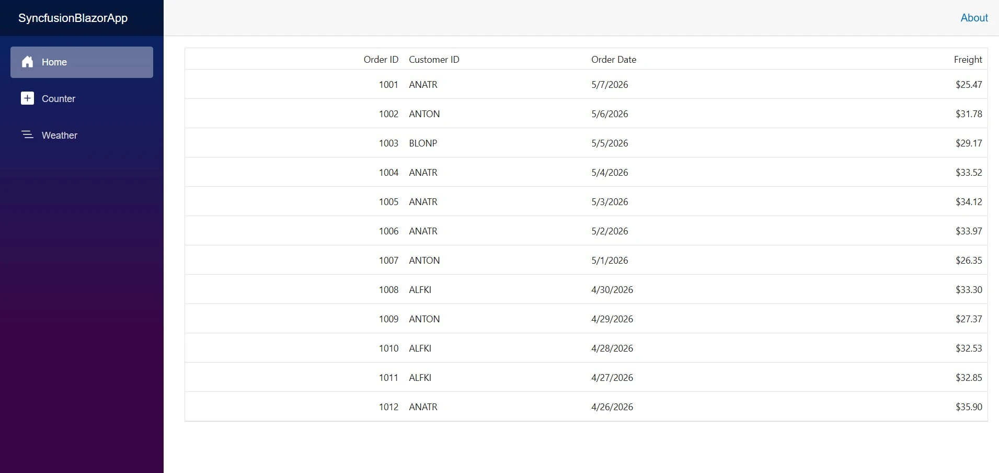
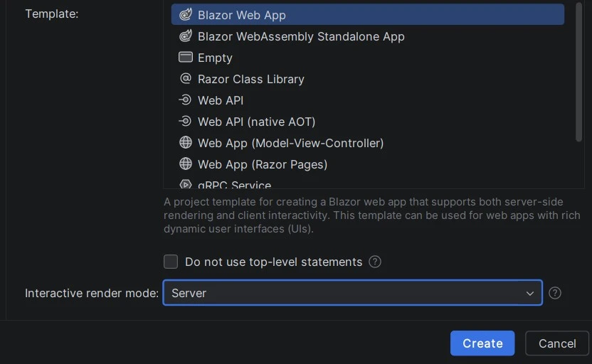

# Getting Started with Blazor WASM and Server Apps in JetBrains Rider 

This guide explains how to create **Blazor Server** and **Blazor WebAssembly (WASM)** applications in [JetBrains Rider](https://www.jetbrains.com/rider/) and integrate [Blazor DataGrid](https://www.syncfusion.com/blazor-components/blazor-datagrid).

## Install JetBrains Rider

- Go to the official [JetBrains Rider](https://www.jetbrains.com/rider/) website.
- Download the installer suitable for your operating system.
- Run the installer and follow the on‑screen instructions to complete the installation.
- After installation finishes, launch JetBrains Rider to verify the setup and begin your Blazor development.

Choose the project type based on your requirements, either a [Blazor Server App](#creating-a-blazor-server-app) or a [Blazor WebAssembly (WASM) App](#creating-a-blazor-webassembly-standalone-app).

## Creating a Blazor WebAssembly Standalone App

This section explains how to create a new **Blazor WebAssembly Standalone App** in **JetBrains Rider**.

Follow these steps to create a Blazor application in Rider:

- Open **JetBrains Rider**.
- On the welcome screen, click **New Solution**.
- Enter your project name.
- Select the **.NET SDK version 8** or later.
- From the available project templates, select **Blazor WebAssembly Standalone App**.
- Click **Create** to generate the project.

Once the project is created, Rider opens the solution and restores the required dependencies automatically.

To quickly get started with a Blazor WebAssembly application in JetBrains Rider with Blazor components, watch the following video:



### Adding Blazor NuGet packages

After creating the Blazor project, you must install the required NuGet packages to use [Blazor DataGrid](https://www.syncfusion.com/blazor-components/blazor-datagrid).

**Install required NuGet packages**

- In the **Solution Explorer**, right click the project name.
- Select **Manage NuGet Packages** from the context menu.
- In the Browse tab, search for and install the following packages:

    - [Syncfusion.Blazor.Grid](https://www.nuget.org/packages/Syncfusion.Blazor.Grid)
    - [Syncfusion.Blazor.Themes](https://www.nuget.org/packages/Syncfusion.Blazor.Themes/)

Once the installation is complete, the **Blazor DataGrid** are ready to be used in your application.

### Register the Blazor services

Open the **Program.cs** file and register the Blazor service and include the required namespace reference `using Syncfusion.Blazor;` at the top.




builder.Services.AddSyncfusionBlazor();




### Add stylesheet and script resources

The theme stylesheet and script can be accessed from NuGet through [Static Web Assets](https://blazor.syncfusion.com/documentation/appearance/themes#static-web-assets). Include the [stylesheet](https://blazor.syncfusion.com/documentation/appearance/themes) at the end of the `<head>` section in the `wwwroot/index.html` file.




<link href="_content/Syncfusion.Blazor.Themes/fluent2.css" rel="stylesheet" />




Include the required [script references](https://blazor.syncfusion.com/documentation/common/adding-script-references) at the end of the `<body>` section in the `wwwroot/index.html` file to enable DataGrid functionality.







### Connect the Blazor DataGrid

Add the **[Blazor DataGrid](https://www.syncfusion.com/blazor-components/blazor-datagrid)** component to a `.razor` file within your app. 




@page "/"

@using Syncfusion.Blazor.Grids

<SfGrid DataSource="@Orders">
    <GridColumns>
        <GridColumn Field=@nameof(Order.OrderID) HeaderText="Order ID" TextAlign="TextAlign.Right" Width="120" />
        <GridColumn Field=@nameof(Order.CustomerID) HeaderText="Customer ID" Width="100" />
        <GridColumn Field=@nameof(Order.OrderDate) HeaderText="Order Date" Format="d" Type="ColumnType.Date" Width="100" />
        <GridColumn Field=@nameof(Order.Freight) HeaderText="Freight" Format="C2" TextAlign="TextAlign.Right" Width="120" />
    </GridColumns>
</SfGrid>

@code{
    public List<Order> Orders { get; set; }

    protected override void OnInitialized()
    {
        Orders = Enumerable.Range(1, 12).Select(i => new Order {
            OrderID = 1000 + i,
            CustomerID = new[] { "ALFKI","ANATR","ANTON","BLONP","BOLID" }[Random.Shared.Next(5)],
            OrderDate = DateTime.Today.AddDays(-i),
            Freight = Math.Round(25 + 15 * Random.Shared.NextDouble(), 2)
        }).ToList();
    }

    public class Order
    {
        public int OrderID { get; set; }
        public string? CustomerID { get; set; }
        public DateTime OrderDate { get; set; }
        public double Freight { get; set; }
    }
}




### Run the application

- In JetBrains Rider, click the **Run** button on the toolbar.
- The default browser opens the application using this URL. If it does not open automatically, copy the URL and open it manually in a browser.

The app launches and renders the **[Blazor DataGrid](https://www.syncfusion.com/blazor-components/blazor-datagrid)** in your default browser.

## Creating a Blazor Server App

This section explains how to create a new **Blazor Server App** in **JetBrains Rider**.

Follow these steps to create a Blazor application in Rider:

- Open **JetBrains Rider**.
- On the welcome screen, click **New Solution**.
- Enter your project name.
- Select the **.NET SDK version 8** or later.
- From the available project templates, select **Blazor Web App**.
- Set the interactive render mode as **Server**.
- Click **Create** to generate the project.

Once the project is created, Rider opens the solution and restores the required dependencies automatically.

### Adding Blazor NuGet packages

After creating the Blazor project, you must install the required NuGet packages to use [Blazor DataGrid](https://www.syncfusion.com/blazor-components/blazor-datagrid).

**Install required NuGet packages**

- In the **Solution Explorer**, right click the project name.
- Select **Manage NuGet Packages** from the context menu.
- In the Browse tab, search for and install the following packages:

    - [Syncfusion.Blazor.Grid](https://www.nuget.org/packages/Syncfusion.Blazor.Grid)
    - [Syncfusion.Blazor.Themes](https://www.nuget.org/packages/Syncfusion.Blazor.Themes/)

Once the installation is complete, the **Blazor DataGrid** are ready to be used in your application.

### Register the Blazor services

Open the **Program.cs** file and register the Blazor service and include the required namespace reference `using Syncfusion.Blazor;` at the top.




builder.Services.AddSyncfusionBlazor();




### Add stylesheet and script resources

The theme stylesheet and script can be accessed from NuGet through [Static Web Assets](https://blazor.syncfusion.com/documentation/appearance/themes#static-web-assets). Include the [stylesheet](https://blazor.syncfusion.com/documentation/appearance/themes) at the end of the `<head>` section in the **App.razor** file.




<link href="_content/Syncfusion.Blazor.Themes/fluent2.css" rel="stylesheet" />




Include the required [script references](https://blazor.syncfusion.com/documentation/common/adding-script-references) at the end of the `<body>` section in the **App.razor** file to enable DataGrid functionality.







N>If the interactivity location is set to `Per page/component`, define a render mode at the top of the razor file. (For example `InteractiveServer`). If the Interactivity is set to `Global`, the render mode is automatically configured in the `App.razor` file by default.

### Connect the Blazor DataGrid

Add the **[Blazor DataGrid](https://www.syncfusion.com/blazor-components/blazor-datagrid)** component to a `.razor` file within your app. 




@page "/"
@rendermode InteractiveServer
@using Syncfusion.Blazor.Grids

<SfGrid DataSource="@Orders">
    <GridColumns>
        <GridColumn Field=@nameof(Order.OrderID) HeaderText="Order ID" TextAlign="TextAlign.Right" Width="120" />
        <GridColumn Field=@nameof(Order.CustomerID) HeaderText="Customer ID" Width="100" />
        <GridColumn Field=@nameof(Order.OrderDate) HeaderText="Order Date" Format="d" Type="ColumnType.Date" Width="100" />
        <GridColumn Field=@nameof(Order.Freight) HeaderText="Freight" Format="C2" TextAlign="TextAlign.Right" Width="120" />
    </GridColumns>
</SfGrid>

@code{
    public List<Order> Orders { get; set; }

    protected override void OnInitialized()
    {
        Orders = Enumerable.Range(1, 12).Select(i => new Order {
            OrderID = 1000 + i,
            CustomerID = new[] { "ALFKI","ANATR","ANTON","BLONP","BOLID" }[Random.Shared.Next(5)],
            OrderDate = DateTime.Today.AddDays(-i),
            Freight = Math.Round(25 + 15 * Random.Shared.NextDouble(), 2)
        }).ToList();
    }

    public class Order
    {
        public int OrderID { get; set; }
        public string? CustomerID { get; set; }
        public DateTime OrderDate { get; set; }
        public double Freight { get; set; }
    }
}




### Run the application

- In JetBrains Rider, click the **Run** button on the toolbar.
- The default browser opens the application using this URL. If it does not open automatically, copy the URL and open it manually in a browser.

The app launches and renders the **[Blazor DataGrid](https://www.syncfusion.com/blazor-components/blazor-datagrid)** in your default browser.

## See also

- [Getting Started with Blazor Web App](https://blazor.syncfusion.com/documentation/getting-started/blazor-web-app)
- [Getting Started with Blazor Server App](https://blazor.syncfusion.com/documentation/getting-started/blazor-server-side-visual-studio)
- [Getting Started with Blazor WebAssembly Standalone App](https://blazor.syncfusion.com/documentation/getting-started/blazor-webassembly-app)
- [Blazor WebAssembly with JetBrains Rider](https://www.syncfusion.com/webinars/blazor-webassembly-with-jetbrains-rider-and-syncfusion/)

