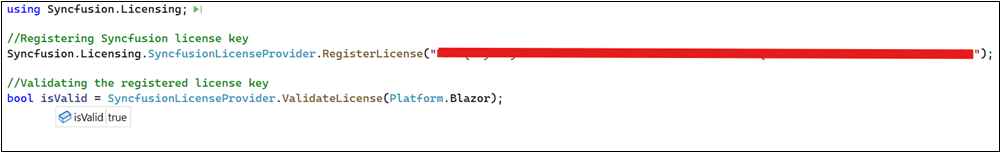

# Validate Syncfusion® license keys in CI services

Syncfusion&reg; license key validation in CI services ensures that Syncfusion&reg; Essential Studio&reg; components are properly licensed during CI processes. Validating the license key at the CI level can prevent licensing errors during deployment. Set up the continuous integration process to fail in case the license key validation fails. Validate the passed parameters and the registered license key again to resolve the issue.

Follow these steps to validate the Syncfusion&reg; license key in CI services.

* Download and extract the LicenseKeyValidator.zip utility: [LicenseKeyValidator](https://s3.amazonaws.com/files2.syncfusion.com/Installs/LicenseKeyValidation/LicenseKeyValidator.zip)
* Open the LicenseKeyValidation.ps1 PowerShell script in a text\code editor and update the parameters as shown below.



# Replace the parameters with the desired platform, version, and actual license key.

$result = & $PSScriptRoot"\LicenseKeyValidatorConsole.exe" /platform:"Blazor" /version:"26.2.4" /licensekey:"Your License Key"

Write-Host $result



* Update the parameters in the script:
   * **Platform:** Set /platform:"Blazor" (use the relevant Syncfusion platform as needed).
   * **Version:** Set /version:"26.2.4" (match the Syncfusion package version used in the build).
   * **License key:** Set /licensekey:"Your License Key" (inject via secure variable or secret).

## Azure Pipelines (YAML)

* Create a [user-defined variable](https://learn.microsoft.com/en-us/azure/devops/pipelines/process/variables?view=azure-devops&tabs=yaml%2Cbatch#user-defined-variables) named `LICENSE_VALIDATION` in the Azure pipeline. Set it to the path of the LicenseKeyValidation.ps1 script (for example, D:\LicenseKeyValidator\LicenseKeyValidation.ps1).

* Integrate the PowerShell task in the pipeline and execute the script to validate the license key. 

The following example shows the syntax for Windows build agents.



pool:
  vmImage: 'windows-latest'

steps:
- task: PowerShell@2
  inputs:
    targetType: filePath
    filePath: $(LICENSE_VALIDATION) #Or the actual path to the LicenseKeyValidation.ps1 script.
  
  displayName: Syncfusion License Validation 



## Azure Pipelines (Classic)

* Create a new [User-defined Variable](https://learn.microsoft.com/en-us/azure/devops/pipelines/process/variables?view=azure-devops&tabs=yaml%2Cbatch#user-defined-variables) named `LICENSE_VALIDATION` in the Azure Pipeline. Use the path of the LicenseKeyValidation.ps1 script file as a value (e.g., D:\LicenseKeyValidator\LicenseKeyValidation.ps1).

* Include the PowerShell task in the pipeline and execute the script to validate the license key. 

## GitHub actions

* To execute the script in PowerShell as part of a GitHub Actions workflow, include a step in the configuration file and update the path of the LicenseKeyValidation.ps1 script file (e.g., D:\LicenseKeyValidator\LicenseKeyValidation.ps1).

The following example validates the Syncfusion&reg; license key in GitHub Actions.



  steps:
  - name: Syncfusion License Validation
    shell: pwsh
    run: |
	  ./path/LicenseKeyValidator/LicenseKeyValidation.ps1



## Jenkins

* Create an [Environment Variable](https://www.jenkins.io/doc/pipeline/tour/environment) named 'LICENSE_VALIDATION'. Use the path of the LicenseKeyValidation.ps1 script file as a value (e.g., D:\LicenseKeyValidator\LicenseKeyValidation.ps1).

* Include a stage in Jenkins to execute the LicenseKeyValidation.ps1 script in PowerShell. 

The following example shows the syntax for validating the Syncfusion&reg; license key in the Jenkins pipeline.



pipeline {
	agent any
	environment {
		LICENSE_VALIDATION = 'path\\to\\LicenseKeyValidator\\LicenseKeyValidation.ps1'
	}
	stages {
		stage('Syncfusion License Validation') {
			steps {
				sh 'pwsh ${LICENSE_VALIDATION}'
            }
        }
    }
}



## Validate the License Key By Using the ValidateLicense() Method

* Register the license key properly by calling RegisterLicense("License Key") method with the license key. 

* Once the license key is registered, it can be validated by using the ValidateLicense("Platform.Blazor") method. This ensures that the license key is valid for the platform and version you are using. For reference, please check the following example.



using Syncfusion.Licensing;

// Register the Syncfusion license key
Syncfusion.Licensing.SyncfusionLicenseProvider.RegisterLicense("YOUR LICENSE KEY");

// Validate the registered license key
bool isValid = SyncfusionLicenseProvider.ValidateLicense(Platform.Blazor);



* If the ValidateLicense() method returns true, registered license key is valid and can proceed with deployment.

* If the ValidateLicense() method returns false, there will be invalid license errors in deployment due to either an invalid license key or an incorrect assembly or package version that is referenced in the project. Please ensure that all the referenced Syncfusion&reg; assemblies or NuGet packages are all on the same version as the license key’s version before deployment. 

## Validate the License Key By Using the Unit Test Project 

* To create a unit test project in Visual Studio, choose **File -> New -> Project** from the menu. This opens a new dialog for creating a new project. Filtering the project type by Test or typing Test as a keyword in the search option can help you to find available unit test projects. Select the appropriate test framework (such as MSTest, NUnit, or xUnit) that best suits your need.

* For more details on creating unit test projects in Visual Studio, refer to the [Getting Started with Unit Testing guide](https://learn.microsoft.com/en-us/visualstudio/test/getting-started-with-unit-testing?view=vs-2022&tabs=dotnet%2Cmstest#create-unit-tests).

* Register the license key by calling the RegisterLicense("Your License Key") method with the license key in the unit test project.

N> * Place the license key between double quotes. Also, ensure that Syncfusion.Licensing.dll is referenced in your project where the license key is being registered.

* Once the license key is registered, it can be validated by using the ValidateLicense("Platform.Blazor", out var validationMessage) method. This ensures that the license key is valid for the platform and version you are using.

* For reference, please check the following example that demonstrates how to register and validate the license key in the unit test project.



public void TestSyncfusionBlazorLicense()
{
	var platform = Platform.Blazor;
	// Register the Syncfusion license key
	SyncfusionLicenseProvider.RegisterLicense("Your License Key");

	bool isValidLicense = SyncfusionLicenseProvider.ValidateLicense(platform, out var validationMessage);
	Assert.That(isValidLicense, Is.True, $"Validation failed for {platform}." + $" Validation Message: {validationMessage}");

	// Log validation messages to TestContext output
	if (isValidLicense)
	{
		TestContext.Out.WriteLine($"Platform {platform} is correctly licensed for version " + $"{typeof(SyncfusionLicenseProvider).Assembly.GetName().Version}");
	}
}



* Once the unit test is executed, if the license key validation passes for the specified platform, the output similar to the following will be displayed in the Test Explorer window.

* If the license validation fails during unit testing, the following output will be displayed in the Test Explorer window.

* License validation fails due to either an invalid license key or an incorrect assembly or package version that is referenced in the project. In such cases, verify that you are using the valid license key for the platform, and ensure the assembly or package versions referenced in the project match the version of the license key.
