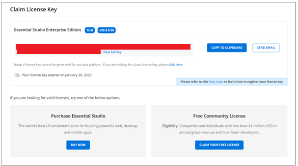
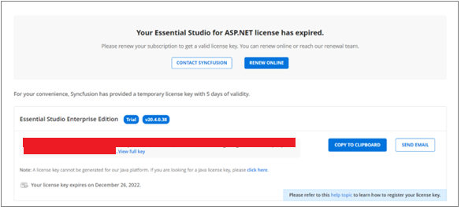

# Generate Syncfusion® Blazor License Key

Generate license keys from the [License & Downloads](https://syncfusion.com/account/downloads) portal or the [Trial & Downloads](https://www.syncfusion.com/account/manage-trials/downloads) page of the Syncfusion&reg; website.

N> * Syncfusion&reg; license keys are **version and platform specific**. See How to generate a license key for [licensed products](https://www.syncfusion.com/kb/8976/how-to-generate-license-key-for-licensed-products).
* To determine which license key version to use in an application, see [Which version Syncfusion&reg; license key should I use in my application?](https://www.syncfusion.com/kb/8951/which-version-syncfusion-license-key-should-i-use-in-my-application).

## Claim License key

License keys can also be generated from the **Claim License Key** page based on the trial or active license associated with the Syncfusion&reg; account.

The generated key depends on license availability in the associated Syncfusion&reg; account.

### Active License

If the account has a valid license, a license key is generated from the Claim License Key page.

### Active Trial

If the account has a valid trial license, a license key is generated with an expiry date.

### Expired License

If the account license has expired, renew the subscription to obtain a valid license key for the latest Essential Studio&reg; version. A temporary license key with a 5‑day validity period is generated in the meantime.

### No Trial or No License or Expired trial

If the account does not have an active trial or license, request a trial or obtain a valid license from the Claim License Key page.

