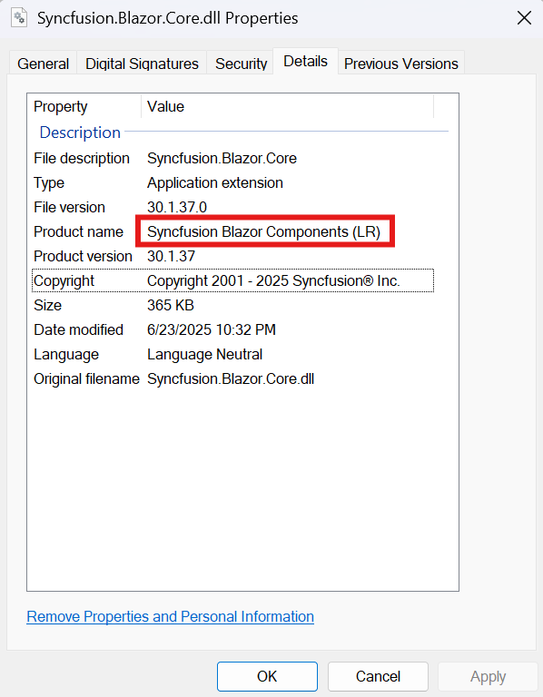
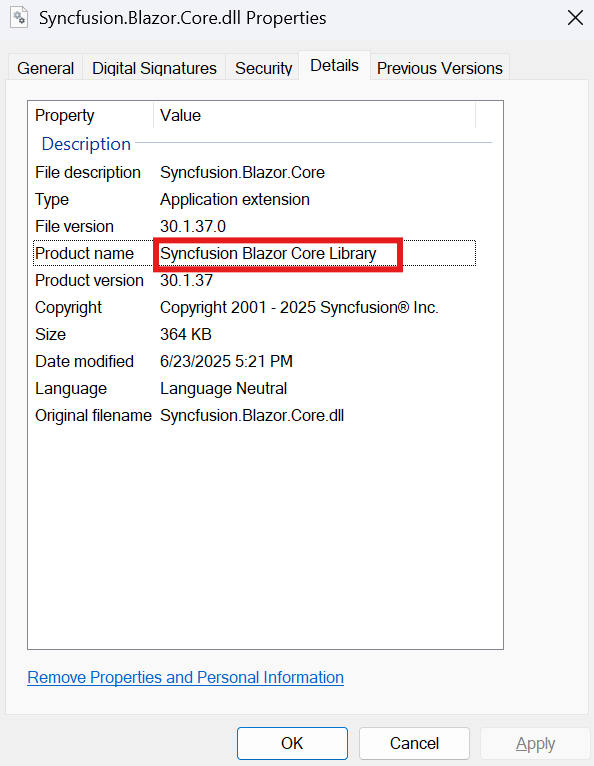

# Secure registration of Syncfusion® license keys

Registering a license key directly in the Program.cs file of a Blazor WebAssembly Client project can expose it through the compiled assemblies, making it accessible in the browser, creating security risks.

## Recommended Solution: Use Licensed NuGet Packages

Syncfusion<sup style="font-size:70%">&reg;</sup> recommends using licensed NuGet packages distributed with licensed Blazor releases (volume and service pack). When these licensed packages are used, no license key registration is required in application code.

### Benefits of using licensed NuGet packages

- **Enhanced Security:** Prevents license key exposure in the browser.
- **Simplified Deployment:** Removes the need for manual license key registration.

## Reference: Syncfusion<sup style="font-size:70%">&reg;</sup> Blazor web installer user guide

Refer to the documentation to download and install the licensed Blazor product:

- [Download instructions](https://blazor.syncfusion.com/documentation/installation/web-installer/how-to-download)
- [Installation guide](https://blazor.syncfusion.com/documentation/installation/web-installer/how-to-install)

These steps ensure Blazor WebAssembly applications secure and compliant by preventing license key exposure.

## Using licensed NuGet packages

Build your Blazor WASM application using licensed NuGet packages from these sources:

- **Local Folder:** Store packages locally and configure your project for restoration.
- **Private repository manager:** Host and manage packages using a private NuGet repository manager such as Nexus or an Azure DevOps Artifacts feed.


> Important: When referencing both a local folder or private repository and `nuget.org` in `NuGet.config`, and if both sources contain the same Syncfusion<sup style="font-size:70%">&reg;</sup> package version, restore may default to `nuget.org` (trial versions), which can cause license popup issues.

### Use Package Source Mapping
To ensure the project always restores Syncfusion<sup style="font-size:70%">&reg;</sup> packages from the licensed source, configure [Package Source Mapping](https://learn.microsoft.com/en-us/nuget/consume-packages/package-source-mapping) in `NuGet.config`.

```xml
<configuration>
  <packageSources>
    <add key="licensed-nuget" value="path/to/your/nuget-source" />
    <add key="nuget.org" value="https://api.nuget.org/v3/index.json" />
  </packageSources>
  <packageSourceMapping>
    <packageSource key="licensed-nuget">
      <package pattern="Syncfusion.*" />
    </packageSource>
  </packageSourceMapping>
</configuration>
```

### Verifying assembly licensing

To confirm whether your application is referencing licensed or trial assemblies:

* Navigate to the build output directory and locate the Syncfusion<sup style="font-size:70%">&reg;</sup> assemblies.

* Right-click each assembly → select Properties → Go to the Details tab.

* Check the File Description:

    * If the File description includes "LR", it is a trial version.

        

    * If it does not include "LR", it is a licensed version.

        


If trial assemblies are detected in your application, follow these steps to ensure a clean and licensed setup:

Clear the NuGet cache to remove any previously downloaded trial packages:
```bash
dotnet nuget locals all --clear
```


Delete the **bin** and **obj** folders from project directories to remove cached build artifacts.

Uninstall and reinstall the Syncfusion<sup style="font-size:70%">&reg;</sup> packages, ensuring restore pulls only from the licensed NuGet source.

## Securely manage Syncfusion<sup style="font-size:70%">&reg;</sup> license keys using Azure Key Vault

You can integrate Azure Key Vault into your application to retrieve the license key at runtime, ensuring it is never exposed in the browser or stored in the client-side code.

For enhanced security, especially in cloud-hosted environments, store and access license keys securely using Azure Key Vault. This method keeps sensitive information out of your source code and configuration files.

Integrate Azure Key Vault to retrieve the license key at runtime, preventing browser exposure or storage in client-side code.

For detailed steps, see [Securely store and use Syncfusion license keys in Azure Key Vault]( https://help.syncfusion.com/common/essential-studio/licensing/licensing-faq/how-to-securely-store-and-use-syncfusion-license-keys-in-azure-key-vault)