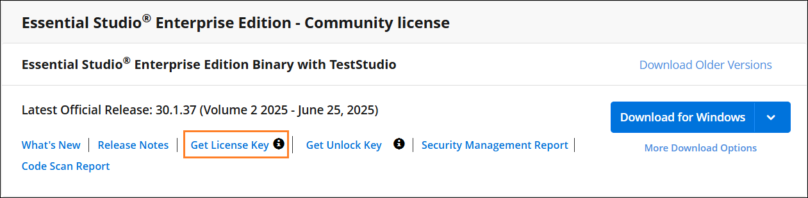

# Syncfusion&reg; licensing errors

Licensing pop-ups can appear with different messages depending on the scenario. Use the guidance below to identify the message and apply the appropriate fix.

## Licensing errors 

### License key not registered or trial expired

This message appears when a license key is not registered in the application or a trial key has passed the 30‑day evaluation period.

**Error message:** This application was built using a trial version of Syncfusion&reg; Essential Studio&reg;. Include a valid license to permanently remove this license validation message.

**Solution:**

* If using Blazor components through trial installer or obtained our components via [NuGet.org](https://www.nuget.org/packages?q=syncfusion), use one of the following options.

1. If you **have a valid Syncfusion&reg; license**, you can **generate a license key for a specific version and product** from [this page](https://www.syncfusion.com/account/downloads).

   

2. If you **have a Syncfusion&reg; account and an active trial**, you can **generate the trial license key for a specific version and platform** from [this page](https://www.syncfusion.com/account/manage-trials/downloads).

3. If you **have a Syncfusion&reg; account but no active trials**, [purchase a license](https://www.syncfusion.com/sales/products) or [start your 30-day free trial](https://www.syncfusion.com/account/manage-trials/start-trials). Then you can generate the trial license key for **a specific version and platform** from [this page](https://www.syncfusion.com/account/downloads).

4. If you **do not already have a Syncfusion&reg; account**, you can create one [here](https://www.syncfusion.com/account/register) and [purchase a license](https://www.syncfusion.com/sales/products) or start your 30-day free trial. Then you can **generate the trial license key for a specific version and platform** from [this page](https://www.syncfusion.com/account/manage-trials/start-trials).

5. You can also generate a license key from the Claim license key page by selecting “Claim your FREE account” in the warning dialog. Refer to this [help topic](https://blazor.syncfusion.com/documentation/getting-started/license-key/how-to-generate#Claim-License-Key) for more details.

* Register the generated license key in the application. Refer to this [help topic](https://blazor.syncfusion.com/documentation/getting-started/license-key/how-to-register-in-an-application) for information on registering the license key.

### Invalid key

If the application is registered with an invalid key, another version of license key, or another platform's license key, the following error message will pop up when launching the application. 

**Error message:** The included Syncfusion&reg; license key is invalid.

**Solution:**

* If you use Blazor components through trial installer or obtained our components via [NuGet.org](https://www.nuget.org/packages?q=syncfusion), use one of the following options:

1. If you have a valid Syncfusion&reg; license, you can **generate a license key for a specific version and product** from [this page](https://www.syncfusion.com/account/downloads).

   

2. If you have a Syncfusion&reg; account and an active trial, you can **generate the trial license key for a specific version and product** from [this page](https://www.syncfusion.com/account/manage-trials/downloads).

3. If you **have a Syncfusion&reg; account but no active trials**, [purchase a license](https://www.syncfusion.com/sales/products) or [start your 30-day free trial](https://www.syncfusion.com/account/manage-trials/start-trials). Then you can **generate the trial license key for a specific version and product** from [this page](https://www.syncfusion.com/account/downloads).

4. If you **do not already have a Syncfusion&reg; account**, you can create one here and [purchase a license](https://www.syncfusion.com/sales/products) or [start your 30-day free trial](https://www.syncfusion.com/account/manage-trials/start-trials). Then you can **generate the trial license key for a specific version and product** from [this page](https://www.syncfusion.com/account/manage-trials/downloads).

5. Also, you can generate the license key from claim license key page by clicking the **"Claim your FREE account"** click from the licensing warning message. Refer to this [help topic](https://blazor.syncfusion.com/documentation/getting-started/license-key/how-to-generate#Claim-License-Key) for more details.

* In your application, register the generated license key. Refer to this [help topic](https://blazor.syncfusion.com/documentation/getting-started/license-key/how-to-register-in-an-application) for information on registering the license key.

## Licensing errors from version 16.2.0* to 20.3.0*

### License key not registered

The following error message will be shown if a Syncfusion&reg; license key has not been registered in your application.

**Error message:**   This application was built using a trial version of Syncfusion&reg; Essential Studio&reg;. Include a valid license to permanently remove this license validation message. You can also obtain a free 30 day evaluation license to temporarily remove this message during the evaluation period. Refer to this [help topic](https://blazor.syncfusion.com/documentation/getting-started/license-key/licensing-errors#license-key-not-registered) for more information.

**Solution:**

* If you use Blazor components through trial installer or obtained our components via [NuGet.org](https://www.nuget.org/packages?q=syncfusion), you can choose from the options listed below

1. If you **have a valid Syncfusion&reg; license**, you can **generate a license key for a specific version and product** from [this page](https://www.syncfusion.com/account/downloads).

   

2. If you **have a Syncfusion&reg; account and an active trial**, you can **generate the trial license key for a specific version and platform** from [this page](https://www.syncfusion.com/account/manage-trials/downloads).

3. If you **have a Syncfusion&reg; account but no active trials**, [purchase a license](https://www.syncfusion.com/sales/products) or [start your 30-day free trial](https://www.syncfusion.com/account/manage-trials/start-trials). Then you can generate the trial license key for **a specific version and platform** from [this page](https://www.syncfusion.com/account/downloads).

4. If you **do not already have a Syncfusion&reg; account**, you can create one [here](https://www.syncfusion.com/account/register) and [purchase a license](https://www.syncfusion.com/sales/products) or start your 30-day free trial. Then you can **generate the trial license key for a specific version and platform** from [this page](https://www.syncfusion.com/account/manage-trials/start-trials).

* In your application, register the generated license key. Refer to this [help topic](https://blazor.syncfusion.com/documentation/getting-started/license-key/how-to-register-in-an-application) for information on registering the license key.

### Invalid key

If the application is registered with an invalid key, another version of license key, or another platform’s license key, the following error message will pop up when launching the application.

**Error message:**   The included Syncfusion&reg; license is invalid. Refer to this [help topic](https://blazor.syncfusion.com/documentation/getting-started/license-key/licensing-errors#invalid-key) for more information.

**Solution:**

* If you use Blazor components through trial installer or obtained our components via [NuGet.org](https://www.nuget.org/packages?q=syncfusion), you can choose from the options listed below

1. If you have a valid Syncfusion&reg; license, you can **generate a license key for a specific version and product** from [this page](https://www.syncfusion.com/account/downloads).

   

2. If you have a Syncfusion&reg; account and an active trial, you can **generate the trial license key for a specific version and product** from [this page](https://www.syncfusion.com/account/manage-trials/downloads).

3. If you **have a Syncfusion&reg; account but no active trials**, [purchase a license](https://www.syncfusion.com/sales/products) or [start your 30-day free trial](https://www.syncfusion.com/account/manage-trials/start-trials). Then you can **generate the trial license key for a specific version and product** from [this page](https://www.syncfusion.com/account/downloads).

4. If you **do not already have a Syncfusion&reg; account**, you can create one here and [purchase a license](https://www.syncfusion.com/sales/products) or [start your 30-day free trial](https://www.syncfusion.com/account/manage-trials/start-trials). Then you can **generate the trial license key for a specific version and product** from [this page](https://www.syncfusion.com/account/manage-trials/downloads).

* In your application, register the generated license key. Refer to this [help topic](https://blazor.syncfusion.com/documentation/getting-started/license-key/how-to-register-in-an-application) for information on registering the license key.

### Trial expired

The following error message will be shown if the trial key has expired after 30 days.

**Error message:**   Your Syncfusion&reg; trial license has expired. Refer to this [help topic](https://blazor.syncfusion.com/documentation/getting-started/license-key/licensing-errors#trial-expired) for more information.

**Solution:**   Purchase a license [here](https://www.syncfusion.com/sales/products)

### Platform Mismatch

If the application is registered with another platform’s license key, the following error message will pop up when launching the application.

**Error message:**   The included Syncfusion&reg; license is invalid (Platform mismatch). Refer to this [help topic](https://blazor.syncfusion.com/documentation/getting-started/license-key/licensing-errors#platform-mismatch) for more information.

**Solution:**

* License keys are version and product specific. So, if you use Blazor components through trial installer or obtained our components via [NuGet.org](https://www.nuget.org/packages?q=syncfusion), you can choose from the options listed below

1. If you have a valid Syncfusion&reg; license, you can **generate a license key for a specific version and product** from [this page](https://www.syncfusion.com/account/downloads).

   

2. If you have a Syncfusion&reg; account and an active trial, you can **generate the trial license key for a specific version and product** from [this page](https://www.syncfusion.com/account/manage-trials/downloads).

3. If you **have a Syncfusion&reg; account but no active trials**, [purchase a license](https://www.syncfusion.com/sales/products) or [start your 30-day free trial](https://www.syncfusion.com/account/manage-trials/start-trials). Then you can **generate the trial license key for a specific version and product** from [this page](https://www.syncfusion.com/account/downloads).

* In your application, register the generated license key. Refer to this [help topic](https://blazor.syncfusion.com/documentation/getting-started/license-key/how-to-register-in-an-application) for information on registering the license key.

### Version Mismatch

If the application is registered with another version’s license key, the following error message will pop up when launching the application.

**Error message:**   The included Syncfusion&reg; license ({Registered Version}) is invalid for version {Required version}. Refer to this [help topic](https://blazor.syncfusion.com/documentation/getting-started/license-key/licensing-errors#version-mismatch) for more information.

**Solution:**

* License keys are version and product specific. So, if you use Blazor components through trial installer or obtained our components via [NuGet.org](https://www.nuget.org/packages?q=syncfusion), you can choose from the options listed below

1. If you have a valid Syncfusion&reg; license, you can **generate a license key for a specific version and product** from [this page](https://www.syncfusion.com/account/downloads).

   

2. If you have a Syncfusion&reg; account and an active trial, you can **generate the trial license key for a specific version and product** from [this page](https://www.syncfusion.com/account/manage-trials/downloads).

3. If you **have a Syncfusion&reg; account but no active trials**, [purchase a license](https://www.syncfusion.com/sales/products) or [start your 30-day free trial](https://www.syncfusion.com/account/manage-trials/start-trials). Then you can **generate the trial license key for a specific version and product** from [this page](https://www.syncfusion.com/account/downloads).

* In your application, register the generated license key. Refer to this [help topic](https://blazor.syncfusion.com/documentation/getting-started/license-key/how-to-register-in-an-application) for information on registering the license key.

### Facing licensing error message even after registering proper license keys

1. Ensure the [Syncfusion.Licensing](https://www.nuget.org/packages/Syncfusion.Licensing/) NuGet package or assembly matches the version used by other Syncfusion&reg; packages in the application.

2. Verify all referenced Syncfusion&reg; assemblies are the same version and that a matching platform/version license key is registered in the application.

3. Register the license key before initializing any Syncfusion&reg; component. Refer [this](https://blazor.syncfusion.com/documentation/getting-started/license-key/how-to-register-in-an-application) page for more information on registering license keys.

4. Ensure the same version of Syncfusion&reg; assemblies are present in the application output and published folders.

5. After upgrading Syncfusion&reg; packages and updating the license key, clean bin/obj and rebuild the application to clear cached trial assemblies.
