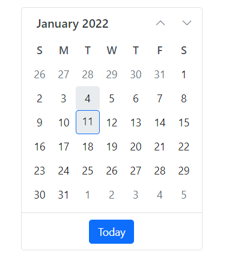
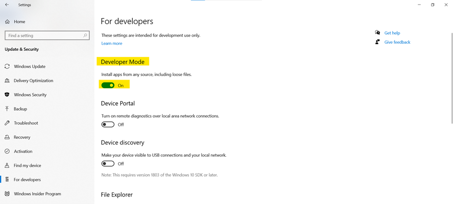

# Getting Started with .NET MAUI Blazor Hybrid App

This section explains how to create and run the first .NET Multi-platform Blazor App UI (.NET MAUI Blazor) app with Syncfusion<sup style="font-size:70%">&reg;</sup> Blazor components.

To get started quickly with a .NET MAUI Blazor app, review the following video.



## What is .NET MAUI Blazor App?

A .NET MAUI Blazor App is a .NET MAUI application where a Blazor Web App is hosted in the .NET MAUI app using the `BlazorWebView` control. This enables a Blazor Web App to integrate with platform features and UI controls. The `BlazorWebView` can be added to any page of a .NET MAUI app and pointed to the root of the Blazor app. The Blazor components run in the .NET process and render web UI to an embedded web view control. .NET MAUI Blazor apps can run on all platforms supported by .NET MAUI.

Visual Studio provides the **.NET MAUI Blazor App** template to create .NET MAUI Blazor Apps.

## Prerequisites

* .NET SDK 8.0 or above

* Visual Studio 2022 17.1 or above with the required workloads:
   * [Mobile development with .NET](https://learn.microsoft.com/en-us/dotnet/maui/get-started/installation?tabs=vswin)
   * ASP.NET and web development

## Create a new .NET MAUI Blazor App in Visual Studio

Create a **.NET MAUI Blazor App** using Visual Studio via [Microsoft templates](https://learn.microsoft.com/en-us/aspnet/core/blazor/hybrid/tutorials/maui?view=aspnetcore-8.0).

## BlazorWebView in .NET MAUI Blazor App

The above steps create a multi-targeted .NET MAUI Blazor app that can be deployed to Android, iOS, macOS, and Windows.

In `MainPage.xaml`, the `BlazorWebView` is added and points to the root of the Blazor app. The root Blazor component for the app is in `Routes.razor`, which Razor compiles into a type named `Routes` in the application's root namespace.




<ContentPage xmlns="http://schemas.microsoft.com/dotnet/2021/maui"
             xmlns:x="http://schemas.microsoft.com/winfx/2009/xaml"
             xmlns:local="clr-namespace:MauiApp1"
             x:Class="MauiApp1.MainPage">

    <BlazorWebView x:Name="blazorWebView" HostPage="wwwroot/index.html">
        <BlazorWebView.RootComponents>
            <RootComponent Selector="#app" ComponentType="{x:Type local:Components.Routes}" />
        </BlazorWebView.RootComponents>
    </BlazorWebView>

</ContentPage>




For more details, refer to the [Create a .NET MAUI Blazor app](https://learn.microsoft.com/en-us/dotnet/maui/user-interface/controls/blazorwebview#create-a-net-maui-blazor-app) topic. 

## Install Syncfusion<sup style="font-size:70%">&reg;</sup> Blazor Calendars and Themes NuGet in the App

To add the **Blazor Calendar** component to the app, open the NuGet package manager in Visual Studio (*Tools → NuGet Package Manager → Manage NuGet Packages for Solution*), then search for and install [Syncfusion.Blazor.Calendars](https://www.nuget.org/packages/Syncfusion.Blazor.Calendars/) and [Syncfusion.Blazor.Themes](https://www.nuget.org/packages/Syncfusion.Blazor.Themes/). Alternatively, use the following Package Manager commands.




Install-Package Syncfusion.Blazor.Calendars -Version {{ site.releaseversion }}
Install-Package Syncfusion.Blazor.Themes -Version {{ site.releaseversion }}




N> Syncfusion<sup style="font-size:70%">&reg;</sup> Blazor components are available on [nuget.org](https://www.nuget.org/packages?q=syncfusion.blazor). Refer to the [NuGet packages](https://blazor.syncfusion.com/documentation/nuget-packages) topic for the list of available packages with component details.

## Register Syncfusion<sup style="font-size:70%">&reg;</sup> Blazor Service

Open the **~/_Imports.razor** file and import the `Syncfusion.Blazor` and `Syncfusion.Blazor.Calendars` namespaces.

```cshtml

@using Syncfusion.Blazor
@using Syncfusion.Blazor.Calendars

```

Next, register the Syncfusion<sup style="font-size:70%">&reg;</sup> Blazor service in the `MauiProgram.cs` file of the MAUI Blazor App.




    using Syncfusion.Blazor;
    ....
    builder.Services.AddSyncfusionBlazor();
    ....




## Add stylesheet and script resources

The theme stylesheet and script can be accessed from NuGet through [Static Web Assets](https://blazor.syncfusion.com/documentation/appearance/themes#static-web-assets). Reference the stylesheet and script in the `<head>` of the **~wwwroot/index.html** file.

```html
<head>
    ....
    <link href="_content/Syncfusion.Blazor.Themes/bootstrap5.css" rel="stylesheet" />
    <script src="_content/Syncfusion.Blazor.Core/scripts/syncfusion-blazor.min.js" type="text/javascript"></script>
</head>
```
N> See the [Blazor Themes](https://blazor.syncfusion.com/documentation/appearance/themes) topic for different methods ([Static Web Assets](https://blazor.syncfusion.com/documentation/appearance/themes#static-web-assets), [CDN](https://blazor.syncfusion.com/documentation/appearance/themes#cdn-reference), and [CRG](https://blazor.syncfusion.com/documentation/common/custom-resource-generator)) to reference themes in a Blazor application. For script references, see [Adding Script Reference](https://blazor.syncfusion.com/documentation/common/adding-script-references).

## Add Syncfusion<sup style="font-size:70%">&reg;</sup> Blazor component

Add a Syncfusion<sup style="font-size:70%">&reg;</sup> Blazor component in any Razor file. In this example, the Calendar component is added to the `~/Home.razor` page under the `~/Components/Pages` folder.




@using Syncfusion.Blazor.Calendars

<SfCalendar TValue="DateTime"></SfCalendar>




In the Visual Studio toolbar, select **Windows Machine** to build and run the app.
Ensure the run profile is set to `Windows Machine` before starting the app.


N> To run the application on Android or iOS, refer to [MAUI Getting Started](https://learn.microsoft.com/en-us/aspnet/core/blazor/hybrid/tutorials/maui?view=aspnetcore-8.0#run-the-app-in-the-android-emulator) for setup instructions.



N> Download the demo from [GitHub](https://github.com/SyncfusionExamples/MAUI-Blazor-App-using-Syncfusion-Blazor-Components).

## How to use images in .NET MAUI Blazor Application

Add images to the `wwwroot` folder of the application and reference them using the `img` tag in the Blazor App.

In the following example, images are added under the `images` folder in the `wwwroot` folder.









## Troubleshooting

### How to solve deployment errors in Windows?

If the error dialog “There were deployment errors” appears, enable Developer Mode. For more details, refer to [Enable your device for development](https://learn.microsoft.com/en-us/windows/apps/get-started/enable-your-device-for-development).



<hr/>

### How to solve deployment errors in iOS?

In iOS, code is statically compiled ahead of time. Configure Syncfusion<sup style="font-size:70%">&reg;</sup> Blazor assemblies in the `MtouchExtraArgs` tag for the iOS Release configuration in the project when deploying to a real device.

Possible errors if the `MtouchExtraArgs` tag is not configured:
1. The app does not load on a real device with the error “An unhandled error has occurred” after compiling in Release mode with Visual Studio and deploying to a real device.
2. AOT-related failures such as [`Attempting to JIT compile method while running in aot-only mode`](https://github.com/xamarin/xamarin-macios/issues/12416)

 ```
<PropertyGroup Condition="$(TargetFramework.Contains('-ios')) And $(Configuration.Contains('Release')) ">
  <UseInterpreter>true</UseInterpreter>
  <MtouchExtraArgs>--linkskip=Syncfusion.Blazor.Themes --linkskip=Syncfusion.Blazor.Inputs</MtouchExtraArgs>
</PropertyGroup>
 ```

Reference:
* [Could not AOT the assembly of my App](https://learn.microsoft.com/en-us/answers/questions/396055/could-not-aot-the-assembly-of-my-app)

<hr/>

### How to solve "The project doesn't know how to run the profile Windows Machine" while running MAUI Blazor App?

* This issue has been addressed in a recent release of Visual Studio. For details, see the discussion [here](https://developercommunity.visualstudio.com/t/the-project-doesnt-know-how-to-run-the-profile-win/1530395).

* Alternatively, install [Single-project MSIX Packaging Tools](https://marketplace.visualstudio.com/items?itemName=ProjectReunion.MicrosoftSingleProjectMSIXPackagingToolsDev17) to resolve this error.

## See also

### MAUI Blazor Diagram

* [How to create Diagram Builder in MAUI platform?](https://support.syncfusion.com/kb/article/11346/how-to-create-diagram-builder-in-maui-platform)

N> [View MAUI Blazor Diagram Builder Source Code in GitHub](https://github.com/syncfusion/blazor-showcase-diagram-builder/tree/master/MAUI)
