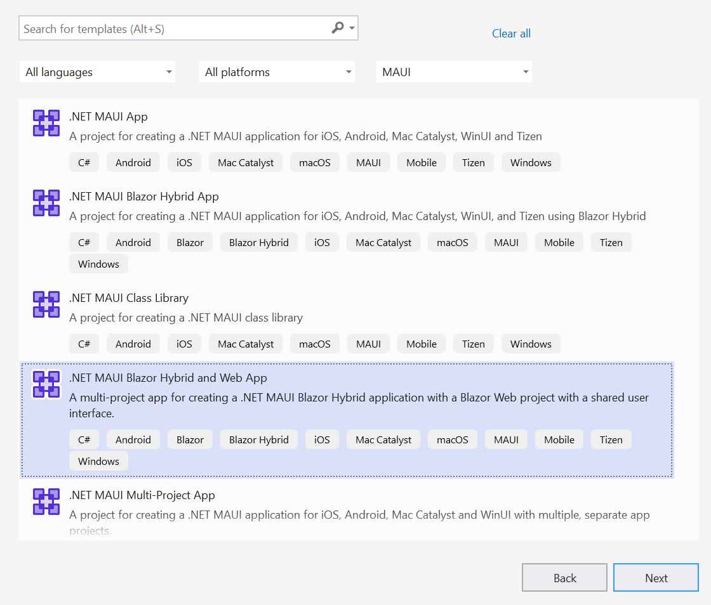

# Getting Started with .NET MAUI Blazor Hybrid and Web App

This section explains how to create and run a .NET Multi-platform Blazor App UI (.NET MAUI with Blazor Web App) using Syncfusion<sup style="font-size:70%">&reg;</sup> Blazor components.

## What is .NET MAUI Blazor Hybrid and Web App?

[.NET MAUI Blazor Web App](https://learn.microsoft.com/en-us/aspnet/core/blazor/hybrid/tutorials/maui-blazor-web-app?view=aspnetcore-9.0) is a hybrid application that leverages a Razor Class Library (RCL) to define reusable Blazor components. These components are shared between a Blazor WebAssembly or Server App and a .NET MAUI Blazor App. This approach enables a unified web-based UI that can be **reused across mobile, desktop, and browser platforms**.

By sharing UI components between native and web apps, this pattern ensures consistent user experiences, maximizes code reuse, and simplifies maintenance for applications targeting multiple environments.

Visual Studio provides the **[.NET MAUI Blazor Hybrid and Web App](https://learn.microsoft.com/en-us/aspnet/core/blazor/hybrid/tutorials/maui-blazor-web-app?view=aspnetcore-9.0)** template to create a .NET MAUI Blazor Hybrid app with a Blazor Web App.

## Prerequisites

* .NET SDK 9.0 or later
* Visual Studio 2022 17.3 or later with the following workloads:
   * [Mobile development with .NET](https://learn.microsoft.com/en-us/dotnet/maui/get-started/installation?tabs=vswin)
   * ASP.NET and web development

## Create a new .NET MAUI Blazor Hybrid and Blazor Web App in Visual Studio

Create a **.NET MAUI Blazor Hybrid and Blazor Web App** in Visual Studio using the [Microsoft Templates](https://learn.microsoft.com/en-us/aspnet/core/blazor/hybrid/tutorials/maui-blazor-web-app?view=aspnetcore-9.0).



## Install Syncfusion<sup style="font-size:70%">&reg;</sup> Blazor Calendars and Themes NuGet in the App

To add the Blazor Calendar component in the app’s shared folder, open the NuGet Package Manager in Visual Studio (*Tools → NuGet Package Manager → Manage NuGet Packages for Solution*), then search for and install [Syncfusion.Blazor.Calendars](https://www.nuget.org/packages/Syncfusion.Blazor.Calendars/) and [Syncfusion.Blazor.Themes](https://www.nuget.org/packages/Syncfusion.Blazor.Themes/). Alternatively, use the following Package Manager commands:




Install-Package Syncfusion.Blazor.Calendars -Version {{ site.releaseversion }}
Install-Package Syncfusion.Blazor.Themes -Version {{ site.releaseversion }}




N> Syncfusion<sup style="font-size:70%">&reg;</sup> Blazor components are available on [nuget.org](https://www.nuget.org/packages?q=syncfusion.blazor). Refer to the [NuGet packages](https://blazor.syncfusion.com/documentation/nuget-packages) topic for the list of packages and component details.

## Register Syncfusion<sup style="font-size:70%">&reg;</sup> Blazor Service

Open **~/_Imports.razor** in both the `.Maui` and `.Web` Apps and import the `Syncfusion.Blazor` and `Syncfusion.Blazor.Calendars` namespaces.

```cshtml

@using Syncfusion.Blazor
@using Syncfusion.Blazor.Calendars

```

Now, register the Syncfusion<sup style="font-size:70%">&reg;</sup> Blazor service in both the `MauiProgram.cs` file of the MAUI Blazor App and the `~/Program.cs` file of the Blazor Web App.




    using Syncfusion.Blazor;
    ....
    builder.Services.AddMauiBlazorWebView();
    builder.Services.AddSyncfusionBlazor();
    ....




    using Syncfusion.Blazor;
    
    var builder = WebApplication.CreateBuilder(args);

    // Add services to the container.
    builder.Services.AddRazorComponents()
        .AddInteractiveServerComponents();
    builder.Services.AddSyncfusionBlazor();
    ....




## Add stylesheet and script resources

The theme stylesheet and script can be accessed from NuGet through [Static Web Assets](https://blazor.syncfusion.com/documentation/appearance/themes#static-web-assets). Reference the stylesheet and script in the `<head>` of the **~wwwroot/index.html** file of your MAUI Blazor App and in the **~/Components/App.razor file** of your Blazor Web App.

```html
<head>
    ....
    <link href="_content/Syncfusion.Blazor.Themes/bootstrap5.css" rel="stylesheet" />
</head>

<body>
    ....
    <script src="_content/Syncfusion.Blazor.Core/scripts/syncfusion-blazor.min.js" type="text/javascript"></script>
</body>

```

N> Check out the [Blazor Themes](https://blazor.syncfusion.com/documentation/appearance/themes) topic to discover various methods ([Static Web Assets](https://blazor.syncfusion.com/documentation/appearance/themes#static-web-assets), [CDN](https://blazor.syncfusion.com/documentation/appearance/themes#cdn-reference), and [CRG](https://blazor.syncfusion.com/documentation/common/custom-resource-generator)) for referencing themes in your Blazor application. Also, check out the [Adding Script Reference](https://blazor.syncfusion.com/documentation/common/adding-script-references) topic to learn different approaches for adding script references in your Blazor application.

## Add Syncfusion<sup style="font-size:70%">&reg;</sup> Blazor component

Add a Syncfusion<sup style="font-size:70%">&reg;</sup> Blazor component in any Razor file. In this example, the Calendar component is added in `~/Pages/Home.razor` under the `~/Pages` folder of the `.Shared` App.




@using Syncfusion.Blazor.Calendars

<SfCalendar TValue="DateTime"></SfCalendar>




In the Visual Studio toolbar, select the **Windows Machine** target to build and run the `.Maui` app. To build and run the `.Web` app, select the **IIS Express** target.


N> To run the application on Android or iOS, refer to [MAUI Getting Started](https://learn.microsoft.com/en-us/aspnet/core/blazor/hybrid/tutorials/maui?view=aspnetcore-9.0#run-the-app-in-the-android-emulator) for emulator or device setup.


N> Download the demo from [GitHub](https://github.com/SyncfusionExamples/MAUI-Blazor-Hybrid-with-Blazor-Web-App-using-Syncfuion-Blazor-Components).

## See also

### MAUI Blazor App

* [How to create Diagram Builder in MAUI platform?](https://support.syncfusion.com/kb/article/11346/how-to-create-diagram-builder-in-maui-platform)

N> [View MAUI Blazor Diagram Builder Source Code in GitHub](https://github.com/syncfusion/blazor-showcase-diagram-builder/tree/master/MAUI)
