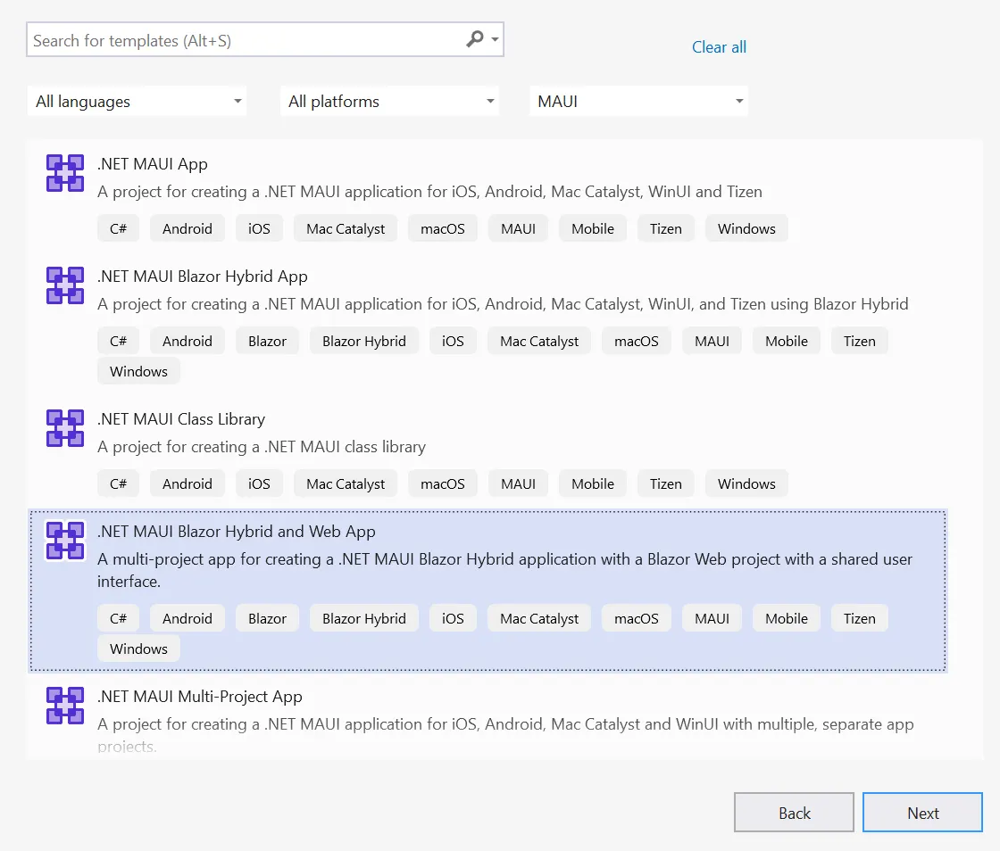
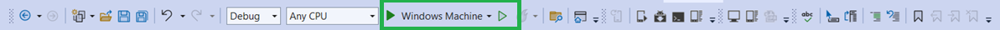
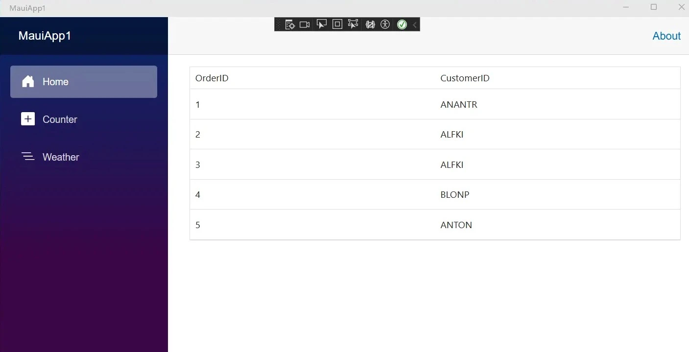

# Integrating Blazor Component with a .NET MAUI Blazor Hybrid and Web App

This section explains how to create and run a **.NET MAUI Blazor Hybrid App** together with a **Blazor Web App** using [Syncfusion Blazor DataGrid](https://www.syncfusion.com/blazor-components/blazor-datagrid) components.

## What is .NET MAUI Blazor Hybrid and Web App?

A **.NET MAUI Blazor Hybrid App** is a native application for Windows, Android, iOS, and macOS. It uses Blazor pages inside a WebView to display the UI.

A **.NET MAUI Blazor Web App** uses a Razor Class Library (RCL) to store reusable Blazor components. These shared components can be used in a Blazor WebAssembly app, a Blazor Server app, and a .NET MAUI Blazor app. This makes it easy to build one UI and use it across mobile, desktop, and web platforms. 

By sharing UI components between native and web apps, this pattern ensures consistent user experiences, maximizes code reuse, and simplifies maintenance for applications targeting multiple environments.

Visual Studio includes the **[.NET MAUI Blazor Hybrid and Web App](https://learn.microsoft.com/en-us/aspnet/core/blazor/hybrid/tutorials/maui-blazor-web-app?view=aspnetcore-9.0)** project template. You can use this template to quickly create a .NET MAUI Hybrid App together with a Blazor Web App in one solution. 

## Prerequisites

* .NET SDK 9.0 or later
* Visual Studio 2022 17.3 or later with the following workloads:
   * [Mobile development with .NET](https://learn.microsoft.com/en-us/dotnet/maui/get-started/installation?tabs=vswin)
   * ASP.NET and web development

## Create a new .NET MAUI Blazor Hybrid and Blazor Web App in Visual Studio

1. Open **Visual Studio**.
2. Click **Create a new project**.
3. Search for **.NET MAUI Blazor Hybrid and Web App**.
4. Select the template and create the project.

The template generates the shared RCL, .NET MAUI app, and Web App.



## Install Syncfusion<sup style="font-size:70%">&reg;</sup> Blazor DataGrid and Themes NuGet in the App

Follow these steps to add the Syncfusion DataGrid.

1. Open (*Tools → NuGet Package Manager → Manage NuGet Packages for Solution*).
2. Search for and install.
 * [Syncfusion.Blazor.Grid](https://www.nuget.org/packages/Syncfusion.Blazor.Grid)
 * [Syncfusion.Blazor.Themes](https://www.nuget.org/packages/Syncfusion.Blazor.Themes/)

N> Syncfusion<sup style="font-size:70%">&reg;</sup> Blazor components are available on [nuget.org](https://www.nuget.org/packages?q=syncfusion.blazor). Refer to the [NuGet packages](https://blazor.syncfusion.com/documentation/nuget-packages) topic for the list of packages and component details.

## Add Syncfusion Namespaces

Open both of the following files and add the Syncfusion namespaces.

* `~/.Maui/_Imports.razor`
* `~/Components/_Imports.razor` (Blazor Web App)

```cshtml

@using Syncfusion.Blazor
@using Syncfusion.Blazor.Grids

```
## Register Syncfusion Blazor Service

Register the Syncfusion<sup style="font-size:70%">&reg;</sup> Blazor service in both the `MauiProgram.cs` file of the MAUI Blazor App and the `~/Program.cs` file of the Blazor Web App.




    using Syncfusion.Blazor;
    ....
    builder.Services.AddMauiBlazorWebView();
    builder.Services.AddSyncfusionBlazor();
    ....




    using Syncfusion.Blazor;
    
    var builder = WebApplication.CreateBuilder(args);

    // Add services to the container.
    builder.Services.AddRazorComponents()
        .AddInteractiveServerComponents();
    builder.Services.AddSyncfusionBlazor();
    ....




## Add stylesheet and script resources

The theme stylesheet and script can be accessed from NuGet through [Static Web Assets](https://blazor.syncfusion.com/documentation/appearance/themes#static-web-assets). Reference the stylesheet and script in the `<head>` of the **~wwwroot/index.html** file of your MAUI Blazor App and in the **~/Components/App.razor file** of your Blazor Web App.

```html
<head>
    ....
    <link href="_content/Syncfusion.Blazor.Themes/fluent2.css" rel="stylesheet" />
</head>

<body>
    ....
    <script src="_content/Syncfusion.Blazor.Core/scripts/syncfusion-blazor.min.js" type="text/javascript"></script>
</body>

```

N> Check out the [Blazor Themes](https://blazor.syncfusion.com/documentation/appearance/themes) topic to discover various methods ([Static Web Assets](https://blazor.syncfusion.com/documentation/appearance/themes#static-web-assets), [CDN](https://blazor.syncfusion.com/documentation/appearance/themes#cdn-reference), and [CRG](https://blazor.syncfusion.com/documentation/common/custom-resource-generator)) for referencing themes in your Blazor application. Also, check out the [Adding Script Reference](https://blazor.syncfusion.com/documentation/common/adding-script-references) topic to learn different approaches for adding script references in your Blazor application.

## Add Syncfusion<sup style="font-size:70%">&reg;</sup> Blazor component

Add a Syncfusion<sup style="font-size:70%">&reg;</sup> Blazor component in any Razor file. In this example, the DataGrid component is added in `~/Pages/Home.razor` under the `~/Pages` folder of the `.Shared` App.




@page "/"
@using Syncfusion.Blazor.Grids

<SfGrid DataSource="@Orders" />

@code{
    public List<Order> Orders { get; set; }

    protected override void OnInitialized()
    {
        Orders = Enumerable.Range(1, 5).Select(x => new Order()
        {
            OrderID = 0 + x,
            CustomerID = (new string[] { "ALFKI", "ANANTR", "ANTON", "BLONP", "BOLID" })[new Random().Next(5)],
        }).ToList();
    }

    public class Order
    {
        public int? OrderID { get; set; }
        public string CustomerID { get; set; }

    }
}




In the Visual Studio toolbar, select the **Windows Machine** target to build and run the `.Maui` app. To build and run the `.Web` app, select the **IIS Express** target.



N> To run the application on Android or iOS, refer to [MAUI Getting Started](https://learn.microsoft.com/en-us/aspnet/core/blazor/hybrid/tutorials/maui?view=aspnetcore-9.0#run-the-app-in-the-android-emulator) for emulator or device setup.




## See also

### MAUI Blazor App

* [How to create Diagram Builder in MAUI platform?](https://support.syncfusion.com/kb/article/11346/how-to-create-diagram-builder-in-maui-platform)

N> [View MAUI Blazor Diagram Builder Source Code in GitHub](https://github.com/syncfusion/blazor-showcase-diagram-builder/tree/master/MAUI)
