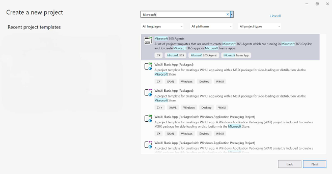
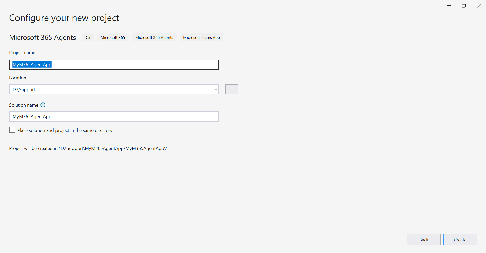
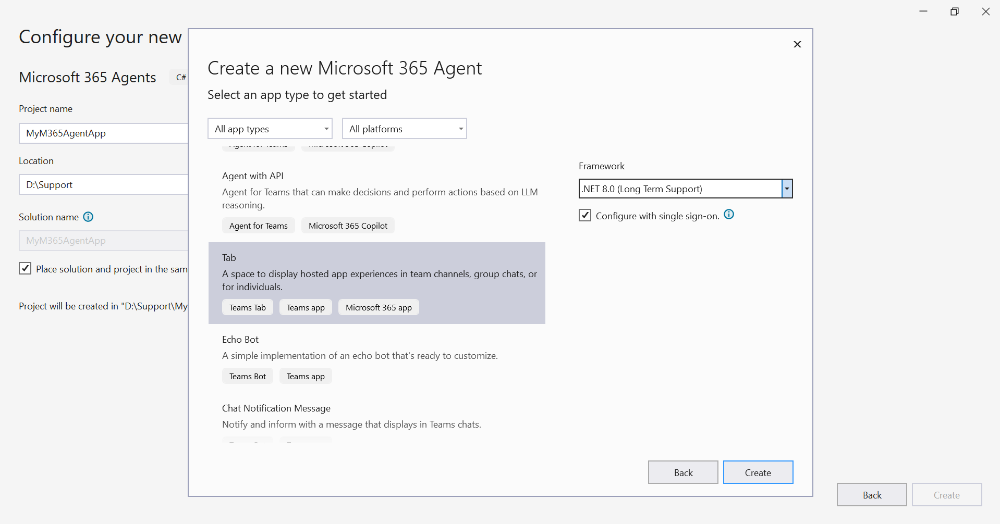
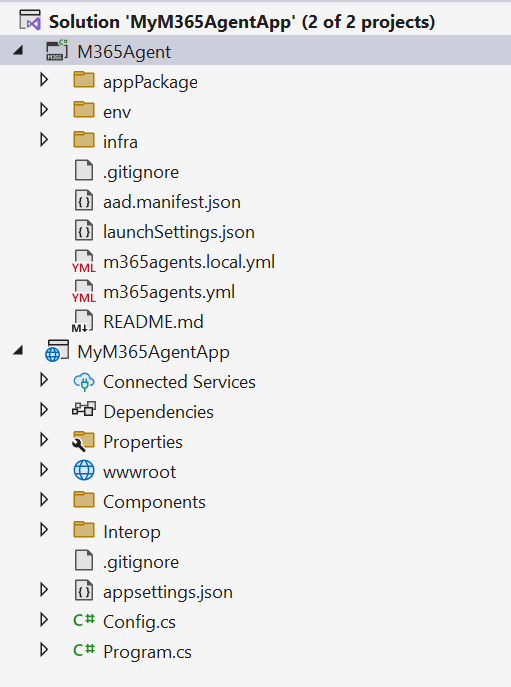
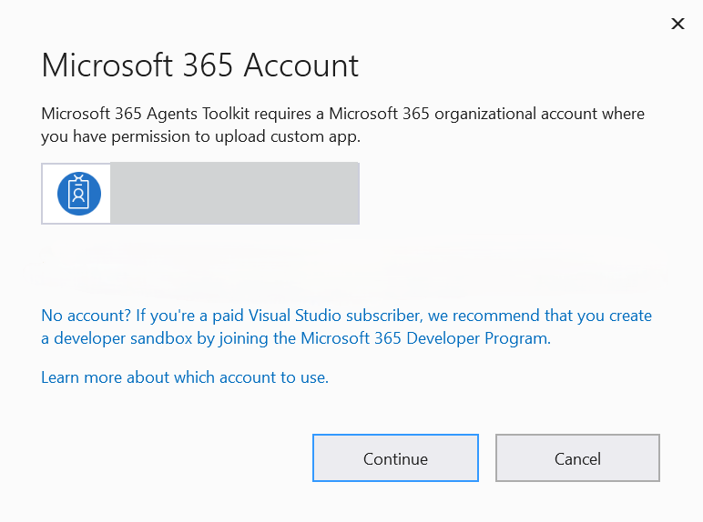
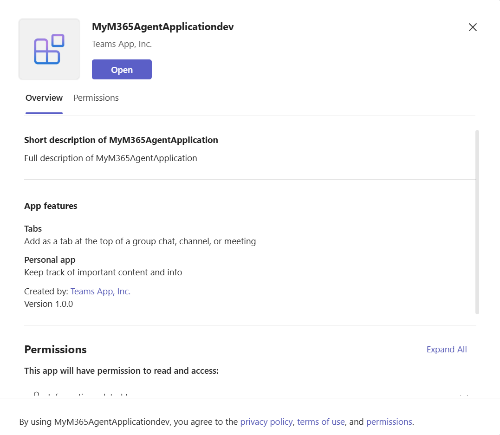
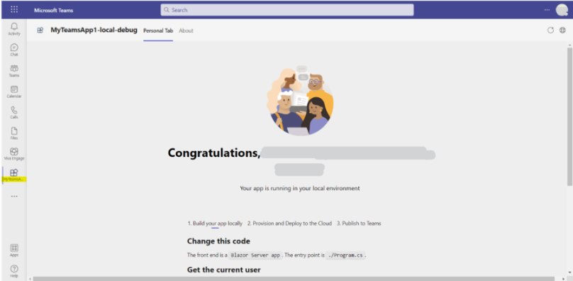
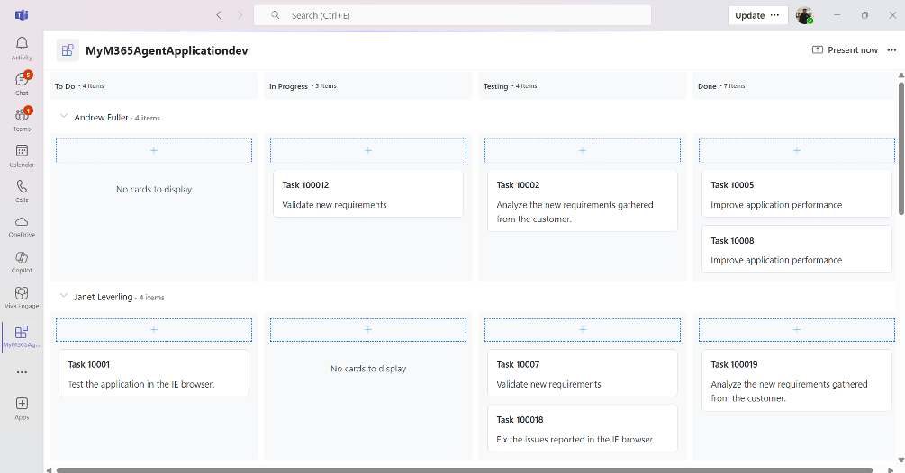

# Getting Started with Microsoft Teams Application

This section explains how to create and run a Microsoft Teams application (Tab App) with Syncfusion<sup style="font-size:70%">&reg;</sup> Blazor components.

## Prerequisites

* Visual Studio 2022 (version 17.13 or later) with the required workloads. In Visual Studio Installer, select Workloads → ASP.NET and web development, then enable Microsoft 365 Agents development tools under Installation details.


    

* Microsoft Teams application

* Microsoft Edge or Google Chrome with developer tools

* In the Teams client, go to Apps icon → Manage your apps → Upload an app, and confirm that "Upload a custom app" is available. Contact a Teams administrator if the option is not available.

    

## Create a new Microsoft Team Application with Tab using Visual Studio

1. Launch Visual Studio 2022, and in the start window click **Create a new project**.
2. Search for Microsoft 365 Agents app in Visual Studio template. Select **Microsoft 365 Agents** and click on Next.

    
3. Configure the project with required project name, select the location to save the application and click on Create.

    
4. Select the type of Microsoft 365 Agent application to create. In this example, **Microsoft application with Tab** is selected.

5. Wait for the project to be created, and its dependencies to be restored, then the project structure looks like below.

    

## Build and run the first Microsoft Teams Application

1. To configure the project with the Microsoft teams application, right Click on the M365 Agent Project and Select Microsoft M365 Account.

    
2. After configuration completes, a Microsoft 365 Account window appears. If an account exists, select the Office 365 account and click Continue. If you don't have an account, create a new account, add it, and then click Continue.

    
3. After successful sign-in, select Debug → Start Debugging or press F5 to run the application.
4. After a successful build, the output window prompts to create the My365Agent application. Click Add to add the created application.

5. Click Open to create the new Microsoft application with a personal tab.


## Install Syncfusion<sup style="font-size:70%">&reg;</sup> Blazor Kanban and Themes NuGet in the App

Here's an example of how to add **Blazor Kanban** component in the app, open the NuGet package manager in Visual Studio (*Tools → NuGet Package Manager → Manage NuGet Packages for Solution*), search and install [Syncfusion.Blazor.Kanban](https://www.nuget.org/packages/Syncfusion.Blazor.Kanban) and [Syncfusion.Blazor.Themes](https://www.nuget.org/packages/Syncfusion.Blazor.Themes/). Alternatively, you can utilize the following package manager command to achieve the same.




Install-Package Syncfusion.Blazor.Kanban -Version {{ site.releaseversion }}
Install-Package Syncfusion.Blazor.Themes -Version {{ site.releaseversion }}




N> Syncfusion<sup style="font-size:70%">&reg;</sup> Blazor components are available on [nuget.org](https://www.nuget.org/packages?q=syncfusion.blazor). Refer to the [NuGet packages](https://blazor.syncfusion.com/documentation/nuget-packages) topic for the available package list with component details.

## Register Syncfusion<sup style="font-size:70%">&reg;</sup> Blazor Service

Open **~/_Imports.razor** file and import the `Syncfusion.Blazor.Buttons` and `Syncfusion.Blazor.Kanban` namespace.

```cshtml

@using Syncfusion.Blazor.Kanban
@using Syncfusion.Blazor.Buttons

```

Now, register the Syncfusion<sup style="font-size:70%">&reg;</sup> Blazor Service in the created Microsoft Teams tab app. Open the `~/Program.cs` file and register the Syncfusion<sup style="font-size:70%">&reg;</sup> Blazor service as follows




....
using Syncfusion.Blazor;

var builder = WebApplication.CreateBuilder(args);

builder.Services.AddRazorPages();
builder.Services.AddRazorComponents()
    .AddInteractiveServerComponents();

var config = builder.Configuration.Get<ConfigOptions>();
builder.Services.AddTeamsFx(config.TeamsFx.Authentication);
builder.Services.AddScoped<MicrosoftTeams>();

builder.Services.AddControllers();
builder.Services.AddHttpClient("WebClient", client => client.Timeout = TimeSpan.FromSeconds(600));
builder.Services.AddHttpContextAccessor();
builder.Services.AddAntiforgery(o => o.SuppressXFrameOptionsHeader = true);

builder.Services.AddSingleton<LibraryConfiguration>();
builder.Services.AddSyncfusionBlazor();

var app = builder.Build();
....




## Add stylesheet and script resources

The theme stylesheet and script can be accessed from NuGet through [Static Web Assets](https://blazor.syncfusion.com/documentation/appearance/themes#static-web-assets). Reference the stylesheet and script in the `<head>` of the main page as follows:

* For **.NET 8 and .NET 9** Microsoft Teams tab app, include it in the **~/Components/Pages/App.razor** file.

```html
<head>
    ....
    <link href="_content/Syncfusion.Blazor.Themes/bootstrap5.css" rel="stylesheet" />
    <script src="_content/Syncfusion.Blazor.Core/scripts/syncfusion-blazor.min.js" type="text/javascript"></script>
</head>
```
N> Check out the [Blazor Themes](https://blazor.syncfusion.com/documentation/appearance/themes) topic to discover various methods ([Static Web Assets](https://blazor.syncfusion.com/documentation/appearance/themes#static-web-assets), [CDN](https://blazor.syncfusion.com/documentation/appearance/themes#cdn-reference), and [CRG](https://blazor.syncfusion.com/documentation/common/custom-resource-generator)) for referencing themes in your Blazor application. Also, check out the [Adding Script Reference](https://blazor.syncfusion.com/documentation/common/adding-script-references) topic to learn different approaches for adding script references in your Blazor application.

## Add Syncfusion<sup style="font-size:70%">&reg;</sup> Blazor component

Now, add the Syncfusion<sup style="font-size:70%">&reg;</sup> Blazor Kanban component in the `Tab.razor` page under the `~/Components/Pages/Tab.razor` folder.




@using System.Collections.ObjectModel;
@using System.ComponentModel;

<div class="col-lg-12 control-section">
    <div class="content-wrapper" id="toast-kanban-observable">
        <div class="row">
            <SfKanban KeyField="Status" DataSource="@ObservableData">
                <KanbanColumns>
                    @foreach (ColumnModel item in columnData)
                    {
                        <KanbanColumn HeaderText="@item.HeaderText" KeyField="@item.KeyField" AllowAdding="true" />
                    }
                </KanbanColumns>
                <KanbanCardSettings HeaderField="Id" ContentField="Summary" />
                <KanbanSwimlaneSettings KeyField="Assignee"></KanbanSwimlaneSettings>
            </SfKanban>
        </div>
    </div>
</div>

@code {
    public ObservableCollection<ObservableDatas> ObservableData { get; set; }
    List<ObservableDatas> Tasks = new List<ObservableDatas>();

    private List<ColumnModel> columnData = new List<ColumnModel>() {
        new ColumnModel(){ HeaderText= "To Do", KeyField= new List<string>() { "Open" } },
        new ColumnModel(){ HeaderText= "In Progress", KeyField= new List<string>() { "In Progress" } },
        new ColumnModel(){ HeaderText= "Testing", KeyField= new List<string>() { "Testing" } },
        new ColumnModel(){ HeaderText= "Done", KeyField=new List<string>() { "Close" } }
    };

    protected override void OnInitialized()
    {
        Tasks = Enumerable.Range(1, 20).Select(x => new ObservableDatas()
            {
                Id = "Task 1000" + x,
                Status = (new string[] { "Open", "In Progress", "Testing", "Close" })[new Random().Next(4)],
                Summary = (new string[] { "Analyze the new requirements gathered from the customer.", "Improve application performance", "Fix the issues reported in the IE browser.", "Validate new requirements", "Test the application in the IE browser." })[new Random().Next(5)],
                Assignee = (new string[] { "Nancy Davloio", "Andrew Fuller", "Janet Leverling", "Steven walker", "Margaret hamilt", "Michael Suyama", "Robert King" })[new Random().Next(7)],
            }).ToList();
        ObservableData = new ObservableCollection<ObservableDatas>(Tasks);
    }

    public class ObservableDatas : INotifyPropertyChanged
    {
        public string Id { get; set; }
        private string status { get; set; }
        public string Status
        {
            get { return status; }
            set
            {
                this.status = value;
                NotifyPropertyChanged("Status");
            }
        }
        public string Summary { get; set; }
        public string Assignee { get; set; }
        public event PropertyChangedEventHandler PropertyChanged;
        private void NotifyPropertyChanged(string propertyName)
        {
            var handler = PropertyChanged;
            if (handler != null)
            {
                handler(this, new PropertyChangedEventArgs(propertyName));
            }
        }
    }
}






N> [View the complete Microsoft Teams application with Syncfusion<sup style="font-size:70%">&reg;</sup> Blazor controls on GitHub](https://github.com/SyncfusionExamples/Building-Apps-for-Microsoft-Teams-with-Blazor-using-Syncfusion-Components)
