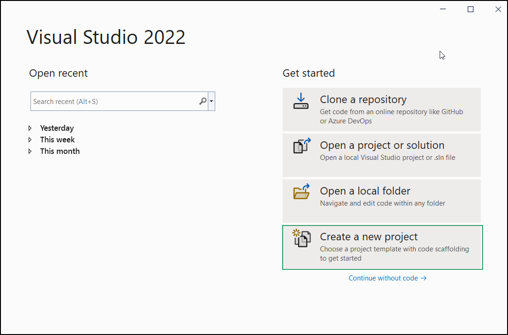
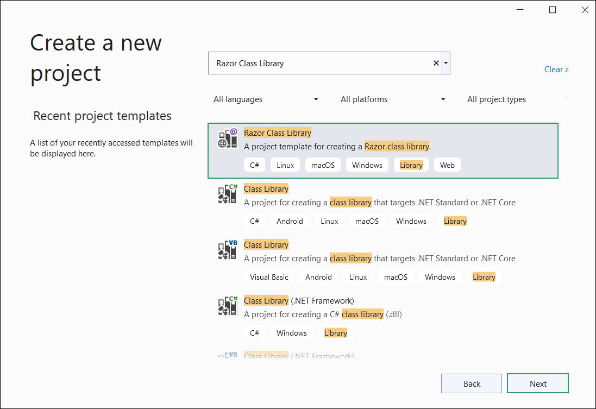
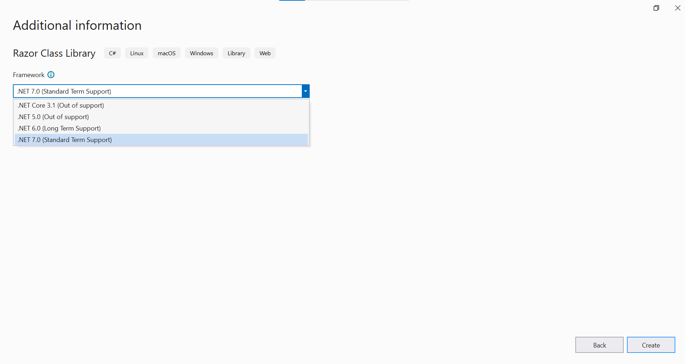
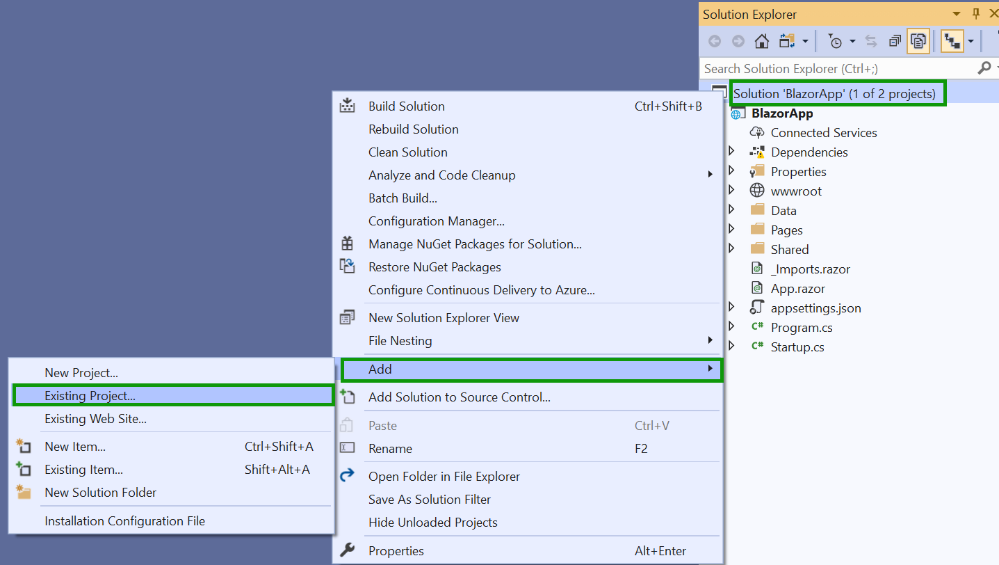
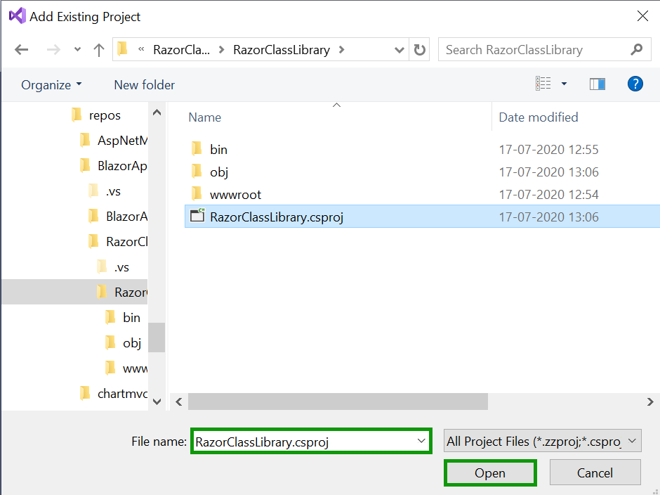
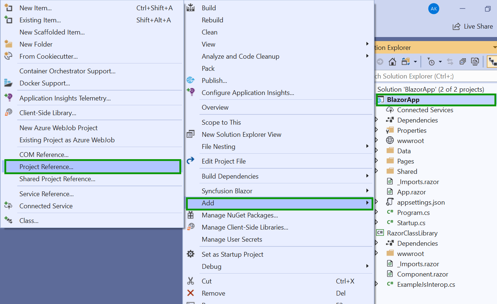
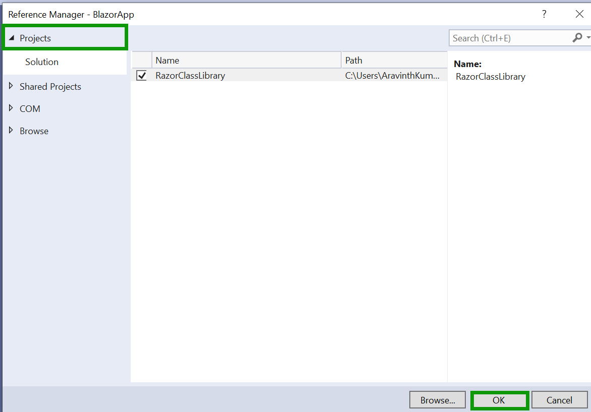
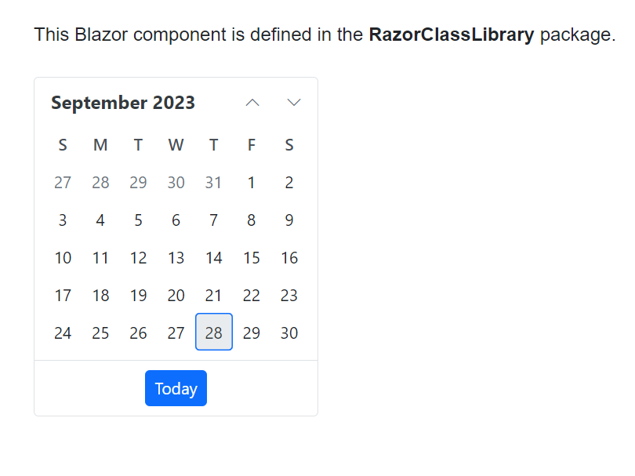

# Creating Razor Class Library (RCL) using Syncfusion® Blazor components

This guide explains how to create a Razor Class Library (RCL) that includes Syncfusion<sup style="font-size:70%">&reg;</sup> Blazor components using [Visual Studio](https://visualstudio.microsoft.com/vs/) and Visual Studio Code.





## Prerequisites

- [System requirements for Blazor components](https://blazor.syncfusion.com/documentation/system-requirements)

## Create a Razor Class Library in Visual Studio 2022

1. Choose **Create a new project** from the Visual Studio dashboard.

    

2. Select **Razor Class Library** from the template, and then click the **Next** button.

    

3. Now, the project configuration window will popup. Click **Create** button to create a new project with the default project configuration.

    

4. Select the target Framework **.NET 8** at the top of the Application based on your required target that you want and then click the **Create** button to create a new Razor Class Library application.

    

## Install Syncfusion<sup style="font-size:70%">&reg;</sup> Blazor Calendars and Themes NuGet in the App

To add the **Blazor Calendar** component to the library, open NuGet Package Manager in Visual Studio (*Tools → NuGet Package Manager → Manage NuGet Packages for Solution*), then install [Syncfusion.Blazor.Calendars](https://www.nuget.org/packages/Syncfusion.Blazor.Calendars) and [Syncfusion.Blazor.Themes](https://www.nuget.org/packages/Syncfusion.Blazor.Themes/). Alternatively, use the following Package Manager commands.




Install-Package Syncfusion.Blazor.Calendars -Version {{ site.releaseversion }}

Install-Package Syncfusion.Blazor.Themes -Version {{ site.releaseversion }}




N> Syncfusion<sup style="font-size:70%">&reg;</sup> Blazor components are available on [nuget.org](https://www.nuget.org/packages?q=syncfusion.blazor). Refer to the [NuGet packages](https://blazor.syncfusion.com/documentation/nuget-packages) topic for the available package list with component details.

## Importing Syncfusion<sup style="font-size:70%">&reg;</sup> Blazor component in Razor Class Library

Import and add the Syncfusion<sup style="font-size:70%">&reg;</sup> Blazor components in the `~/Component1.razor` file. For example, the Calendar component is imported and added in the **~/Component1.razor** page.

```html

@using Syncfusion.Blazor.Calendars

<div class="my-component">
This Blazor component is defined in the <strong>RazorClassLibrary</strong> package.
</div><br />

<SfCalendar TValue="DateTime"></SfCalendar>

```

## Create a Blazor project in Visual Studio

* Refer to the [Blazor Tooling documentation](https://learn.microsoft.com/en-us/aspnet/core/blazor/tooling?view=aspnetcore-8.0&pivots=windows) to create a new **Blazor Web App** using Visual Studio.





## Prerequisites

- [System requirements for Blazor components](https://blazor.syncfusion.com/documentation/system-requirements)

## Create a Razor class library in Visual Studio Code

You can create a Razor class library using Visual Studio code via [Microsoft Templates](https://learn.microsoft.com/en-us/aspnet/core/razor-pages/ui-class?view=aspnetcore-9.0&tabs=net-cli).





dotnet new razorclasslib -o RazorUIClassLib
cd RazorUIClassLib





## Install Syncfusion<sup style="font-size:70%">&reg;</sup> Blazor Calendars and Themes NuGet in the App

If using the `WebAssembly` or `Auto` render modes in a Blazor Web App, install Syncfusion<sup style="font-size:70%">&reg;</sup> Blazor component NuGet packages in the client project.

* Press <kbd>Ctrl</kbd>+<kbd>`</kbd> to open the integrated terminal in Visual Studio Code.
* Ensure you’re in the project root directory where your `.csproj` file is located.
* Run the following commands to install the [Syncfusion.Blazor.Calendars](https://www.nuget.org/packages/Syncfusion.Blazor.Calendars) and [Syncfusion.Blazor.Themes](https://www.nuget.org/packages/Syncfusion.Blazor.Themes/) NuGet packages and ensure all dependencies are installed.





dotnet add package Syncfusion.Blazor.Calendars -v {{ site.releaseversion }}
dotnet add package Syncfusion.Blazor.Themes -v {{ site.releaseversion }}
dotnet restore





N> Syncfusion<sup style="font-size:70%">&reg;</sup> Blazor components are available on [nuget.org](https://www.nuget.org/packages?q=syncfusion.blazor). Refer to the [NuGet packages](https://blazor.syncfusion.com/documentation/nuget-packages) topic for the available package list with component details.

## Importing Syncfusion<sup style="font-size:70%">&reg;</sup> Blazor component in Razor Class Library

Now, import and add the Syncfusion<sup style="font-size:70%">&reg;</sup> Blazor components in the `~/Component1.razor` file. For example, the Calendar component is imported and added in the **~/Component1.razor** page.

```html

@using Syncfusion.Blazor.Calendars

<div class="my-component">
This Blazor component is defined in the <strong>RazorClassLibrary</strong> package.
</div><br />

<SfCalendar TValue="DateTime"></SfCalendar>

```

## Create a Blazor project in Visual Studio Code

You can create a **Blazor Web App** or **Blazor Server App** or **Blazor WebAssembly App** using Visual Studio Code via [Syncfusion<sup style="font-size:70%">&reg;</sup> Blazor Extension](https://blazor.syncfusion.com/documentation/visual-studio-code-integration/create-project).





## Configure the Razor Class Library and Blazor Application

1. Now, Right-click the solution, and then select Add/Existing Project.

    

2. Add the **Razor Class Library** project by selecting the `RazorClassLibrary.csproj` file.

    

    N> The Razor Class Library project is added to the existing Blazor Application.

3. Right-click the Blazor App project, and then select Add/Project reference. Now, click the checkbox and configure the **Razor Class Library**.

    

    

## Importing Razor Class Library in the Blazor Application

1. Open **~/_Imports.razor** file in Blazor App and import the `RazorClassLibrary`.

    ```cshtml
    @using RazorClassLibrary
    ```

2. Now, register the Syncfusion<sup style="font-size:70%">&reg;</sup> Blazor Service in the **~/Program.cs** file of your Blazor App.

   * If you select an **Interactive render mode** as `WebAssembly` or `Auto`, you need to register the Syncfusion<sup style="font-size:70%">&reg;</sup> Blazor service in both **~/Program.cs** files of your Blazor Web App.

    ```cshtml

    ....
    using Syncfusion.Blazor;
    ....
    builder.Services.AddSyncfusionBlazor();
    ....

    ```


3. Include Stylesheet and Script References Based on Project Type:

    * For Blazor WebAssembly standalone app, include the stylesheet reference in the `<head>` section and the script reference at the end of the `<body>` in the **~/wwwroot/index.html** file.

    * For **.NET 8, .NET 9 and .NET 10** Blazor Web Apps using any render mode (Server, WebAssembly, or Auto), include the stylesheet reference in the `<head>` section and the script reference at the end of the `<body>` in the **~/Components/Pages/App.razor** file.

    ```html
    <head>
        ....
        <link href="_content/Syncfusion.Blazor.Themes/bootstrap5.css" rel="stylesheet" />
    </head>
    ....
    <body>
        ....
        <script src="_content/Syncfusion.Blazor.Core/scripts/syncfusion-blazor.min.js" type="text/javascript"></script>
    </body>
    ```

    N> Check out the [Blazor Themes](https://blazor.syncfusion.com/documentation/appearance/themes) topic to discover various methods ([Static Web Assets](https://blazor.syncfusion.com/documentation/appearance/themes#static-web-assets), [CDN](https://blazor.syncfusion.com/documentation/appearance/themes#cdn-reference), and [CRG](https://blazor.syncfusion.com/documentation/common/custom-resource-generator)) for referencing themes in your Blazor application. Also, check out the [Adding Script Reference](https://blazor.syncfusion.com/documentation/common/adding-script-references) topic to learn different approaches for adding script references in your Blazor application.

4. Now, add the created custom component in the **~/Components/Pages/.razor** file.

    ```cshtml
    <Component1></Component1>

    ```

5. Run the application, The Syncfusion<sup style="font-size:70%">&reg;</sup> Blazor Calendar component will be rendered in the default web browser.

    