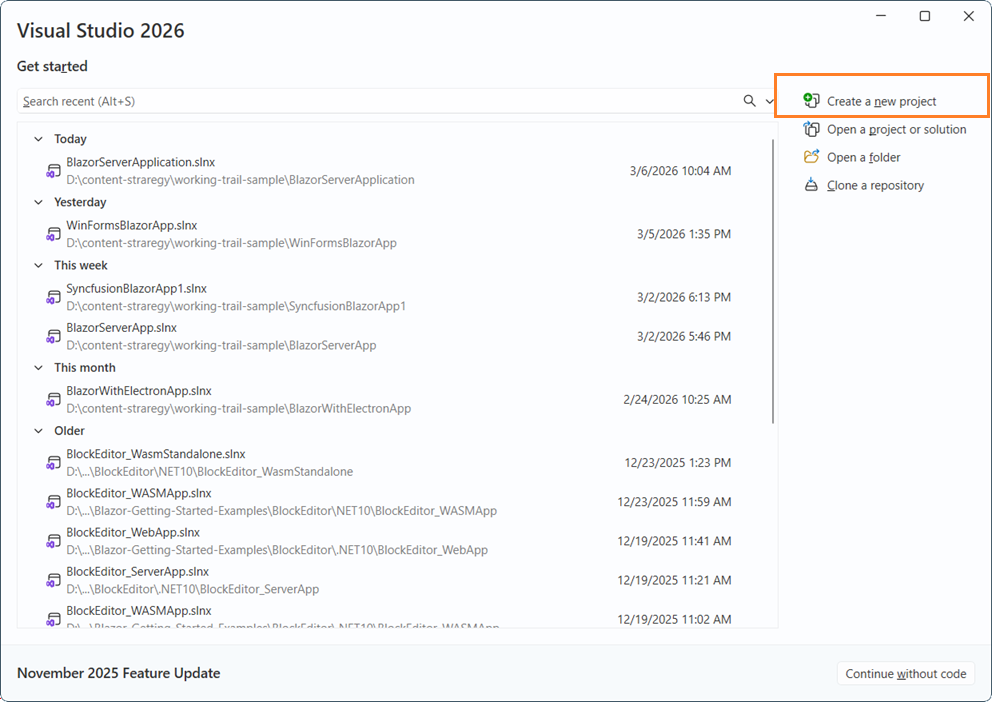
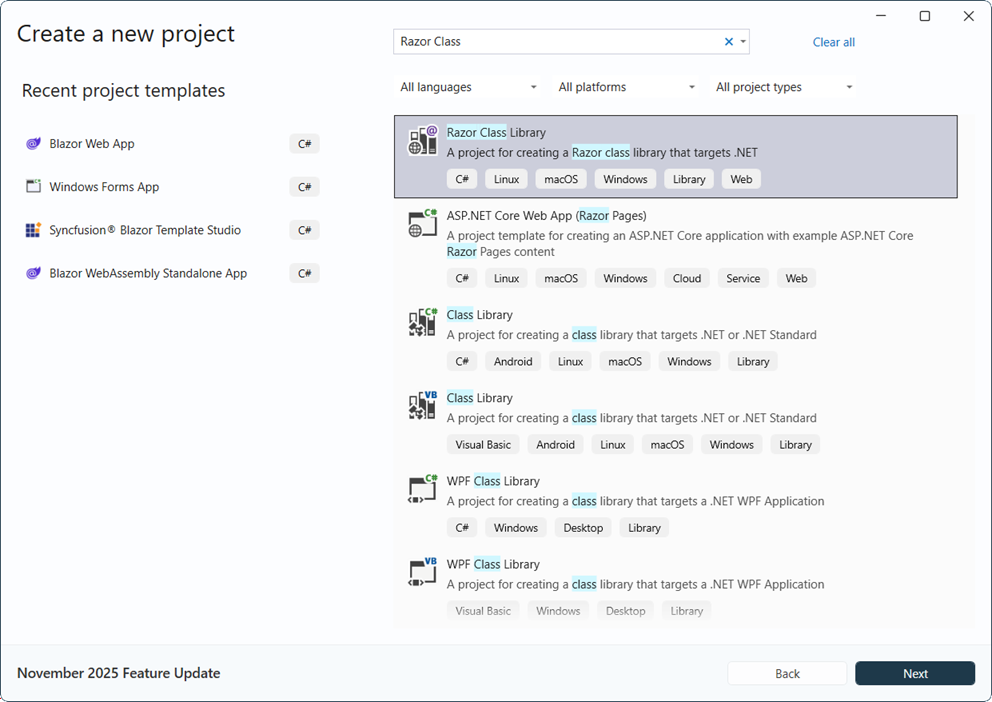
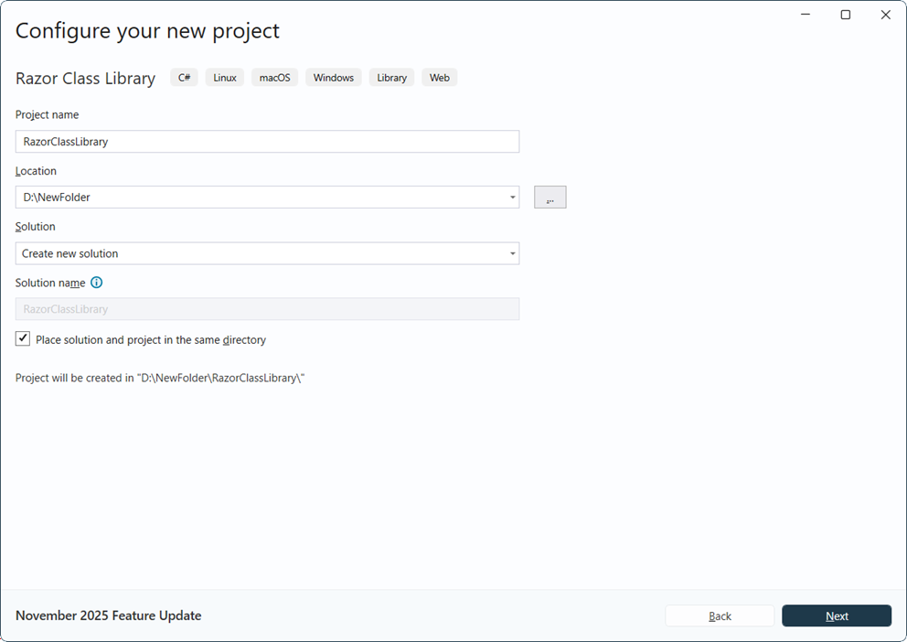
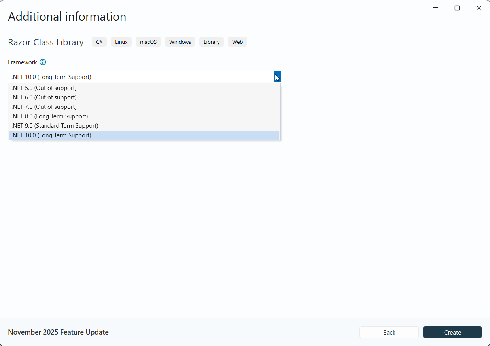
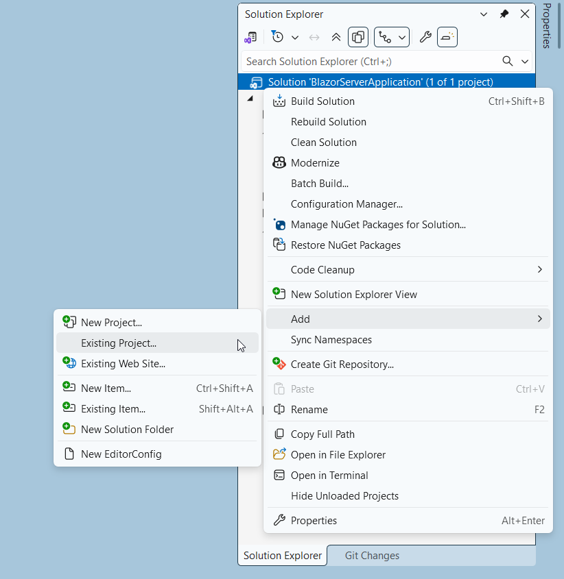
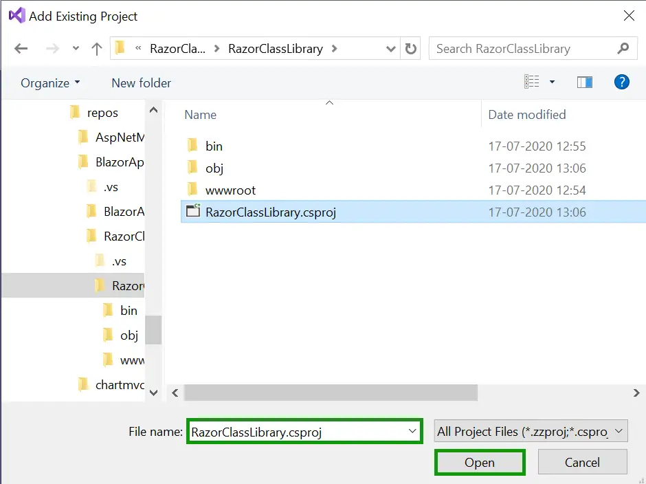
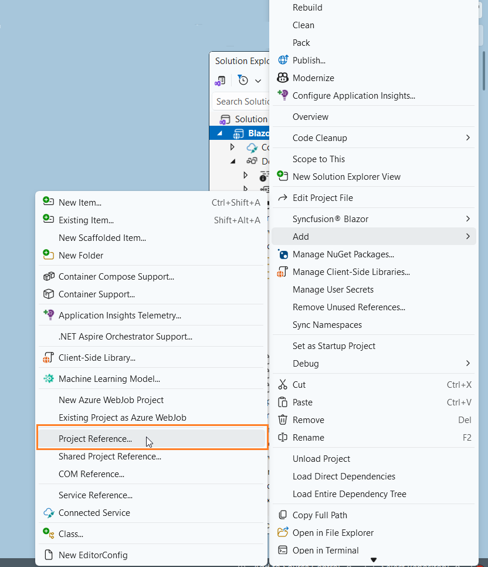
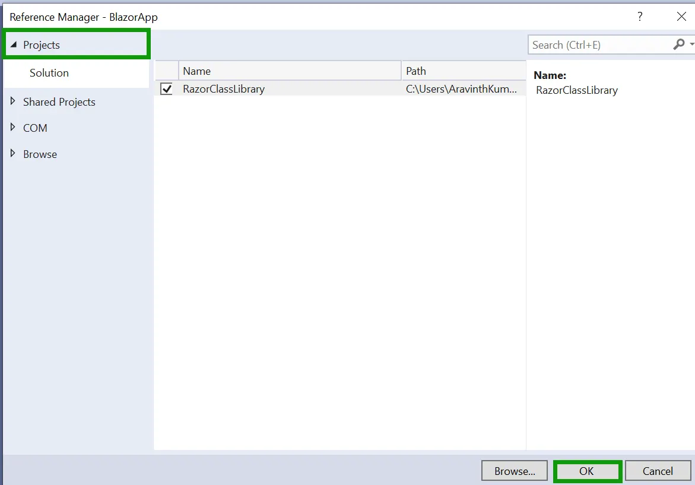
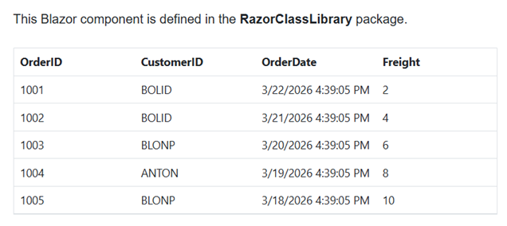

# Creating Razor Class Library (RCL) using Syncfusion® Blazor components

This guide explains how to create a Razor Class Library (RCL) that includes Syncfusion<sup style="font-size:70%">&reg;</sup> Blazor components using [Visual Studio](https://visualstudio.microsoft.com/vs/) and [Visual Studio Code](https://code.visualstudio.com/).





## Prerequisites

- [System requirements for Blazor components](https://blazor.syncfusion.com/documentation/system-requirements)

## Create a Razor Class Library in Visual Studio

1. Choose **Create a new project** from the Visual Studio dashboard.

    

2. Select **Razor Class Library** from the template, and then click the **Next** button.

    

3. Now, the project configuration window will popup. Click **Create** button to create a new project with the default project configuration.

    

4. Select the target Framework **.NET 8** or **.NET 9** or **.NET 10** at the top of the Application based on your required target that you want and then click the **Create** button to create a new Razor Class Library application.

    

## Install Syncfusion<sup style="font-size:70%">&reg;</sup> Blazor Grid and Themes NuGet in the App

To add the **Blazor DataGrid** component to the library, open NuGet Package Manager in Visual Studio (*Tools → NuGet Package Manager → Manage NuGet Packages for Solution*), then install [Syncfusion.Blazor.Grid](https://www.nuget.org/packages/Syncfusion.Blazor.Grid) and [Syncfusion.Blazor.Themes](https://www.nuget.org/packages/Syncfusion.Blazor.Themes/). Alternatively, use the following Package Manager commands.




Install-Package Syncfusion.Blazor.Grid -Version {{ site.releaseversion }}
Install-Package Syncfusion.Blazor.Themes -Version {{ site.releaseversion }}




N> Syncfusion Blazor components are available in [nuget.org](https://www.nuget.org/packages?q=syncfusion.blazor). Refer to the [NuGet packages](https://blazor.syncfusion.com/documentation/nuget-packages) topic for the available NuGet package list with component details.

## Importing Syncfusion Blazor component in Razor Class Library

Import and add the Syncfusion Blazor components in the `~/Component1.razor` file. For example, the Blazor DataGrid component is imported and added in the **~/Component1.razor** page.




@using Syncfusion.Blazor.Grid

<div class="my-component">
This Blazor component is defined in the <strong>RazorClassLibrary</strong> package.
</div><br />

<SfGrid DataSource="@Orders" />

@code {
    public List<Order> Orders { get; set; }

    protected override void OnInitialized()
    {
        Orders = Enumerable.Range(1, 5).Select(x => new Order()
        {
            OrderID = 1000 + x,
            CustomerID = (new string[] { "ALFKI", "ANANTR", "ANTON", "BLONP", "BOLID" })[new Random().Next(5)],
            Freight = 2 * x,
            OrderDate = DateTime.Now.AddDays(-x),
        }).ToList();
    }

    public class Order
    {
        public int? OrderID { get; set; }
        public string CustomerID { get; set; }
        public DateTime? OrderDate { get; set; }
        public double? Freight { get; set; }
    }
}




## Create a Blazor project in Visual Studio

* Create a **Blazor Web App** or **Blazor Server App** or **Blazor WebAssembly App** using Visual Studio via [Microsoft Templates](https://learn.microsoft.com/en-us/aspnet/core/blazor/tooling?view=aspnetcore-10.0&pivots=vs) or [Syncfusion Blazor Extension](https://blazor.syncfusion.com/documentation/visual-studio-integration/template-studio).





## Prerequisites

- [System requirements for Blazor components](https://blazor.syncfusion.com/documentation/system-requirements)

## Create a Razor Class Library in Visual Studio Code

Create a Razor Class Library using Visual Studio Code via [Microsoft Templates](https://learn.microsoft.com/en-us/aspnet/core/razor-pages/ui-class?view=aspnetcore-9.0&tabs=net-cli).





dotnet new razorclasslib -o RazorUIClassLib
cd RazorUIClassLib





## Install Syncfusion Blazor Grid and Themes NuGet in the App

If using the `WebAssembly` or `Auto` render modes in a Blazor Web App, install Syncfusion Blazor component NuGet packages in the client project.

* Press <kbd>Ctrl</kbd>+<kbd>`</kbd> to open the integrated terminal in Visual Studio Code.
* Ensure you’re in the project root directory where your `.csproj` file is located.
* Run the following commands to install the [Syncfusion.Blazor.Grid](https://www.nuget.org/packages/Syncfusion.Blazor.Grid) and [Syncfusion.Blazor.Themes](https://www.nuget.org/packages/Syncfusion.Blazor.Themes) NuGet packages and ensure all dependencies are installed.





dotnet add package Syncfusion.Blazor.Grid -v {{ site.releaseversion }}
dotnet add package Syncfusion.Blazor.Themes -v {{ site.releaseversion }}
dotnet restore





N> Syncfusion<sup style="font-size:70%">&reg;</sup> Blazor components are available on [nuget.org](https://www.nuget.org/packages?q=syncfusion.blazor). Refer to the [NuGet packages](https://blazor.syncfusion.com/documentation/nuget-packages) topic for the available NuGet package list with component details.

## Importing Syncfusion Blazor component in Razor Class Library

Import and add the Syncfusion Blazor components in the `~/Component1.razor` file. For example, the Blazor DataGrid component is imported and added in the **~/Component1.razor** page.




@using Syncfusion.Blazor.Grid

<div class="my-component">
This Blazor component is defined in the <strong>RazorClassLibrary</strong> package.
</div><br />

<SfGrid DataSource="@Orders" />

@code {
    public List<Order> Orders { get; set; }

    protected override void OnInitialized()
    {
        Orders = Enumerable.Range(1, 5).Select(x => new Order()
        {
            OrderID = 1000 + x,
            CustomerID = (new string[] { "ALFKI", "ANANTR", "ANTON", "BLONP", "BOLID" })[new Random().Next(5)],
            Freight = 2 * x,
            OrderDate = DateTime.Now.AddDays(-x),
        }).ToList();
    }

    public class Order
    {
        public int? OrderID { get; set; }
        public string CustomerID { get; set; }
        public DateTime? OrderDate { get; set; }
        public double? Freight { get; set; }
    }
}




## Create a Blazor project in Visual Studio Code

Create a **Blazor Web App** or **Blazor Server App** or **Blazor WebAssembly App** using Visual Studio Code via [Microsoft Templates](https://learn.microsoft.com/en-us/aspnet/core/blazor/tooling?view=aspnetcore-10.0&pivots=vsc) or [Syncfusion Blazor Extension](https://blazor.syncfusion.com/documentation/visual-studio-code-integration/create-project).





## Configure the Razor Class Library and Blazor Application

1. Right-click the solution in the Blazor application, and then select Add/Existing Project.

    

2. Add the **Razor Class Library** project by selecting the `RazorClassLibrary.csproj` file.

    

    N> The Razor Class Library project is added to the existing Blazor Application.

3. Right-click the Blazor App project, choose Add, and then select **Project reference...**. Now, click the checkbox and configure the **Razor Class Library** application.

    

    

## Importing Razor Class Library in the Blazor Application

1. Open **~/_Imports.razor** file in Blazor App and import the `RazorClassLibrary`.

    ```cshtml
    @using RazorClassLibrary
    ```

2. Register the Syncfusion Blazor Service in the **~/Program.cs** file of the Blazor App.

   * If you select an **Interactive render mode** as `WebAssembly` or `Auto`, need to register the Syncfusion Blazor service in both **~/Program.cs** files of the Blazor Web App.

    ```cshtml

    ....
    using Syncfusion.Blazor;
    ....
    builder.Services.AddSyncfusionBlazor();
    ....

    ```


3. Include Stylesheet and Script References based on the project type:

    * For Blazor WebAssembly Standalone App, include the stylesheet in the `<head>` section and the script at the end of the `<body>` in the **~/wwwroot/index.html** file.

    * For Blazor Web App, include the stylesheet in the `<head>` and the script at the end of the `<body>` in the **~/Components/Pages/App.razor** file.

    ```html
    <head>
        ....
        <link href="_content/Syncfusion.Blazor.Themes/bootstrap5.css" rel="stylesheet" />
    </head>
    ....
    <body>
        ....
        <script src="_content/Syncfusion.Blazor.Core/scripts/syncfusion-blazor.min.js" type="text/javascript"></script>
    </body>
    ```

    N> Check out the [Blazor Themes](https://blazor.syncfusion.com/documentation/appearance/themes) topic to discover various methods ([Static Web Assets](https://blazor.syncfusion.com/documentation/appearance/themes#static-web-assets), [CDN](https://blazor.syncfusion.com/documentation/appearance/themes#cdn-reference), and [CRG](https://blazor.syncfusion.com/documentation/common/custom-resource-generator)) for referencing themes in the Blazor application. Also, check out the [Adding Script Reference](https://blazor.syncfusion.com/documentation/common/adding-script-references) topic to learn different approaches for adding script references in the Blazor application.

4. Now, add the created custom component in the **~/Components/Pages/.razor** file.

    ```cshtml
    <Component1></Component1>

    ```

5. Run the application, The Syncfusion<sup style="font-size:70%">&reg;</sup> Blazor Grid component will be rendered in the default web browser.

    