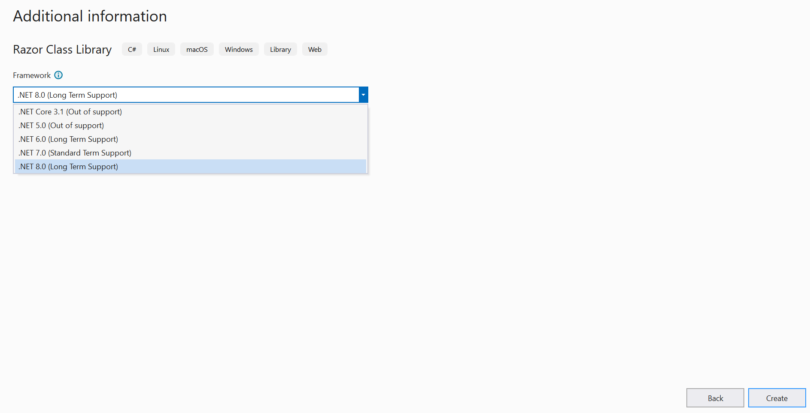
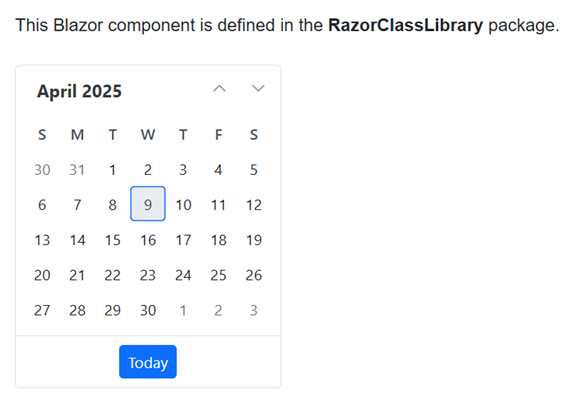

# Creating Razor Class Library (RCL) using Syncfusion Blazor components

This section provides information about creating Razor Class Library with the Syncfusion Blazor components using [Visual Studio](https://visualstudio.microsoft.com/vs/).

## Prerequisites

* [Visual Studio 2022](https://visualstudio.microsoft.com/downloads/)
* [.NET 6.0 SDK](https://dotnet.microsoft.com/en-us/download/dotnet/6.0)/[.NET 7.0 SDK](https://dotnet.microsoft.com/en-us/download/dotnet/7.0)

N>  **.NET 6 and .NET 7** requires Visual Studio 2022 or later.

## Create a Razor Class Library using Syncfusion Blazor components in Visual Studio 2022

1. Choose **Create a new project** from the Visual Studio dashboard.

    

2. Select **Razor Class Library** from the template, and then click the **Next** button.

    

3. Now, the project configuration window will popup. Click **Create** button to create a new project with the default project configuration.

    

4. Select the target Framework **.NET 6** at the top of the Application based on your required target that you want and then click the **Create** button to create a new Razor Class Library application.

    

### Importing Syncfusion Blazor component in Razor Class Library

To add Blazor Calendar component in the app, open the NuGet package manager in Visual Studio (*Tools → NuGet Package Manager → Manage NuGet Packages for Solution*), search and install [Syncfusion.Blazor.Calendars](https://www.nuget.org/packages/Syncfusion.Blazor.Calendars) and [Syncfusion.Blazor.Themes](https://www.nuget.org/packages/Syncfusion.Blazor.Themes/). Alternatively, you can utilize the following package manager command to achieve the same.




Install-Package Syncfusion.Blazor.Calendars -Version {{ site.releaseversion }}

Install-Package Syncfusion.Blazor.Themes -Version {{ site.releaseversion }}




N> Syncfusion Blazor components are available in [nuget.org](https://www.nuget.org/packages?q=syncfusion.blazor). Refer to [NuGet packages](https://blazor.syncfusion.com/documentation/nuget-packages) topic for available NuGet packages list with component details.

Now, import and add the Syncfusion Blazor components in the `~/Component.razor` file. For example, the Calendar component is imported and added in the **~/Component.razor** page.

    ```cshtml
    @using Syncfusion.Blazor.Calendars

    <div class="my-component">
    This Blazor component is defined in the <strong>RazorClassLibrary</strong> package.
    </div><br />

    <SfCalendar TValue="DateTime"></SfCalendar>
    ```

## Create a Blazor project in Visual Studio with Razor Class Library (RCL)

Refer to the [Blazor Tooling documentation](https://learn.microsoft.com/en-us/aspnet/core/blazor/tooling?view=aspnetcore-7.0&pivots=windows) to create a new **Blazor Server App** or **Blazor WebAssembly App** using Visual Studio.

### Configure the Razor Class Library and Blazor Application

1. Now, Right-click the solution, and then select Add/Existing Project.

    

2. Add the **Razor Class Library** project by selecting the `RazorClassLibrary.csproj` file.

    

    N> Razor Class Library project is added to the existing Blazor Server Application.

3. Right-click the Blazor App project, and then select Add/Project reference. Now, click the checkbox and configure the **Razor Class Library** and **Blazor Server App** or **Blazor WebAssembly App** .

    

    

### Importing Razor Class Library in the Blazor Application

1. Open **~/_Imports.razor** file in Blazor Server App or Blazor WebAssembly App and import the `RazorClassLibrary`.

    ```cshtml
    @using RazorClassLibrary
    ```

2. Now, register the Syncfusion Blazor Service in the **~/Program.cs** file of your Blazor Server App or Blazor WebAssembly App. 

    
    
    
    using Microsoft.AspNetCore.Components;
    using Microsoft.AspNetCore.Components.Web;
    using Syncfusion.Blazor;
    
    var builder = WebApplication.CreateBuilder(args);
    
    // Add services to the container.
    builder.Services.AddRazorPages();
    builder.Services.AddServerSideBlazor();
    builder.Services.AddSyncfusionBlazor();
    
    var app = builder.Build();
    ....
    
    
    
    
    using Microsoft.AspNetCore.Components.Web;
    using Microsoft.AspNetCore.Components.WebAssembly.Hosting;
    using Syncfusion.Blazor;
    
    var builder = WebAssemblyHostBuilder.CreateDefault(args);
    builder.RootComponents.Add<App>("#app");
    builder.RootComponents.Add<HeadOutlet>("head::after");
    
    builder.Services.AddScoped(sp => new HttpClient { BaseAddress = new Uri(builder.HostEnvironment.BaseAddress) });
    
    builder.Services.AddSyncfusionBlazor();
    await builder.Build().RunAsync();
    ....
    
    
    


3. Now, add the Syncfusion Blazor theme and script resources to the Blazor Server App or Blazor WebAssembly App based on the requirements of Syncfusion Blazor components.

    a) For **.NET 6** project, add the Syncfusion bootstrap4 theme in the `<head>` element of the **~/Pages/_Layout.cshtml** page.

    b) For **.NET 7** project, add the Syncfusion bootstrap4 theme in the `<head>` element of the **~/Pages/_Host.cshtml** page.

    c) For Blazor WebAssembly app, add the Syncfusion bootstrap4 theme in the `<head>` element of the **~/wwwroot/index.html** page.
   
    ```html
    <head>
        ....
        <link href="_content/Syncfusion.Blazor.Themes/bootstrap4.css" rel="stylesheet" />
        <script src="_content/Syncfusion.Blazor.Core/scripts/syncfusion-blazor.min.js" type="text/javascript"></script>
    </head>
    ```

    N> Also, you can refer to the themes through the CDN version by using the following link instead of package theme reference.
    [https://cdn.syncfusion.com/blazor/{{ site.blazorversion }}/styles/bootstrap4.css](https://cdn.syncfusion.com/blazor/{{ site.blazorversion }}/styles/bootstrap4.css).

5. Now, add the created custom component in the **~/Pages/Index.razor** file.

    ```cshtml
    <Component></Component>
    ```

6. Run the application, The Syncfusion Blazor Calendar component will be rendered in the default web browser.

    
