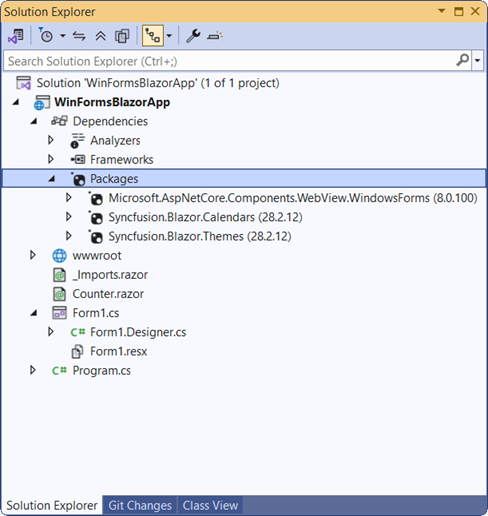
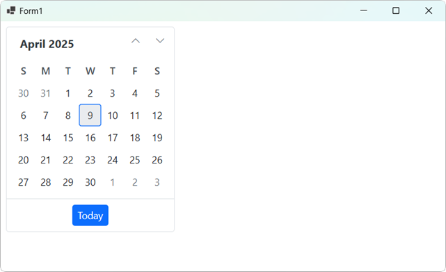

# Getting Started with WinForms Blazor Application

This section explains how to create and run the first WinForms Blazor App UI (.NET WinForms Blazor) app with Syncfusion<sup style="font-size:70%">&reg;</sup> Blazor components.

## What is WinForms Blazor App?

WinForms Blazor App is an app where `Blazor web app` is hosted in WinForms app using `BlazorWebView` control. This enable a Blazor web app to be integrated with platform features and UI controls. Also, BlazorWebView can be added to any page of WinForms Blazor app, and pointed to the root of the Blazor app. The Blazor components run natively in the .NET process and render web UI to an embedded web view control. WinForms Blazor apps can run on all the platforms supported by WinForms.

Visual Studio provides **WinForms Application** template to create WinForms Blazor Apps.

## Prerequisites

* [Supported platforms (WinForms documentation)](https://learn.microsoft.com/en-us/dotnet/desktop/winforms/overview/?view=netdesktop-8.0)

* [Visual Studio 2022](https://visualstudio.microsoft.com/vs/) with the .NET desktop development workload

## Create a new WinForms Blazor App in Visual Studio

To create a **WinForms Blazor App** using Visual Studio, it is essential<sup style="font-size:70%">&reg;</sup> to follow the comprehensive steps outlined in the [Microsoft Templates](https://learn.microsoft.com/en-us/aspnet/core/blazor/hybrid/tutorials/windows-forms?view=aspnetcore-8.0) documentation. Ensuring that you understand each step from the official guide will provide the foundation needed to continue with this documentation.

## Install Syncfusion<sup style="font-size:70%">&reg;</sup> Blazor Calendars and Themes NuGet in the App

Here's an example of how to add **Blazor Calendar** component in the app, open the NuGet package manager in Visual Studio (*Tools → NuGet Package Manager → Manage NuGet Packages for Solution*), search and install [Syncfusion.Blazor.Calendars](https://www.nuget.org/packages/Syncfusion.Blazor.Calendars/) and [Syncfusion.Blazor.Themes](https://www.nuget.org/packages/Syncfusion.Blazor.Themes/). Alternatively, you can utilize the following package manager command to achieve the same.




Install-Package Syncfusion.Blazor.Calendars -Version {{ site.releaseversion }}
Install-Package Syncfusion.Blazor.Themes -Version {{ site.releaseversion }}




N> Ensure that the package `Microsoft.AspNetCore.Components.WebView.WindowsForms` updated to version `8.0.16`.



N> Syncfusion<sup style="font-size:70%">&reg;</sup> Blazor components are available in [nuget.org](https://www.nuget.org/packages?q=syncfusion.blazor). Refer to [NuGet packages](https://blazor.syncfusion.com/documentation/nuget-packages) topic for available NuGet packages list with component details.

## Register Syncfusion<sup style="font-size:70%">&reg;</sup> Blazor Service

Open **~/_Imports.razor** file and import the `Syncfusion.Blazor` and `Syncfusion.Blazor.Calendars` namespace.

```cshtml

@using Syncfusion.Blazor
@using Syncfusion.Blazor.Calendars

```

Now, register the Syncfusion<sup style="font-size:70%">&reg;</sup> Blazor service in the `Form1.cs` file of your WinForms Blazor App.




    using Syncfusion.Blazor;
    ....
    service.AddSyncfusionBlazor();
    ....




## Add stylesheet and script resources

The theme stylesheet and script can be accessed from NuGet through [Static Web Assets](https://blazor.syncfusion.com/documentation/appearance/themes#static-web-assets). Reference the stylesheet and script in the `<head>` of the **~wwwroot/index.html** file.

```html
<head>
    ....
    <link href="_content/Syncfusion.Blazor.Themes/bootstrap5.css" rel="stylesheet" />
    <script src="_content/Syncfusion.Blazor.Core/scripts/syncfusion-blazor.min.js" type="text/javascript"></script>
</head>
```
N> Check out the [Blazor Themes](https://blazor.syncfusion.com/documentation/appearance/themes) topic to discover various methods ([Static Web Assets](https://blazor.syncfusion.com/documentation/appearance/themes#static-web-assets), [CDN](https://blazor.syncfusion.com/documentation/appearance/themes#cdn-reference), and [CRG](https://blazor.syncfusion.com/documentation/common/custom-resource-generator)) for referencing themes in your Blazor application. Also, check out the [Adding Script Reference](https://blazor.syncfusion.com/documentation/common/adding-script-references) topic to learn different approaches for adding script references in your Blazor application.

## Add Syncfusion<sup style="font-size:70%">&reg;</sup> Blazor component

Now add Syncfusion<sup style="font-size:70%">&reg;</sup> Blazor component in any razor file. Here, the Calendar component is added in `~/Counter.razor`.




<SfCalendar TValue="DateTime"></SfCalendar>




In the Visual Studio toolbar, select the start button to build and run the app.

