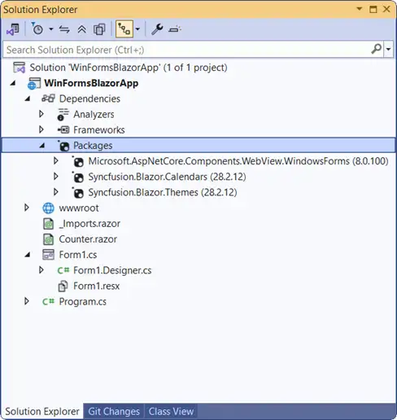
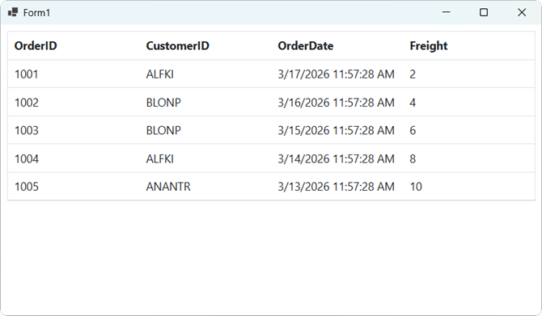

# Getting Started with WinForms Blazor Application

This section explains how to create and run a WinForms Blazor App (.NET WinForms Blazor) that integrates Syncfusion<sup style="font-size:70%">&reg;</sup> Blazor components.

## What is WinForms Blazor App?

A WinForms Blazor app hosts a Blazor web app inside a Windows Forms Application using the `BlazorWebView` control. This enables a Blazor Web App to integrate with desktop platform features and UI controls. The `BlazorWebView` control can be added on any form in the WinForms app and pointed to the Blazor app's root component. Blazor components execute in the .NET process and render their web UI into the embedded web view control. WinForms Blazor apps run on platforms supported by WinForms (Windows).

Visual Studio provides the **WinForms Application** template to create WinForms Blazor Apps.

## Prerequisites

* [Supported platforms (WinForms documentation)](https://learn.microsoft.com/en-us/dotnet/desktop/winforms/overview/?view=netdesktop-8.0)
* [Visual Studio 2022](https://visualstudio.microsoft.com/vs/) or [Visual Studio 2026](https://visualstudio.microsoft.com/downloads/)

## Create a new WinForms Blazor App in Visual Studio

To create a **WinForms Blazor App** using Visual Studio, follow the comprehensive steps in the [Microsoft Templates](https://learn.microsoft.com/en-us/aspnet/core/blazor/hybrid/tutorials/windows-forms?view=aspnetcore-8.0) documentation. Ensuring and understanding each step in the official guide establishes the foundation required to continue with this documentation.

## Install Syncfusion<sup style="font-size:70%">&reg;</sup> Blazor Grid and Themes NuGet in the App

To add the **Blazor DataGrid** component in the app, open the NuGet Package Manager in Visual Studio (*Tools → NuGet Package Manager → Manage NuGet Packages for Solution*), then search and install [Syncfusion.Blazor.Grid](https://www.nuget.org/packages/Syncfusion.Blazor.Grid/) and [Syncfusion.Blazor.Themes](https://www.nuget.org/packages/Syncfusion.Blazor.Themes/). Alternatively, run the following commands in the Package Manager Console to achieve the same.




Install-Package Syncfusion.Blazor.Grid -Version {{ site.releaseversion }}
Install-Package Syncfusion.Blazor.Themes -Version {{ site.releaseversion }}




N> Ensure that the package [Microsoft.AspNetCore.Components.WebView.WindowsForms](https://www.nuget.org/packages/Microsoft.AspNetCore.Components.WebView.WindowsForms) is updated to version `8.0.16` or later.



N> Syncfusion<sup style="font-size:70%">&reg;</sup> Blazor components are available in [nuget.org](https://www.nuget.org/packages?q=syncfusion.blazor). Refer to the [NuGet packages](https://blazor.syncfusion.com/documentation/nuget-packages) topic for the available NuGet package list with component details.

## Add Import Namespaces

Open the `~/_Imports.razor` file and import the `Syncfusion.Blazor` and `Syncfusion.Blazor.Grids` namespaces:




@using Syncfusion.Blazor
@using Syncfusion.Blazor.Grids




## Register Syncfusion<sup style="font-size:70%">&reg;</sup> Blazor Service

Register the Syncfusion<sup style="font-size:70%">&reg;</sup> Blazor service in the `Form1.cs` file of the WinForms Blazor App.




    using Syncfusion.Blazor;
    ....
    services.AddSyncfusionBlazor();
    ....




## Add stylesheet and script resources

The theme stylesheet and script can be accessed from NuGet through [Static Web Assets](https://blazor.syncfusion.com/documentation/appearance/themes#static-web-assets). Include the stylesheet in the `<head>` and the script at the end of the `<body>` in the **~wwwroot/index.html** file as shown below:

```html
<head>
    ....
    <link href="_content/Syncfusion.Blazor.Themes/bootstrap5.css" rel="stylesheet" />
</head>

<body>
    ....
    <script src="_content/Syncfusion.Blazor.Core/scripts/syncfusion-blazor.min.js" type="text/javascript"></script>
</body>
```

N> Check out the [Blazor Themes](https://blazor.syncfusion.com/documentation/appearance/themes) topic to discover various methods ([Static Web Assets](https://blazor.syncfusion.com/documentation/appearance/themes#static-web-assets), [CDN](https://blazor.syncfusion.com/documentation/appearance/themes#cdn-reference), and [CRG](https://blazor.syncfusion.com/documentation/common/custom-resource-generator)) for referencing themes in the Blazor application. Also, see [Adding Script Reference](https://blazor.syncfusion.com/documentation/common/adding-script-references) topic to learn different approaches for adding script references in the Blazor application.

## Add Syncfusion<sup style="font-size:70%">&reg;</sup> Blazor component

Add a Syncfusion Blazor component to any Razor file in the Blazor project. The example below adds the Blazor Grid component into `~/Counter.razor` file.




<SfGrid DataSource="@Orders" />

@code {
    public List<Order> Orders { get; set; }

    protected override void OnInitialized()
    {
        Orders = Enumerable.Range(1, 5).Select(x => new Order()
        {
            OrderID = 1000 + x,
            CustomerID = (new string[] { "ALFKI", "ANANTR", "ANTON", "BLONP", "BOLID" })[new Random().Next(5)],
            Freight = 2 * x,
            OrderDate = DateTime.Now.AddDays(-x),
        }).ToList();
    }

    public class Order
    {
        public int? OrderID { get; set; }
        public string CustomerID { get; set; }
        public DateTime? OrderDate { get; set; }
        public double? Freight { get; set; }
    }
}




In the Visual Studio toolbar, select the start button to build and run the app.

