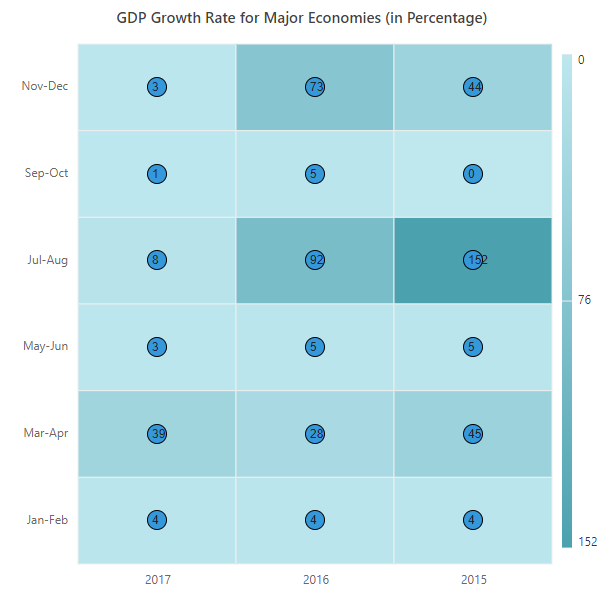

# Appearance in Blazor HeatMap Chart Component

## Cell customizations

You can customize the cell by using the `CellSettings`

### Border

Change the width, color, and radius of the heat map cells by using the `HeatMapCellBorder` tag.

```cshtml

@using Syncfusion.Blazor.HeatMap

<SfHeatMap DataSource="@HeatMapData">
    <HeatMapXAxis Labels="@XAxisLabels"></HeatMapXAxis>
    <HeatMapYAxis Labels="@YAxisLabels"></HeatMapYAxis>
    <HeatMapTitleSettings Text="Sales Revenue per Employee (in 1000 US$)">
    </HeatMapTitleSettings>
    <HeatMapCellSettings ShowLabel="true" TileType="CellType.Rect">
         <HeatMapCellBorder Width = "1" Radius = "4" Color = "White" ></HeatMapCellBorder>
    </HeatMapCellSettings>
    <HeatMapLegendSettings ShowLabel="true"></HeatMapLegendSettings>
</SfHeatMap>

@code{
    int[,] GetDefaultData()
    {
        int[,] dataSource = new int[,]
        {
            {73, 39, 26, 39, 94, 0},
            {93, 58, 53, 38, 26, 68},
            {99, 28, 22, 4, 66, 90},
            {14, 26, 97, 69, 69, 3},
            {7, 46, 47, 47, 88, 6},
            {41, 55, 73, 23, 3, 79},
        };
        return dataSource;
    }
    string[] XAxisLabels = new string[] {"Nancy", "Andrew", "Janet", "Margaret", "Steven", "Michael" };
    string[] YAxisLabels = new string[] { "Mon", "Tue", "Wed", "Thu", "Fri", "Sat" };
    public object HeatMapData { get; set; }
    protected override void OnInitialized()
    {
        HeatMapData = GetDefaultData();
    }
}

```


### Cell highlighting

Enable or disable the cell highlighting while hover over the heat map cells by using the  `EnableCellHighlighting` property.

```cshtml

@using Syncfusion.Blazor.HeatMap

<SfHeatMap DataSource="@HeatMapData">
    <HeatMapXAxis Labels="@XAxisLabels"></HeatMapXAxis>
    <HeatMapYAxis Labels="@YAxisLabels"></HeatMapYAxis>
    <HeatMapTitleSettings Text="Sales Revenue per Employee (in 1000 US$)">
    </HeatMapTitleSettings>
    <HeatMapCellSettings ShowLabel="true" TileType="CellType.Rect" EnableCellHighlighting="true"></HeatMapCellSettings>
    <HeatMapLegendSettings ShowLabel="true" Position="LegendPosition.Right" EnableSmartLegend="true" ToggleVisibility="true"></HeatMapLegendSettings>
</SfHeatMap>

@code{
    int[,] GetDefaultData()
        {
            int[,] dataSource = new int[,]
            {
                {73, 39, 26, 39, 94, 0},
                {93, 58, 53, 38, 26, 68},
                {99, 28, 22, 4, 66, 90},
                {14, 26, 97, 69, 69, 3},
                {7, 46, 47, 47, 88, 6},
                {41, 55, 73, 23, 3, 79}
            };
            return dataSource;
        }
    string[] XAxisLabels = new string[] {"Nancy", "Andrew", "Janet", "Margaret", "Steven", "Michael" };
    string[] YAxisLabels = new string[] { "Mon", "Tue", "Wed", "Thu", "Fri", "Sat" };
    public object HeatMapData { get; set; }
    protected override void OnInitialized()
    {
        HeatMapData = GetDefaultData();
    }
}

```


## Margin

Set the margin for the heat map from its container by using the `HeatMapMargin` property.

```cshtml

@using Syncfusion.Blazor.HeatMap

<SfHeatMap DataSource="@HeatMapData">
    <HeatMapXAxis Labels="@XAxisLabels"></HeatMapXAxis>
    <HeatMapYAxis Labels="@YAxisLabels"></HeatMapYAxis>
    <HeatMapTitleSettings Text="Sales Revenue per Employee (in 1000 US$)">
    </HeatMapTitleSettings>
    <HeatMapCellSettings ShowLabel="true" TileType="CellType.Rect"></HeatMapCellSettings>
    <HeatMapMargin Left="15" Right="15" Top="15" Bottom="15"></HeatMapMargin>
    <HeatMapLegendSettings ShowLabel="true" Position="LegendPosition.Right" EnableSmartLegend="true" ToggleVisibility="true"></HeatMapLegendSettings>
</SfHeatMap>

@code{
     int[,] GetDefaultData()
        {
            int[,] dataSource = new int[,]
            {
                {73, 39, 26, 39, 94, 0},
                {93, 58, 53, 38, 26, 68},
                {99, 28, 22, 4, 66, 90},
                {14, 26, 97, 69, 69, 3},
                {7, 46, 47, 47, 88, 6},
                {41, 55, 73, 23, 3, 79}
            };
            return dataSource;
        }
    string[] XAxisLabels = new string[] {"Nancy", "Andrew", "Janet", "Margaret", "Steven", "Michael" };
    string[] YAxisLabels = new string[] { "Mon", "Tue", "Wed", "Thu", "Fri", "Sat" };
    public object HeatMapData { get; set; }
    protected override void OnInitialized()
    {
        HeatMapData = GetDefaultData();
    }
}

```


## Title

The title is used to provide a quick information about the data plotted in heat map. The `Text` property is used to set the title for heat map. You can also customize text style of a title by using the `HeatMapTitleTextStyle` tag.

```cshtml

@using Syncfusion.Blazor.HeatMap

<SfHeatMap DataSource="@HeatMapData">
    <HeatMapXAxis Labels="@XAxisLabels"></HeatMapXAxis>
    <HeatMapYAxis Labels="@YAxisLabels"></HeatMapYAxis>
    <HeatMapTitleSettings Text="Sales Revenue per Employee (in 1000 US$)">
        <HeatMapTitleTextStyle Size = "15px" FontWeight = "500" FontStyle = "Italic" FontFamily = "Segoe UI"></HeatMapTitleTextStyle>
    </HeatMapTitleSettings>
    <HeatMapCellSettings ShowLabel="true" TileType="CellType.Rect"></HeatMapCellSettings>
    <HeatMapMargin Left="15" Right="15" Top="15" Bottom="15"></HeatMapMargin>
    <HeatMapLegendSettings ShowLabel="true" Position="LegendPosition.Right" EnableSmartLegend="true" ToggleVisibility="true"></HeatMapLegendSettings>
</SfHeatMap>

@code{
    int[,] GetDefaultData()
        {
            int[,] dataSource = new int[,]
            {
                {73, 39, 26, 39, 94, 0},
                {93, 58, 53, 38, 26, 68},
                {99, 28, 22, 4, 66, 90},
                {14, 26, 97, 69, 69, 3},
                {7, 46, 47, 47, 88, 6},
                {41, 55, 73, 23, 3, 79}
            };
            return dataSource;
    }
    string[] XAxisLabels = new string[] {"Nancy", "Andrew", "Janet", "Margaret", "Steven", "Michael" };
    string[] YAxisLabels = new string[] { "Mon", "Tue", "Wed", "Thu", "Fri", "Sat" };
    public object HeatMapData { get; set; }
    protected override void OnInitialized()
    {
        HeatMapData = GetDefaultData();
    }
}

```


## Data label

You can toggle the visibility of data labels by using the `ShowLabel` property. By default, the data label will be visible.

```cshtml

@using Syncfusion.Blazor.HeatMap

<SfHeatMap DataSource="@HeatMapData">
    <HeatMapXAxis Labels="@XAxisLabels"></HeatMapXAxis>
    <HeatMapYAxis Labels="@YAxisLabels"></HeatMapYAxis>
    <HeatMapTitleSettings Text="Sales Revenue per Employee (in 1000 US$)">
    </HeatMapTitleSettings>
    <HeatMapCellSettings ShowLabel="true" TileType="CellType.Rect"></HeatMapCellSettings>
    <HeatMapMargin Left="15" Right="15" Top="15" Bottom="15"></HeatMapMargin>
</SfHeatMap>

@code{
    int[,] GetDefaultData()
        {
            int[,] dataSource = new int[,]
            {
                {73, 39, 26, 39, 94, 0},
                {93, 58, 53, 38, 26, 68},
                {99, 28, 22, 4, 66, 90},
                {14, 26, 97, 69, 69, 3},
                {7, 46, 47, 47, 88, 6},
                {41, 55, 73, 23, 3, 79}
            };
            return dataSource;
        }
    string[] XAxisLabels = new string[] {"Nancy", "Andrew", "Janet", "Margaret", "Steven", "Michael" };
    string[] YAxisLabels = new string[] { "Mon", "Tue", "Wed", "Thu", "Fri", "Sat" };
    public object HeatMapData { get; set; }
    protected override void OnInitialized()
    {
        HeatMapData = GetDefaultData();
    }
}

```


### Text style

You can customize the font family, font size, and color of the data label by using the `HeatMapCellTextStyle` tag in the `HeatMapCellSettings` tag.

```cshtml

@using Syncfusion.Blazor.HeatMap

<SfHeatMap DataSource="@HeatMapData">
    <HeatMapXAxis Labels="@XAxisLabels"></HeatMapXAxis>
    <HeatMapYAxis Labels="@YAxisLabels"></HeatMapYAxis>
    <HeatMapTitleSettings Text="Sales Revenue per Employee (in 1000 US$)">
        <HeatMapTitleTextStyle Size="15px" FontWeight="500" FontStyle="Italic" FontFamily="Segoe UI"></HeatMapTitleTextStyle>
    </HeatMapTitleSettings>
    <HeatMapCellSettings ShowLabel="true" TileType="CellType.Rect">
        <HeatMapCellTextStyle Size="15px" FontWeight="500" FontStyle="Italic" FontFamily="Segoe UI"></HeatMapCellTextStyle>
    </HeatMapCellSettings>
    <HeatMapMargin Left="15" Right="15" Top="15" Bottom="15"></HeatMapMargin>
</SfHeatMap>

@code{
    int[,] GetDefaultData()
    {
        int[,] dataSource = new int[,]
        {
            {73, 39, 26, 39, 94, 0},
            {93, 58, 53, 38, 26, 68},
            {99, 28, 22, 4, 66, 90},
            {14, 26, 97, 69, 69, 3},
            {7, 46, 47, 47, 88, 6},
            {41, 55, 73, 23, 3, 79}
        };
        return dataSource;
    }
    string[] XAxisLabels = new string[] {"Nancy", "Andrew", "Janet", "Margaret", "Steven", "Michael" };
    string[] YAxisLabels = new string[] { "Mon", "Tue", "Wed", "Thu", "Fri", "Sat" };
    public object HeatMapData { get; set; }
    protected override void OnInitialized()
    {
        HeatMapData = GetDefaultData();
    }
}

```


### Format

You can change the format of the data label, such as currency, decimal, percent, etc. by using the `Format` property.

```cshtml

@using Syncfusion.Blazor.HeatMap

<SfHeatMap DataSource="@HeatMapData">
    <HeatMapXAxis Labels="@XAxisLabels"></HeatMapXAxis>
    <HeatMapYAxis Labels="@YAxisLabels"></HeatMapYAxis>
    <HeatMapTitleSettings Text="Sales Revenue per Employee (in 1000 US$)">
    </HeatMapTitleSettings>
    <HeatMapCellSettings ShowLabel="true" TileType="CellType.Rect" Format="{value} $"></HeatMapCellSettings>
    <HeatMapMargin Left="15" Right="15" Top="15" Bottom="15"></HeatMapMargin>
</SfHeatMap>

@code{
    int[,] GetDefaultData()
    {
        int[,] dataSource = new int[,]
        {
            {73, 39, 26, 39, 94, 0},
            {93, 58, 53, 38, 26, 68},
            {99, 28, 22, 4, 66, 90},
            {14, 26, 97, 69, 69, 3},
            {7, 46, 47, 47, 88, 6},
            {41, 55, 73, 23, 3, 79}
        };
        return dataSource;
    }
    string[] XAxisLabels = new string[] {"Nancy", "Andrew", "Janet", "Margaret", "Steven", "Michael" };
    string[] YAxisLabels = new string[] { "Mon", "Tue", "Wed", "Thu", "Fri", "Sat" };
    public object HeatMapData { get; set; }
    protected override void OnInitialized()
    {
        HeatMapData = GetDefaultData();
    }
}

```


## Adding data label as a template

Any HTML elements can be added as a template in the data labels by using the `LabelTemplate` property of `HeatMapCellSettings` in the HeatMap.

The following examples demonstrate different data binding with the `LabelTemplate` property in the HeatMap.

### Array binding

When an array of numbers is specified as the data source, you can add a template in the data label by using the `LabelTemplate` property, and its value should be set as **@Template["Value"]**. This allows the cell value to be displayed as the template for the labels.

**Table**

The following example illustrates how to add a template in the data label using array table binding.

```cshtml

@using Syncfusion.Blazor.HeatMap;

<SfHeatMap DataSource="@HeatMapData">
    <HeatMapTitleSettings Text="GDP Growth Rate for Major Economies (in Percentage)">
        <HeatMapTitleTextStyle Size="15px" FontWeight="500" FontStyle="Normal" FontFamily="Segoe UI"></HeatMapTitleTextStyle>
    </HeatMapTitleSettings>
    <HeatMapXAxis Labels="@XAxisLabels"></HeatMapXAxis>
    <HeatMapYAxis Labels="@YAxisLabels"></HeatMapYAxis>
    <HeatMapCellSettings ShowLabel="true">
         <LabelTemplate>
            @{
                var Template = (context as Dictionary<string, string>);
                <div style="width:20px;height:20px;padding-left: 4px;background-color:#3498db; border: 1px solid #000000; border-radius:50%"> @Template["Value"]</div>
            }
        </LabelTemplate>
    </HeatMapCellSettings>
    <HeatMapDataSourceSettings IsJsonData="false" AdaptorType="AdaptorType.Table"></HeatMapDataSourceSettings>
</SfHeatMap>

@code {
    double[,] GetDefaultData()
    {
        double[,] dataSource = new double[,]
        {
            {4, 39, 3, 8, 1, 3 },
            {4, 28, 5, 92, 5, 73 },
            {4, 45, 5, 152, 0, 44 }
        };
        return dataSource;
    }
    string[] XAxisLabels = new string[] { "2017", "2016", "2015" };
    string[] YAxisLabels = new string[] { "Jan-Feb", "Mar-Apr", "May-Jun", "Jul-Aug", "Sep-Oct", "Nov-Dec" };
    public object HeatMapData { get; set; }
    protected override void OnInitialized()
    {
        HeatMapData = GetDefaultData();
    }
}

```


**Cell**

The following example illustrates how to add a template in the data label using array cell binding.

```cshtml

@using Syncfusion.Blazor.HeatMap;

<SfHeatMap DataSource="@HeatMapData">
    <HeatMapTitleSettings Text="Commercial Aviation Accidents and Fatalities by year 2012 - 2017">
        <HeatMapTitleTextStyle Size="15px" FontWeight="500" FontStyle="Normal" FontFamily="Segoe UI"></HeatMapTitleTextStyle>
    </HeatMapTitleSettings>
    <HeatMapXAxis Labels="@XAxisLabels"></HeatMapXAxis>
    <HeatMapYAxis Labels="@YAxisLabels"></HeatMapYAxis>
    <HeatMapLegendSettings Visible="false"></HeatMapLegendSettings>
    <HeatMapCellSettings>
        <LabelTemplate>
            @{
                var Template = (context as Dictionary<string, string>);
                <div style="width:20px;height:20px;padding-left: 4px;background-color:#3498db; border: 1px solid #000000; border-radius:50%"> @Template["Value"]</div>
            }
        </LabelTemplate>
    </HeatMapCellSettings>
    <HeatMapDataSourceSettings IsJsonData="false" AdaptorType="AdaptorType.Cell"></HeatMapDataSourceSettings>
</SfHeatMap>

@code {
    double[,] GetDefaultData()
    {
        double[,] dataSource = new double[,]
            {
                {0, 0, 4, 39}, {0, 1, 3, 8}, {0, 2, 1, 3}, {0, 3, 1, 10}, {0, 4, 4, 4}, {0, 5, 2, 15},
                {1, 0, 4, 28}, {1, 1, 5, 92}, {1, 2, 5, 73}, {1, 3, 3, 1}, {1, 4, 3, 4}, {1, 5, 4, 126},
                {2, 0, 4, 45}, {2, 1, 5, 152}, {2, 2, 0, 44}, {2, 3, 4, 54}, {2, 4, 5, 243}, {2, 5, 2, 45}
            };
        return dataSource;
    }
    string[] XAxisLabels = new string[] { "2017", "2016", "2015" };
    string[] YAxisLabels = new string[] { "Jan-Feb", "Mar-Apr", "May-Jun", "Jul-Aug", "Sep-Oct", "Nov-Dec" };
    public object HeatMapData { get; set; }
    protected override void OnInitialized()
    {
        HeatMapData = GetDefaultData();
    }
}

```


### JSON binding

When a list of JSON objects are specified as data source, you can add a template in the data label by using the `LabelTemplate` property, and its value should be bound to the field value from the data source. This allows the specified feild value to be displayed as the template for the labels.

**Table**

The following example illustrates how to add a template in the data label using JSON table binding.

```cshtml

<SfHeatMap DataSource="@HeatMapData" Width="600" Height="600">
    <HeatMapTitleSettings Text="Olympic Medal Achievements of most Successful Countries">
        <HeatMapTitleTextStyle Size="15px" FontWeight="500" FontStyle="Normal" FontFamily="Segoe UI"></HeatMapTitleTextStyle>
    </HeatMapTitleSettings>
    <HeatMapDataSourceSettings IsJsonData="true" AdaptorType="AdaptorType.Table" XDataMapping="Region"></HeatMapDataSourceSettings>
    <HeatMapXAxis Labels="@XLabels"></HeatMapXAxis>
    <HeatMapYAxis Labels="@YLabels"></HeatMapYAxis>
    <HeatMapCellSettings>
        <LabelTemplate>
            @{
                var content = (context as RegionalData);
                if (content != null)
                {
                    <div>@content.Region - @content.Jan_2000 - @content.Jan_2004 - @content.Jan_2008 - @content.Jan_2012</div>
                }
            }
        </LabelTemplate>
    </HeatMapCellSettings>
</SfHeatMap>

@code
{
    public string[] XLabels = new string[] { "China", "France", "GBR", "Germany", "Italy", "Japan", "KOR", "Russia", "USA" };
    public string[] YLabels = new string[] { "Jan_2000", "Jan_2004", "Jan_2008", "Jan_2012", "Jan_2016" };
    public class RegionalData
    {
        public string Region { get; set; }
        public int? Jan_2000 { get; set; }
        public int? Jan_2004 { get; set; }
        public int? Jan_2008 { get; set; }
        public int? Jan_2012 { get; set; }
        public int? Jan_2016 { get; set; }
    }
    public RegionalData[] HeatMapData = new RegionalData[]{
        new RegionalData {Region = "USA", Jan_2000 = 93,Jan_2004 = 101,Jan_2008 = 112,Jan_2012 = 103,Jan_2016 = 121 },
        new RegionalData {Region = "GBR", Jan_2000 = 28,Jan_2004 = 30,Jan_2008 = 49,Jan_2012 = 65,Jan_2016 = 67 },
        new RegionalData {Region = "China", Jan_2000 = 58,Jan_2004 = 63,Jan_2008 = 100,Jan_2012 = 91,Jan_2016 = 70 },
        new RegionalData {Region = "Russia", Jan_2000 = 89,Jan_2004 = 90,Jan_2008 = 60,Jan_2012 = 69,Jan_2016 = 55 },
        new RegionalData {Region = "Germany", Jan_2000 = 56,Jan_2004 = 49,Jan_2008 = 41,Jan_2012 = 44,Jan_2016 = 42 },
        new RegionalData {Region = "Japan", Jan_2000 = 18,Jan_2004 = 37,Jan_2008 = 25,Jan_2012 = 38,Jan_2016 = 41 },
        new RegionalData {Region = "France", Jan_2000 = 38,Jan_2004 = 33,Jan_2008 = 43,Jan_2012 = 35,Jan_2016 = 42 },
        new RegionalData {Region = "KOR", Jan_2000 = 28,Jan_2004 = 30,Jan_2008 = 32,Jan_2012 = 30,Jan_2016 = 21 },
        new RegionalData {Region = "Italy", Jan_2000 = 34,Jan_2004 = 32,Jan_2008 = 27,Jan_2012 = 28,Jan_2016 = 28 }
    };
}

```


**Cell**

The following example illustrates how to add a template in the data label using JSON cell binding.

```cshtml

@using Syncfusion.Blazor.HeatMap

<SfHeatMap DataSource="@HeatMapData">
    <HeatMapTitleSettings Text="Commercial Aviation Accidents and Fatalities by year 2012 - 2017">
        <HeatMapTitleTextStyle Size="15px" FontWeight="500" FontStyle="Normal" FontFamily="Segoe UI"></HeatMapTitleTextStyle>
    </HeatMapTitleSettings>
    <HeatMapDataSourceSettings IsJsonData="true" AdaptorType="AdaptorType.Cell" XDataMapping="Year" YDataMapping="Months" ValueMapping="Fatalities"></HeatMapDataSourceSettings>
    <HeatMapXAxis Labels="@XLabels"></HeatMapXAxis>
    <HeatMapYAxis Labels="@YLabels"></HeatMapYAxis>
    <HeatMapCellSettings>
        <LabelTemplate>
            @{
                var content = (context as SampleData);
                if(content != null)
                {
                    <div>@content.Year - @content.Months - @content.Accidents - @content.Fatalities</div>
                }
            }
        </LabelTemplate>
    </HeatMapCellSettings>
</SfHeatMap>

@code {
    public string[] XLabels = new string[] { "2017", "2016", "2015" };
    public string[] YLabels = new string[] { "Jan-Feb", "Mar-Apr", "May-Jun", "Jul-Aug", "Sep-Oct", "Nov-Dec" };
    public class SampleData
    {
        public string Year { get; set; }
        public string Months { get; set; }
        public int? Accidents { get; set; }
        public int? Fatalities { get; set; }
    }
    public SampleData[] HeatMapData = new SampleData[] {
        new SampleData  { Year= "2017", Months= "Jan-Feb", Accidents= 4,  Fatalities = 39 },
        new SampleData  { Year= "2017", Months= "Mar-Apr", Accidents= 3,  Fatalities = 8 },
        new SampleData  { Year= "2017", Months= "May-Jun", Accidents= 1,  Fatalities = 3 },
        new SampleData  { Year= "2017", Months= "Jul-Aug", Accidents= 1,  Fatalities = 10 },
        new SampleData  { Year= "2017", Months= "Sep-Oct", Accidents= 4,  Fatalities = 4 },
        new SampleData  { Year= "2017", Months= "Nov-Dec", Accidents= 2,  Fatalities = 15 },
        new SampleData  { Year= "2016", Months= "Jan-Feb", Accidents= 4,  Fatalities = 28 },
        new SampleData  { Year= "2016", Months= "Mar-Apr", Accidents= 5,  Fatalities = 92 },
        new SampleData  { Year= "2016", Months= "May-Jun", Accidents= 5,  Fatalities = 73 },
        new SampleData  { Year= "2016", Months= "Jul-Aug", Accidents= 3,  Fatalities = 1 },
        new SampleData  { Year= "2016", Months= "Sep-Oct", Accidents= 3,  Fatalities = 4 },
        new SampleData  { Year= "2016", Months= "Nov-Dec", Accidents= 4,  Fatalities = 126 },
        new SampleData  { Year= "2015", Months= "Jan-Feb", Accidents= 4,  Fatalities = 45 },
        new SampleData  { Year= "2015", Months= "Mar-Apr", Accidents= 5,  Fatalities = 152 },
        new SampleData  { Year= "2015", Months= "May-Jun", Accidents= 0,  Fatalities = 0 },
        new SampleData  { Year= "2015", Months= "Jul-Aug", Accidents= 4,  Fatalities = 54 },
        new SampleData  { Year= "2015", Months= "Sep-Oct", Accidents= 5,  Fatalities = 243 },
        new SampleData  { Year= "2015", Months= "Nov-Dec", Accidents= 2,  Fatalities = 45 }
        
    };
}

```

>Note: The properties of data label such as `HeatMapXAxisTextStyle` and `HeatMapYAxisTextStyle` properties are not applicable to template property. The styles can be applied to the label template using the CSS styles of the HTML element.

