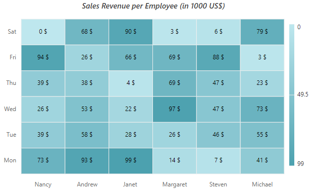

# Appearance in Blazor HeatMap Chart Component

## Cell customization

You can customize the cell by using the [CellSettings](https://help.syncfusion.com/cr/blazor/Syncfusion.Blazor.HeatMap.HeatMapCellSettings.html)

### Border

Change the width, color, and radius of the heat map cells by using the [HeatMapCellBorder](https://help.syncfusion.com/cr/blazor/Syncfusion.Blazor.HeatMap.HeatMapCellBorder.html) tag.

```cshtml

@using Syncfusion.Blazor.HeatMap

<SfHeatMap DataSource="@HeatMapData">
    <HeatMapXAxis Labels="@XAxisLabels"></HeatMapXAxis>
    <HeatMapYAxis Labels="@YAxisLabels"></HeatMapYAxis>
    <HeatMapTitleSettings Text="Sales Revenue per Employee (in 1000 US$)">
    </HeatMapTitleSettings>
    <HeatMapCellSettings ShowLabel="true" TileType="CellType.Rect">
         <HeatMapCellBorder Width = "1" Radius = "4" Color = "White" ></HeatMapCellBorder>
    </HeatMapCellSettings>
    <HeatMapLegendSettings ShowLabel="true"></HeatMapLegendSettings>
</SfHeatMap>

@code{
    public int[,] GetDefaultData()
    {
        int[,] dataSource = new int[,]
        {
            {73, 39, 26, 39, 94, 0},
            {93, 58, 53, 38, 26, 68},
            {99, 28, 22, 4, 66, 90},
            {14, 26, 97, 69, 69, 3},
            {7, 46, 47, 47, 88, 6},
            {41, 55, 73, 23, 3, 79},
        };
        return dataSource;
    }
    public string[] XAxisLabels = new string[] {"Nancy", "Andrew", "Janet", "Margaret", "Steven", "Michael" };
    public string[] YAxisLabels = new string[] { "Mon", "Tue", "Wed", "Thu", "Fri", "Sat" };
    public object HeatMapData { get; set; }
    protected override void OnInitialized()
    {
        HeatMapData = GetDefaultData();
    }
}

```


### Cell highlighting

Enable or disable the cell highlighting while hovering over the heat map cells by using the  [EnableCellHighlighting](https://help.syncfusion.com/cr/blazor/Syncfusion.Blazor.HeatMap.HeatMapCellSettings.html#Syncfusion_Blazor_HeatMap_HeatMapCellSettings_EnableCellHighlighting) property.

```cshtml

@using Syncfusion.Blazor.HeatMap

<SfHeatMap DataSource="@HeatMapData">
    <HeatMapXAxis Labels="@XAxisLabels"></HeatMapXAxis>
    <HeatMapYAxis Labels="@YAxisLabels"></HeatMapYAxis>
    <HeatMapTitleSettings Text="Sales Revenue per Employee (in 1000 US$)">
    </HeatMapTitleSettings>
    <HeatMapCellSettings ShowLabel="true" TileType="CellType.Rect" EnableCellHighlighting="true"></HeatMapCellSettings>
    <HeatMapLegendSettings ShowLabel="true" Position="LegendPosition.Right" EnableSmartLegend="true" ToggleVisibility="true"></HeatMapLegendSettings>
</SfHeatMap>

@code{
    public int[,] GetDefaultData()
        {
            int[,] dataSource = new int[,]
            {
                {73, 39, 26, 39, 94, 0},
                {93, 58, 53, 38, 26, 68},
                {99, 28, 22, 4, 66, 90},
                {14, 26, 97, 69, 69, 3},
                {7, 46, 47, 47, 88, 6},
                {41, 55, 73, 23, 3, 79}
            };
            return dataSource;
        }
    public string[] XAxisLabels = new string[] {"Nancy", "Andrew", "Janet", "Margaret", "Steven", "Michael" };
    public string[] YAxisLabels = new string[] { "Mon", "Tue", "Wed", "Thu", "Fri", "Sat" };
    public object HeatMapData { get; set; }
    protected override void OnInitialized()
    {
        HeatMapData = GetDefaultData();
    }
}

```


### Color gradient mode

The [ColorGradientMode](https://help.syncfusion.com/cr/blazor/Syncfusion.Blazor.HeatMap.ColorGradientMode.html) property can be used to set the minimum and maximum values for colors based on row and column. Three types of color gradient modes are available.

* **Table**: The minimum and maximum value colors calculated for overall data.
* **Row**: The minimum and maximum value colors calculated for each row of data.
* **Column**: The minimum and maximum value colors calculated for each column of data.

> The default value of `ColorGradientMode` is **Table**.

```cshtml

@using Syncfusion.Blazor.HeatMap

<SfHeatMap DataSource="@HeatMapData">
    <HeatMapTitleSettings Text="Sales Revenue per Employee (in 1000 US$)">
    </HeatMapTitleSettings>
    <HeatMapXAxis Labels="@XAxisLabels"></HeatMapXAxis>
    <HeatMapYAxis Labels="@YAxisLabels"></HeatMapYAxis>
    <HeatMapCellSettings ShowLabel="true" TileType="CellType.Rect"></HeatMapCellSettings>
    <HeatMapPaletteSettings ColorGradientMode="ColorGradientMode.Column">
    </HeatMapPaletteSettings>
</SfHeatMap>

@code {
    public int[,] GetDefaultData()
    {
        int[,] dataSource = new int[,]
        {
            {73, 39, 26, 39, 94, 0},
            {93, 58, 53, 38, 26, 68},
            {99, 28, 22, 4, 66, 90},
            {14, 26, 97, 69, 69, 3},
            {7, 46, 47, 47, 88, 6},
            {41, 55, 73, 23, 3, 79}
        };
        return dataSource;
    }
    public string[] XAxisLabels = new string[] { "Nancy", "Andrew", "Janet", "Margaret", "Steven", "Michael" };
    public string[] YAxisLabels = new string[] { "Mon", "Tue", "Wed", "Thu", "Fri", "Sat" };
    public object HeatMapData { get; set; }
    protected override void OnInitialized()
    {
        HeatMapData = GetDefaultData();
    }
}

```


## Margin

Set the margin for the heatmap from its container by using the [HeatMapMargin](https://help.syncfusion.com/cr/blazor/Syncfusion.Blazor.HeatMap.HeatMapMargin.html) tag.

```cshtml

@using Syncfusion.Blazor.HeatMap

<SfHeatMap DataSource="@HeatMapData">
    <HeatMapXAxis Labels="@XAxisLabels"></HeatMapXAxis>
    <HeatMapYAxis Labels="@YAxisLabels"></HeatMapYAxis>
    <HeatMapTitleSettings Text="Sales Revenue per Employee (in 1000 US$)">
    </HeatMapTitleSettings>
    <HeatMapCellSettings ShowLabel="true" TileType="CellType.Rect"></HeatMapCellSettings>
    <HeatMapMargin Left="15" Right="15" Top="15" Bottom="15"></HeatMapMargin>
    <HeatMapLegendSettings ShowLabel="true" Position="LegendPosition.Right" EnableSmartLegend="true" ToggleVisibility="true"></HeatMapLegendSettings>
</SfHeatMap>

@code{
     public int[,] GetDefaultData()
        {
            int[,] dataSource = new int[,]
            {
                {73, 39, 26, 39, 94, 0},
                {93, 58, 53, 38, 26, 68},
                {99, 28, 22, 4, 66, 90},
                {14, 26, 97, 69, 69, 3},
                {7, 46, 47, 47, 88, 6},
                {41, 55, 73, 23, 3, 79}
            };
            return dataSource;
        }
    public string[] XAxisLabels = new string[] {"Nancy", "Andrew", "Janet", "Margaret", "Steven", "Michael" };
    public string[] YAxisLabels = new string[] { "Mon", "Tue", "Wed", "Thu", "Fri", "Sat" };
    public object HeatMapData { get; set; }
    protected override void OnInitialized()
    {
        HeatMapData = GetDefaultData();
    }
}

```


## Title

The title is used to provide a quick information about the data plotted in heatmap. The [Text](https://help.syncfusion.com/cr/blazor/Syncfusion.Blazor.HeatMap.HeatMapTitleSettings.html#Syncfusion_Blazor_HeatMap_HeatMapTitleSettings_Text) property is used to set the title for the heatmap. The text style of the title can be customized by using the [HeatMapTitleTextStyle](https://help.syncfusion.com/cr/blazor/Syncfusion.Blazor.HeatMap.HeatMapTitleTextStyle.html) tag.

```cshtml

@using Syncfusion.Blazor.HeatMap

<SfHeatMap DataSource="@HeatMapData">
    <HeatMapXAxis Labels="@XAxisLabels"></HeatMapXAxis>
    <HeatMapYAxis Labels="@YAxisLabels"></HeatMapYAxis>
    <HeatMapTitleSettings Text="Sales Revenue per Employee (in 1000 US$)">
        <HeatMapTitleTextStyle Size = "15px" FontWeight = "500" FontStyle = "Italic" FontFamily = "Segoe UI"></HeatMapTitleTextStyle>
    </HeatMapTitleSettings>
    <HeatMapCellSettings ShowLabel="true" TileType="CellType.Rect"></HeatMapCellSettings>
    <HeatMapMargin Left="15" Right="15" Top="15" Bottom="15"></HeatMapMargin>
    <HeatMapLegendSettings ShowLabel="true" Position="LegendPosition.Right" EnableSmartLegend="true" ToggleVisibility="true"></HeatMapLegendSettings>
</SfHeatMap>

@code{
    public int[,] GetDefaultData()
        {
            int[,] dataSource = new int[,]
            {
                {73, 39, 26, 39, 94, 0},
                {93, 58, 53, 38, 26, 68},
                {99, 28, 22, 4, 66, 90},
                {14, 26, 97, 69, 69, 3},
                {7, 46, 47, 47, 88, 6},
                {41, 55, 73, 23, 3, 79}
            };
            return dataSource;
    }
    public string[] XAxisLabels = new string[] {"Nancy", "Andrew", "Janet", "Margaret", "Steven", "Michael" };
    public string[] YAxisLabels = new string[] { "Mon", "Tue", "Wed", "Thu", "Fri", "Sat" };
    public object HeatMapData { get; set; }
    protected override void OnInitialized()
    {
        HeatMapData = GetDefaultData();
    }
}

```


## Data label

The visibility of data labels can be toggled using the [ShowLabel](https://help.syncfusion.com/cr/blazor/Syncfusion.Blazor.HeatMap.HeatMapCellSettings.html#Syncfusion_Blazor_HeatMap_HeatMapCellSettings_ShowLabel) property. By default, the data labels will be visible.

```cshtml

@using Syncfusion.Blazor.HeatMap

<SfHeatMap DataSource="@HeatMapData">
    <HeatMapXAxis Labels="@XAxisLabels"></HeatMapXAxis>
    <HeatMapYAxis Labels="@YAxisLabels"></HeatMapYAxis>
    <HeatMapTitleSettings Text="Sales Revenue per Employee (in 1000 US$)">
    </HeatMapTitleSettings>
    <HeatMapCellSettings ShowLabel="true" TileType="CellType.Rect"></HeatMapCellSettings>
    <HeatMapMargin Left="15" Right="15" Top="15" Bottom="15"></HeatMapMargin>
</SfHeatMap>

@code{
    public int[,] GetDefaultData()
        {
            int[,] dataSource = new int[,]
            {
                {73, 39, 26, 39, 94, 0},
                {93, 58, 53, 38, 26, 68},
                {99, 28, 22, 4, 66, 90},
                {14, 26, 97, 69, 69, 3},
                {7, 46, 47, 47, 88, 6},
                {41, 55, 73, 23, 3, 79}
            };
            return dataSource;
        }
    public string[] XAxisLabels = new string[] {"Nancy", "Andrew", "Janet", "Margaret", "Steven", "Michael" };
    public string[] YAxisLabels = new string[] { "Mon", "Tue", "Wed", "Thu", "Fri", "Sat" };
    public object HeatMapData { get; set; }
    protected override void OnInitialized()
    {
        HeatMapData = GetDefaultData();
    }
}

```


### Cutomize the data label

The label displayed in the HeatMap cell can be changed using the [CellRendering](https://help.syncfusion.com/cr/blazor/Syncfusion.Blazor.HeatMap.HeatMapEvents.html#Syncfusion_Blazor_HeatMap_HeatMapEvents_CellRendering) event.

```cshtml

@using Syncfusion.Blazor.HeatMap

<SfHeatMap DataSource="@HeatMapData">
    <HeatMapEvents CellRendering="CellRender"></HeatMapEvents>
    <HeatMapXAxis Labels="@XAxisLabels"></HeatMapXAxis>
    <HeatMapYAxis Labels="@YAxisLabels"></HeatMapYAxis>
    <HeatMapTitleSettings Text="Sales Revenue per Employee (in 1000 US$)">
        <HeatMapTitleTextStyle Size="15px" FontWeight="500" FontStyle="Italic" FontFamily="Segoe UI"></HeatMapTitleTextStyle>
    </HeatMapTitleSettings>
    <HeatMapCellSettings ShowLabel="true" TileType="CellType.Rect">
    </HeatMapCellSettings>
    <HeatMapMargin Left="15" Right="15" Top="15" Bottom="15"></HeatMapMargin>
</SfHeatMap>

@code{
    public int[,] GetDefaultData()
    {
        int[,] dataSource = new int[,]
        {
            {73, 39, 26, 39, 94, 0},
            {93, 58, 53, 38, 26, 68},
            {99, 28, 22, 4, 66, 90},
            {14, 26, 97, 69, 69, 3},
            {7, 46, 47, 47, 88, 6},
            {41, 55, 73, 23, 3, 79}
        };
        return dataSource;
    }
    public string[] XAxisLabels = new string[] {"Nancy", "Andrew", "Janet", "Margaret", "Steven", "Michael" };
    public string[] YAxisLabels = new string[] { "Mon", "Tue", "Wed", "Thu", "Fri", "Sat" };
    public object HeatMapData { get; set; }
    protected override void OnInitialized()
    {
        HeatMapData = GetDefaultData();
    }
    public void CellRender(HeatMapCellRenderEventArgs args)
    {
        args.CellValue = args.CellValue + " $";
    }
}

```


### Text style

The text attributes of the data label such as font-family, font-size, and color can be customized using the [HeatMapCellTextStyle](https://help.syncfusion.com/cr/blazor/Syncfusion.Blazor.HeatMap.HeatMapCellTextStyle.html) tag.

```cshtml

@using Syncfusion.Blazor.HeatMap

<SfHeatMap DataSource="@HeatMapData">
    <HeatMapXAxis Labels="@XAxisLabels"></HeatMapXAxis>
    <HeatMapYAxis Labels="@YAxisLabels"></HeatMapYAxis>
    <HeatMapTitleSettings Text="Sales Revenue per Employee (in 1000 US$)">
        <HeatMapTitleTextStyle Size="15px" FontWeight="500" FontStyle="Italic" FontFamily="Segoe UI"></HeatMapTitleTextStyle>
    </HeatMapTitleSettings>
    <HeatMapCellSettings ShowLabel="true" TileType="CellType.Rect">
        <HeatMapCellTextStyle Size="15px" FontWeight="500" FontStyle="Italic" FontFamily="Segoe UI"></HeatMapCellTextStyle>
    </HeatMapCellSettings>
    <HeatMapMargin Left="15" Right="15" Top="15" Bottom="15"></HeatMapMargin>
</SfHeatMap>

@code{
    public int[,] GetDefaultData()
    {
        int[,] dataSource = new int[,]
        {
            {73, 39, 26, 39, 94, 0},
            {93, 58, 53, 38, 26, 68},
            {99, 28, 22, 4, 66, 90},
            {14, 26, 97, 69, 69, 3},
            {7, 46, 47, 47, 88, 6},
            {41, 55, 73, 23, 3, 79}
        };
        return dataSource;
    }
    public string[] XAxisLabels = new string[] {"Nancy", "Andrew", "Janet", "Margaret", "Steven", "Michael" };
    public string[] YAxisLabels = new string[] { "Mon", "Tue", "Wed", "Thu", "Fri", "Sat" };
    public object HeatMapData { get; set; }
    protected override void OnInitialized()
    {
        HeatMapData = GetDefaultData();
    }
}

```


### Format

The format of the data label, such as currency, decimal, percent etc. can be changed using [Format](https://help.syncfusion.com/cr/blazor/Syncfusion.Blazor.HeatMap.HeatMapCellSettings.html#Syncfusion_Blazor_HeatMap_HeatMapCellSettings_Format) property.

```cshtml

@using Syncfusion.Blazor.HeatMap

<SfHeatMap DataSource="@HeatMapData">
    <HeatMapXAxis Labels="@XAxisLabels"></HeatMapXAxis>
    <HeatMapYAxis Labels="@YAxisLabels"></HeatMapYAxis>
    <HeatMapTitleSettings Text="Sales Revenue per Employee (in 1000 US$)">
    </HeatMapTitleSettings>
    <HeatMapCellSettings ShowLabel="true" TileType="CellType.Rect" Format="{value} $"></HeatMapCellSettings>
    <HeatMapMargin Left="15" Right="15" Top="15" Bottom="15"></HeatMapMargin>
</SfHeatMap>

@code{
    public int[,] GetDefaultData()
    {
        int[,] dataSource = new int[,]
        {
            {73, 39, 26, 39, 94, 0},
            {93, 58, 53, 38, 26, 68},
            {99, 28, 22, 4, 66, 90},
            {14, 26, 97, 69, 69, 3},
            {7, 46, 47, 47, 88, 6},
            {41, 55, 73, 23, 3, 79}
        };
        return dataSource;
    }
    public string[] XAxisLabels = new string[] {"Nancy", "Andrew", "Janet", "Margaret", "Steven", "Michael" };
    public string[] YAxisLabels = new string[] { "Mon", "Tue", "Wed", "Thu", "Fri", "Sat" };
    public object HeatMapData { get; set; }
    protected override void OnInitialized()
    {
        HeatMapData = GetDefaultData();
    }
}

```

