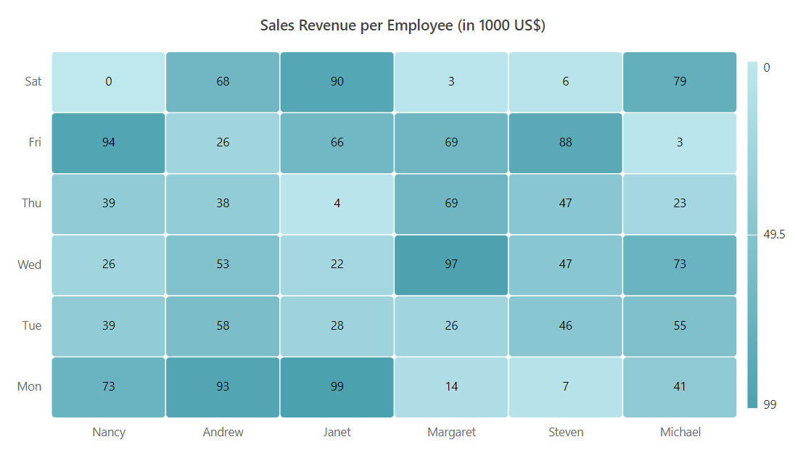
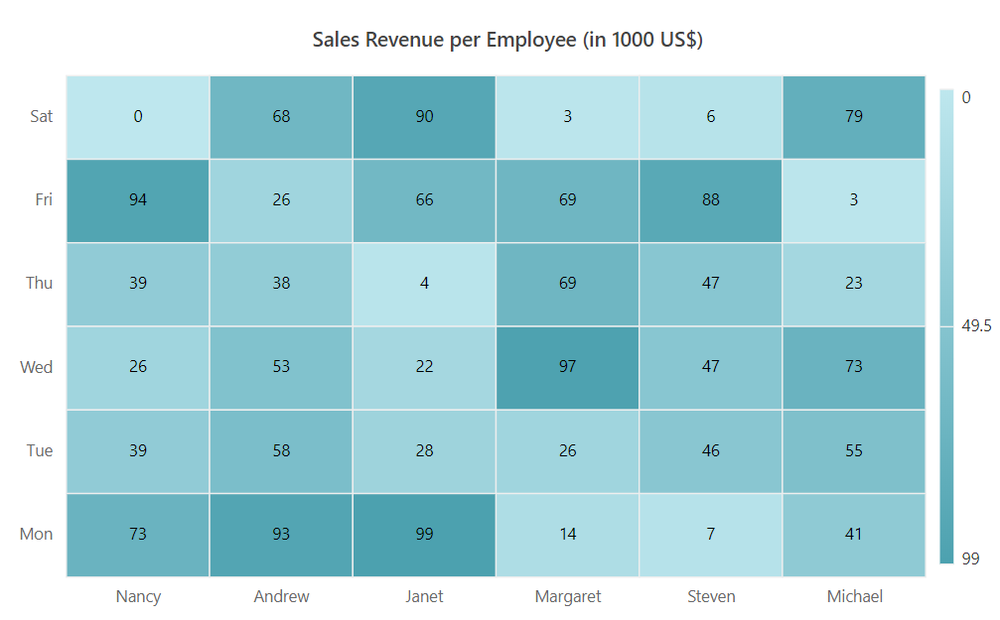
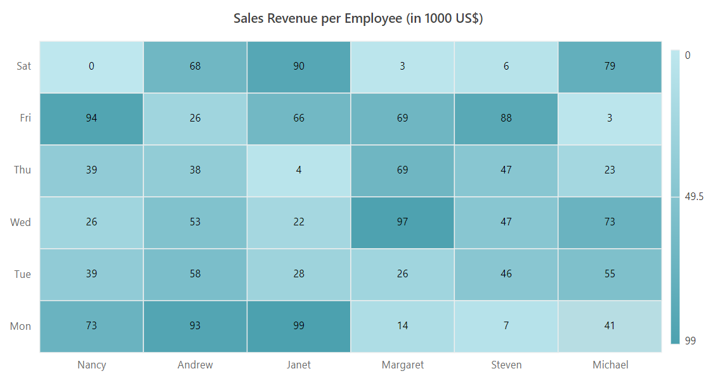
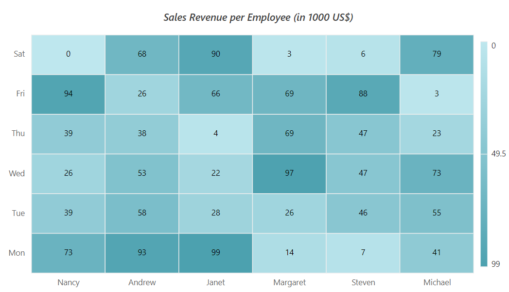
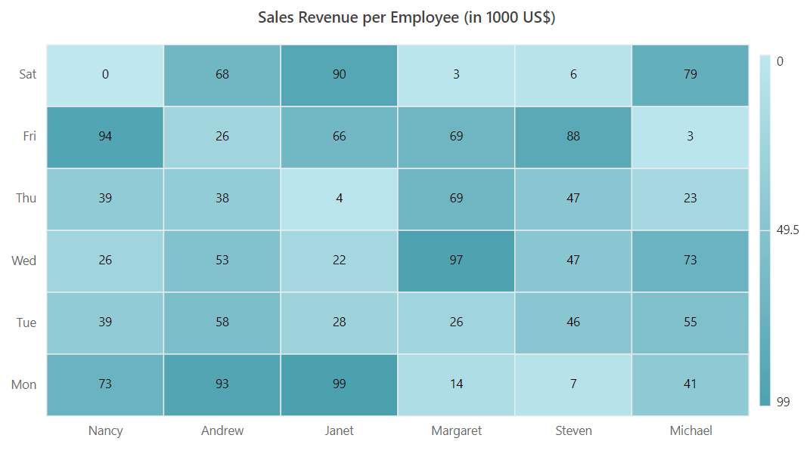
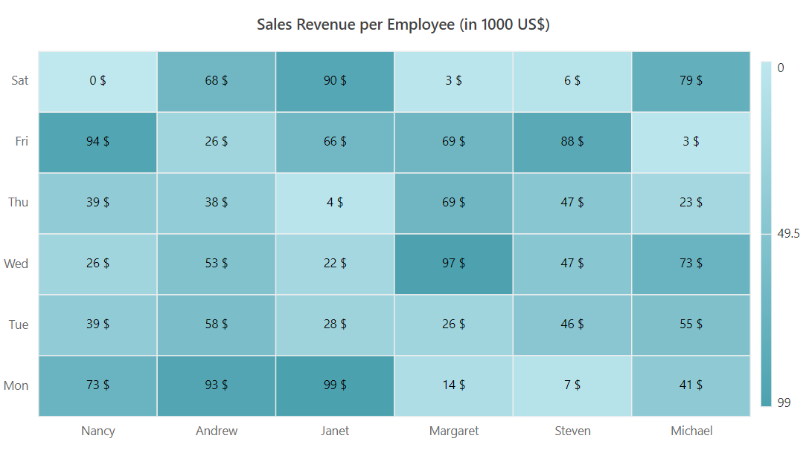

# Appearance in Blazor HeatMap Chart Component

## Cell customizations

You can customize the cell by using the `CellSettings`

### Border

Change the width, color, and radius of the heat map cells by using the `HeatMapCellBorder` tag.

```cshtml

@using Syncfusion.Blazor.HeatMap

<SfHeatMap DataSource="@HeatMapData">
    <HeatMapXAxis Labels="@XAxisLabels"></HeatMapXAxis>
    <HeatMapYAxis Labels="@YAxisLabels"></HeatMapYAxis>
    <HeatMapTitleSettings Text="Sales Revenue per Employee (in 1000 US$)">
    </HeatMapTitleSettings>
    <HeatMapCellSettings ShowLabel="true" TileType="CellType.Rect">
         <HeatMapCellBorder Width = "1" Radius = "4" Color = "White" ></HeatMapCellBorder>
    </HeatMapCellSettings>
    <HeatMapLegendSettings ShowLabel="true"></HeatMapLegendSettings>
</SfHeatMap>

@code{
    int[,] GetDefaultData()
    {
        int[,] dataSource = new int[,]
        {
            {73, 39, 26, 39, 94, 0},
            {93, 58, 53, 38, 26, 68},
            {99, 28, 22, 4, 66, 90},
            {14, 26, 97, 69, 69, 3},
            {7, 46, 47, 47, 88, 6},
            {41, 55, 73, 23, 3, 79},
        };
        return dataSource;
    }
    string[] XAxisLabels = new string[] {"Nancy", "Andrew", "Janet", "Margaret", "Steven", "Michael" };
    string[] YAxisLabels = new string[] { "Mon", "Tue", "Wed", "Thu", "Fri", "Sat" };
    public object HeatMapData { get; set; }
    protected override void OnInitialized()
    {
        HeatMapData = GetDefaultData();
    }
}

```



### Cell highlighting

Enable or disable the cell highlighting while hover over the heat map cells by using the  `EnableCellHighlighting` property.

```cshtml

@using Syncfusion.Blazor.HeatMap

<SfHeatMap DataSource="@HeatMapData">
    <HeatMapXAxis Labels="@XAxisLabels"></HeatMapXAxis>
    <HeatMapYAxis Labels="@YAxisLabels"></HeatMapYAxis>
    <HeatMapTitleSettings Text="Sales Revenue per Employee (in 1000 US$)">
    </HeatMapTitleSettings>
    <HeatMapCellSettings ShowLabel="true" TileType="CellType.Rect" EnableCellHighlighting="true"></HeatMapCellSettings>
    <HeatMapLegendSettings ShowLabel="true" Position="LegendPosition.Right" EnableSmartLegend="true" ToggleVisibility="true"></HeatMapLegendSettings>
</SfHeatMap>

@code{
    int[,] GetDefaultData()
        {
            int[,] dataSource = new int[,]
            {
                {73, 39, 26, 39, 94, 0},
                {93, 58, 53, 38, 26, 68},
                {99, 28, 22, 4, 66, 90},
                {14, 26, 97, 69, 69, 3},
                {7, 46, 47, 47, 88, 6},
                {41, 55, 73, 23, 3, 79}
            };
            return dataSource;
        }
    string[] XAxisLabels = new string[] {"Nancy", "Andrew", "Janet", "Margaret", "Steven", "Michael" };
    string[] YAxisLabels = new string[] { "Mon", "Tue", "Wed", "Thu", "Fri", "Sat" };
    public object HeatMapData { get; set; }
    protected override void OnInitialized()
    {
        HeatMapData = GetDefaultData();
    }
}

```



## Margin

Set the margin for the heat map from its container by using the `HeatMapMargin` property.

```cshtml

@using Syncfusion.Blazor.HeatMap

<SfHeatMap DataSource="@HeatMapData">
    <HeatMapXAxis Labels="@XAxisLabels"></HeatMapXAxis>
    <HeatMapYAxis Labels="@YAxisLabels"></HeatMapYAxis>
    <HeatMapTitleSettings Text="Sales Revenue per Employee (in 1000 US$)">
    </HeatMapTitleSettings>
    <HeatMapCellSettings ShowLabel="true" TileType="CellType.Rect"></HeatMapCellSettings>
    <HeatMapMargin Left="15" Right="15" Top="15" Bottom="15"></HeatMapMargin>
    <HeatMapLegendSettings ShowLabel="true" Position="LegendPosition.Right" EnableSmartLegend="true" ToggleVisibility="true"></HeatMapLegendSettings>
</SfHeatMap>

@code{
     int[,] GetDefaultData()
        {
            int[,] dataSource = new int[,]
            {
                {73, 39, 26, 39, 94, 0},
                {93, 58, 53, 38, 26, 68},
                {99, 28, 22, 4, 66, 90},
                {14, 26, 97, 69, 69, 3},
                {7, 46, 47, 47, 88, 6},
                {41, 55, 73, 23, 3, 79}
            };
            return dataSource;
        }
    string[] XAxisLabels = new string[] {"Nancy", "Andrew", "Janet", "Margaret", "Steven", "Michael" };
    string[] YAxisLabels = new string[] { "Mon", "Tue", "Wed", "Thu", "Fri", "Sat" };
    public object HeatMapData { get; set; }
    protected override void OnInitialized()
    {
        HeatMapData = GetDefaultData();
    }
}

```



## Title

The title is used to provide a quick information about the data plotted in heat map. The `Text` property is used to set the title for heat map. You can also customize text style of a title by using the `HeatMapTitleTextStyle` tag.

```cshtml

@using Syncfusion.Blazor.HeatMap

<SfHeatMap DataSource="@HeatMapData">
    <HeatMapXAxis Labels="@XAxisLabels"></HeatMapXAxis>
    <HeatMapYAxis Labels="@YAxisLabels"></HeatMapYAxis>
    <HeatMapTitleSettings Text="Sales Revenue per Employee (in 1000 US$)">
        <HeatMapTitleTextStyle Size = "15px" FontWeight = "500" FontStyle = "Italic" FontFamily = "Segoe UI"></HeatMapTitleTextStyle>
    </HeatMapTitleSettings>
    <HeatMapCellSettings ShowLabel="true" TileType="CellType.Rect"></HeatMapCellSettings>
    <HeatMapMargin Left="15" Right="15" Top="15" Bottom="15"></HeatMapMargin>
    <HeatMapLegendSettings ShowLabel="true" Position="LegendPosition.Right" EnableSmartLegend="true" ToggleVisibility="true"></HeatMapLegendSettings>
</SfHeatMap>

@code{
    int[,] GetDefaultData()
        {
            int[,] dataSource = new int[,]
            {
                {73, 39, 26, 39, 94, 0},
                {93, 58, 53, 38, 26, 68},
                {99, 28, 22, 4, 66, 90},
                {14, 26, 97, 69, 69, 3},
                {7, 46, 47, 47, 88, 6},
                {41, 55, 73, 23, 3, 79}
            };
            return dataSource;
    }
    string[] XAxisLabels = new string[] {"Nancy", "Andrew", "Janet", "Margaret", "Steven", "Michael" };
    string[] YAxisLabels = new string[] { "Mon", "Tue", "Wed", "Thu", "Fri", "Sat" };
    public object HeatMapData { get; set; }
    protected override void OnInitialized()
    {
        HeatMapData = GetDefaultData();
    }
}

```



## Data label

You can toggle the visibility of data labels by using the `ShowLabel` property. By default, the data label will be visible.

```cshtml

@using Syncfusion.Blazor.HeatMap

<SfHeatMap DataSource="@HeatMapData">
    <HeatMapXAxis Labels="@XAxisLabels"></HeatMapXAxis>
    <HeatMapYAxis Labels="@YAxisLabels"></HeatMapYAxis>
    <HeatMapTitleSettings Text="Sales Revenue per Employee (in 1000 US$)">
    </HeatMapTitleSettings>
    <HeatMapCellSettings ShowLabel="true" TileType="CellType.Rect"></HeatMapCellSettings>
    <HeatMapMargin Left="15" Right="15" Top="15" Bottom="15"></HeatMapMargin>
</SfHeatMap>

@code{
    int[,] GetDefaultData()
        {
            int[,] dataSource = new int[,]
            {
                {73, 39, 26, 39, 94, 0},
                {93, 58, 53, 38, 26, 68},
                {99, 28, 22, 4, 66, 90},
                {14, 26, 97, 69, 69, 3},
                {7, 46, 47, 47, 88, 6},
                {41, 55, 73, 23, 3, 79}
            };
            return dataSource;
        }
    string[] XAxisLabels = new string[] {"Nancy", "Andrew", "Janet", "Margaret", "Steven", "Michael" };
    string[] YAxisLabels = new string[] { "Mon", "Tue", "Wed", "Thu", "Fri", "Sat" };
    public object HeatMapData { get; set; }
    protected override void OnInitialized()
    {
        HeatMapData = GetDefaultData();
    }
}

```



### Text style

You can customize the font family, font size, and color of the data label by using the `HeatMapCellTextStyle` tag in the `HeatMapCellSettings` tag.

```cshtml

@using Syncfusion.Blazor.HeatMap

<SfHeatMap DataSource="@HeatMapData">
    <HeatMapXAxis Labels="@XAxisLabels"></HeatMapXAxis>
    <HeatMapYAxis Labels="@YAxisLabels"></HeatMapYAxis>
    <HeatMapTitleSettings Text="Sales Revenue per Employee (in 1000 US$)">
        <HeatMapTitleTextStyle Size="15px" FontWeight="500" FontStyle="Italic" FontFamily="Segoe UI"></HeatMapTitleTextStyle>
    </HeatMapTitleSettings>
    <HeatMapCellSettings ShowLabel="true" TileType="CellType.Rect">
        <HeatMapCellTextStyle Size="15px" FontWeight="500" FontStyle="Italic" FontFamily="Segoe UI"></HeatMapCellTextStyle>
    </HeatMapCellSettings>
    <HeatMapMargin Left="15" Right="15" Top="15" Bottom="15"></HeatMapMargin>
</SfHeatMap>

@code{
    int[,] GetDefaultData()
    {
        int[,] dataSource = new int[,]
        {
            {73, 39, 26, 39, 94, 0},
            {93, 58, 53, 38, 26, 68},
            {99, 28, 22, 4, 66, 90},
            {14, 26, 97, 69, 69, 3},
            {7, 46, 47, 47, 88, 6},
            {41, 55, 73, 23, 3, 79}
        };
        return dataSource;
    }
    string[] XAxisLabels = new string[] {"Nancy", "Andrew", "Janet", "Margaret", "Steven", "Michael" };
    string[] YAxisLabels = new string[] { "Mon", "Tue", "Wed", "Thu", "Fri", "Sat" };
    public object HeatMapData { get; set; }
    protected override void OnInitialized()
    {
        HeatMapData = GetDefaultData();
    }
}

```


### Format

You can change the format of the data label, such as currency, decimal, percent, etc. by using the `Format` property.

```cshtml

@using Syncfusion.Blazor.HeatMap

<SfHeatMap DataSource="@HeatMapData">
    <HeatMapXAxis Labels="@XAxisLabels"></HeatMapXAxis>
    <HeatMapYAxis Labels="@YAxisLabels"></HeatMapYAxis>
    <HeatMapTitleSettings Text="Sales Revenue per Employee (in 1000 US$)">
    </HeatMapTitleSettings>
    <HeatMapCellSettings ShowLabel="true" TileType="CellType.Rect" Format="{value} $"></HeatMapCellSettings>
    <HeatMapMargin Left="15" Right="15" Top="15" Bottom="15"></HeatMapMargin>
</SfHeatMap>

@code{
    int[,] GetDefaultData()
    {
        int[,] dataSource = new int[,]
        {
            {73, 39, 26, 39, 94, 0},
            {93, 58, 53, 38, 26, 68},
            {99, 28, 22, 4, 66, 90},
            {14, 26, 97, 69, 69, 3},
            {7, 46, 47, 47, 88, 6},
            {41, 55, 73, 23, 3, 79}
        };
        return dataSource;
    }
    string[] XAxisLabels = new string[] {"Nancy", "Andrew", "Janet", "Margaret", "Steven", "Michael" };
    string[] YAxisLabels = new string[] { "Mon", "Tue", "Wed", "Thu", "Fri", "Sat" };
    public object HeatMapData { get; set; }
    protected override void OnInitialized()
    {
        HeatMapData = GetDefaultData();
    }
}

```



### Template

Any HTML elements can be added as a template in the data labels by using the [LabelTemplate](https://help.syncfusion.com/cr/blazor/Syncfusion.Blazor.HeatMap.HeatMapCellSettings.html#Syncfusion_Blazor_HeatMap_HeatMapCellSettings_LabelTemplate) property of [HeatMapCellSettings](https://help.syncfusion.com/cr/blazor/Syncfusion.Blazor.HeatMap.HeatMapCellSettings.html) in the HeatMap.

The following examples show various data binding methods in the HeatMap using the `LabelTemplate` property.

#### Array binding

The data for the corresponding cell from the data source can be received as a **Dictionary<string, string>** type. The **XLabel**, **YLabel**, and **Value** keys can be used to retrieve the x-axis label, y-axis label, and cell value from the dictionary, respectively.

**Table**

The following example demonstrates how to add a data label template for array table binding.

```cshtml

@using Syncfusion.Blazor.HeatMap;

<SfHeatMap DataSource="@HeatMapData">
    <HeatMapTitleSettings Text="Commercial Aviation Accidents and Fatalities by year 2015 - 2017">
        <HeatMapTitleTextStyle Size="15px" FontWeight="500" FontStyle="Normal" FontFamily="Segoe UI"></HeatMapTitleTextStyle>
    </HeatMapTitleSettings>
    <HeatMapXAxis Labels="@XAxisLabels"></HeatMapXAxis>
    <HeatMapYAxis Labels="@YAxisLabels"></HeatMapYAxis>
    <HeatMapCellSettings ShowLabel="true">
        <LabelTemplate>
            @{
                var Template = (context as Dictionary<string, string>);
                <div style="width:25px;height:22px;text-align:center;padding-top:2px;background-color:#5BBB9C; border: 1px solid #000000; border-radius:50%;font-weight:bold;">@Template["Value"]</div>
            }
        </LabelTemplate>
    </HeatMapCellSettings>
    <HeatMapDataSourceSettings IsJsonData="false" AdaptorType="AdaptorType.Table"></HeatMapDataSourceSettings>
</SfHeatMap>

@code {
    public double[,] GetDefaultData()
    {
        double[,] dataSource = new double[,]
        {
            {4, 39, 3, 8, 1, 3 },
            {4, 28, 5, 92, 5, 73 },
            {4, 45, 5, 152, 0, 44 }
        };
        return dataSource;
    }
    public string[] XAxisLabels = new string[] { "2015", "2016", "2017" };
    public string[] YAxisLabels = new string[] { "Jan-Feb", "Mar-Apr", "May-Jun", "Jul-Aug", "Sep-Oct", "Nov-Dec" };
    public object HeatMapData { get; set; }
    protected override void OnInitialized()
    {
        HeatMapData = GetDefaultData();
    }
}

```


**Cell**

The following example demonstrates how to add a data label template for array cell binding.

```cshtml

@using Syncfusion.Blazor.HeatMap;

<SfHeatMap DataSource="@HeatMapData">
    <HeatMapTitleSettings Text="Commercial Aviation Accidents and Fatalities by year 2015 - 2017">
        <HeatMapTitleTextStyle Size="15px" FontWeight="500" FontStyle="Normal" FontFamily="Segoe UI"></HeatMapTitleTextStyle>
    </HeatMapTitleSettings>
    <HeatMapXAxis Labels="@XAxisLabels"></HeatMapXAxis>
    <HeatMapYAxis Labels="@YAxisLabels"></HeatMapYAxis>
    <HeatMapLegendSettings Visible="false"></HeatMapLegendSettings>
    <HeatMapCellSettings>
        <LabelTemplate>
            @{
                var Template = (context as Dictionary<string, string>);
                <div style="width:25px;height:22px;text-align:center;padding-top:2px;background-color:#5BBB9C; border: 1px solid #000000; border-radius:50%;font-weight:bold;">@Template["Value"]</div>
            }
        </LabelTemplate>
    </HeatMapCellSettings>
    <HeatMapDataSourceSettings IsJsonData="false" AdaptorType="AdaptorType.Cell"></HeatMapDataSourceSettings>
</SfHeatMap>

@code {
    public double[,] GetDefaultData()
    {
        double[,] dataSource = new double[,]
            {
                {0, 0, 4, 39}, {0, 1, 3, 8}, {0, 2, 1, 3}, {0, 3, 1, 10}, {0, 4, 4, 4}, {0, 5, 2, 15},
                {1, 0, 4, 28}, {1, 1, 5, 92}, {1, 2, 5, 73}, {1, 3, 3, 1}, {1, 4, 3, 4}, {1, 5, 4, 126},
                {2, 0, 4, 45}, {2, 1, 5, 152}, {2, 2, 0, 44}, {2, 3, 4, 54}, {2, 4, 5, 243}, {2, 5, 2, 45}
            };
        return dataSource;
    }
    public string[] XAxisLabels = new string[] { "2015", "2016", "2017" };
    public string[] YAxisLabels = new string[] { "Jan-Feb", "Mar-Apr", "May-Jun", "Jul-Aug", "Sep-Oct", "Nov-Dec" };
    public object HeatMapData { get; set; }
    protected override void OnInitialized()
    {
        HeatMapData = GetDefaultData();
    }
}

```


#### JSON binding

The value from the data source for the corresponding cell can be displayed in the HeatMap cell as data label template content by including the desired field name from the class object, set in the [DataSource](https://help.syncfusion.com/cr/blazor/Syncfusion.Blazor.HeatMap.SfHeatMap-1.html#Syncfusion_Blazor_HeatMap_SfHeatMap_1_DataSource), in the template content.

**Table**

The following example demonstrates how to add a data label template for JSON table binding.

```cshtml

@using Syncfusion.Blazor.HeatMap;

<SfHeatMap DataSource="@HeatMapData">
    <HeatMapTitleSettings Text="Commercial Aviation Accidents and Fatalities by year 2015 - 2017">
        <HeatMapTitleTextStyle Size="15px" FontWeight="500" FontStyle="Normal" FontFamily="Segoe UI"></HeatMapTitleTextStyle>
    </HeatMapTitleSettings>
    <HeatMapDataSourceSettings IsJsonData="true" AdaptorType="AdaptorType.Table" XDataMapping="Year"></HeatMapDataSourceSettings>
    <HeatMapXAxis Labels="@XLabels"></HeatMapXAxis>
    <HeatMapYAxis Labels="@YLabels"></HeatMapYAxis>
    <HeatMapCellSettings>
        <LabelTemplate>
            @{
                var content = (context as RegionalData);
                if (content != null)
                {
                    <div> </div>
                }
            }
        </LabelTemplate>
    </HeatMapCellSettings>
    <HeatMapPaletteSettings Type="PaletteType.Gradient">
        <HeatMapPalettes>
            <HeatMapPalette Color="#C06C84"></HeatMapPalette>
            <HeatMapPalette Color="#6C5B7B"></HeatMapPalette>
            <HeatMapPalette Color="#355C7D"></HeatMapPalette>
        </HeatMapPalettes>
    </HeatMapPaletteSettings>
</SfHeatMap>

@code
{
    public string[] XLabels = new string[] { "2015", "2016", "2017" };
    public string[] YLabels = new string[] { "Jan_2015", "Feb_2015", "Mar_2016", "Apr_2016", "May_2017" };
    public class RegionalData
    {
        public string? Year { get; set; }
        public string? Image { get; set; }
        public int? Jan_2015 { get; set; }
        public int? Feb_2015 { get; set; }
        public int? Mar_2016 { get; set; }
        public int? Apr_2016 { get; set; }
        public int? May_2017 { get; set; }
    }
    public RegionalData[] HeatMapData = new RegionalData[]{
        new RegionalData {Year = "2017", Image="https://blazor.syncfusion.com/demos/_content/blazor_server_common_net7/images/circular-gauge/football.png", Jan_2015 = 93,Feb_2015 = 101,Mar_2016 = 112,Apr_2016 = 103,May_2017 = 121 },
        new RegionalData {Year = "2017", Image="https://blazor.syncfusion.com/demos/_content/blazor_server_common_net7/images/circular-gauge/football.png", Jan_2015 = 28,Feb_2015 = 30,Mar_2016 = 49,Apr_2016 = 65,May_2017 = 67 },
        new RegionalData {Year = "2017", Image="https://blazor.syncfusion.com/demos/_content/blazor_server_common_net7/images/circular-gauge/football.png", Jan_2015 = 58,Feb_2015 = 63,Mar_2016 = 100,Apr_2016 = 91,May_2017 = 70 },
        new RegionalData {Year = "2016", Image="https://blazor.syncfusion.com/demos/_content/blazor_server_common_net7/images/circular-gauge/golf-ball.png",Jan_2015 = 89,Feb_2015 = 90,Mar_2016 = 60,Apr_2016 = 69,May_2017 = 55 },
        new RegionalData {Year = "2016", Image="https://blazor.syncfusion.com/demos/_content/blazor_server_common_net7/images/circular-gauge/golf-ball.png",Jan_2015 = 56,Feb_2015 = 49,Mar_2016 = 41,Apr_2016 = 44,May_2017 = 42 },
        new RegionalData {Year = "2016", Image="https://blazor.syncfusion.com/demos/_content/blazor_server_common_net7/images/circular-gauge/golf-ball.png",Jan_2015 = 18,Feb_2015 = 37,Mar_2016 = 25,Apr_2016 = 38,May_2017 = 41 },
        new RegionalData {Year = "2015", Image="https://blazor.syncfusion.com/demos/_content/blazor_server_common_net7/images/circular-gauge/basketball.png",Jan_2015 = 38,Feb_2015 = 33,Mar_2016 = 43,Apr_2016 = 35,May_2017 = 42 },
        new RegionalData {Year = "2015", Image="https://blazor.syncfusion.com/demos/_content/blazor_server_common_net7/images/circular-gauge/basketball.png",Jan_2015 = 28,Feb_2015 = 30,Mar_2016 = 32,Apr_2016 = 30,May_2017 = 21 },
        new RegionalData {Year = "2015", Image="https://blazor.syncfusion.com/demos/_content/blazor_server_common_net7/images/circular-gauge/basketball.png",Jan_2015 = 34,Feb_2015 = 32,Mar_2016 = 27,Apr_2016 = 28,May_2017 = 28 }
    };
}

```


**Cell**

The following example demonstrates how to add a data label template for JSON cell binding.

```cshtml

@using Syncfusion.Blazor.HeatMap

<SfHeatMap DataSource="@HeatMapData">
    <HeatMapTitleSettings Text="Commercial Aviation Accidents and Fatalities by year 2015 - 2017">
        <HeatMapTitleTextStyle Size="15px" FontWeight="500" FontStyle="Normal" FontFamily="Segoe UI"></HeatMapTitleTextStyle>
    </HeatMapTitleSettings>
    <HeatMapDataSourceSettings IsJsonData="true" AdaptorType="AdaptorType.Cell" XDataMapping="Year" YDataMapping="Months" ValueMapping="Fatalities"></HeatMapDataSourceSettings>
    <HeatMapXAxis Labels="@XLabels"></HeatMapXAxis>
    <HeatMapYAxis Labels="@YLabels"></HeatMapYAxis>
    <HeatMapCellSettings>
        <LabelTemplate>
            @{
                var content = (context as SampleData);
                if(content != null)
                {
                    <div>Accidents - @content.Accidents</div>
                }
            }
        </LabelTemplate>
    </HeatMapCellSettings>
</SfHeatMap>

@code {
    public string[] XLabels = new string[] { "2015", "2016", "2017" };
    public string[] YLabels = new string[] { "Jan-Feb", "Mar-Apr", "May-Jun", "Jul-Aug", "Sep-Oct", "Nov-Dec" };
    public class SampleData
    {
        public string Year { get; set; }
        public string Months { get; set; }
        public int? Accidents { get; set; }
        public int? Fatalities { get; set; }
    }
    public SampleData[] HeatMapData = new SampleData[] {
        new SampleData  { Year= "2017", Months= "Jan-Feb", Accidents= 4,  Fatalities = 39 },
        new SampleData  { Year= "2017", Months= "Mar-Apr", Accidents= 3,  Fatalities = 8 },
        new SampleData  { Year= "2017", Months= "May-Jun", Accidents= 1,  Fatalities = 3 },
        new SampleData  { Year= "2017", Months= "Jul-Aug", Accidents= 1,  Fatalities = 10 },
        new SampleData  { Year= "2017", Months= "Sep-Oct", Accidents= 4,  Fatalities = 4 },
        new SampleData  { Year= "2017", Months= "Nov-Dec", Accidents= 2,  Fatalities = 15 },
        new SampleData  { Year= "2016", Months= "Jan-Feb", Accidents= 4,  Fatalities = 28 },
        new SampleData  { Year= "2016", Months= "Mar-Apr", Accidents= 5,  Fatalities = 92 },
        new SampleData  { Year= "2016", Months= "May-Jun", Accidents= 5,  Fatalities = 73 },
        new SampleData  { Year= "2016", Months= "Jul-Aug", Accidents= 3,  Fatalities = 1 },
        new SampleData  { Year= "2016", Months= "Sep-Oct", Accidents= 3,  Fatalities = 4 },
        new SampleData  { Year= "2016", Months= "Nov-Dec", Accidents= 4,  Fatalities = 126 },
        new SampleData  { Year= "2015", Months= "Jan-Feb", Accidents= 4,  Fatalities = 45 },
        new SampleData  { Year= "2015", Months= "Mar-Apr", Accidents= 5,  Fatalities = 152 },
        new SampleData  { Year= "2015", Months= "May-Jun", Accidents= 0,  Fatalities = 0 },
        new SampleData  { Year= "2015", Months= "Jul-Aug", Accidents= 4,  Fatalities = 54 },
        new SampleData  { Year= "2015", Months= "Sep-Oct", Accidents= 5,  Fatalities = 243 },
        new SampleData  { Year= "2015", Months= "Nov-Dec", Accidents= 2,  Fatalities = 45 }
        
    };
}

```


## See Also

* [Minimize White Borders in SVG-Based HeatMap Charts](https://support.syncfusion.com/kb/article/20964/how-to-minimize-white-borders-in-svg-based-blazor-heatmap-charts)