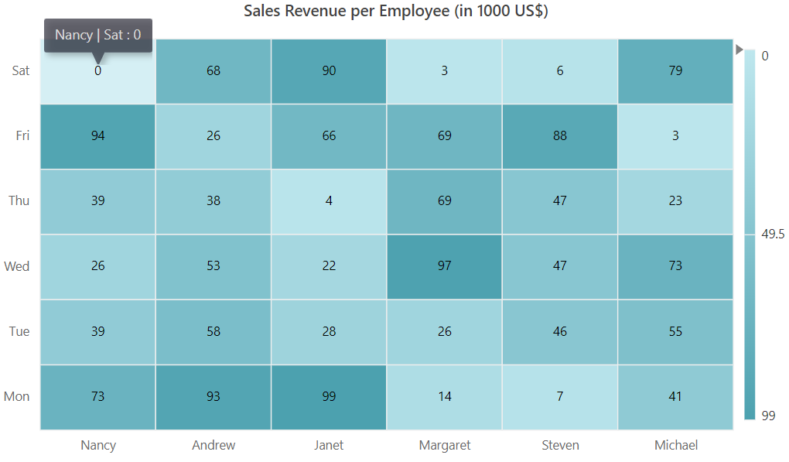
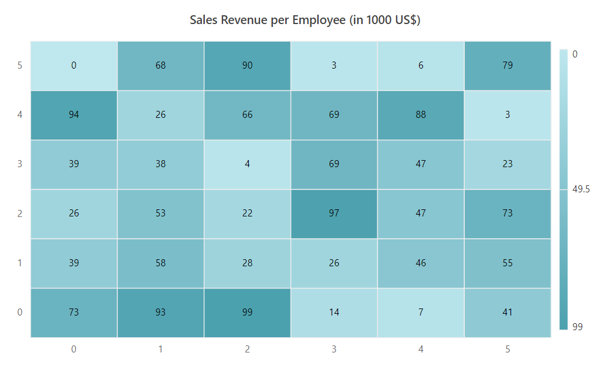
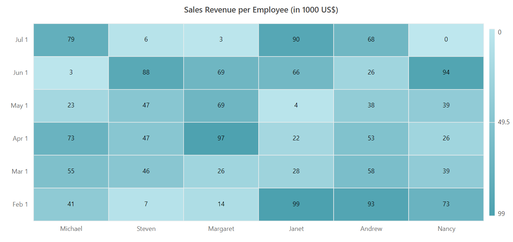
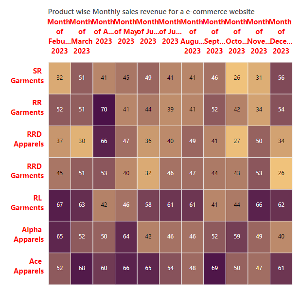
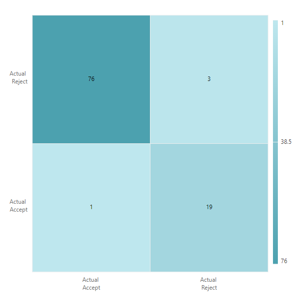
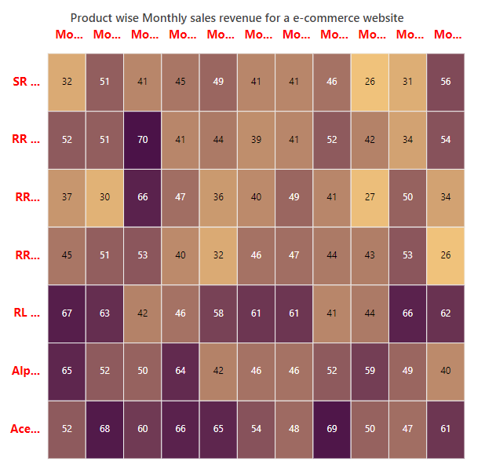
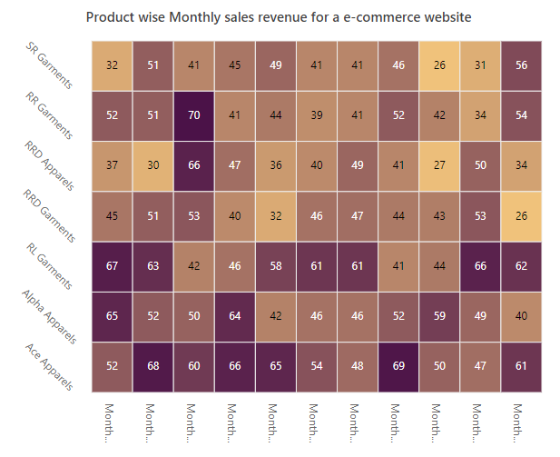
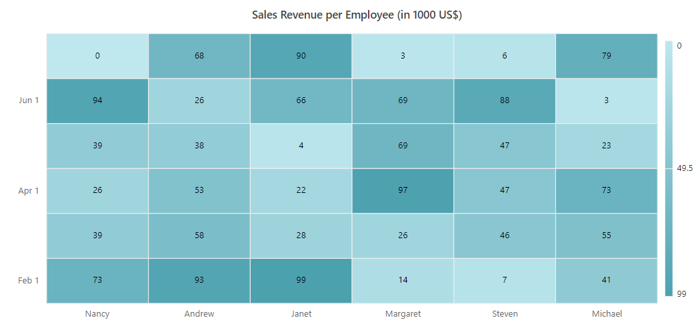
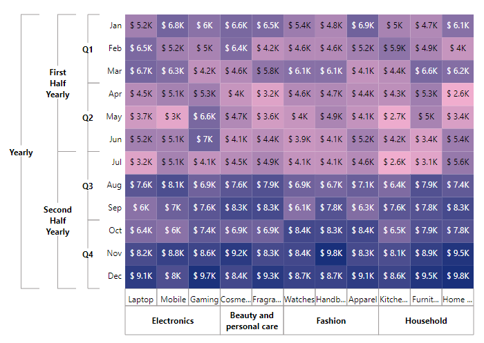

# Axis in Blazor HeatMap Chart Component

The HeatMap Chart includes two axes, X-axis and Y-axis, which display row and column headers for plotting data points. Both axes can be customized for type, format, and appearance.

## Types

The HeatMap Chart supports three axis types, defined by the `ValueType` property:

- **Category**: Represents string values in axis labels.
- **Numeric**: Represents numeric values in axis labels.
- **DateTime**: Represents date-time values in axis labels, with support for custom formats and intervals.

### Category axis

The category axis displays string values as axis labels.

```cshtml

@using Syncfusion.Blazor.HeatMap

<SfHeatMap DataSource="@HeatMapData">
    <HeatMapTitleSettings Text="Sales Revenue per Employee (in 1000 US$)">
    </HeatMapTitleSettings>
    <HeatMapXAxis Labels="@XAxisLabels" ValueType="Syncfusion.Blazor.HeatMap.ValueType.Category"></HeatMapXAxis>
    <HeatMapYAxis Labels="@YAxisLabels" ValueType="Syncfusion.Blazor.HeatMap.ValueType.Category"></HeatMapYAxis>
</SfHeatMap>

@code {
    string[] XAxisLabels = new string[] {"Nancy", "Andrew", "Janet", "Margaret", "Steven", "Michael" };

    string[] YAxisLabels = new string[] { "Mon", "Tue", "Wed", "Thu", "Fri", "Sat" };
    public object HeatMapData { get; set; }

    int[,] GetDefaultData()
    {
        int[,] dataSource = new int[,]
        {
            {73, 39, 26, 39, 94, 0},
            {93, 58, 53, 38, 26, 68},
            {99, 28, 22, 4, 66, 90},
            {14, 26, 97, 69, 69, 3},
            {7, 46, 47, 47, 88, 6},
            {41, 55, 73, 23, 3, 79}
        };
        return dataSource;
    }

    protected override void OnInitialized()
    {
        HeatMapData = GetDefaultData();
    }
}


```



### Numeric axis

The numeric axis displays numeric values as axis labels.

```cshtml

@using Syncfusion.Blazor.HeatMap

<SfHeatMap DataSource="@HeatMapData">
    <HeatMapTitleSettings Text="Sales Revenue per Employee (in 1000 US$)"></HeatMapTitleSettings>
    <HeatMapXAxis Labels="@XAxisLabels" ValueType="Syncfusion.Blazor.HeatMap.ValueType.Numeric"></HeatMapXAxis>
    <HeatMapYAxis Labels="@YAxisLabels" ValueType="Syncfusion.Blazor.HeatMap.ValueType.Numeric"></HeatMapYAxis>
</SfHeatMap>

@code {
    string[] XAxisLabels = new string[] {"Nancy", "Andrew", "Janet", "Margaret", "Steven", "Michael" };

    string[] YAxisLabels = new string[] { "Mon", "Tue", "Wed", "Thu", "Fri", "Sat" };
    public object HeatMapData { get; set; }

    int[,] GetDefaultData()
    {
        int[,] dataSource = new int[,]
        {
            {73, 39, 26, 39, 94, 0},
            {93, 58, 53, 38, 26, 68},
            {99, 28, 22, 4, 66, 90},
            {14, 26, 97, 69, 69, 3},
            {7, 46, 47, 47, 88, 6},
            {41, 55, 73, 23, 3, 79}
        };
        return dataSource;
    }

    protected override void OnInitialized()
    {
        HeatMapData = GetDefaultData();
    }
}

```



### Date-time axis

The date-time axis displays date-time values as axis labels. Use the `Minimum` and `Maximum` properties to define the range.

```cshtml

@using Syncfusion.Blazor.HeatMap

<SfHeatMap DataSource="@HeatMapData">
    <HeatMapTitleSettings Text="Sales Revenue per Employee (in 1000 US$)">
    </HeatMapTitleSettings>
    <HeatMapXAxis Labels="@XAxisLabels" ValueType="Syncfusion.Blazor.HeatMap.ValueType.Category"></HeatMapXAxis>
    <HeatMapYAxis Labels="@YAxisLabels" ValueType="Syncfusion.Blazor.HeatMap.ValueType.DateTime" Minimum="@Minimum" Maximum="@Maximum" IntervalType="IntervalType.Months"></HeatMapYAxis>
</SfHeatMap>

@code {
    public object HeatMapData { get; set; }

    public object Minimum = new DateTime(2007, 2, 1);
    public object Maximum = new DateTime(2007, 7, 1);

    string[] XAxisLabels = new string[] {"Nancy", "Andrew", "Janet", "Margaret", "Steven", "Michael" };
    string[] YAxisLabels = new string[] { "Mon", "Tue", "Wed", "Thu", "Fri", "Sat" };

    int[,] GetDefaultData()
    {
        int[,] dataSource = new int[,]
        {
            {73, 39, 26, 39, 94, 0},
            {93, 58, 53, 38, 26, 68},
            {99, 28, 22, 4, 66, 90},
            {14, 26, 97, 69, 69, 3},
            {7, 46, 47, 47, 88, 6},
            {41, 55, 73, 23, 3, 79}
        };
        return dataSource;
    }

    protected override void OnInitialized()
    {
        HeatMapData = GetDefaultData();
    }
}

```


## Inversed axis

The HeatMap Chart supports inversing the axis origin for both axes, displaying axis labels in reverse order. Enable axis inversion with the `IsInversed` property.

```cshtml

@using Syncfusion.Blazor.HeatMap

<SfHeatMap DataSource="@HeatMapData">
    <HeatMapTitleSettings Text="Sales Revenue per Employee (in 1000 US$)">
    </HeatMapTitleSettings>
    <HeatMapXAxis Labels="@XAxisLabels" ValueType="Syncfusion.Blazor.HeatMap.ValueType.Category" IsInversed="true"></HeatMapXAxis>
    <HeatMapYAxis Labels="@YAxisLabels" ValueType="Syncfusion.Blazor.HeatMap.ValueType.DateTime" Minimum="@Minimum" Maximum="@Maximum" IntervalType="IntervalType.Months"></HeatMapYAxis>
</SfHeatMap>

@code {
    public object HeatMapData { get; set; }

    public object Minimum = new DateTime(2007, 2, 1);
    public object Maximum = new DateTime(2007, 7, 1);

    string[] XAxisLabels = new string[] {"Nancy", "Andrew", "Janet", "Margaret", "Steven", "Michael" };
    string[] YAxisLabels = new string[] { "Mon", "Tue", "Wed", "Thu", "Fri", "Sat" };

    int[,] GetDefaultData()
    {
        int[,] dataSource = new int[,]
        {
            {73, 39, 26, 39, 94, 0},
            {93, 58, 53, 38, 26, 68},
            {99, 28, 22, 4, 66, 90},
            {14, 26, 97, 69, 69, 3},
            {7, 46, 47, 47, 88, 6},
            {41, 55, 73, 23, 3, 79}
        };
        return dataSource;
    }

    protected override void OnInitialized()
    {
        HeatMapData = GetDefaultData();
    }
}

```



## Opposed axis

Axis labels can be placed on the opposite side of their default position using the `OpposedPosition` property.

```cshtml

@using Syncfusion.Blazor.HeatMap

<SfHeatMap DataSource="@HeatMapData">
    <HeatMapTitleSettings Text="Sales Revenue per Employee (in 1000 US$)">
    </HeatMapTitleSettings>
    <HeatMapXAxis Labels="@XAxisLabels" ValueType="Syncfusion.Blazor.HeatMap.ValueType.Category" OpposedPosition="true"></HeatMapXAxis>
    <HeatMapYAxis Labels="@YAxisLabels" ValueType="Syncfusion.Blazor.HeatMap.ValueType.DateTime" Minimum="@Minimum" Maximum="@Maximum" IntervalType="IntervalType.Months"></HeatMapYAxis>
</SfHeatMap>

@code {
    public object HeatMapData { get; set; }

    public object Minimum = new DateTime(2007, 2, 1);
    public object Maximum = new DateTime(2007, 7, 1);

    string[] XAxisLabels = new string[] {"Nancy", "Andrew", "Janet", "Margaret", "Steven", "Michael" };
    string[] YAxisLabels = new string[] { "Mon", "Tue", "Wed", "Thu", "Fri", "Sat" };

    int[,] GetDefaultData()
    {
        int[,] dataSource = new int[,]
        {
            {73, 39, 26, 39, 94, 0},
            {93, 58, 53, 38, 26, 68},
            {99, 28, 22, 4, 66, 90},
            {14, 26, 97, 69, 69, 3},
            {7, 46, 47, 47, 88, 6},
            {41, 55, 73, 23, 3, 79}
        };
        return dataSource;
    }

    protected override void OnInitialized()
    {
        HeatMapData = GetDefaultData();
    }
}

```


## Axis labels customization

### Customizing the text style

Customize axis label text style using the [HeatMapXAxisTextStyle](https://help.syncfusion.com/cr/blazor/Syncfusion.Blazor.HeatMap.HeatMapXAxisTextStyle.html) and [HeatMapYAxisTextStyle](https://help.syncfusion.com/cr/blazor/Syncfusion.Blazor.HeatMap.HeatMapYAxisTextStyle.html) properties. Options include:

- `Color`: used to change label text color.
- `FontFamily`: used to set the font family.
- `FontStyle`: used to set the font style.
- `FontWeight`: used to set the font weight.
- `Size`: used to set the font size.
- `TextAlignment`: used to align the axis labels (**Near**, **Center**, **Far**).
- `TextOverflow`: used to handle label overflow (**None**, **Trim**, **Wrap**).

```cshtml

@using Syncfusion.Blazor.HeatMap

<SfHeatMap DataSource="@HeatMapData">
    <HeatMapTitleSettings Text="Product wise Monthly sales revenue for a e-commerce website">
        <HeatMapTitleTextStyle Size="15px" FontWeight="500" FontStyle="Normal" FontFamily="Segoe UI"></HeatMapTitleTextStyle>
    </HeatMapTitleSettings>
    <HeatMapXAxis Labels="@XAxisLabels" OpposedPosition="true">
        <HeatMapXAxisTextStyle Color="Red" Size="15px" FontWeight="650" FontStyle="Normal" FontFamily="Segoe UI" TextAlignment="Alignment.Center" TextOverflow="TextOverflow.Wrap"></HeatMapXAxisTextStyle>
    </HeatMapXAxis>
    <HeatMapYAxis Labels="@YAxisLabels" MaxLabelLength="70">
        <HeatMapYAxisTextStyle Color="Red" Size="15px" FontWeight="650" FontStyle="Normal" FontFamily="Segoe UI" TextAlignment="Alignment.Center" TextOverflow="TextOverflow.Wrap"></HeatMapYAxisTextStyle>
    </HeatMapYAxis>
    <HeatMapPaletteSettings>
        <HeatMapPalettes>
            <HeatMapPalette Color="#F0C27B"></HeatMapPalette>
            <HeatMapPalette Color="#4B1248"></HeatMapPalette>
        </HeatMapPalettes>
    </HeatMapPaletteSettings>
    <HeatMapLegendSettings Visible="false">
    </HeatMapLegendSettings>
</SfHeatMap>

@code {
    public object HeatMapData { get; set; }

    string[] XAxisLabels = new string[] { "Month of Feburary 2023", "Month of March 2023", "Month of April 2023", "Month of May 2023", "Month of June 2023", "Month of July 2023", "Month of August 2023", "Month of September 2023", "Month of October 2023", "Month of November 2023", "Month of December 2023" };

    string[] YAxisLabels = new string[] { "Ace Apparels", "Alpha Apparels", "RL Garments", "RRD Garments", "RRD Apparels", "RR Garments", "SR Garments" };

    int[,] GetDefaultData()
    {
        int[,] dataSource = new int[,]
        {
            {52, 65, 67, 45, 37, 52, 32},
            {68, 52, 63, 51, 30, 51, 51},
            {60, 50, 42, 53, 66, 70, 41},
            {66, 64, 46, 40, 47, 41, 45},
            {65, 42, 58, 32, 36, 44, 49},
            {54, 46, 61, 46, 40, 39, 41},
            {48, 46, 61, 47, 49, 41, 41},
            {69, 52, 41, 44, 41, 52, 46},
            {50, 59, 44, 43, 27, 42, 26},
            {47, 49, 66, 53, 50, 34, 31},
            {61, 40, 62, 26, 34, 54, 56}
        };
        return dataSource;
    }

    protected override void OnInitialized()
    {
        HeatMapData = GetDefaultData();
    }
}

```



### Providing line breaks

Improve readability by adding line breaks to axis labels using the **"<br>"** character.

```cshtml

@using Syncfusion.Blazor.HeatMap

<SfHeatMap DataSource="@HeatMapData">
    <HeatMapXAxis Labels="@XAxisLabels"></HeatMapXAxis>
    <HeatMapYAxis Labels="@YAxisLabels" MaxLabelLength="60"></HeatMapYAxis>
</SfHeatMap>

@code {
    public object HeatMapData { get; set; }

    string[] XAxisLabels = new string[] { "Actual<br>Accept", "Actual<br>Reject" };
    string[] YAxisLabels = new string[] { "Actual<br>Accept", "Actual<br>Reject" };

    int[,] GetDefaultData()
    {
        int[,] dataSource = new int[,]
        {
            {1, 76},
            {19, 3}
        };
        return dataSource;
    }

    protected override void OnInitialized()
    {
        HeatMapData = GetDefaultData();
    }
}

```



### Customizing axis labels when intersecting

Handle intersecting axis labels using the [LabelIntersectAction](https://help.syncfusion.com/cr/blazor/Syncfusion.Blazor.HeatMap.HeatMapCommonAxis.html#Syncfusion_Blazor_HeatMap_HeatMapCommonAxis_LabelIntersectAction) property. Options include:

- **None**: No action on intersection.
- **Trim**: Trim labels when they intersect.
- **Rotate45**: Rotate labels 45 degrees.
- **MultipleRows**: Display labels in multiple rows.

```cshtml

@using Syncfusion.Blazor.HeatMap

<SfHeatMap DataSource="@HeatMapData">
    <HeatMapTitleSettings Text="Product wise Monthly sales revenue for a e-commerce website">
        <HeatMapTitleTextStyle Size="15px" FontWeight="500" FontStyle="Normal" FontFamily="Segoe UI"></HeatMapTitleTextStyle>
    </HeatMapTitleSettings>
    <HeatMapXAxis Labels="@XAxisLabels" OpposedPosition="true" EnableTrim="true" LabelIntersectAction="LabelIntersectAction.Trim">
        <HeatMapXAxisTextStyle Color="Red" Size="15px" FontWeight="650" FontStyle="Normal" FontFamily="Segoe UI" TextAlignment="Alignment.Center" TextOverflow="TextOverflow.Wrap"></HeatMapXAxisTextStyle>
    </HeatMapXAxis>
    <HeatMapYAxis Labels="@YAxisLabels" EnableTrim="true" LabelIntersectAction="LabelIntersectAction.Trim">
        <HeatMapYAxisTextStyle Color="Red" Size="15px" FontWeight="650" FontStyle="Normal" FontFamily="Segoe UI" TextAlignment="Alignment.Center" TextOverflow="TextOverflow.Wrap"></HeatMapYAxisTextStyle>
    </HeatMapYAxis>
    <HeatMapPaletteSettings>
        <HeatMapPalettes>
            <HeatMapPalette Color="#F0C27B"></HeatMapPalette>
            <HeatMapPalette Color="#4B1248"></HeatMapPalette>
        </HeatMapPalettes>
    </HeatMapPaletteSettings>
    <HeatMapLegendSettings Visible="false">
    </HeatMapLegendSettings>
</SfHeatMap>

@code {
    public object HeatMapData { get; set; }

    string[] XAxisLabels = new string[] { "Month of Feburary 2023", "Month of March 2023", "Month of April 2023", "Month of May 2023", "Month of June 2023", "Month of July 2023", "Month of August 2023", "Month of September 2023", "Month of October 2023", "Month of November 2023", "Month of December 2023" };

    string[] YAxisLabels = new string[] { "Ace Apparels", "Alpha Apparels", "RL Garments", "RRD Garments", "RRD Apparels", "RR Garments", "SR Garments" };

    int[,] GetDefaultData()
    {
        int[,] dataSource = new int[,]
        {
            {52, 65, 67, 45, 37, 52, 32},
            {68, 52, 63, 51, 30, 51, 51},
            {60, 50, 42, 53, 66, 70, 41},
            {66, 64, 46, 40, 47, 41, 45},
            {65, 42, 58, 32, 36, 44, 49},
            {54, 46, 61, 46, 40, 39, 41},
            {48, 46, 61, 47, 49, 41, 41},
            {69, 52, 41, 44, 41, 52, 46},
            {50, 59, 44, 43, 27, 42, 26},
            {47, 49, 66, 53, 50, 34, 31},
            {61, 40, 62, 26, 34, 54, 56}
        };
        return dataSource;
    }

    protected override void OnInitialized()
    {
        HeatMapData = GetDefaultData();
    }
}

```



### Rotating axis labels

Rotate axis labels to a desired angle using the [LabelRotation](https://help.syncfusion.com/cr/blazor/Syncfusion.Blazor.HeatMap.HeatMapCommonAxis.html#Syncfusion_Blazor_HeatMap_HeatMapCommonAxis_LabelRotation) property.

```cshtml

@using Syncfusion.Blazor.HeatMap

<SfHeatMap DataSource="@HeatMapData">
    <HeatMapTitleSettings Text="Product wise Monthly sales revenue for a e-commerce website">
        <HeatMapTitleTextStyle Size="15px" FontWeight="500" FontStyle="Normal" FontFamily="Segoe UI"></HeatMapTitleTextStyle>
    </HeatMapTitleSettings>
    <HeatMapXAxis Labels="@XAxisLabels" LabelRotation="90" OpposedPosition="true">
    </HeatMapXAxis>
    <HeatMapYAxis Labels="@YAxisLabels" LabelRotation="45">
    </HeatMapYAxis>
    <HeatMapPaletteSettings>
        <HeatMapPalettes>
            <HeatMapPalette Color="#F0C27B"></HeatMapPalette>
            <HeatMapPalette Color="#4B1248"></HeatMapPalette>
        </HeatMapPalettes>
    </HeatMapPaletteSettings>
    <HeatMapLegendSettings Visible="false">
    </HeatMapLegendSettings>
</SfHeatMap>

@code {
    public object HeatMapData { get; set; }

    string[] XAxisLabels = new string[] { "Month of Feburary 2023", "Month of March 2023", "Month of April 2023", "Month of May 2023", "Month of June 2023", "Month of July 2023", "Month of August 2023", "Month of September 2023", "Month of October 2023", "Month of November 2023", "Month of December 2023" };
    
    string[] YAxisLabels = new string[] { "Ace Apparels", "Alpha Apparels", "RL Garments", "RRD Garments", "RRD Apparels", "RR Garments", "SR Garments" };

    int[,] GetDefaultData()
    {
        int[,] dataSource = new int[,]
        {
            {52, 65, 67, 45, 37, 52, 32},
            {68, 52, 63, 51, 30, 51, 51},
            {60, 50, 42, 53, 66, 70, 41},
            {66, 64, 46, 40, 47, 41, 45},
            {65, 42, 58, 32, 36, 44, 49},
            {54, 46, 61, 46, 40, 39, 41},
            {48, 46, 61, 47, 49, 41, 41},
            {69, 52, 41, 44, 41, 52, 46},
            {50, 59, 44, 43, 27, 42, 26},
            {47, 49, 66, 53, 50, 34, 31},
            {61, 40, 62, 26, 34, 54, 56}
        };
        return dataSource;
    }

    protected override void OnInitialized()
    {
        HeatMapData = GetDefaultData();
    }
}

```



### Label formatting

Format axis labels using the [LabelFormat](https://help.syncfusion.com/cr/blazor/Syncfusion.Blazor.HeatMap.HeatMapCommonAxis.html#Syncfusion_Blazor_HeatMap_HeatMapCommonAxis_LabelFormat) property. Use global string formats (e.g., 'P', 'C') or custom formats (e.g., '{value}°C').

```cshtml

@using Syncfusion.Blazor.HeatMap

<SfHeatMap DataSource="@HeatMapData">
    <HeatMapTitleSettings Text="Sales Revenue per Employee (in 1000 US$)">
    </HeatMapTitleSettings>
    <HeatMapXAxis Labels="@XAxisLabels" ValueType="Syncfusion.Blazor.HeatMap.ValueType.Category"></HeatMapXAxis>
    <HeatMapYAxis Labels="@YAxisLabels" ValueType="Syncfusion.Blazor.HeatMap.ValueType.Numeric"  LabelFormat="${value}"></HeatMapYAxis>
</SfHeatMap>

@code {
    public object HeatMapData { get; set; }

    public object Minimum = new DateTime(2007, 2, 1);
    public object Maximum = new DateTime(2007, 7, 1);

    string[] XAxisLabels = new string[] {"Nancy", "Andrew", "Janet", "Margaret", "Steven", "Michael" };
    string[] YAxisLabels = new string[] { "Mon", "Tue", "Wed", "Thu", "Fri", "Sat" };

    int[,] GetDefaultData()
    {
        int[,] dataSource = new int[,]
        {
            {73, 39, 26, 39, 94, 0},
            {93, 58, 53, 38, 26, 68},
            {99, 28, 22, 4, 66, 90},
            {14, 26, 97, 69, 69, 3},
            {7, 46, 47, 47, 88, 6},
            {41, 55, 73, 23, 3, 79}
        };
        return dataSource;
    }

    protected override void OnInitialized()
    {
        HeatMapData = GetDefaultData();
    }
}

```


## Axis intervals

Set intervals between axis labels using the `Interval` property. For date-time axes, use the `IntervalType` property to specify the interval mode.

```cshtml

@using Syncfusion.Blazor.HeatMap

<SfHeatMap DataSource="@HeatMapData">
    <HeatMapTitleSettings Text="Sales Revenue per Employee (in 1000 US$)">
    </HeatMapTitleSettings>
    <HeatMapXAxis Labels="@XAxisLabels" ValueType="Syncfusion.Blazor.HeatMap.ValueType.Category"></HeatMapXAxis>
    <HeatMapYAxis Labels="@YAxisLabels" ValueType="Syncfusion.Blazor.HeatMap.ValueType.DateTime" Minimum="@Minimum" Interval=2 Maximum="@Maximum" IntervalType="IntervalType.Months"></HeatMapYAxis>
</SfHeatMap>

@code {
    public object HeatMapData { get; set; }

    public object Minimum = new DateTime(2007, 2, 1);
    public object Maximum = new DateTime(2007, 7, 1);

    string[] XAxisLabels = new string[] { "Nancy", "Andrew", "Janet", "Margaret", "Steven", "Michael" };
    string[] YAxisLabels = new string[] { "Mon", "Tue", "Wed", "Thu", "Fri", "Sat" };

    int[,] GetDefaultData()
    {
        int[,] dataSource = new int[,]
        {
        {73, 39, 26, 39, 94, 0},
        {93, 58, 53, 38, 26, 68},
        {99, 28, 22, 4, 66, 90},
        {14, 26, 97, 69, 69, 3},
        {7, 46, 47, 47, 88, 6},
        {41, 55, 73, 23, 3, 79}
            };
        return dataSource;
    }

    protected override void OnInitialized()
    {
        HeatMapData = GetDefaultData();
    }
}

```



## Axis label increment

Display axis labels at regular intervals using the `Increment` property. The default value is 1.

```cshtml

@using Syncfusion.Blazor.HeatMap

<SfHeatMap DataSource="@HeatMapData">
    <HeatMapTitleSettings Text="Sales Revenue per Employee (in 1000 US$)">
    </HeatMapTitleSettings>
    <HeatMapXAxis Labels="@XAxisLabels" ValueType="Syncfusion.Blazor.HeatMap.ValueType.Numeric" Increment=2></HeatMapXAxis>
    <HeatMapYAxis Labels="@YAxisLabels" ValueType="Syncfusion.Blazor.HeatMap.ValueType.Numeric" Increment=3></HeatMapYAxis>
</SfHeatMap>

@code {
    public object HeatMapData { get; set; }

    string[] XAxisLabels = new string[] { "Nancy", "Andrew", "Janet", "Margaret", "Steven", "Michael" };
    string[] YAxisLabels = new string[] { "Mon", "Tue", "Wed", "Thu", "Fri", "Sat" };

    int[,] GetDefaultData()
    {
        int[,] dataSource = new int[,]
        {
        {73, 39, 26, 39, 94, 0},
        {93, 58, 53, 38, 26, 68},
        {99, 28, 22, 4, 66, 90},
        {14, 26, 97, 69, 69, 3},
        {7, 46, 47, 47, 88, 6},
        {41, 55, 73, 23, 3, 79}
        };
        return dataSource;
    }

    protected override void OnInitialized()
    {
        HeatMapData = GetDefaultData();
    }
}

```


## Multilevel labels

Multilevel labels group axis labels into categories, displayed as a single label. Use multiple [HeatMapMultiLevelLabel](https://help.syncfusion.com/cr/blazor/Syncfusion.Blazor.HeatMap.HeatMapMultiLevelLabels.html) tags to add levels.

Customize multilevel labels with these properties:
* [Overflow](https://help.syncfusion.com/cr/blazor/Syncfusion.Blazor.HeatMap.HeatMapMultiLevelLabel.html#Syncfusion_Blazor_HeatMap_HeatMapMultiLevelLabel_Overflow) - It is used to trim or wrap the multilevel labels when the label overflows the intended space. NOTE: This property is only for x-axis.
* [Alignment](https://help.syncfusion.com/cr/blazor/Syncfusion.Blazor.HeatMap.HeatMapMultiLevelLabel.html#Syncfusion_Blazor_HeatMap_HeatMapMultiLevelLabel_Alignment) - It is used to place and align the multilevel labels.
* [MaximumTextWidth](https://help.syncfusion.com/cr/blazor/Syncfusion.Blazor.HeatMap.HeatMapAxisMultiLevelCategories.html#Syncfusion_Blazor_HeatMap_HeatMapAxisMultiLevelCategories_MaximumTextWidth) - It is used to set the maximum width of the text. When the text length exceeds the maximum text width, the overflow action will be performed.
* [HeatMapAxisMultiLevelLabelsTextStyle](https://help.syncfusion.com/cr/blazor/Syncfusion.Blazor.HeatMap.HeatMapAxisMultiLevelLabelsTextStyle.html) - It is used to customize the font style of the multilevel labels.
* [HeatMapXAxisMultiLevelLabelBorder](https://help.syncfusion.com/cr/blazor/Syncfusion.Blazor.HeatMap.HeatMapXAxisMultiLevelLabelBorder.html) - It is used to customize the border of the multilevel labels displayed in the x-axis.
* [HeatMapYAxisMultiLevelLabelBorder](https://help.syncfusion.com/cr/blazor/Syncfusion.Blazor.HeatMap.HeatMapYAxisMultiLevelLabelBorder.html) - It is used to customize the border of the multilevel labels displayed in the y-axis.

```cshtml

@using Syncfusion.Blazor.HeatMap

<SfHeatMap DataSource="@DataSource">
    <HeatMapEvents TooltipRendering="@TooltipRendering" CellRendering="@CellRender"></HeatMapEvents>
    <HeatMapXAxis Labels="@XLabels">
        <HeatMapXAxisTextStyle Color="Black"></HeatMapXAxisTextStyle>
        <HeatMapAxisLabelBorder Width="1" Type="BorderType.Rectangle" Color="#a19d9d"></HeatMapAxisLabelBorder>
        <HeatMapMultiLevelLabels>
            <HeatMapMultiLevelLabel>
                <HeatMapXAxisMultiLevelLabelBorder Width="1" Type="BorderType.Rectangle" Color="#a19d9d"></HeatMapXAxisMultiLevelLabelBorder>
                <HeatMapAxisMultiLevelLabelsTextStyle Color="Black" FontWeight="Bold"></HeatMapAxisMultiLevelLabelsTextStyle>
                <HeatMapAxisMultiLevelCategories Start="0" End="2" Text="Electronics">
                </HeatMapAxisMultiLevelCategories>
                <HeatMapAxisMultiLevelCategories Start="3" End="4" Text="Beauty and personal care">
                </HeatMapAxisMultiLevelCategories>
                <HeatMapAxisMultiLevelCategories Start="5" End="7" Text="Fashion">
                </HeatMapAxisMultiLevelCategories>
                <HeatMapAxisMultiLevelCategories Start="8" End="10" Text="Household">
                </HeatMapAxisMultiLevelCategories>
            </HeatMapMultiLevelLabel>
        </HeatMapMultiLevelLabels>
    </HeatMapXAxis>
    <HeatMapYAxis Labels="@YLabels" IsInversed=true>
        <HeatMapAxisLabelBorder Width="0"></HeatMapAxisLabelBorder>
        <HeatMapYAxisTextStyle Color="Black"></HeatMapYAxisTextStyle>
        <HeatMapMultiLevelLabels>
            <HeatMapMultiLevelLabel>
                <HeatMapYAxisMultiLevelLabelBorder Width="1" Type="BorderType.Brace" Color="#a19d9d"></HeatMapYAxisMultiLevelLabelBorder>
                <HeatMapAxisMultiLevelLabelsTextStyle Color="Black" FontWeight="Bold"></HeatMapAxisMultiLevelLabelsTextStyle>
                <HeatMapAxisMultiLevelCategories Start="0" End="2" Text="Q1">
                </HeatMapAxisMultiLevelCategories>
                <HeatMapAxisMultiLevelCategories Start="3" End="5" Text="Q2">
                </HeatMapAxisMultiLevelCategories>
                <HeatMapAxisMultiLevelCategories Start="6" End="8" Text="Q3">
                </HeatMapAxisMultiLevelCategories>
                <HeatMapAxisMultiLevelCategories Start="9" End="11" Text="Q4">
                </HeatMapAxisMultiLevelCategories>
            </HeatMapMultiLevelLabel>
            <HeatMapMultiLevelLabel>
                <HeatMapYAxisMultiLevelLabelBorder Width="1" Type="BorderType.Brace" Color="#a19d9d"></HeatMapYAxisMultiLevelLabelBorder>
                <HeatMapAxisMultiLevelLabelsTextStyle Color="Black" FontWeight="Bold"></HeatMapAxisMultiLevelLabelsTextStyle>
                <HeatMapAxisMultiLevelCategories Start="0" End="5" Text="First Half Yearly">
                </HeatMapAxisMultiLevelCategories>
                <HeatMapAxisMultiLevelCategories Start="6" End="11" Text="Second Half Yearly">
                </HeatMapAxisMultiLevelCategories>
            </HeatMapMultiLevelLabel>
            <HeatMapMultiLevelLabel>
                <HeatMapYAxisMultiLevelLabelBorder Width="1" Type="BorderType.Brace" Color="#a19d9d"></HeatMapYAxisMultiLevelLabelBorder>
                <HeatMapAxisMultiLevelLabelsTextStyle Color="Black" FontWeight="Bold"></HeatMapAxisMultiLevelLabelsTextStyle>
                <HeatMapAxisMultiLevelCategories Start="0" End="11" Text="Yearly">
                </HeatMapAxisMultiLevelCategories>
            </HeatMapMultiLevelLabel>
        </HeatMapMultiLevelLabels>
    </HeatMapYAxis>
    <HeatMapCellSettings ShowLabel="true" Format="$ {value}K">
        <HeatMapCellBorder Width="0"></HeatMapCellBorder>
    </HeatMapCellSettings>
    <HeatMapPaletteSettings>
        <HeatMapPalettes>
            <HeatMapPalette Color="#F0ADCE"></HeatMapPalette>
            <HeatMapPalette Color="#19307B"></HeatMapPalette>
        </HeatMapPalettes>
    </HeatMapPaletteSettings>
    <HeatMapLegendSettings Visible="false">
    </HeatMapLegendSettings>
    <HeatMapTooltipSettings Enable="true">
        <HeatMapFont Size="12px" FontWeight="500"></HeatMapFont>
    </HeatMapTooltipSettings>
</SfHeatMap>

@code {
    public string[] XLabels = new string[] { "Laptop", "Mobile", "Gaming", "Cosmetics", "Fragrance", "Watches", "Handbags", "Apparel", "Kitchenware", "Furniture", "Home Decor" };

    public string[] YLabels = new string[] { "Jan", "Feb", "Mar", "Apr", "May", "Jun", "Jul", "Aug", "Sep", "Oct", "Nov", "Dec" };
    int[,] DataSource;

    public void TooltipRendering(TooltipEventArgs args)
    {
        args.Content = new string[] { args.XLabel + " | " + args.YLabel + " : $ " + args.Value + "K" };
    }

    public void CellRender(HeatMapCellRenderEventArgs args)
    {
        string CellValue = (double.Parse(args.CellValue) / 10).ToString();
        args.CellValue = CellValue;
    }

    public static int[,] GetMultiLevelData()
    {
        int[,] dataSource = new int[,]
        {
            {52, 65, 67, 45, 37, 52, 32, 76, 60, 64, 82, 91},
            {68, 52, 63, 51, 30, 51, 51, 81, 70, 60, 88, 80},
            {60, 50, 42, 53, 66, 70, 41, 69, 76, 74, 86, 97},
            {66, 64, 46, 40, 47, 41, 45, 76, 83, 69, 92, 84},
            {65, 42, 58, 32, 36, 44, 49, 79, 83, 69, 83, 93},
            {54, 46, 61, 46, 40, 39, 41, 69, 61, 84, 84, 87},
            {48, 46, 61, 47, 49, 41, 41, 67, 78, 83, 98, 87},
            {69, 52, 41, 44, 41, 52, 46, 71, 63, 84, 83, 91},
            {50, 59, 44, 43, 27, 42, 26, 64, 76, 65, 81, 86},
            {47, 49, 66, 53, 50, 34, 31, 79, 78, 79, 89, 95},
            {61, 40, 62, 26, 34, 54, 56, 74, 83, 78, 95, 98}
        };
        return dataSource;
    }

    protected override void OnInitialized()
    {
        DataSource = GetMultiLevelData();
    }
}

```

