# Blazor HeatMap Chart Axis

The Blazor HeatMap Chart plots data on two axes: the X axis (columns) and the Y axis (rows). Both axes support axis `ValueType`, formatting, label rotation, intervals, and additional customization such as inversed and opposed positioning.

## Types

The `ValueType` property of an axis controls the data type of its labels. The following values are supported.

| `ValueType` | Description | Default | Available labels |
| --- | --- | --- | --- |
| `Category` | Renders string labels (the default). | Yes | `string[]` |
| `Numeric` | Renders numeric labels with optional `Minimum`/`Maximum`/`Interval`. | No | Numeric array |
| `DateTime` | Renders date-time labels using `Minimum`, `Maximum`, and `IntervalType`. | No | DateTime array |

### Category Axis

Category is the default `ValueType`. Use it to represent string labels on an axis.

```cshtml

@using Syncfusion.Blazor.HeatMap

<SfHeatMap DataSource="@HeatMapData">
    <HeatMapTitleSettings Text="Sales Revenue per Employee (in 1000 US$)">
    </HeatMapTitleSettings>
    <HeatMapXAxis Labels="@XAxisLabels" ValueType="Syncfusion.Blazor.HeatMap.ValueType.Category"></HeatMapXAxis>
    <HeatMapYAxis Labels="@YAxisLabels" ValueType="Syncfusion.Blazor.HeatMap.ValueType.Category"></HeatMapYAxis>
</SfHeatMap>

@code{
    int[,] GetDefaultData()
    {
        int[,] dataSource = new int[,]
        {
            {73, 39, 26, 39, 94, 0},
            {93, 58, 53, 38, 26, 68},
            {99, 28, 22, 4, 66, 90},
            {14, 26, 97, 69, 69, 3},
            {7, 46, 47, 47, 88, 6},
            {41, 55, 73, 23, 3, 79}
        };
        return dataSource;
    }
    string[] XAxisLabels = new string[] {"Nancy", "Andrew", "Janet", "Margaret", "Steven", "Michael" };
    string[] YAxisLabels = new string[] { "Mon", "Tue", "Wed", "Thu", "Fri", "Sat" };
    public object HeatMapData { get; set; }
    protected override void OnInitialized()
    {
        HeatMapData = GetDefaultData();
    }
}


```

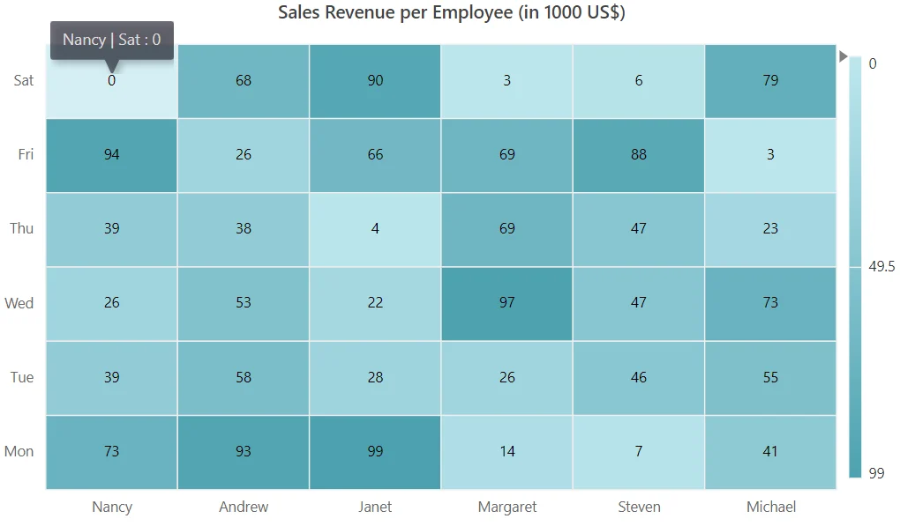

### Numeric Axis

Use the Numeric axis type to render numeric values as axis labels. Pair it with `Minimum`, `Maximum`, and `Interval` properties to control the numeric range and step.

```cshtml

@using Syncfusion.Blazor.HeatMap

<SfHeatMap DataSource="@HeatMapData">
    <HeatMapTitleSettings Text="Sales Revenue per Employee (in 1000 US$)"></HeatMapTitleSettings>
    <HeatMapXAxis Labels="@XAxisLabels" ValueType="Syncfusion.Blazor.HeatMap.ValueType.Numeric"></HeatMapXAxis>
    <HeatMapYAxis Labels="@YAxisLabels" ValueType="Syncfusion.Blazor.HeatMap.ValueType.Numeric"></HeatMapYAxis>
</SfHeatMap>

@code{
    int[,] GetDefaultData()
    {
        int[,] dataSource = new int[,]
        {
            {73, 39, 26, 39, 94, 0},
            {93, 58, 53, 38, 26, 68},
            {99, 28, 22, 4, 66, 90},
            {14, 26, 97, 69, 69, 3},
            {7, 46, 47, 47, 88, 6},
            {41, 55, 73, 23, 3, 79}
        };
        return dataSource;
    }
    string[] XAxisLabels = new string[] {"Nancy", "Andrew", "Janet", "Margaret", "Steven", "Michael" };
    string[] YAxisLabels = new string[] { "Mon", "Tue", "Wed", "Thu", "Fri", "Sat" };
    public object HeatMapData { get; set; }
    protected override void OnInitialized()
    {
        HeatMapData = GetDefaultData();
    }
}

```

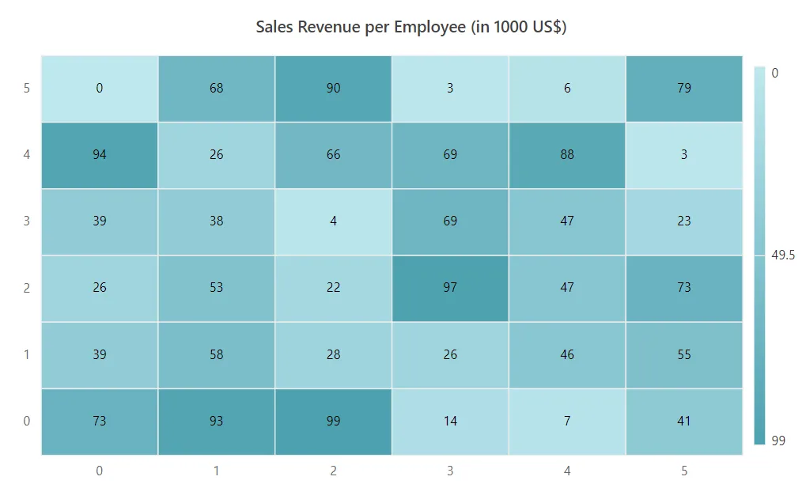

### Date-Time Axis

Use the Date-Time axis type to render date-time values as axis labels. Use the `Minimum` and `Maximum` properties to define the start and end date/time, and the `IntervalType` property to control how the axis is divided. The following `IntervalType` values are supported: `Years`, `Months`, `Days`, `Hours`, `Minutes`, `Seconds`, and `Auto`.

```cshtml

@using Syncfusion.Blazor.HeatMap

<SfHeatMap DataSource="@HeatMapData">
    <HeatMapTitleSettings Text="Sales Revenue per Employee (in 1000 US$)">
    </HeatMapTitleSettings>
    <HeatMapXAxis Labels="@XAxisLabels" ValueType="Syncfusion.Blazor.HeatMap.ValueType.Category"></HeatMapXAxis>
    <HeatMapYAxis Labels="@YAxisLabels" ValueType="Syncfusion.Blazor.HeatMap.ValueType.DateTime" Minimum="@Minimum" Maximum="@Maximum" IntervalType="IntervalType.Months"></HeatMapYAxis>
</SfHeatMap>

@code{
    int[,] GetDefaultData()
    {
        int[,] dataSource = new int[,]
        {
            {73, 39, 26, 39, 94, 0},
            {93, 58, 53, 38, 26, 68},
            {99, 28, 22, 4, 66, 90},
            {14, 26, 97, 69, 69, 3},
            {7, 46, 47, 47, 88, 6},
            {41, 55, 73, 23, 3, 79}
        };
        return dataSource;
    }
    public object Minimum = new DateTime(2007, 2, 1);
    public object Maximum = new DateTime(2007, 7, 1);
    string[] XAxisLabels = new string[] {"Nancy", "Andrew", "Janet", "Margaret", "Steven", "Michael" };
    string[] YAxisLabels = new string[] { "Mon", "Tue", "Wed", "Thu", "Fri", "Sat" };
    public object HeatMapData { get; set; }
    protected override void OnInitialized()
    {
        HeatMapData = GetDefaultData();
    }
}

```

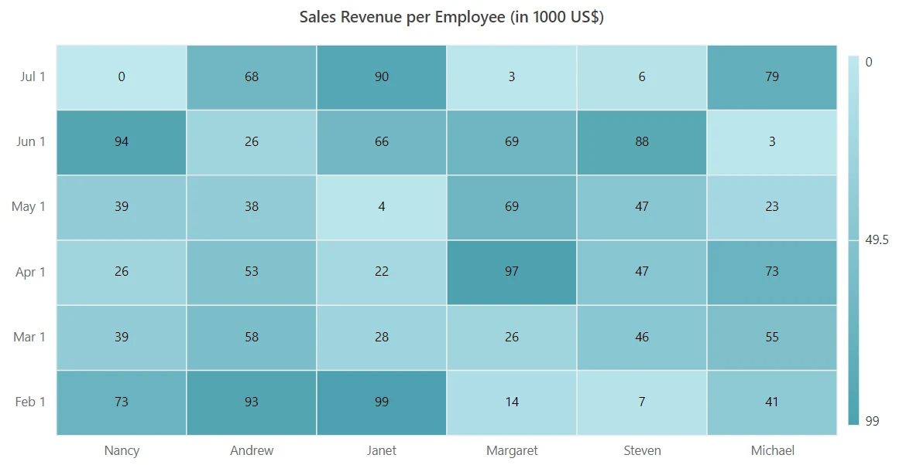

## Inversed Axis

Use the `IsInversed` property to render axis labels in reverse order. By default, the property is `false`. Apply it to the X axis, the Y axis, or both as needed.

```cshtml

@using Syncfusion.Blazor.HeatMap

<SfHeatMap DataSource="@HeatMapData">
    <HeatMapTitleSettings Text="Sales Revenue per Employee (in 1000 US$)">
    </HeatMapTitleSettings>
    <HeatMapXAxis Labels="@XAxisLabels" ValueType="Syncfusion.Blazor.HeatMap.ValueType.Category" IsInversed="true"></HeatMapXAxis>
    <HeatMapYAxis Labels="@YAxisLabels" ValueType="Syncfusion.Blazor.HeatMap.ValueType.DateTime" Minimum="@Minimum" Maximum="@Maximum" IntervalType="IntervalType.Months"></HeatMapYAxis>
</SfHeatMap>

@code{
    int[,] GetDefaultData()
    {
        int[,] dataSource = new int[,]
        {
            {73, 39, 26, 39, 94, 0},
            {93, 58, 53, 38, 26, 68},
            {99, 28, 22, 4, 66, 90},
            {14, 26, 97, 69, 69, 3},
            {7, 46, 47, 47, 88, 6},
            {41, 55, 73, 23, 3, 79}
        };
        return dataSource;
    }
    public object Minimum = new DateTime(2007, 2, 1);
    public object Maximum = new DateTime(2007, 7, 1);
    string[] XAxisLabels = new string[] {"Nancy", "Andrew", "Janet", "Margaret", "Steven", "Michael" };
    string[] YAxisLabels = new string[] { "Mon", "Tue", "Wed", "Thu", "Fri", "Sat" };
    public object HeatMapData { get; set; }
    protected override void OnInitialized()
    {
        HeatMapData = GetDefaultData();
    }
}

```

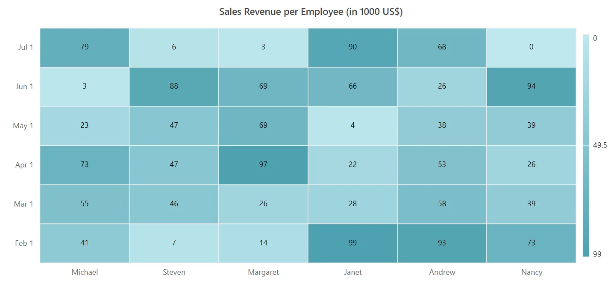

## Opposed Axis

Use the `OpposedPosition` property to render axis labels on the opposite side of the chart from the default position. By default, the property is `false`. Apply it to the X axis, the Y axis, or both as needed.

```cshtml

@using Syncfusion.Blazor.HeatMap

<SfHeatMap DataSource="@HeatMapData">
    <HeatMapTitleSettings Text="Sales Revenue per Employee (in 1000 US$)">
    </HeatMapTitleSettings>
    <HeatMapXAxis Labels="@XAxisLabels" ValueType="Syncfusion.Blazor.HeatMap.ValueType.Category" OpposedPosition="true"></HeatMapXAxis>
    <HeatMapYAxis Labels="@YAxisLabels" ValueType="Syncfusion.Blazor.HeatMap.ValueType.DateTime" Minimum="@Minimum" Maximum="@Maximum" IntervalType="IntervalType.Months"></HeatMapYAxis>
</SfHeatMap>

@code{
    int[,] GetDefaultData()
    {
        int[,] dataSource = new int[,]
        {
            {73, 39, 26, 39, 94, 0},
            {93, 58, 53, 38, 26, 68},
            {99, 28, 22, 4, 66, 90},
            {14, 26, 97, 69, 69, 3},
            {7, 46, 47, 47, 88, 6},
            {41, 55, 73, 23, 3, 79}
        };
        return dataSource;
    }
    public object Minimum = new DateTime(2007, 2, 1);
    public object Maximum = new DateTime(2007, 7, 1);
    string[] XAxisLabels = new string[] {"Nancy", "Andrew", "Janet", "Margaret", "Steven", "Michael" };
    string[] YAxisLabels = new string[] { "Mon", "Tue", "Wed", "Thu", "Fri", "Sat" };
    public object HeatMapData { get; set; }
    protected override void OnInitialized()
    {
        HeatMapData = GetDefaultData();
    }
}

```

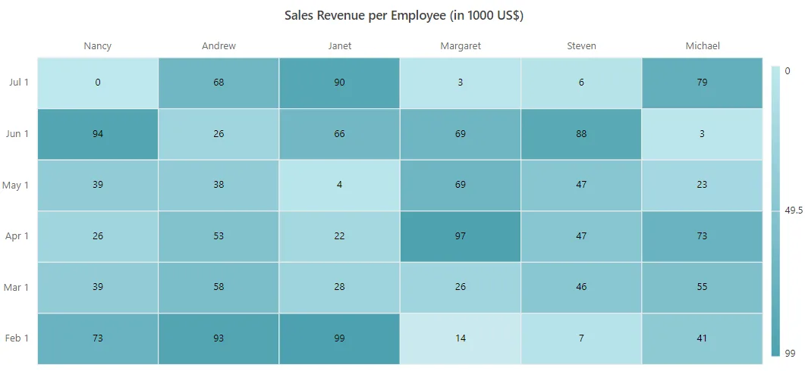

## Axis Labels Customization

### Customizing the Text Style

Customize the text style of the axis labels with the following properties of the [`HeatMapXAxisTextStyle`](https://help.syncfusion.com/cr/blazor/Syncfusion.Blazor.HeatMap.HeatMapXAxisTextStyle.html) for the X axis and the [`HeatMapYAxisTextStyle`](https://help.syncfusion.com/cr/blazor/Syncfusion.Blazor.HeatMap.HeatMapYAxisTextStyle.html) for the Y axis.

| Property | Type | Description |
| --- | --- | --- |
| `Color` | `string` | Sets the axis label text color (CSS color string). |
| `FontFamily` | `string` | Sets the font family (default `"Segoe UI"`). |
| `FontStyle` | `string` | Sets the font style (`normal` or `italic`). |
| `FontWeight` | `string` | Sets the font weight (for example, `normal` or numeric value). |
| `Size` | `string` | Sets the font size in pixels (for example, `"15px"`). |
| `TextAlignment` | enum | Aligns the axis labels. Allowed values: `Alignment.Near`, `Alignment.Center`, `Alignment.Far`. |
| `TextOverflow` | enum | Trims or wraps labels when they exceed the available space. Allowed values: `TextOverflow.None`, `TextOverflow.Trim`, `TextOverflow.Wrap`. |

```cshtml

@using Syncfusion.Blazor.HeatMap

<SfHeatMap DataSource="@HeatMapData">
    <HeatMapTitleSettings Text="Product wise Monthly sales revenue for a e-commerce website">
        <HeatMapTitleTextStyle Size="15px" FontWeight="500" FontStyle="Normal" FontFamily="Segoe UI"></HeatMapTitleTextStyle>
    </HeatMapTitleSettings>
    <HeatMapXAxis Labels="@XAxisLabels" OpposedPosition="true">
        <HeatMapXAxisTextStyle Color="Red" Size="15px" FontWeight="650" FontStyle="Normal" FontFamily="Segoe UI" TextAlignment="Alignment.Center" TextOverflow="TextOverflow.Wrap"></HeatMapXAxisTextStyle>
    </HeatMapXAxis>
    <HeatMapYAxis Labels="@YAxisLabels" MaxLabelLength="70">
        <HeatMapYAxisTextStyle Color="Red" Size="15px" FontWeight="650" FontStyle="Normal" FontFamily="Segoe UI" TextAlignment="Alignment.Center" TextOverflow="TextOverflow.Wrap"></HeatMapYAxisTextStyle>
    </HeatMapYAxis>
    <HeatMapPaletteSettings>
        <HeatMapPalettes>
            <HeatMapPalette Color="#F0C27B"></HeatMapPalette>
            <HeatMapPalette Color="#4B1248"></HeatMapPalette>
        </HeatMapPalettes>
    </HeatMapPaletteSettings>
    <HeatMapLegendSettings Visible="false">
    </HeatMapLegendSettings>
</SfHeatMap>

@code {
    int[,] GetDefaultData()
    {
        int[,] dataSource = new int[,]
        {
            {52, 65, 67, 45, 37, 52, 32},
            {68, 52, 63, 51, 30, 51, 51},
            {60, 50, 42, 53, 66, 70, 41},
            {66, 64, 46, 40, 47, 41, 45},
            {65, 42, 58, 32, 36, 44, 49},
            {54, 46, 61, 46, 40, 39, 41},
            {48, 46, 61, 47, 49, 41, 41},
            {69, 52, 41, 44, 41, 52, 46},
            {50, 59, 44, 43, 27, 42, 26},
            {47, 49, 66, 53, 50, 34, 31},
            {61, 40, 62, 26, 34, 54, 56}
        };
        return dataSource;
    }
    string[] XAxisLabels = new string[] { "Month of February 2023", "Month of March 2023", "Month of April 2023", "Month of May 2023", "Month of June 2023", "Month of July 2023", "Month of August 2023", "Month of September 2023", "Month of October 2023", "Month of November 2023", "Month of December 2023" };
    string[] YAxisLabels = new string[] { "Ace Apparels", "Alpha Apparels", "RL Garments", "RRD Garments", "RRD Apparels", "RR Garments", "SR Garments" };
    public object HeatMapData { get; set; }
    protected override void OnInitialized()
    {
        HeatMapData = GetDefaultData();
    }
}

```

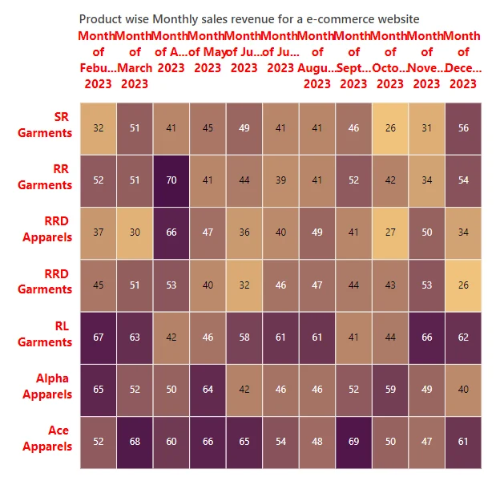

### Axis Label Line break

Use the `<br>` character to split axis label text into multiple lines for improved readability.

Axis labels with line breaks improve the readability of the HeatMap by splitting the text on an axis into multiple lines. The **"\<br>"** character is used to add line breaks to the axis labels.

```cshtml

@using Syncfusion.Blazor.HeatMap

<SfHeatMap DataSource="@HeatMapData">
    <HeatMapXAxis Labels="@XAxisLabels"></HeatMapXAxis>
    <HeatMapYAxis Labels="@YAxisLabels" MaxLabelLength="60"></HeatMapYAxis>
</SfHeatMap>

@code {
    int[,] GetDefaultData()
    {
        int[,] dataSource = new int[,]
        {
            {1, 76},
            {19, 3}
        };
        return dataSource;
    }
    string[] XAxisLabels = new string[] { "Actual<br>Accept", "Actual<br>Reject" };
    string[] YAxisLabels = new string[] { "Actual<br>Accept", "Actual<br>Reject" };
    public object HeatMapData { get; set; }
    protected override void OnInitialized()
    {
        HeatMapData = GetDefaultData();
    }
}

```

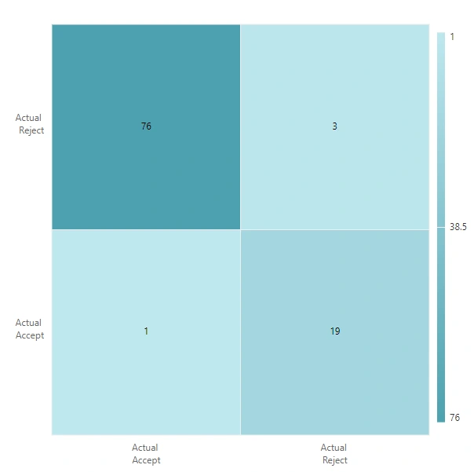

### Customizing Axis Labels When Intersecting

When the axis labels overlap, use the [`LabelIntersectAction`](https://help.syncfusion.com/cr/blazor/Syncfusion.Blazor.HeatMap.HeatMapCommonAxis.html#Syncfusion_Blazor_HeatMap_HeatMapCommonAxis_LabelIntersectAction) property to control the rendering. The following values are supported.

| Value | Description |
| --- | --- |
| `None` | No action is taken. Overlapping labels remain visible. |
| `Trim` | Trims the labels that overlap. |
| `Rotate45` | Rotates the overlapping labels to 45 degrees. |
| `MultipleRows` | Shows the overlapping labels on multiple rows. |

The following example trims axis labels using `LabelIntersectAction`.

The below example demonstrates to trim the axis labels by using the `LabelIntersectAction` property.

```cshtml

@using Syncfusion.Blazor.HeatMap

<SfHeatMap DataSource="@HeatMapData">
    <HeatMapTitleSettings Text="Product wise Monthly sales revenue for a e-commerce website">
        <HeatMapTitleTextStyle Size="15px" FontWeight="500" FontStyle="Normal" FontFamily="Segoe UI"></HeatMapTitleTextStyle>
    </HeatMapTitleSettings>
    <HeatMapXAxis Labels="@XAxisLabels" OpposedPosition="true" EnableTrim="true" LabelIntersectAction="LabelIntersectAction.Trim">
        <HeatMapXAxisTextStyle Color="Red" Size="15px" FontWeight="650" FontStyle="Normal" FontFamily="Segoe UI" TextAlignment="Alignment.Center" TextOverflow="TextOverflow.Wrap"></HeatMapXAxisTextStyle>
    </HeatMapXAxis>
    <HeatMapYAxis Labels="@YAxisLabels" EnableTrim="true" LabelIntersectAction="LabelIntersectAction.Trim">
        <HeatMapYAxisTextStyle Color="Red" Size="15px" FontWeight="650" FontStyle="Normal" FontFamily="Segoe UI" TextAlignment="Alignment.Center" TextOverflow="TextOverflow.Wrap"></HeatMapYAxisTextStyle>
    </HeatMapYAxis>
    <HeatMapPaletteSettings>
        <HeatMapPalettes>
            <HeatMapPalette Color="#F0C27B"></HeatMapPalette>
            <HeatMapPalette Color="#4B1248"></HeatMapPalette>
        </HeatMapPalettes>
    </HeatMapPaletteSettings>
    <HeatMapLegendSettings Visible="false">
    </HeatMapLegendSettings>
</SfHeatMap>

@code {
    int[,] GetDefaultData()
    {
        int[,] dataSource = new int[,]
        {
            {52, 65, 67, 45, 37, 52, 32},
            {68, 52, 63, 51, 30, 51, 51},
            {60, 50, 42, 53, 66, 70, 41},
            {66, 64, 46, 40, 47, 41, 45},
            {65, 42, 58, 32, 36, 44, 49},
            {54, 46, 61, 46, 40, 39, 41},
            {48, 46, 61, 47, 49, 41, 41},
            {69, 52, 41, 44, 41, 52, 46},
            {50, 59, 44, 43, 27, 42, 26},
            {47, 49, 66, 53, 50, 34, 31},
            {61, 40, 62, 26, 34, 54, 56}
        };
        return dataSource;
    }
    string[] XAxisLabels = new string[] { "Month of February 2023", "Month of March 2023", "Month of April 2023", "Month of May 2023", "Month of June 2023", "Month of July 2023", "Month of August 2023", "Month of September 2023", "Month of October 2023", "Month of November 2023", "Month of December 2023" };
    string[] YAxisLabels = new string[] { "Ace Apparels", "Alpha Apparels", "RL Garments", "RRD Garments", "RRD Apparels", "RR Garments", "SR Garments" };
    public object HeatMapData { get; set; }
    protected override void OnInitialized()
    {
        HeatMapData = GetDefaultData();
    }
}

```Axis Labels

Rotate the axis labels to a custom angle using the [`LabelRotation`hart](images/axis/blazor-heatmap-chart-label-when-intersecting-with-other-labels.webp)

### Rotating axis labels

The axis labels can be rotated to a desired angle by using the [LabelRotation](https://help.syncfusion.com/cr/blazor/Syncfusion.Blazor.HeatMap.HeatMapCommonAxis.html#Syncfusion_Blazor_HeatMap_HeatMapCommonAxis_LabelRotation) property.

```cshtml

@using Syncfusion.Blazor.HeatMap

<SfHeatMap DataSource="@HeatMapData">
    <HeatMapTitleSettings Text="Product wise Monthly sales revenue for a e-commerce website">
        <HeatMapTitleTextStyle Size="15px" FontWeight="500" FontStyle="Normal" FontFamily="Segoe UI"></HeatMapTitleTextStyle>
    </HeatMapTitleSettings>
    <HeatMapXAxis Labels="@XAxisLabels" LabelRotation="90" OpposedPosition="true">
    </HeatMapXAxis>
    <HeatMapYAxis Labels="@YAxisLabels" LabelRotation="45">
    </HeatMapYAxis>
    <HeatMapPaletteSettings>
        <HeatMapPalettes>
            <HeatMapPalette Color="#F0C27B"></HeatMapPalette>
            <HeatMapPalette Color="#4B1248"></HeatMapPalette>
        </HeatMapPalettes>
    </HeatMapPaletteSettings>
    <HeatMapLegendSettings Visible="false">
    </HeatMapLegendSettings>
</SfHeatMap>

@code {
    int[,] GetDefaultData()
    {
        int[,] dataSource = new int[,]
        {
            {52, 65, 67, 45, 37, 52, 32},
            {68, 52, 63, 51, 30, 51, 51},
            {60, 50, 42, 53, 66, 70, 41},
            {66, 64, 46, 40, 47, 41, 45},
            {65, 42, 58, 32, 36, 44, 49},
            {54, 46, 61, 46, 40, 39, 41},
            {48, 46, 61, 47, 49, 41, 41},
            {69, 52, 41, 44, 41, 52, 46},
            {50, 59, 44, 43, 27, 42, 26},
            {47, 49, 66, 53, 50, 34, 31},
            {61, 40, 62, 26, 34, 54, 56}
        };
        return dataSource;
    }
    string[] XAxisLabels = new string[] { "Month of February 2023", "Month of March 2023", "Month of April 2023", "Month of May 2023", "Month of June 2023", "Month of July 2023", "Month of August 2023", "Month of September 2023", "Month of October 2023", "Month of November 2023", "Month of December 2023" };
    string[] YAxisLabels = new string[] { "Ace Apparels", "Alpha Apparels", "RL Garments", "RRD Garments", "RRD Apparels", "RR Garments", "SR Garments" };
    public object HeatMapData { get; set; }
    protected override void OnInitialized()
    {
        HeatMapData = GetDefaultData();
    }
}

```

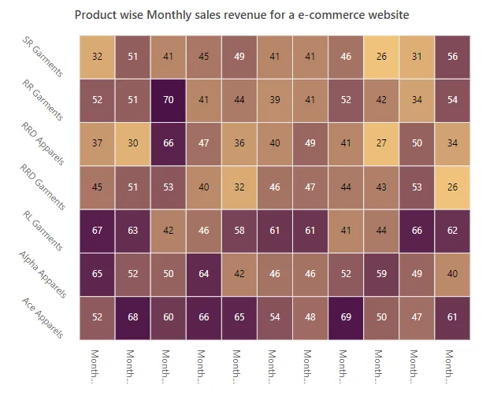

### Label Formatting

Use the [`LabelFormat`](https://help.syncfusion.com/cr/blazor/Syncfusion.Blazor.HeatMap.HeatMapCommonAxis.html#Syncfusion_Blazor_HeatMap_HeatMapCommonAxis_LabelFormat) property to format axis labels. You can use standard format specifiers (for example, `C` for currency, `P` for percent) or a custom pattern with the `{value}` placeholder (for example, `{value}°C`).

The following placeholders are supported: `{value}` (current numeric value), `{xLabel}` (column label), and `{yLabel}` (row label).

```cshtml

@using Syncfusion.Blazor.HeatMap

<SfHeatMap DataSource="@HeatMapData">
    <HeatMapTitleSettings Text="Sales Revenue per Employee (in 1000 US$)">
    </HeatMapTitleSettings>
    <HeatMapXAxis Labels="@XAxisLabels" ValueType="Syncfusion.Blazor.HeatMap.ValueType.Category"></HeatMapXAxis>
    <HeatMapYAxis Labels="@YAxisLabels" ValueType="Syncfusion.Blazor.HeatMap.ValueType.Numeric"  LabelFormat="${value}"></HeatMapYAxis>
</SfHeatMap>

@code{
    int[,] GetDefaultData()
    {
        int[,] dataSource = new int[,]
        {
            {73, 39, 26, 39, 94, 0},
            {93, 58, 53, 38, 26, 68},
            {99, 28, 22, 4, 66, 90},
            {14, 26, 97, 69, 69, 3},
            {7, 46, 47, 47, 88, 6},
            {41, 55, 73, 23, 3, 79}
        };
        return dataSource;
    }
    public object Minimum = new DateTime(2007, 2, 1);
    public object Maximum = new DateTime(2007, 7, 1);
    string[] XAxisLabels = new string[] {"Nancy", "Andrew", "Janet", "Margaret", "Steven", "Michael" };
    string[] YAxisLabels = new string[] { "Mon", "Tue", "Wed", "Thu", "Fri", "Sat" };
    public object HeatMapData { get; set; }
    protected override void OnInitialized()
    {
        HeatMapData = GetDefaultData();
    }
}

```

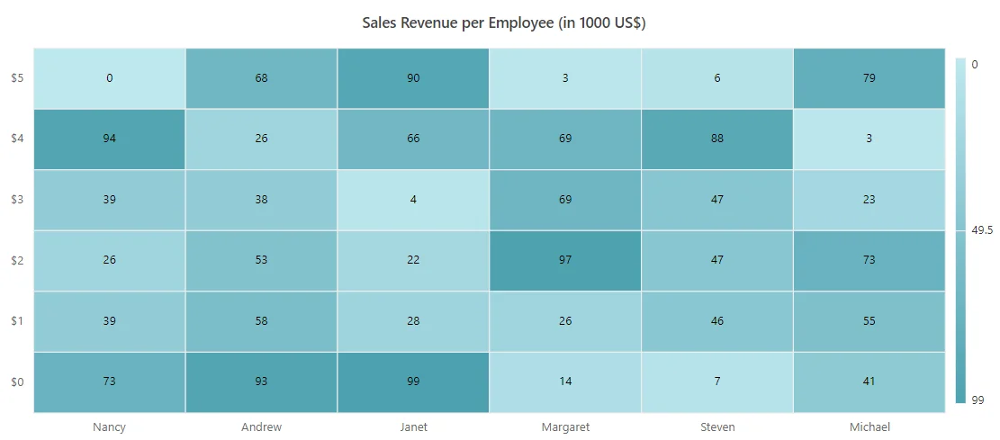

## Axis intervals

In heat map, you can define an interval between the axis labels using the `Interval` property. In date-time axis, you can change the interval mode by using the `IntervalType` property. The date-time axis supports the following interval types.

```cshtml

@using Syncfusion.Blazor.HeatMap

<SfHeatMap DataSource="@HeatMapData">
    <HeatMapTitleSettings Text="Sales Revenue per Employee (in 1000 US$)">
    </HeatMapTitleSettings>
    <HeatMapXAxis Labels="@XAxisLabels" ValueType="Syncfusion.Blazor.HeatMap.ValueType.Category"></HeatMapXAxis>
    <HeatMapYAxis Labels="@YAxisLabels" ValueType="Syncfusion.Blazor.HeatMap.ValueType.DateTime" Minimum="@Minimum" Interval=2 Maximum="@Maximum" IntervalType="IntervalType.Months"></HeatMapYAxis>
</SfHeatMap>

@code{
    int[,] GetDefaultData()
    {
        int[,] dataSource = new int[,]
        {
        {73, 39, 26, 39, 94, 0},
        {93, 58, 53, 38, 26, 68},
        {99, 28, 22, 4, 66, 90},
        {14, 26, 97, 69, 69, 3},
        {7, 46, 47, 47, 88, 6},
        {41, 55, 73, 23, 3, 79}
            };
        return dataSource;
    }
    public object Minimum = new DateTime(2007, 2, 1);
    public object Maximum = new DateTime(2007, 7, 1);
    string[] XAxisLabels = new string[] { "Nancy", "Andrew", "Janet", "Margaret", "Steven", "Michael" };
    string[] YAxisLabels = new string[] { "Mon", "Tue", "Wed", "Thu", "Fri", "Sat" };
    public object HeatMapData { get; set; }
    protected override void OnInitialized()
    {
        HeatMapData = GetDefaultData();
    }
}

```

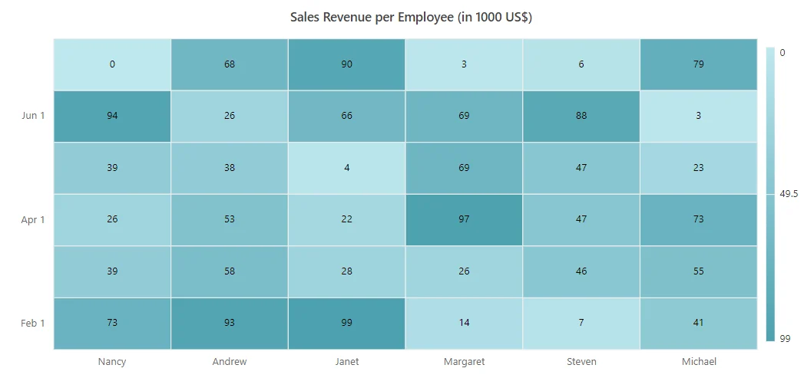

## Axis label increment

Axis label increment in the heat map is used to display the axis labels with regular interval values in numeric and date-time axes. The labels will be displayed with tick gaps when you set the label interval. But, to achieve the same behavior without tick gaps, use the label increment. You can set the axis label increment using the `Increment` property and the default value of this property is 1.

```cshtml

@using Syncfusion.Blazor.HeatMap

<SfHeatMap DataSource="@HeatMapData">
    <HeatMapTitleSettings Text="Sales Revenue per Employee (in 1000 US$)">
    </HeatMapTitleSettings>
    <HeatMapXAxis Labels="@XAxisLabels" ValueType="Syncfusion.Blazor.HeatMap.ValueType.Numeric" Increment=2></HeatMapXAxis>
    <HeatMapYAxis Labels="@YAxisLabels" ValueType="Syncfusion.Blazor.HeatMap.ValueType.Numeric" Increment=3></HeatMapYAxis>
</SfHeatMap>

@code{
    int[,] GetDefaultData()
    {
        int[,] dataSource = new int[,]
        {
        {73, 39, 26, 39, 94, 0},
        {93, 58, 53, 38, 26, 68},
        {99, 28, 22, 4, 66, 90},
        {14, 26, 97, 69, 69, 3},
        {7, 46, 47, 47, 88, 6},
        {41, 55, 73, 23, 3, 79}
        };
        return dataSource;
    }
    string[] XAxisLabels = new string[] { "Nancy", "Andrew", "Janet", "Margaret", "Steven", "Michael" };
    string[] YAxisLabels = new string[] { "Mon", "Tue", "Wed", "Thu", "Fri", "Sat" };
    public object HeatMapData { get; set; }
    protected override void OnInitialized()
    {
        HeatMapData = GetDefaultData();
    }
}

```

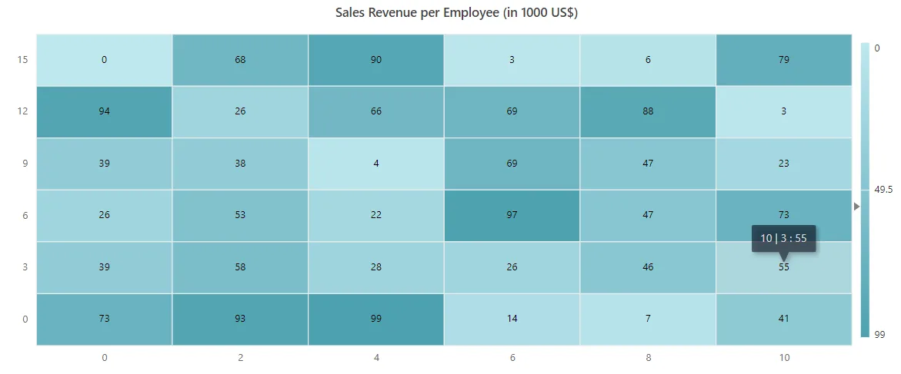

## Multi-Level Labels

Multi-level labels group a range of axis labels under a single category by using the [`HeatMapMultiLevelLabel`](https://help.syncfusion.com/cr/blazor/Syncfusion.Blazor.HeatMap.HeatMapMultiLevelLabels.html) child component. To classify labels into groups, add multiple [`HeatMapAxisMultiLevelCategories`](https://help.syncfusion.com/cr/blazor/Syncfusion.Blazor.HeatMap.HeatMapAxisMultiLevelCategories.html) child components. The `Start` and `End` values are 0-based inclusive indices into the `Labels` array, and the [`Text`](https://help.syncfusion.com/cr/blazor/Syncfusion.Blazor.HeatMap.HeatMapAxisMultiLevelCategories.html#Syncfusion_Blazor_HeatMap_HeatMapAxisMultiLevelCategories_Text) property provides the display name for the group. Multiple `HeatMapMultiLevelLabel` blocks can be combined to render several label rows (for example, quarters on one row and yearly summary on another).

The following properties and child components are available to customize multi-level labels.

| Member | Description |
| --- | --- |
| [`Overflow`](https://help.syncfusion.com/cr/blazor/Syncfusion.Blazor.HeatMap.HeatMapMultiLevelLabel.html#Syncfusion_Blazor_HeatMap_HeatMapMultiLevelLabel_Overflow) | Trims or wraps labels when they overflow. Applies only to the X axis. |
| [`Alignment`](https://help.syncfusion.com/cr/blazor/Syncfusion.Blazor.HeatMap.HeatMapMultiLevelLabel.html#Syncfusion_Blazor_HeatMap_HeatMapMultiLevelLabel_Alignment) | Positions and aligns the multi-level labels. |
| [`MaximumTextWidth`](https://help.syncfusion.com/cr/blazor/Syncfusion.Blazor.HeatMap.HeatMapAxisMultiLevelCategories.html#Syncfusion_Blazor_HeatMap_HeatMapAxisMultiLevelCategories_MaximumTextWidth) | Sets the maximum text width before the overflow action applies. |
| [`HeatMapAxisMultiLevelLabelsTextStyle`](https://help.syncfusion.com/cr/blazor/Syncfusion.Blazor.HeatMap.HeatMapAxisMultiLevelLabelsTextStyle.html) | Customize the font family, size, weight, and color of the multi-level labels. |
| [`HeatMapXAxisMultiLevelLabelBorder`](https://help.syncfusion.com/cr/blazor/Syncfusion.Blazor.HeatMap.HeatMapXAxisMultiLevelLabelBorder.html) | Customize the border of multi-level labels on the X axis. |
| [`HeatMapYAxisMultiLevelLabelBorder`](https://help.syncfusion.com/cr/blazor/Syncfusion.Blazor.HeatMap.HeatMapYAxisMultiLevelLabelBorder.html) | Customize the border of multi-level labels on the Y axis. |

```cshtml

@using Syncfusion.Blazor.HeatMap

<SfHeatMap DataSource="@DataSource">
    <HeatMapEvents TooltipRendering="@TooltipRendering" CellRendering="@CellRender"></HeatMapEvents>
    <HeatMapXAxis Labels="@XLabels">
        <HeatMapXAxisTextStyle Color="Black"></HeatMapXAxisTextStyle>
        <HeatMapAxisLabelBorder Width="1" Type="BorderType.Rectangle" Color="#a19d9d"></HeatMapAxisLabelBorder>
        <HeatMapMultiLevelLabels>
            <HeatMapMultiLevelLabel>
                <HeatMapXAxisMultiLevelLabelBorder Width="1" Type="BorderType.Rectangle" Color="#a19d9d"></HeatMapXAxisMultiLevelLabelBorder>
                <HeatMapAxisMultiLevelLabelsTextStyle Color="Black" FontWeight="Bold"></HeatMapAxisMultiLevelLabelsTextStyle>
                <HeatMapAxisMultiLevelCategories Start="0" End="2" Text="Electronics">
                </HeatMapAxisMultiLevelCategories>
                <HeatMapAxisMultiLevelCategories Start="3" End="4" Text="Beauty and personal care">
                </HeatMapAxisMultiLevelCategories>
                <HeatMapAxisMultiLevelCategories Start="5" End="7" Text="Fashion">
                </HeatMapAxisMultiLevelCategories>
                <HeatMapAxisMultiLevelCategories Start="8" End="10" Text="Household">
                </HeatMapAxisMultiLevelCategories>
            </HeatMapMultiLevelLabel>
        </HeatMapMultiLevelLabels>
    </HeatMapXAxis>
    <HeatMapYAxis Labels="@YLabels" IsInversed=true>
        <HeatMapAxisLabelBorder Width="0"></HeatMapAxisLabelBorder>
        <HeatMapYAxisTextStyle Color="Black"></HeatMapYAxisTextStyle>
        <HeatMapMultiLevelLabels>
            <HeatMapMultiLevelLabel>
                <HeatMapYAxisMultiLevelLabelBorder Width="1" Type="BorderType.Brace" Color="#a19d9d"></HeatMapYAxisMultiLevelLabelBorder>
                <HeatMapAxisMultiLevelLabelsTextStyle Color="Black" FontWeight="Bold"></HeatMapAxisMultiLevelLabelsTextStyle>
                <HeatMapAxisMultiLevelCategories Start="0" End="2" Text="Q1">
                </HeatMapAxisMultiLevelCategories>
                <HeatMapAxisMultiLevelCategories Start="3" End="5" Text="Q2">
                </HeatMapAxisMultiLevelCategories>
                <HeatMapAxisMultiLevelCategories Start="6" End="8" Text="Q3">
                </HeatMapAxisMultiLevelCategories>
                <HeatMapAxisMultiLevelCategories Start="9" End="11" Text="Q4">
                </HeatMapAxisMultiLevelCategories>
            </HeatMapMultiLevelLabel>
            <HeatMapMultiLevelLabel>
                <HeatMapYAxisMultiLevelLabelBorder Width="1" Type="BorderType.Brace" Color="#a19d9d"></HeatMapYAxisMultiLevelLabelBorder>
                <HeatMapAxisMultiLevelLabelsTextStyle Color="Black" FontWeight="Bold"></HeatMapAxisMultiLevelLabelsTextStyle>
                <HeatMapAxisMultiLevelCategories Start="0" End="5" Text="First Half Yearly">
                </HeatMapAxisMultiLevelCategories>
                <HeatMapAxisMultiLevelCategories Start="6" End="11" Text="Second Half Yearly">
                </HeatMapAxisMultiLevelCategories>
            </HeatMapMultiLevelLabel>
            <HeatMapMultiLevelLabel>
                <HeatMapYAxisMultiLevelLabelBorder Width="1" Type="BorderType.Brace" Color="#a19d9d"></HeatMapYAxisMultiLevelLabelBorder>
                <HeatMapAxisMultiLevelLabelsTextStyle Color="Black" FontWeight="Bold"></HeatMapAxisMultiLevelLabelsTextStyle>
                <HeatMapAxisMultiLevelCategories Start="0" End="11" Text="Yearly">
                </HeatMapAxisMultiLevelCategories>
            </HeatMapMultiLevelLabel>
        </HeatMapMultiLevelLabels>
    </HeatMapYAxis>
    <HeatMapCellSettings ShowLabel="true" Format="$ {value}K">
        <HeatMapCellBorder Width="0"></HeatMapCellBorder>
    </HeatMapCellSettings>
    <HeatMapPaletteSettings>
        <HeatMapPalettes>
            <HeatMapPalette Color="#F0ADCE"></HeatMapPalette>
            <HeatMapPalette Color="#19307B"></HeatMapPalette>
        </HeatMapPalettes>
    </HeatMapPaletteSettings>
    <HeatMapLegendSettings Visible="false">
    </HeatMapLegendSettings>
    <HeatMapTooltipSettings Enable="true">
        <HeatMapFont Size="12px" FontWeight="500"></HeatMapFont>
    </HeatMapTooltipSettings>
</SfHeatMap>

@code{
    public string[] XLabels = new string[] { "Laptop", "Mobile", "Gaming", "Cosmetics", "Fragrance", "Watches", "Handbags", "Apparel", "Kitchenware", "Furniture", "Home Decor" };
    public string[] YLabels = new string[] { "Jan", "Feb", "Mar", "Apr", "May", "Jun", "Jul", "Aug", "Sep", "Oct", "Nov", "Dec" };
    int[,] DataSource;
    public void TooltipRendering(TooltipEventArgs args)
    {
        args.Content = new string[] { args.XLabel + " | " + args.YLabel + " : $ " + args.Value + "K" };
    }
    public void CellRender(HeatMapCellRenderEventArgs args)
    {
        string CellValue = (double.Parse(args.CellValue) / 10).ToString();
        args.CellValue = CellValue;
    }
    public static int[,] GetMultiLevelData()
    {
        int[,] dataSource = new int[,]
        {
                {52, 65, 67, 45, 37, 52, 32, 76, 60, 64, 82, 91},
                {68, 52, 63, 51, 30, 51, 51, 81, 70, 60, 88, 80},
                {60, 50, 42, 53, 66, 70, 41, 69, 76, 74, 86, 97},
                {66, 64, 46, 40, 47, 41, 45, 76, 83, 69, 92, 84},
                {65, 42, 58, 32, 36, 44, 49, 79, 83, 69, 83, 93},
                {54, 46, 61, 46, 40, 39, 41, 69, 61, 84, 84, 87},
                {48, 46, 61, 47, 49, 41, 41, 67, 78, 83, 98, 87},
                {69, 52, 41, 44, 41, 52, 46, 71, 63, 84, 83, 91},
                {50, 59, 44, 43, 27, 42, 26, 64, 76, 65, 81, 86},
                {47, 49, 66, 53, 50, 34, 31, 79, 78, 79, 89, 95},
                {61, 40, 62, 26, 34, 54, 56, 74, 83, 78, 95, 98}

        };
        return dataSource;
    }

    protected override void OnInitialized()
    {
        DataSource = GetMultiLevelData();
    }
}

```
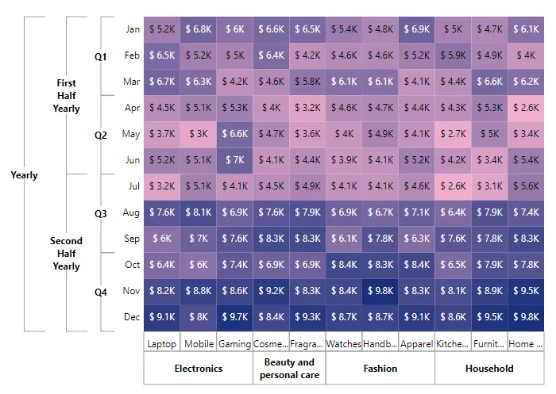

## Troubleshooting

* **Axis labels are missing.** Verify that `Labels.Length` matches the corresponding data dimension (rows for Y, columns for X).
* **Date-time labels do not render.** Pass `DateTime` values to `Minimum`/`Maximum` instead of string labels, and ensure `Labels` are `DateTime[]` values.
* **Numeric ticks display empty values.** Use numeric `Labels` (for example, a `double[]`) when `ValueType.Numeric` is set.

## See Also

* [Blazor HeatMap Chart Appearance](appearance.md)
* [Blazor HeatMap Chart Palette](palette.md)
* [Blazor HeatMap Chart Legend](legend.md)
* [Blazor HeatMap Chart Selection](selection.md)
* [Blazor HeatMap Chart Tooltip](tooltip.md)
* [Blazor HeatMap Chart Events](events.md)
* [Getting Started with Blazor HeatMap Chart](getting-started.md)
