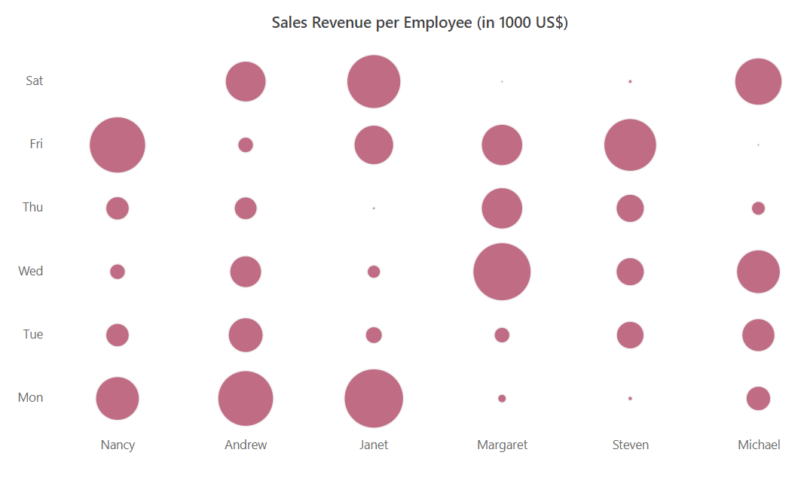

# Bubble heat map

Data points represent the data source values with `Gradient` or `Fixed` colors in the heat map.
You can customize the appearance of these data points by changing the `Color` and `Shape` attributes.

The data points can be represented in color fill or bubble shape by defining the `TileType` property.
By default, the data points are color filled with `Gradient` or `Fixed` and this depiction of data points is defined as `Rect` in the `TileType` property.

The cell customizations and color mapping for `Rect` tile type is defined in `Appearance` and `Palette` sections in detail.

## Bubble attributes

The data points can be represented in the bubble along with its attributes by setting the `TileType` property to `Bubble`.

In bubble heat map, you can display the data points with bubble size, bubble colors, and sector attributes of the bubble.

### Bubble size

In this bubble heat map type, the size factor of the bubble is used to denote the data variations. The radius of the bubble varies according to data values.

By default, the bubble with small size denotes the data value with small magnitude and the larger bubble size denotes the data value with larger magnitude. This behavior can be inversed by using the `IsInversedBubbleSize` property.

To render a bubble heat map with size series, set the `BubbleType` property to `Size`.

```csharp

@using Syncfusion.Blazor.HeatMap

<SfHeatMap DataSource="@HeatMapData">
    <HeatMapTitleSettings Text="Sales Revenue per Employee (in 1000 US$)">
    </HeatMapTitleSettings>
    <HeatMapXAxis Labels="@XAxisLabels"></HeatMapXAxis>
    <HeatMapYAxis Labels="@YAxisLabels"></HeatMapYAxis>
    <HeatMapCellSettings ShowLabel="false" TileType="CellType.Bubble" BubbleType="BubbleType.Size"></HeatMapCellSettings>
    <HeatMapPaletteSettings Type="PaletteType.Gradient">
        <HeatMapPalettes>
            <HeatMapPalette Color="#C06C84"></HeatMapPalette>
            <HeatMapPalette Color="#6C5B7B"></HeatMapPalette>
            <HeatMapPalette Color="#355C7D"></HeatMapPalette>
        </HeatMapPalettes>
    </HeatMapPaletteSettings>
</SfHeatMap>

@code{
    int[,] GetDefaultData()
    {
        int[,] dataSource = new int[,]
        {
            {73, 39, 26, 39, 94, 0},
            {93, 58, 53, 38, 26, 68},
            {99, 28, 22, 4, 66, 90},
            {14, 26, 97, 69, 69, 3},
            {7, 46, 47, 47, 88, 6},
            {41, 55, 73, 23, 3, 79}
        };
        return dataSource;
    }
    string[] XAxisLabels = new string[] {"Nancy", "Andrew", "Janet", "Margaret", "Steven", "Michael", "Robert","Laura", "Anne", "Paul", "Karin", "Mario" };
    string[] YAxisLabels = new string[] { "Mon", "Tue", "Wed", "Thu", "Fri", "Sat" };
    public object HeatMapData { get; set; }
    protected override void OnInitialized()
    {
        HeatMapData = GetDefaultData();
    }
}


```



### Bubble color

In heat map, defined with this tile type, the data points will be represented with same sized bubbles and the data value variations are represented with the bubble colors.

To represent the data points with variations in bubble colors, set the `BubbleType` property to `Color`.

```csharp

@using Syncfusion.Blazor.HeatMap

<SfHeatMap DataSource="@HeatMapData">
    <HeatMapTitleSettings Text="Sales Revenue per Employee (in 1000 US$)">
    </HeatMapTitleSettings>
    <HeatMapXAxis Labels="@XAxisLabels"></HeatMapXAxis>
    <HeatMapYAxis Labels="@YAxisLabels"></HeatMapYAxis>
    <HeatMapCellSettings ShowLabel="true" TileType="CellType.Bubble" BubbleType="BubbleType.Color"></HeatMapCellSettings>
    <HeatMapPaletteSettings Type="PaletteType.Gradient">
        <HeatMapPalettes>
            <HeatMapPalette Color="#C06C84"></HeatMapPalette>
            <HeatMapPalette Color="#6C5B7B"></HeatMapPalette>
            <HeatMapPalette Color="#355C7D"></HeatMapPalette>
        </HeatMapPalettes>
    </HeatMapPaletteSettings>
</SfHeatMap>

@code{
    int[,] GetDefaultData()
    {
        int[,] dataSource = new int[,]
        {
            {73, 39, 26, 39, 94, 0},
            {93, 58, 53, 38, 26, 68},
            {99, 28, 22, 4, 66, 90},
            {14, 26, 97, 69, 69, 3},
            {7, 46, 47, 47, 88, 6},
            {41, 55, 73, 23, 3, 79}
        };
        return dataSource;
    }
    string[] XAxisLabels = new string[] {"Nancy", "Andrew", "Janet", "Margaret", "Steven", "Michael" };
    string[] YAxisLabels = new string[] { "Mon", "Tue", "Wed", "Thu", "Fri", "Sat" };
    public object HeatMapData { get; set; }
    protected override void OnInitialized()
    {
        HeatMapData = GetDefaultData();
    }
}

```


### Bubble sector

In this bubble heat map type, the sector of the bubble decides the magnitude of data point. If the sector is large, then the data point value will be high.

To render the data points with bubble sector, set the `BubbleType` property to `Sector`.

```csharp

@using Syncfusion.Blazor.HeatMap

<SfHeatMap DataSource="@HeatMapData">
    <HeatMapTitleSettings Text="Sales Revenue per Employee (in 1000 US$)">
    </HeatMapTitleSettings>
    <HeatMapXAxis Labels="@XAxisLabels"></HeatMapXAxis>
    <HeatMapYAxis Labels="@YAxisLabels"></HeatMapYAxis>
    <HeatMapCellSettings ShowLabel="true" TileType="CellType.Bubble" BubbleType="BubbleType.Sector"></HeatMapCellSettings>
    <HeatMapPaletteSettings Type="PaletteType.Gradient">
        <HeatMapPalettes>
            <HeatMapPalette Color="#C06C84"></HeatMapPalette>
            <HeatMapPalette Color="#6C5B7B"></HeatMapPalette>
            <HeatMapPalette Color="#355C7D"></HeatMapPalette>
        </HeatMapPalettes>
    </HeatMapPaletteSettings>
</SfHeatMap>

@code{
    int[,] GetDefaultData()
    {
        int[,] dataSource = new int[,]
        {
            {73, 39, 26, 39, 94, 0},
            {93, 58, 53, 38, 26, 68},
            {99, 28, 22, 4, 66, 90},
            {14, 26, 97, 69, 69, 3},
            {7, 46, 47, 47, 88, 6},
            {41, 55, 73, 23, 3, 79}
        };
        return dataSource;
    }
    string[] XAxisLabels = new string[] {"Nancy", "Andrew", "Janet", "Margaret", "Steven", "Michael" };
    string[] YAxisLabels = new string[] { "Mon", "Tue", "Wed", "Thu", "Fri", "Sat" };
    public object HeatMapData { get; set; }
    protected override void OnInitialized()
    {
        HeatMapData = GetDefaultData();
    }
}

```

