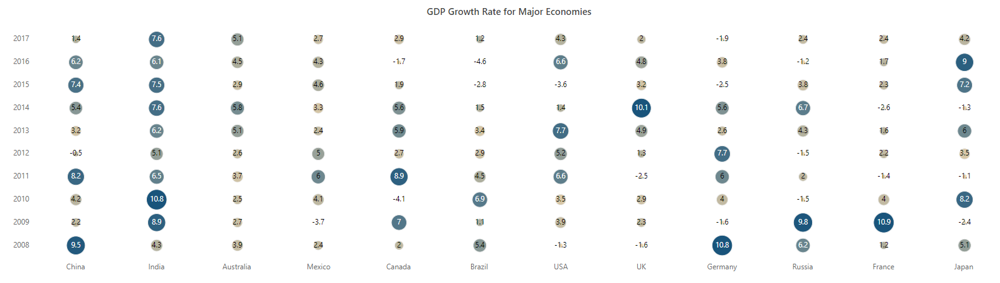
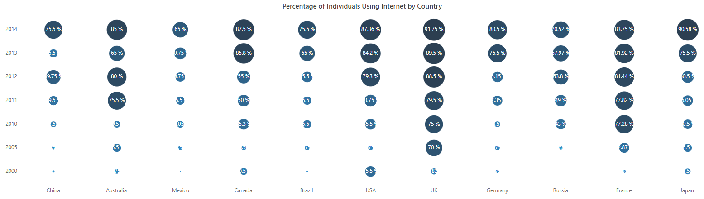
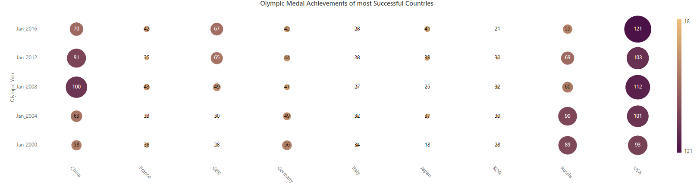
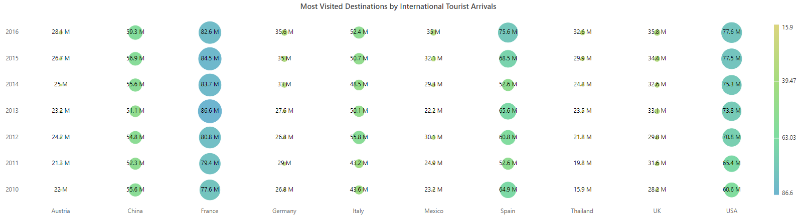
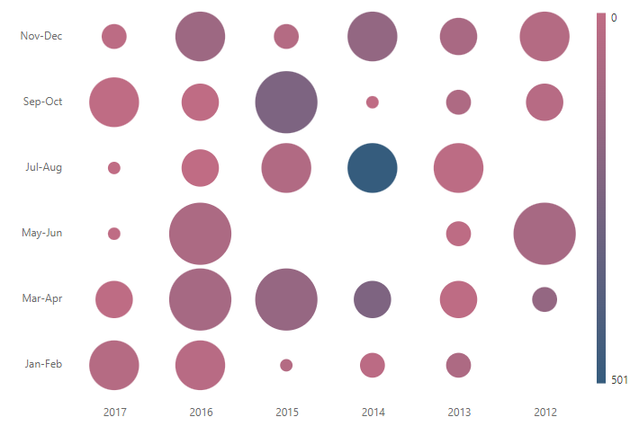

# Bubble HeatMap in Blazor HeatMap Chart Component

This section explains how to customize the appearance of HeatMap cells as bubbles. The following video demonstrates the customization process.



Data points in the HeatMap Chart can be visualized using gradient or fixed colors. The appearance of these data points can be customized by changing the `Color` and `Size` attributes.

Data points can be displayed as color-filled rectangles or as bubbles by setting the [TileType](https://help.syncfusion.com/cr/blazor/Syncfusion.Blazor.HeatMap.HeatMapCellSettings.html#Syncfusion_Blazor_HeatMap_HeatMapCellSettings_TileType) property. By default, data points are color-filled rectangles (`Rect`).

Cell customizations and color mapping for the rectangle tile type are detailed in the [appearance](https://blazor.syncfusion.com/documentation/heatmap-chart/appearance) and [palette](https://blazor.syncfusion.com/documentation/heatmap-chart/palette) sections.

## Bubble types

Data points can be displayed as bubbles by setting the [TileType](https://help.syncfusion.com/cr/blazor/Syncfusion.Blazor.HeatMap.HeatMapCellSettings.html#Syncfusion_Blazor_HeatMap_HeatMapCellSettings_TileType) property to **Bubble**.

Bubble HeatMap allows customization of bubble size, color, and sector attributes.

### Bubble size

The bubble size represents data variations. The radius of the bubble changes according to the data value. By default, a smaller bubble indicates a smaller value, and a larger bubble indicates a larger value. This behavior can be inverted using the [IsInversedBubbleSize](https://help.syncfusion.com/cr/blazor/Syncfusion.Blazor.HeatMap.HeatMapCellSettings.html#Syncfusion_Blazor_HeatMap_HeatMapCellSettings_IsInversedBubbleSize) property.

To render a bubble HeatMap with size series, set the [BubbleType](https://help.syncfusion.com/cr/blazor/Syncfusion.Blazor.HeatMap.HeatMapCellSettings.html#Syncfusion_Blazor_HeatMap_HeatMapCellSettings_BubbleType) property to **Size**.

```cshtml

@using Syncfusion.Blazor.HeatMap

<SfHeatMap DataSource="@HeatMapData">
    <HeatMapTitleSettings Text="Sales Revenue per Employee (in 1000 US$)">
    </HeatMapTitleSettings>
    <HeatMapXAxis Labels="@XAxisLabels"></HeatMapXAxis>
    <HeatMapYAxis Labels="@YAxisLabels"></HeatMapYAxis>
    <HeatMapCellSettings ShowLabel="false" TileType="CellType.Bubble" BubbleType="BubbleType.Size"></HeatMapCellSettings>
    <HeatMapPaletteSettings Type="PaletteType.Gradient">
        <HeatMapPalettes>
            <HeatMapPalette Color="#C06C84"></HeatMapPalette>
            <HeatMapPalette Color="#6C5B7B"></HeatMapPalette>
            <HeatMapPalette Color="#355C7D"></HeatMapPalette>
        </HeatMapPalettes>
    </HeatMapPaletteSettings>
</SfHeatMap>

@code {
    public object HeatMapData { get; set; }

    string[] XAxisLabels = new string[] {"Nancy", "Andrew", "Janet", "Margaret", "Steven", "Michael", "Robert","Laura", "Anne", "Paul", "Karin", "Mario" };

    string[] YAxisLabels = new string[] { "Mon", "Tue", "Wed", "Thu", "Fri", "Sat" };

    int[,] GetDefaultData()
    {
        int[,] dataSource = new int[,]
        {
            {73, 39, 26, 39, 94, 0},
            {93, 58, 53, 38, 26, 68},
            {99, 28, 22, 4, 66, 90},
            {14, 26, 97, 69, 69, 3},
            {7, 46, 47, 47, 88, 6},
            {41, 55, 73, 23, 3, 79}
        };
        return dataSource;
    }

    protected override void OnInitialized()
    {
        HeatMapData = GetDefaultData();
    }
}

```


### Bubble color

With this tile type, data points are represented by bubbles of the same size, and data value variations are shown using bubble colors.

To display data variations with bubble colors, set the [BubbleType](https://help.syncfusion.com/cr/blazor/Syncfusion.Blazor.HeatMap.HeatMapCellSettings.html#Syncfusion_Blazor_HeatMap_HeatMapCellSettings_BubbleType) property to **Color**.

```cshtml

@using Syncfusion.Blazor.HeatMap

<SfHeatMap DataSource="@HeatMapData">
    <HeatMapTitleSettings Text="Sales Revenue per Employee (in 1000 US$)">
    </HeatMapTitleSettings>
    <HeatMapXAxis Labels="@XAxisLabels"></HeatMapXAxis>
    <HeatMapYAxis Labels="@YAxisLabels"></HeatMapYAxis>
    <HeatMapCellSettings ShowLabel="true" TileType="CellType.Bubble" BubbleType="BubbleType.Color"></HeatMapCellSettings>
    <HeatMapPaletteSettings Type="PaletteType.Gradient">
        <HeatMapPalettes>
            <HeatMapPalette Color="#C06C84"></HeatMapPalette>
            <HeatMapPalette Color="#6C5B7B"></HeatMapPalette>
            <HeatMapPalette Color="#355C7D"></HeatMapPalette>
        </HeatMapPalettes>
    </HeatMapPaletteSettings>
</SfHeatMap>

@code {
    public object HeatMapData { get; set; }

    string[] XAxisLabels = new string[] {"Nancy", "Andrew", "Janet", "Margaret", "Steven", "Michael" };

    string[] YAxisLabels = new string[] { "Mon", "Tue", "Wed", "Thu", "Fri", "Sat" };

    int[,] GetDefaultData()
    {
        int[,] dataSource = new int[,]
        {
            {73, 39, 26, 39, 94, 0},
            {93, 58, 53, 38, 26, 68},
            {99, 28, 22, 4, 66, 90},
            {14, 26, 97, 69, 69, 3},
            {7, 46, 47, 47, 88, 6},
            {41, 55, 73, 23, 3, 79}
        };
        return dataSource;
    }

    protected override void OnInitialized()
    {
        HeatMapData = GetDefaultData();
    }
}

```


### Bubble sector

In this type, the sector of the bubble indicates the magnitude of the data point. A larger sector represents a higher value.

To render data points with bubble sectors, set the [BubbleType](https://help.syncfusion.com/cr/blazor/Syncfusion.Blazor.HeatMap.HeatMapCellSettings.html#Syncfusion_Blazor_HeatMap_HeatMapCellSettings_BubbleType) property to **Sector**.

```cshtml

@using Syncfusion.Blazor.HeatMap

<SfHeatMap DataSource="@HeatMapData">
    <HeatMapTitleSettings Text="Sales Revenue per Employee (in 1000 US$)">
    </HeatMapTitleSettings>
    <HeatMapXAxis Labels="@XAxisLabels"></HeatMapXAxis>
    <HeatMapYAxis Labels="@YAxisLabels"></HeatMapYAxis>
    <HeatMapCellSettings ShowLabel="true" TileType="CellType.Bubble" BubbleType="BubbleType.Sector"></HeatMapCellSettings>
    <HeatMapPaletteSettings Type="PaletteType.Gradient">
        <HeatMapPalettes>
            <HeatMapPalette Color="#C06C84"></HeatMapPalette>
            <HeatMapPalette Color="#6C5B7B"></HeatMapPalette>
            <HeatMapPalette Color="#355C7D"></HeatMapPalette>
        </HeatMapPalettes>
    </HeatMapPaletteSettings>
</SfHeatMap>

@code {
    public object HeatMapData { get; set; }

    string[] XAxisLabels = new string[] {"Nancy", "Andrew", "Janet", "Margaret", "Steven", "Michael" };

    string[] YAxisLabels = new string[] { "Mon", "Tue", "Wed", "Thu", "Fri", "Sat" };

    int[,] GetDefaultData()
    {
        int[,] dataSource = new int[,]
        {
            {73, 39, 26, 39, 94, 0},
            {93, 58, 53, 38, 26, 68},
            {99, 28, 22, 4, 66, 90},
            {14, 26, 97, 69, 69, 3},
            {7, 46, 47, 47, 88, 6},
            {41, 55, 73, 23, 3, 79}
        };
        return dataSource;
    }

    protected override void OnInitialized()
    {
        HeatMapData = GetDefaultData();
    }
}

```


### Combining size and color bubble types

In this type, both the size and color of the bubble represent data value variations. To render this type, set the [BubbleType](https://help.syncfusion.com/cr/blazor/Syncfusion.Blazor.HeatMap.HeatMapCellSettings.html#Syncfusion_Blazor_HeatMap_HeatMapCellSettings_BubbleType) property to **SizeAndColor**.

The following examples demonstrate different data binding methods with the **SizeAndColor** bubble type.

**Array binding**

When an array of numbers is specified as the `DataSource`, the bubble HeatMap can be rendered with varying sizes and colors.

**Table**

The following example shows how to render a bubble HeatMap with different sizes and colors using array table binding.

```cshtml

@using Syncfusion.Blazor.HeatMap;

<SfHeatMap DataSource="@HeatMapData">
    <HeatMapTitleSettings Text="GDP Growth Rate for Major Economies (in Percentage)">
        <HeatMapTitleTextStyle Size="15px" FontWeight="500" FontStyle="Normal" FontFamily="Segoe UI"></HeatMapTitleTextStyle>
    </HeatMapTitleSettings>
    <HeatMapXAxis Labels="@XAxisLabels"></HeatMapXAxis>
    <HeatMapYAxis Labels="@YAxisLabels"></HeatMapYAxis>
    <HeatMapCellSettings ShowLabel="true" TileType="CellType.Bubble" BubbleType="BubbleType.SizeAndColor"></HeatMapCellSettings>
    <HeatMapPaletteSettings Type="PaletteType.Gradient">
        <HeatMapPalettes>
            <HeatMapPalette Color="#F0D6AD" Value=-1></HeatMapPalette>
            <HeatMapPalette Color="#9da49a" Value=0></HeatMapPalette>
            <HeatMapPalette Color="#d7c7a7" Value=3.5></HeatMapPalette>
            <HeatMapPalette Color="#6e888f" Value=6.0></HeatMapPalette>
            <HeatMapPalette Color="#466f86" Value=7.5></HeatMapPalette>
            <HeatMapPalette Color="#19547B" Value=10></HeatMapPalette>
        </HeatMapPalettes>
    </HeatMapPaletteSettings>
    <HeatMapLegendSettings Visible="false"></HeatMapLegendSettings>
</SfHeatMap>

@code {
    public object HeatMapData { get; set; }

    string[] XAxisLabels = new string[] { "China", "India", "Australia", "Mexico", "Canada", "Brazil", "USA", "UK", "Germany", "Russia", "France", "Japan" };

    string[] YAxisLabels = new string[] { "2008", "2009", "2010", "2011", "2012", "2013", "2014", "2015", "2016", "2017" };

    double[,] GetDefaultData()
    {
        double[,] dataSource = new double[,]
        {
            {9.5, 2.2, 4.2, 8.2, -0.5, 3.2, 5.4, 7.4, 6.2, 1.4 },

            {4.3, 8.9, 10.8, 6.5, 5.1, 6.2, 7.6, 7.5, 6.1, 7.6 },

            {3.9, 2.7, 2.5, 3.7, 2.6, 5.1, 5.8, 2.9, 4.5, 5.1 },

            {2.4, -3.7, 4.1, 6.0, 5.0, 2.4, 3.3, 4.6, 4.3, 2.7 },

            {2.0, 7.0, -4.1, 8.9, 2.7, 5.9, 5.6, 1.9, -1.7, 2.9 },

            {5.4, 1.1, 6.9, 4.5, 2.9, 3.4, 1.5, -2.8, -4.6, 1.2 },

            {-1.3, 3.9, 3.5, 6.6, 5.2, 7.7, 1.4, -3.6, 6.6, 4.3 },

            {-1.6, 2.3, 2.9, -2.5, 1.3, 4.9, 10.1, 3.2, 4.8, 2.0 },

            {10.8, -1.6, 4.0, 6.0, 7.7, 2.6, 5.6, -2.5, 3.8, -1.9 },

            {6.2, 9.8, -1.5, 2.0, -1.5, 4.3, 6.7, 3.8, -1.2, 2.4 },

            {1.2, 10.9, 4.0, -1.4, 2.2, 1.6, -2.6, 2.3, 1.7, 2.4 },

            {5.1, -2.4, 8.2, -1.1, 3.5, 6.0, -1.3, 7.2, 9.0, 4.2 }
        };
        return dataSource;
    }

    protected override void OnInitialized()
    {
        HeatMapData = GetDefaultData();
    }
}

```



**Cell**

The following example shows how to render a bubble HeatMap with different sizes and colors using array cell binding.

```cshtml

@using Syncfusion.Blazor.HeatMap;

<SfHeatMap DataSource="@HeatMapData">
    <HeatMapTitleSettings Text="Percentage of Individuals Using Internet by Country">
        <HeatMapTitleTextStyle Size="15px" FontWeight="500" FontStyle="Normal" FontFamily="Segoe UI"></HeatMapTitleTextStyle>
    </HeatMapTitleSettings>
    <HeatMapXAxis Labels="@XAxisLabels"></HeatMapXAxis>
    <HeatMapYAxis Labels="@YAxisLabels"></HeatMapYAxis>
    <HeatMapLegendSettings Visible="false"></HeatMapLegendSettings>
    <HeatMapCellSettings Format="{value} %" TileType="CellType.Bubble" BubbleType="BubbleType.SizeAndColor">
        <HeatMapCellBorder Width="0">
        </HeatMapCellBorder>
        <HeatMapCellTextStyle Color="White"></HeatMapCellTextStyle>
    </HeatMapCellSettings>
    <HeatMapDataSourceSettings IsJsonData="false" AdaptorType="AdaptorType.Cell"></HeatMapDataSourceSettings>
    <HeatMapPaletteSettings Type="PaletteType.Gradient">
        <HeatMapPalettes>
            <HeatMapPalette Color="#3498DB"></HeatMapPalette>
            <HeatMapPalette Color="#2C3E50"></HeatMapPalette>
        </HeatMapPalettes>
    </HeatMapPaletteSettings>
</SfHeatMap>

@code {
    public object HeatMapData { get; set; }

    string[] XAxisLabels = new string[] { "China", "Australia", "Mexico", "Canada", "Brazil", "USA", "UK" , "Germany", "Russia", "France", "Japan" };

    string[] YAxisLabels = new string[] { "2000", "2005", "2010", "2011", "2012", "2013", "2014" };

    double[,] GetDefaultData()
    {
        double[,] dataSource = new double[,]
        {
            {0, 0, 10.75 }, {0, 1, 14.5 }, {0, 2, 25.5 }, {0, 3, 39.5 }, {0, 4, 59.75 }, {0, 5, 35.50 }, {0, 6, 75.5 },

            {1, 0, 20.75 }, {1, 1, 35.5 }, {1, 2, 29.5 }, {1, 3, 75.5 }, {1, 4, 80 }, {1, 5, 65 }, {1, 6, 85 },

            { 2, 0, 6}, {2, 1, 18.5 }, {2, 2, 30.05 }, {2, 3, 35.5 }, {2, 4, 40.75 }, {2, 5, 50.75 }, {2, 6, 65 },

            {3, 0, 30.5 }, {3, 1, 20.5 }, {3, 2, 45.30 }, {3, 3, 50 }, {3, 4, 55 }, {3, 5, 85.80 }, {3, 6, 87.5 },

            {4, 0, 10.5 }, {4, 1, 20.75 }, {4, 2, 35.5 }, {4, 3, 35.5 }, {4, 4, 45.5 }, {4, 5, 65}, {4, 6, 75.5 },

            {5, 0, 45.5 }, {5, 1, 20.75}, {5, 2, 45.5}, {5, 3, 50.75}, {5, 4, 79.30}, {5, 5, 84.20}, {5, 6, 87.36},

            {6, 0, 26.82 }, {6, 1, 70 }, {6, 2, 75 }, {6, 3, 79.5 }, {6, 4, 88.5 }, {6, 5, 89.5 }, {6, 6, 91.75 },

            {7, 0, 15.75 }, {7, 1, 20.75}, {7, 2, 25.5}, {7, 3, 42.35}, {7, 4, 45.15}, {7, 5, 76.5}, {7, 6, 80.5},

            {8, 0, 1.98 }, {8, 1, 15.23 }, {8, 2, 43 }, {8, 3, 49 }, {8, 4, 63.80 }, {8, 5, 67.97 }, {8, 6, 70.52 },

            {9, 0, 14.31 }, {9, 1, 42.87}, {9, 2, 77.28}, {9, 3, 77.82}, {9, 4, 81.44}, {9, 5, 81.92}, {9, 6, 83.75},

            {10, 0, 25.5 }, {10, 1, 35.5 }, {10, 2, 40.5 }, {10, 3, 45.05 }, {10, 4, 50.5 }, {10, 5, 75.5 }, {10, 6, 90.58 }
        };
        return dataSource;
    }

    protected override void OnInitialized()
    {
        HeatMapData = GetDefaultData();
    }
}

```



**JSON binding**

When a list of JSON objects is specified as the `DataSource`, the bubble HeatMap can be rendered with varying sizes and colors.

**Table**

The following example shows how to render a bubble HeatMap with different sizes and colors using JSON table binding.

```cshtml

@using Syncfusion.Blazor.HeatMap

<SfHeatMap DataSource="@HeatMapData">
    <HeatMapTitleSettings Text="Olympic Medal Achievements of most Successful Countries">
        <HeatMapTitleTextStyle Size="15px" FontWeight="500" FontStyle="Normal" FontFamily="Segoe UI"></HeatMapTitleTextStyle>
    </HeatMapTitleSettings>
    <HeatMapDataSourceSettings IsJsonData="true" AdaptorType="AdaptorType.Table" XDataMapping="Region"></HeatMapDataSourceSettings>
    <HeatMapXAxis Labels="@XLabels" LabelRotation="45" LabelIntersectAction="LabelIntersectAction.None"></HeatMapXAxis>
    <HeatMapYAxis Labels="@YLabels">
        <HeatMapYAxisTitle Text="Olympic Year"></HeatMapYAxisTitle>
    </HeatMapYAxis>
    <HeatMapPaletteSettings>
        <HeatMapPalettes>
            <HeatMapPalette Color="#F0C27B"></HeatMapPalette>
            <HeatMapPalette Color="#4B1248"></HeatMapPalette>
        </HeatMapPalettes>
    </HeatMapPaletteSettings>
    <HeatMapCellSettings TileType="CellType.Bubble" BubbleType="BubbleType.SizeAndColor">
        <HeatMapCellBorder Width="1" Radius="4" Color="White"></HeatMapCellBorder>
    </HeatMapCellSettings>
</SfHeatMap>

@code {
    public string[] XLabels = new string[] { "China", "France", "GBR", "Germany", "Italy", "Japan", "KOR", "Russia", "USA" };

    public string[] YLabels = new string[] { "Jan_2000", "Jan_2004", "Jan_2008", "Jan_2012", "Jan_2016" };

    public class RegionalData
    {
        public string Region { get; set; }
        public int? Jan_2000 { get; set; }
        public int? Jan_2004 { get; set; }
        public int? Jan_2008 { get; set; }
        public int? Jan_2012 { get; set; }
        public int? Jan_2016 { get; set; }
    }

    public RegionalData[] HeatMapData = new RegionalData[] {
        new RegionalData { Region = "USA", Jan_2000 = 93, Jan_2004 = 101, Jan_2008 = 112, Jan_2012 = 103, Jan_2016 = 121 },
        new RegionalData { Region = "GBR", Jan_2000 = 28, Jan_2004 = 30, Jan_2008 = 49, Jan_2012 = 65, Jan_2016 = 67 },
        new RegionalData { Region = "China", Jan_2000 = 58, Jan_2004 = 63, Jan_2008 = 100, Jan_2012 = 91, Jan_2016 = 70 },
        new RegionalData { Region = "Russia", Jan_2000 = 89, Jan_2004 = 90, Jan_2008 = 60, Jan_2012 = 69, Jan_2016 = 55 },
        new RegionalData { Region = "Germany", Jan_2000 = 56, Jan_2004 = 49, Jan_2008 = 41, Jan_2012 = 44, Jan_2016 = 42 },
        new RegionalData { Region = "Japan", Jan_2000 = 18, Jan_2004 = 37, Jan_2008 = 25, Jan_2012 = 38, Jan_2016 = 41 },
        new RegionalData { Region = "France", Jan_2000 = 38, Jan_2004 = 33, Jan_2008 = 43, Jan_2012 = 35, Jan_2016 = 42 },
        new RegionalData { Region = "KOR", Jan_2000 = 28, Jan_2004 = 30, Jan_2008 = 32, Jan_2012 = 30, Jan_2016 = 21 },
        new RegionalData { Region = "Italy", Jan_2000 = 34, Jan_2004 = 32, Jan_2008 = 27, Jan_2012 = 28, Jan_2016 = 28 }
    };
}

```



**Cell**

The following example shows how to render a bubble HeatMap with different sizes and colors using JSON cell binding.

```cshtml

@using Syncfusion.Blazor.HeatMap

<SfHeatMap DataSource="@HeatMapData">
    <HeatMapTitleSettings Text="Most Visited Destinations by International Tourist Arrivals">
        <HeatMapTitleTextStyle Size="15px" FontWeight="500" FontStyle="Normal" FontFamily="Segoe UI"></HeatMapTitleTextStyle>
    </HeatMapTitleSettings>
    <HeatMapDataSourceSettings IsJsonData="true" AdaptorType="AdaptorType.Cell" XDataMapping="RowId" YDataMapping="ColumnId" ValueMapping="Value"></HeatMapDataSourceSettings>
    <HeatMapXAxis Labels="@XLabels"></HeatMapXAxis>
    <HeatMapYAxis Labels="@YLabels"></HeatMapYAxis>
    <HeatMapPaletteSettings>
        <HeatMapPalettes>
            <HeatMapPalette Color="#DCD57E"></HeatMapPalette>
            <HeatMapPalette Color="#A6DC7E"></HeatMapPalette>
            <HeatMapPalette Color="#7EDCA2"></HeatMapPalette>
            <HeatMapPalette Color="#6EB5D0"></HeatMapPalette>
        </HeatMapPalettes>
    </HeatMapPaletteSettings>
    <HeatMapCellSettings ShowLabel="true" Format="{value} M" TileType="CellType.Bubble" BubbleType="BubbleType.SizeAndColor">
        <HeatMapCellBorder Width="1" Radius="4" Color="White"></HeatMapCellBorder>
    </HeatMapCellSettings>
</SfHeatMap>

@code {
    public string[] XLabels = new string[] { "Austria", "China", "France", "Germany", "Italy", "Mexico", "Spain", "Thailand", "UK", "USA" };

    public string[] YLabels = new string[] { "2010", "2011", "2012", "2013", "2014", "2015", "2016" };

    public class SampleData
    {
        public string RowId { get; set; }
        public string ColumnId { get; set; }
        public string Value { get; set; }
    }

    public SampleData[] HeatMapData = new SampleData[] {
        new SampleData { RowId = "France", ColumnId = "2010", Value = "77.6" },
        new SampleData { RowId = "France", ColumnId = "2011", Value = "79.4" },
        new SampleData { RowId = "France", ColumnId = "2012", Value = "80.8" },
        new SampleData { RowId = "France", ColumnId = "2013", Value = "86.6" },
        new SampleData { RowId = "France", ColumnId = "2014", Value = "83.7" },
        new SampleData { RowId = "France", ColumnId = "2015", Value = "84.5" },
        new SampleData { RowId = "France", ColumnId = "2016", Value = "82.6" },
        new SampleData { RowId = "USA", ColumnId = "2010", Value = "60.6" },
        new SampleData { RowId = "USA", ColumnId = "2014", Value = "75.3" },
        new SampleData { RowId = "USA", ColumnId = "2011", Value = "65.4" },
        new SampleData { RowId = "USA", ColumnId = "2012", Value = "70.8" },
        new SampleData { RowId = "USA", ColumnId = "2012", Value = "70.8" },
        new SampleData { RowId = "USA", ColumnId = "2013", Value = "73.8" },
        new SampleData { RowId = "USA", ColumnId = "2014", Value = "75.3" },
        new SampleData { RowId = "USA", ColumnId = "2015", Value = "77.5" },
        new SampleData { RowId = "USA", ColumnId = "2016", Value = "77.6" },
        new SampleData { RowId = "Spain", ColumnId = "2010", Value = "64.9" },
        new SampleData { RowId = "Spain", ColumnId = "2011", Value = "52.6" },
        new SampleData { RowId = "Spain", ColumnId = "2012", Value = "60.8" },
        new SampleData { RowId = "Spain", ColumnId = "2013", Value = "65.6" },
        new SampleData { RowId = "Spain", ColumnId = "2014", Value = "52.6" },
        new SampleData { RowId = "Spain", ColumnId = "2015", Value = "68.5" },
        new SampleData { RowId = "Spain", ColumnId = "2016", Value = "75.6" },
        new SampleData { RowId = "China", ColumnId = "2010", Value = "55.6" },
        new SampleData { RowId = "China", ColumnId = "2011", Value = "52.3" },
        new SampleData { RowId = "China", ColumnId = "2012", Value = "54.8" },
        new SampleData { RowId = "China", ColumnId = "2013", Value = "51.1" },
        new SampleData { RowId = "China", ColumnId = "2014", Value = "55.6" },
        new SampleData { RowId = "China", ColumnId = "2015", Value = "56.9" },
        new SampleData { RowId = "China", ColumnId = "2016", Value = "59.3" },
        new SampleData { RowId = "Italy", ColumnId = "2010", Value = "43.6" },
        new SampleData { RowId = "Italy", ColumnId = "2011", Value = "43.2" },
        new SampleData { RowId = "Italy", ColumnId = "2012", Value = "55.8" },
        new SampleData { RowId = "Italy", ColumnId = "2013", Value = "50.1" },
        new SampleData { RowId = "Italy", ColumnId = "2014", Value = "48.5" },
        new SampleData { RowId = "Italy", ColumnId = "2015", Value = "50.7" },
        new SampleData { RowId = "Italy", ColumnId = "2016", Value = "52.4" },
        new SampleData { RowId = "UK", ColumnId = "2010", Value = "28.2" },
        new SampleData { RowId = "UK", ColumnId = "2011", Value = "31.6" },
        new SampleData { RowId = "UK", ColumnId = "2012", Value = "29.8" },
        new SampleData { RowId = "UK", ColumnId = "2013", Value = "33.1" },
        new SampleData { RowId = "UK", ColumnId = "2014", Value = "32.6" },
        new SampleData { RowId = "UK", ColumnId = "2015", Value = "34.4" },
        new SampleData { RowId = "UK", ColumnId = "2016", Value = "35.8" },
        new SampleData { RowId = "Germany", ColumnId = "2010", Value = "26.8" },
        new SampleData { RowId = "Germany", ColumnId = "2011", Value = "29" },
        new SampleData { RowId = "Germany", ColumnId = "2012", Value = "26.8" },
        new SampleData { RowId = "Germany", ColumnId = "2013", Value = "27.6" },
        new SampleData { RowId = "Germany", ColumnId = "2014", Value = "33" },
        new SampleData { RowId = "Germany", ColumnId = "2015", Value = "35" },
        new SampleData { RowId = "Germany", ColumnId = "2016", Value = "35.6" },
        new SampleData { RowId = "Mexico", ColumnId = "2010", Value = "23.2" },
        new SampleData { RowId = "Mexico", ColumnId = "2011", Value = "24.9" },
        new SampleData { RowId = "Mexico", ColumnId = "2012", Value = "30.1" },
        new SampleData { RowId = "Mexico", ColumnId = "2013", Value = "22.2" },
        new SampleData { RowId = "Mexico", ColumnId = "2014", Value = "29.3" },
        new SampleData { RowId = "Mexico", ColumnId = "2015", Value = "32.1" },
        new SampleData { RowId = "Mexico", ColumnId = "2016", Value = "35" },
        new SampleData { RowId = "Thailand", ColumnId = "2010", Value = "15.9" },
        new SampleData { RowId = "Thailand", ColumnId = "2011", Value = "19.8" },
        new SampleData { RowId = "Thailand", ColumnId = "2012", Value = "21.8" },
        new SampleData { RowId = "Thailand", ColumnId = "2013", Value = "23.5" },
        new SampleData { RowId = "Thailand", ColumnId = "2014", Value = "24.8" },
        new SampleData { RowId = "Thailand", ColumnId = "2015", Value = "29.9" },
        new SampleData { RowId = "Thailand", ColumnId = "2016", Value = "32.6" },
        new SampleData { RowId = "Austria", ColumnId = "2010", Value = "22" },
        new SampleData { RowId = "Austria", ColumnId = "2011", Value = "21.3" },
        new SampleData { RowId = "Austria", ColumnId = "2012", Value = "24.2" },
        new SampleData { RowId = "Austria", ColumnId = "2013", Value = "23.2" },
        new SampleData { RowId = "Austria", ColumnId = "2014", Value = "25" },
        new SampleData { RowId = "Austria", ColumnId = "2015", Value = "26.7" },
        new SampleData { RowId = "Austria", ColumnId = "2016", Value = "28.1" }
    };
}

```




**Binding size and color values from datasource**

The size and color of bubbles in the **SizeAndColor** bubble HeatMap type can be customized by binding the data source field names that hold the size and color values to the [Size](https://help.syncfusion.com/cr/blazor/Syncfusion.Blazor.HeatMap.HeatMapBubbleDataMapping.html#Syncfusion_Blazor_HeatMap_HeatMapBubbleDataMapping_Size) and [Color](https://help.syncfusion.com/cr/blazor/Syncfusion.Blazor.HeatMap.HeatMapBubbleDataMapping.html#Syncfusion_Blazor_HeatMap_HeatMapBubbleDataMapping_Color) properties in the [HeatMapBubbleDataMapping](https://help.syncfusion.com/cr/blazor/Syncfusion.Blazor.HeatMap.HeatMapBubbleDataMapping.html).

> The `HeatMapBubbleDataMapping` is supported only for JSON data with the cell adaptor type.

```cshtml

@using Syncfusion.Blazor.HeatMap

<SfHeatMap DataSource="@HeatMapData">
                <HeatMapEvents TooltipRendering="@TooltipRendering"></HeatMapEvents>
                <HeatMapXAxis Labels="@XLabels"></HeatMapXAxis>
                <HeatMapYAxis Labels="@YLabels"></HeatMapYAxis>
                <HeatMapDataSourceSettings IsJsonData="true" AdaptorType="AdaptorType.Cell" XDataMapping="Year" YDataMapping="Months">
                    <HeatMapBubbleDataMapping Size="Accidents" Color="Fatalities"></HeatMapBubbleDataMapping>
                </HeatMapDataSourceSettings>
                <HeatMapCellSettings ShowLabel="false" TileType="CellType.Bubble" BubbleType="BubbleType.SizeAndColor">
                    <HeatMapCellBorder Width="0"></HeatMapCellBorder>
                </HeatMapCellSettings>
                <HeatMapPaletteSettings Type="PaletteType.Gradient">
                    <HeatMapPalettes>
                        <HeatMapPalette Color="#C06C84"></HeatMapPalette>
                        <HeatMapPalette Color="#355C7D"></HeatMapPalette>
                    </HeatMapPalettes>
                </HeatMapPaletteSettings>
                <HeatMapLegendSettings Visible="true"></HeatMapLegendSettings>
                <HeatMapTooltipSettings Enable="true">
                    <HeatMapFont Size="12px" FontWeight="500"></HeatMapFont>
                </HeatMapTooltipSettings>
            </SfHeatMap>

@code {
    public string[] XLabels = new string[] { "2017", "2016", "2015", "2014", "2013", "2012" };

    public string[] YLabels = new string[] { "Jan-Feb", "Mar-Apr", "May-Jun", "Jul-Aug", "Sep-Oct", "Nov-Dec" };

    public void TooltipRendering(TooltipEventArgs args)
    {
        int dataIndex = 0;
        for (int i = 0; i < HeatMapData.Count; i++)
        {
            if (HeatMapData[i].Year == args.XLabel && HeatMapData[i].Months == args.YLabel)
            {
                dataIndex = i;
                break;
            }
        }
        args.Content = new string[] { "Year " + " : " + args.XLabel + "<br/>" + "Months " + " : " + args.YLabel + "<br/>" + "Accidents " + " : " + HeatMapData[dataIndex].Accidents +
        "<br/>" + "Fatalities " + " : " + HeatMapData[dataIndex].Fatalities };
    }

    public List<BubbleDataSource> HeatMapData { get; set; }

    public class BubbleDataSource
    {
        public string Year { get; set; }
        public string Months { get; set; }
        public Nullable<int> Accidents { get; set; }
        public Nullable<int> Fatalities { get; set; }
        public static List<BubbleDataSource> GetData()
        {
            List<BubbleDataSource> HeatMapData = new List<BubbleDataSource>()
            {
                new BubbleDataSource { Year = "2017", Months = "Jan-Feb", Accidents = 4, Fatalities = 39 },
                new BubbleDataSource { Year = "2017", Months = "Mar-Apr", Accidents = 3, Fatalities = 8 },
                new BubbleDataSource { Year = "2017", Months = "May-Jun", Accidents = 1, Fatalities = 3 },
                new BubbleDataSource { Year = "2017", Months = "Jul-Aug", Accidents = 1, Fatalities = 0 },
                new BubbleDataSource { Year = "2017", Months = "Sep-Oct", Accidents = 4, Fatalities = 4 },
                new BubbleDataSource { Year = "2017", Months = "Nov-Dec", Accidents = 2, Fatalities = 15 },
                new BubbleDataSource { Year = "2016", Months = "Jan-Feb", Accidents = 4, Fatalities = 28 },
                new BubbleDataSource { Year = "2016", Months = "Mar-Apr", Accidents = 5, Fatalities = 92 },
                new BubbleDataSource { Year = "2016", Months = "May-Jun", Accidents = 5, Fatalities = 73 },
                new BubbleDataSource { Year = "2016", Months = "Jul-Aug", Accidents = 3, Fatalities = 1 },
                new BubbleDataSource { Year = "2016", Months = "Sep-Oct", Accidents = 3, Fatalities = 4 },
                new BubbleDataSource { Year = "2016", Months = "Nov-Dec", Accidents = 4, Fatalities = 126 },
                new BubbleDataSource { Year = "2015", Months = "Jan-Feb", Accidents = 1, Fatalities = 45 },
                new BubbleDataSource { Year = "2015", Months = "Mar-Apr", Accidents = 5, Fatalities = 152 },
                new BubbleDataSource { Year = "2015", Months = "May-Jun", Accidents = 0, Fatalities = 0 },
                new BubbleDataSource { Year = "2015", Months = "Jul-Aug", Accidents = 4, Fatalities = 54 },
                new BubbleDataSource { Year = "2015", Months = "Sep-Oct", Accidents = 5, Fatalities = 243 },
                new BubbleDataSource { Year = "2015", Months = "Nov-Dec", Accidents = 2, Fatalities = 45 },
                new BubbleDataSource { Year = "2014", Months = "Jan-Feb", Accidents = 2, Fatalities = 18 },
                new BubbleDataSource { Year = "2014", Months = "Mar-Apr", Accidents = 3, Fatalities = 239 },
                new BubbleDataSource { Year = "2014", Months = "May-Jun", Accidents = 0, Fatalities = 0 },
                new BubbleDataSource { Year = "2014", Months = "Jul-Aug", Accidents = 4, Fatalities = 501 },
                new BubbleDataSource { Year = "2014", Months = "Sep-Oct", Accidents = 1, Fatalities = 2 },
                new BubbleDataSource { Year = "2014", Months = "Nov-Dec", Accidents = 4, Fatalities = 162 },
                new BubbleDataSource { Year = "2013", Months = "Jan-Feb", Accidents = 2, Fatalities = 68 },
                new BubbleDataSource { Year = "2013", Months = "Mar-Apr", Accidents = 3, Fatalities = 7 },
                new BubbleDataSource { Year = "2013", Months = "May-Jun", Accidents = 2, Fatalities = 12 },
                new BubbleDataSource { Year = "2013", Months = "Jul-Aug", Accidents = 4, Fatalities = 15 },
                new BubbleDataSource { Year = "2013", Months = "Sep-Oct", Accidents = 2, Fatalities = 64 },
                new BubbleDataSource { Year = "2013", Months = "Nov-Dec", Accidents = 3, Fatalities = 83 },
                new BubbleDataSource { Year = "2012", Months = "Jan-Feb", Accidents = 0, Fatalities = 0 },
                new BubbleDataSource { Year = "2012", Months = "Mar-Apr", Accidents = 2, Fatalities = 158 },
                new BubbleDataSource { Year = "2012", Months = "May-Jun", Accidents = 5, Fatalities = 90 },
                new BubbleDataSource { Year = "2012", Months = "Jul-Aug", Accidents = 0, Fatalities = 0 },
                new BubbleDataSource { Year = "2012", Months = "Sep-Oct", Accidents = 3, Fatalities = 33 },
                new BubbleDataSource { Year = "2012", Months = "Nov-Dec", Accidents = 4, Fatalities = 42 }
            };
            return HeatMapData;
        }
    }

    protected override void OnInitialized()
    {
        this.HeatMapData = BubbleDataSource.GetData(); 
    }
}

```


