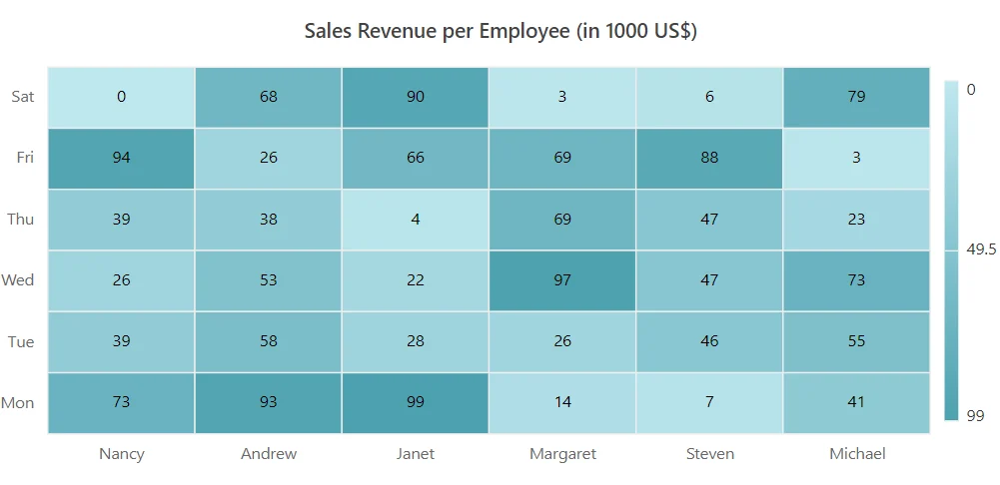
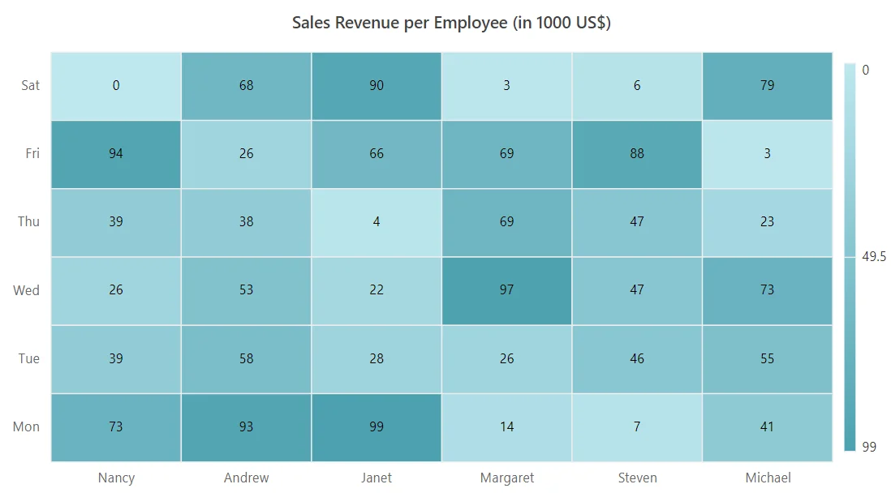

# Blazor HeatMap Chart Dimensions

## Size for HeatMap

You can set the size of the heat map directly by using the [Width](https://help.syncfusion.com/cr/blazor/Syncfusion.Blazor.HeatMap.SfHeatMap-1.html#Syncfusion_Blazor_HeatMap_SfHeatMap_1_Width) and [Height](https://help.syncfusion.com/cr/blazor/Syncfusion.Blazor.HeatMap.SfHeatMap-1.html#Syncfusion_Blazor_HeatMap_SfHeatMap_1_Height) properties.

### In pixel

You can set the size of the heat map in pixels.

```cshtml

@using Syncfusion.Blazor.HeatMap

<SfHeatMap DataSource="@HeatMapData" Width="750px" Height="350px">
    <HeatMapTitleSettings Text="Sales Revenue per Employee (in 1000 US$)">
    </HeatMapTitleSettings>
    <HeatMapXAxis Labels="@XAxisLabels"></HeatMapXAxis>
    <HeatMapYAxis Labels="@YAxisLabels"></HeatMapYAxis>
    <HeatMapCellSettings ShowLabel="true" TileType="CellType.Rect"></HeatMapCellSettings>
</SfHeatMap>

@code{
    int[,] GetDefaultData()
    {
        int[,] dataSource = new int[,]
        {
            {73, 39, 26, 39, 94, 0},
            {93, 58, 53, 38, 26, 68},
            {99, 28, 22, 4, 66, 90},
            {14, 26, 97, 69, 69, 3},
            {7, 46, 47, 47, 88, 6},
            {41, 55, 73, 23, 3, 79}
        };
        return dataSource;
    }
    string[] XAxisLabels = new string[] {"Nancy", "Andrew", "Janet", "Margaret", "Steven", "Michael" };
    string[] YAxisLabels = new string[] { "Mon", "Tue", "Wed", "Thu", "Fri", "Sat" };
    public object HeatMapData { get; set; }
    protected override void OnInitialized()
    {
        HeatMapData = GetDefaultData();
    }
}

```



### In percentage

By setting the value in percentage, the heat map gets its dimension with respect to its container. For example, when the height is "75%", the heat map is rendered to three-quarters of the container height.

```cshtml

@using Syncfusion.Blazor.HeatMap

<SfHeatMap DataSource="@HeatMapData" Width="75%" Height="75%">
    <HeatMapTitleSettings Text="Sales Revenue per Employee (in 1000 US$)">
    </HeatMapTitleSettings>
    <HeatMapXAxis Labels="@XAxisLabels"></HeatMapXAxis>
    <HeatMapYAxis Labels="@YAxisLabels"></HeatMapYAxis>
    <HeatMapCellSettings ShowLabel="true" TileType="CellType.Rect"></HeatMapCellSettings>
</SfHeatMap>

@code{
    int[,] GetDefaultData()
    {
        int[,] dataSource = new int[,]
        {
            {73, 39, 26, 39, 94, 0},
            {93, 58, 53, 38, 26, 68},
            {99, 28, 22, 4, 66, 90},
            {14, 26, 97, 69, 69, 3},
            {7, 46, 47, 47, 88, 6},
            {41, 55, 73, 23, 3, 79}
        };
        return dataSource;
    }
    string[] XAxisLabels = new string[] {"Nancy", "Andrew", "Janet", "Margaret", "Steven", "Michael" };
    string[] YAxisLabels = new string[] { "Mon", "Tue", "Wed", "Thu", "Fri", "Sat" };
    public object HeatMapData { get; set; }
    protected override void OnInitialized()
    {
        HeatMapData = GetDefaultData();
    }
}

```

N> The `Width` and `Height` percentages are based on the size of the HeatMap's parent container. Set an explicit width and height on the parent element for percentage values to take effect.

