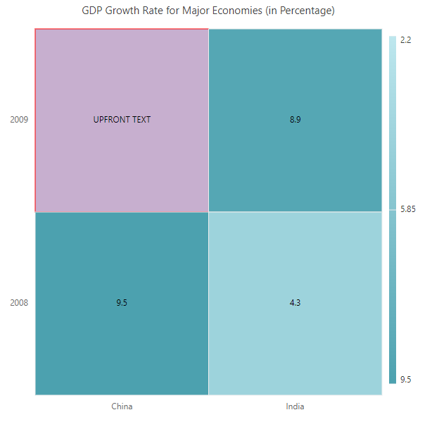
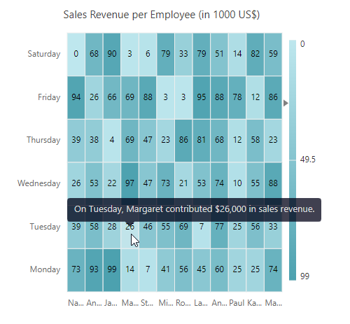

# Events in Blazor HeatMap Chart Component

This section describes the events that will be triggered for appropriate actions in HeatMap. The events should be declared in the HeatMap component using the [HeatMapEvents](https://help.syncfusion.com/cr/blazor/Syncfusion.Blazor.HeatMap.HeatMapEvents.html).

## CellClicked

When you click on a HeatMap cell, the [CellClicked](https://help.syncfusion.com/cr/blazor/Syncfusion.Blazor.HeatMap.HeatMapEvents.html#Syncfusion_Blazor_HeatMap_HeatMapEvents_CellClicked) event is triggered. More information about the arguments in this event can be found [here](https://help.syncfusion.com/cr/blazor/Syncfusion.Blazor.HeatMap.CellClickEventArgs.html).

The following example demonstrates how to use the `CellClicked` event to retrieve the value of the clicked cell as well as its x-axis and y-axis labels.

```cshtml
@using Syncfusion.Blazor.HeatMap

@if(IsVisible) {
    <div>
        <span> X-Label : <b> @XLabel </b> </span> <br />
        <span> Y-Label : <b> @YLabel </b> </span> <br />
        <span> CellValue : <b> @CellValue </b> </span>
    </div>
}

<SfHeatMap DataSource="@dataSource">
    <HeatMapEvents CellClicked="@CellClicked" />
    <HeatMapTitleSettings Text="Sales Revenue per Employee (in 1000 US$)" />
    <HeatMapXAxis Labels="@xAxisLabels" />
    <HeatMapYAxis Labels="@yAxisLabels" />
</SfHeatMap>

@code {
    public bool IsVisible = false;
    public string XLabel { get; set; }
    public string YLabel { get; set; }
    public double CellValue { get; set; }
    private void CellClicked(CellClickEventArgs args)
    {
        IsVisible = true;
        XLabel = args.XLabel;
        YLabel = args.YLabel;
        CellValue = args.Value;
    }
    public double[,] dataSource = new double[,]
    {
            { 73, 39, 26, 39, 94, 0 },
            { 93, 58, 53, 38, 26, 68 },
            { 99, 28, 22, 4, 66, 90 },
            { 14, 26, 97, 69, 69, 3 },
            { 7, 46, 47, 47, 88, 6 },
            { 41, 55, 73, 23, 3, 79 },
            { 56, 69, 21, 86, 3, 33 },
            { 45, 7, 53, 81, 95, 79 },
            { 60, 77, 74, 68, 88, 51 },
            { 25, 25, 10, 12, 78, 14 },
            { 25, 56, 55, 58, 12, 82 },
            { 74, 33, 88, 23, 86, 59 }
    };
    public string[] xAxisLabels = new string[] { "Nancy", "Andrew", "Janet", "Margaret", "Steven",
                 "Michael", "Robert", "Laura", "Anne", "Paul", "Karin", "Mario" };
    public string[] yAxisLabels = new string[] { "Mon", "Tues", "Wed", "Thurs", "Fri", "Sat" };
}
```


## CellRendering

The [CellRendering](https://help.syncfusion.com/cr/blazor/Syncfusion.Blazor.HeatMap.HeatMapEvents.html#Syncfusion_Blazor_HeatMap_HeatMapEvents_CellRendering) event will be triggered before each HeatMap cell is rendered. More information about the arguments in this event can be found [here](https://help.syncfusion.com/cr/blazor/Syncfusion.Blazor.HeatMap.HeatMapCellRenderEventArgs.html).

The following example demonstrates how to use the `CellRendering` event to customize the value, color, and border color of the cell.

```cshtml
@using Syncfusion.Blazor.HeatMap

<SfHeatMap DataSource="@dataSource">
    <HeatMapEvents CellRendering="@CellRender"/>
    <HeatMapTitleSettings Text="GDP Growth Rate for Major Economies (in Percentage)"/>
    <HeatMapXAxis Labels="@xAxisLabels"/>
    <HeatMapYAxis Labels="@yAxisLabels"/>
</SfHeatMap>

@code{
    private void CellRender(HeatMapCellRenderEventArgs args)
    {
        if (args.CellValue == "2.2")
        {
            args.CellValue = "UPFRONT TEXT";
            args.CellColor = "#c7afcf";
            args.BorderColor = "Red";
        }
    }
    public double[,] dataSource = new double[2, 2]
    {
            {9.5, 2.2 },
            {4.3, 8.9 }
    };
    public string[] xAxisLabels = new string[] { "China", "India" };
    public string[] yAxisLabels = new string[] { "2008", "2009" };
}
```



## CellSelected

When single or multiple cells in the HeatMap are selected, the [CellSelected](https://help.syncfusion.com/cr/blazor/Syncfusion.Blazor.HeatMap.HeatMapEvents.html#Syncfusion_Blazor_HeatMap_HeatMapEvents_CellSelected) event is triggered. More information about the arguments in this event can be found [here](https://help.syncfusion.com/cr/blazor/Syncfusion.Blazor.HeatMap.SelectedEventArgs.html).

The following example demonstrates how to use the `CellSelected` event to obtain the count and details of the selected cells.

```cshtml
@using Syncfusion.Blazor.HeatMap

@if (IsVisible)
{
    <div> Total Selected Cells : <b> @SelectedCellCount </b> </div>
}
<SfHeatMap DataSource="@dataSource" AllowSelection="true">
    <HeatMapEvents CellSelected="@CellSelected" />
    <HeatMapTitleSettings Text="Sales Revenue per Employee (in 1000 US$)" />
    <HeatMapXAxis Labels="@xAxisLabels" />
    <HeatMapYAxis Labels="@yAxisLabels" />
</SfHeatMap>

@code {
    public bool IsVisible = false;
    public int SelectedCellCount { get; set; }
    private void CellSelected(SelectedEventArgs args)
    {
        IsVisible = true;
        SelectedCellCount = args.Data.Count;
    }
    public double[,] dataSource = new double[,]
    {
            { 73, 39, 26, 39, 94, 0 },
            { 93, 58, 53, 38, 26, 68 },
            { 99, 28, 22, 4, 66, 90 },
            { 14, 26, 97, 69, 69, 3 },
            { 7, 46, 47, 47, 88, 6 },
            { 41, 55, 73, 23, 3, 79 },
            { 56, 69, 21, 86, 3, 33 },
            { 45, 7, 53, 81, 95, 79 },
            { 60, 77, 74, 68, 88, 51 },
            { 25, 25, 10, 12, 78, 14 },
            { 25, 56, 55, 58, 12, 82 },
            { 74, 33, 88, 23, 86, 59 }
    };
    public string[] xAxisLabels = new string[] { "Nancy", "Andrew", "Janet", "Margaret", "Steven",
                 "Michael", "Robert", "Laura", "Anne", "Paul", "Karin", "Mario" };
    public string[] yAxisLabels = new string[] { "Mon", "Tues", "Wed", "Thurs", "Fri", "Sat" };
}
```


## Created

The [Created](https://help.syncfusion.com/cr/blazor/Syncfusion.Blazor.HeatMap.HeatMapEvents.html#Syncfusion_Blazor_HeatMap_HeatMapEvents_Created) event is triggered during the initial rendering process, that is, immediately after the HeatMap component is initialized. This indicates that this event will be executed only once.

The following example demonstrates how to use the `Created` event.

```cshtml
@using Syncfusion.Blazor.HeatMap

@if (IsVisible)
{
    <div> <b>@EventText</b> </div>
}
<SfHeatMap DataSource="@dataSource">
    <HeatMapEvents Created="@Created" />
    <HeatMapTitleSettings Text="Sales Revenue per Employee (in 1000 US$)" />
    <HeatMapXAxis Labels="@xAxisLabels" />
    <HeatMapYAxis Labels="@yAxisLabels" />
</SfHeatMap>

@code {
    public bool IsVisible = false;
    public string EventText { get; set; }
    private void Created()
    {
        IsVisible = true;
        EventText = "The created event has been triggered!!!";
    }
    public double[,] dataSource = new double[,]
    {
            { 73, 39, 26, 39, 94, 0 },
            { 93, 58, 53, 38, 26, 68 },
            { 99, 28, 22, 4, 66, 90 },
            { 14, 26, 97, 69, 69, 3 },
            { 7, 46, 47, 47, 88, 6 },
            { 41, 55, 73, 23, 3, 79 },
            { 56, 69, 21, 86, 3, 33 },
            { 45, 7, 53, 81, 95, 79 },
            { 60, 77, 74, 68, 88, 51 },
            { 25, 25, 10, 12, 78, 14 },
            { 25, 56, 55, 58, 12, 82 },
            { 74, 33, 88, 23, 86, 59 }
    };
    public string[] xAxisLabels = new string[] { "Nancy", "Andrew", "Janet", "Margaret", "Steven",
                 "Michael", "Robert", "Laura", "Anne", "Paul", "Karin", "Mario" };
    public string[] yAxisLabels = new string[] { "Mon", "Tues", "Wed", "Thurs", "Fri", "Sat" };
}
```


## OnLoad

The [OnLoad](https://help.syncfusion.com/cr/blazor/Syncfusion.Blazor.HeatMap.HeatMapEvents.html#Syncfusion_Blazor_HeatMap_HeatMapEvents_OnLoad) event is triggered before the HeatMap is rendered. More information about the arguments in this event can be found [here](https://help.syncfusion.com/cr/blazor/Syncfusion.Blazor.HeatMap.LoadedEventArgs.html).

The following example demonstrates how to use the `OnLoad` event.

```cshtml

@using Syncfusion.Blazor.HeatMap

@if (IsVisible)
{
    <div> <b>@EventText</b> </div>
}
<SfHeatMap DataSource="@dataSource">
    <HeatMapEvents OnLoad="@Load" />
    <HeatMapTitleSettings Text="Sales Revenue per Employee (in 1000 US$)" />
    <HeatMapXAxis Labels="@xAxisLabels" />
    <HeatMapYAxis Labels="@yAxisLabels" />
</SfHeatMap>

@code {
    public bool IsVisible = false;
    public string EventText { get; set; }
    private void Load(LoadedEventArgs args)
    {
        IsVisible = true;
        EventText = "The load event has been triggered!!!";
    }
    public double[,] dataSource = new double[,]
    {
            { 73, 39, 26, 39, 94, 0 },
            { 93, 58, 53, 38, 26, 68 },
            { 99, 28, 22, 4, 66, 90 },
            { 14, 26, 97, 69, 69, 3 },
            { 7, 46, 47, 47, 88, 6 },
            { 41, 55, 73, 23, 3, 79 },
            { 56, 69, 21, 86, 3, 33 },
            { 45, 7, 53, 81, 95, 79 },
            { 60, 77, 74, 68, 88, 51 },
            { 25, 25, 10, 12, 78, 14 },
            { 25, 56, 55, 58, 12, 82 },
            { 74, 33, 88, 23, 86, 59 }
    };
    public string[] xAxisLabels = new string[] { "Nancy", "Andrew", "Janet", "Margaret", "Steven",
                 "Michael", "Robert", "Laura", "Anne", "Paul", "Karin", "Mario" };
    public string[] yAxisLabels = new string[] { "Mon", "Tues", "Wed", "Thurs", "Fri", "Sat" };
}
```


## Loaded

The [Loaded](https://help.syncfusion.com/cr/blazor/Syncfusion.Blazor.HeatMap.HeatMapEvents.html#Syncfusion_Blazor_HeatMap_HeatMapEvents_Loaded) event is triggered when the HeatMap component is re-rendered during a browser window resize. More information about the arguments in this event can be found [here](https://help.syncfusion.com/cr/blazor/Syncfusion.Blazor.HeatMap.LoadedEventArgs.html).

The following example demonstrates how to use the `Loaded` event.

```cshtml
@using Syncfusion.Blazor.HeatMap

@if (IsVisible)
{
    <div> <b>@EventText</b> </div>
}
<SfHeatMap DataSource="@dataSource">
    <HeatMapEvents Loaded="@Loaded" />
    <HeatMapTitleSettings Text="Sales Revenue per Employee (in 1000 US$)" />
    <HeatMapXAxis Labels="@xAxisLabels" />
    <HeatMapYAxis Labels="@yAxisLabels" />
</SfHeatMap>

@code {
    public bool IsVisible = false;
    public string EventText { get; set; }
    private void Loaded(LoadedEventArgs args)
    {
        IsVisible = true;
        EventText = "The loaded event has been triggered!!!";
    }
    public double[,] dataSource = new double[,]
    {
            { 73, 39, 26, 39, 94, 0 },
            { 93, 58, 53, 38, 26, 68 },
            { 99, 28, 22, 4, 66, 90 },
            { 14, 26, 97, 69, 69, 3 },
            { 7, 46, 47, 47, 88, 6 },
            { 41, 55, 73, 23, 3, 79 },
            { 56, 69, 21, 86, 3, 33 },
            { 45, 7, 53, 81, 95, 79 },
            { 60, 77, 74, 68, 88, 51 },
            { 25, 25, 10, 12, 78, 14 },
            { 25, 56, 55, 58, 12, 82 },
            { 74, 33, 88, 23, 86, 59 }
    };
    public string[] xAxisLabels = new string[] { "Nancy", "Andrew", "Janet", "Margaret", "Steven",
                 "Michael", "Robert", "Laura", "Anne", "Paul", "Karin", "Mario" };
    public string[] yAxisLabels = new string[] { "Mon", "Tues", "Wed", "Thurs", "Fri", "Sat" };
}
```


## Resized

When the browser window is resized, the [Resized](https://help.syncfusion.com/cr/blazor/Syncfusion.Blazor.HeatMap.HeatMapEvents.html#Syncfusion_Blazor_HeatMap_HeatMapEvents_Resized) event is triggered. More information about the arguments in this event can be found [here](https://help.syncfusion.com/cr/blazor/Syncfusion.Blazor.HeatMap.ResizeEventArgs.html).

The following example demonstrates how to use the `Resized` event.

```cshtml
@using Syncfusion.Blazor.HeatMap

@if (IsVisible)
{
    <div> <b>@EventText</b> </div>
}
<SfHeatMap DataSource="@dataSource">
    <HeatMapEvents Resized="@Resized" />
    <HeatMapTitleSettings Text="Sales Revenue per Employee (in 1000 US$)" />
    <HeatMapXAxis Labels="@xAxisLabels" />
    <HeatMapYAxis Labels="@yAxisLabels" />
</SfHeatMap>

@code {
    public bool IsVisible = false;
    public string EventText { get; set; }
    private void Resized(ResizeEventArgs args)
    {
        IsVisible = true;
        EventText = "The resized event has been triggered!!!";
    }
    public double[,] dataSource = new double[,]
    {
            { 73, 39, 26, 39, 94, 0 },
            { 93, 58, 53, 38, 26, 68 },
            { 99, 28, 22, 4, 66, 90 },
            { 14, 26, 97, 69, 69, 3 },
            { 7, 46, 47, 47, 88, 6 },
            { 41, 55, 73, 23, 3, 79 },
            { 56, 69, 21, 86, 3, 33 },
            { 45, 7, 53, 81, 95, 79 },
            { 60, 77, 74, 68, 88, 51 },
            { 25, 25, 10, 12, 78, 14 },
            { 25, 56, 55, 58, 12, 82 },
            { 74, 33, 88, 23, 86, 59 }
    };
    public string[] xAxisLabels = new string[] { "Nancy", "Andrew", "Janet", "Margaret", "Steven",
                 "Michael", "Robert", "Laura", "Anne", "Paul", "Karin", "Mario" };
    public string[] yAxisLabels = new string[] { "Mon", "Tues", "Wed", "Thurs", "Fri", "Sat" };
}
```


## TooltipRendering

The [TooltipRendering](https://help.syncfusion.com/cr/blazor/Syncfusion.Blazor.HeatMap.HeatMapEvents.html#Syncfusion_Blazor_HeatMap_HeatMapEvents_TooltipRendering) event is triggered before the tooltip is rendered on the HeatMap cell. More information about the arguments in this event can be found [here](https://help.syncfusion.com/cr/blazor/Syncfusion.Blazor.HeatMap.TooltipEventArgs.html).

The following example demonstrates how to use the `TooltipRendering` event to customize tooltips for specific cells when hovering over them.

```cshtml
@using Syncfusion.Blazor.HeatMap

<SfHeatMap DataSource="@dataSource">
    <HeatMapEvents TooltipRendering="@TooltipRendering" />
    <HeatMapTitleSettings Text="Sales Revenue per Employee (in 1000 US$)" />
    <HeatMapXAxis Labels="@xAxisLabels" />
    <HeatMapYAxis Labels="@yAxisLabels" />
</SfHeatMap>

@code {
    private void TooltipRendering(TooltipEventArgs args)
    {
        args.Content = new string[] { $"On {args.YLabel}, {args.XLabel} contributed {args.Value * 1000:C0} in sales revenue." };
    }
    public double[,] dataSource = new double[,]
    {
            { 73, 39, 26, 39, 94, 0 },
            { 93, 58, 53, 38, 26, 68 },
            { 99, 28, 22, 4, 66, 90 },
            { 14, 26, 97, 69, 69, 3 },
            { 7, 46, 47, 47, 88, 6 },
            { 41, 55, 73, 23, 3, 79 },
            { 56, 69, 21, 86, 3, 33 },
            { 45, 7, 53, 81, 95, 79 },
            { 60, 77, 74, 68, 88, 51 },
            { 25, 25, 10, 12, 78, 14 },
            { 25, 56, 55, 58, 12, 82 },
            { 74, 33, 88, 23, 86, 59 }
    };
    public string[] xAxisLabels = new string[] { "Nancy", "Andrew", "Janet", "Margaret", "Steven",
                 "Michael", "Robert", "Laura", "Anne", "Paul", "Karin", "Mario" };
    public string[] yAxisLabels = new string[] { "Monday", "Tuesday", "Wednesday", "Thursday", "Friday", "Saturday" };
}
```
