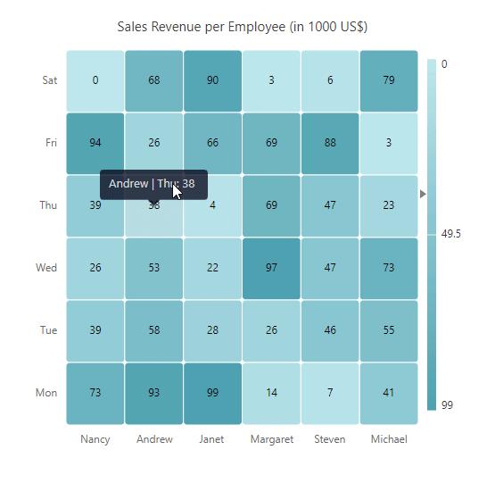
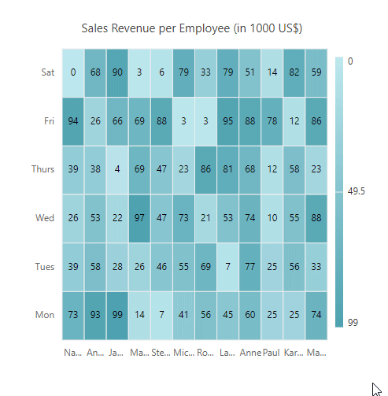
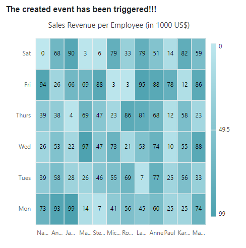
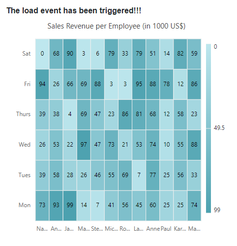
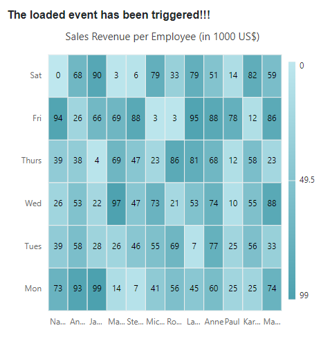
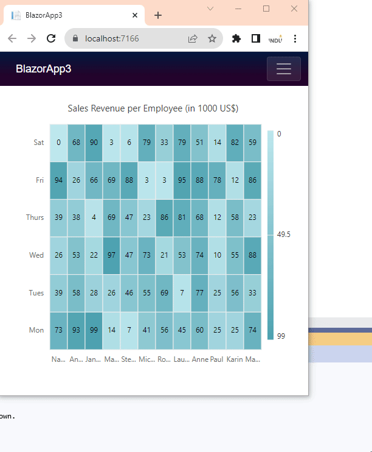

# Events in Blazor HeatMap Chart Component

This section describes the events triggered by actions in the HeatMap Chart. Declare events using the [HeatMapEvents](https://help.syncfusion.com/cr/blazor/Syncfusion.Blazor.HeatMap.HeatMapEvents.html) property.

## CellClicked

The [CellClicked](https://help.syncfusion.com/cr/blazor/Syncfusion.Blazor.HeatMap.HeatMapEvents.html#Syncfusion_Blazor_HeatMap_HeatMapEvents_CellClicked) event is triggered when a HeatMap cell is clicked. For right-clicks, the [HasRightClicked](https://help.syncfusion.com/cr/blazor/Syncfusion.Blazor.HeatMap.CellClickEventArgs.html#Syncfusion_Blazor_HeatMap_CellClickEventArgs_HasRightClicked) property is set to **true**. See the event arguments [here](https://help.syncfusion.com/cr/blazor/Syncfusion.Blazor.HeatMap.CellClickEventArgs.html).

```cshtml

@using Syncfusion.Blazor.HeatMap
@using Syncfusion.Blazor.Popups

@if (IsCellClicked)
{
    <div>@CellClicked</div>
}

<SfHeatMap DataSource="@dataSource">
    <HeatMapEvents CellClicked="CellClick"></HeatMapEvents>
    <HeatMapXAxis Labels="@XAxisLabels"></HeatMapXAxis>
    <HeatMapYAxis Labels="@YAxisLabels"></HeatMapYAxis>
    <HeatMapTitleSettings Text="Sales Revenue per Employee (in 1000 US$)">
    </HeatMapTitleSettings>
    <HeatMapCellSettings ShowLabel="true" TileType="CellType.Rect">
        <HeatMapCellBorder Width="1" Radius="4" Color="White"></HeatMapCellBorder>
    </HeatMapCellSettings>
    <HeatMapLegendSettings ShowLabel="true"></HeatMapLegendSettings>
</SfHeatMap>


@if (this.ShowButton)
{
    <SfDialog ResizeHandles="@DialogResizeDirections" AllowDragging="true" Height="200px" Width="300px" EnableResize="true" ShowCloseIcon="true" @bind-Visible="Visibility">
        <DialogPositionData X="@Xvalue" Y="@Yvalue"></DialogPositionData>
        <DialogEvents Closed="@DialogClose"></DialogEvents>
        <DialogTemplates>
            <Header>HeatMap Cell Values</Header>
            <Content>
                <table class="styled-table">
                    <thead>
                        <tr>
                            <th>X-axis Label</th>
                            <th>Y-axis Label</th>
                            <th>Current Cell Value</th>
                        </tr>
                    </thead>
                    <tbody>
                        <tr>
                            <td>@xLabel</td>
                            <td>@yLabel</td>
                            <td>@cellValue</td>
                        </tr>
                    </tbody>
                </table>
            </Content>
        </DialogTemplates>
    </SfDialog>
}

<style>
    .styled-table {
        width: 100%;
        border-collapse: collapse;
    }

        .styled-table th, .styled-table td {
            border: 1px solid black;
            padding: 10px;
            text-align: left;
        }

        .styled-table thead {
            background-color: #f2f2f2;
        }
</style>

@code {
    public bool IsCellClicked = false;
    public string CellClicked;
    public bool ShowButton { get; set; } = false;
    public bool Visibility { get; set; } = false;
    public ResizeDirection[] DialogResizeDirections { get; set; } = new ResizeDirection[] { ResizeDirection.All };
    public string xLabel { get; set; }
    public string yLabel { get; set; }
    public double cellValue { get; set; }
    public string Xvalue { get; set; }
    public string Yvalue { get; set; }

    string[] XAxisLabels = new string[] { "Nancy", "Andrew", "Janet", "Margaret", "Steven", "Michael" };
    string[] YAxisLabels = new string[] { "Mon", "Tue", "Wed", "Thu", "Fri", "Sat" };

    int[,] dataSource = new int[,]
    {
        {73, 39, 26, 39, 94, 0},
        {93, 58, 53, 38, 26, 68},
        {99, 28, 22, 4, 66, 90},
        {14, 26, 97, 69, 69, 3},
        {7, 46, 47, 47, 88, 6},
        {41, 55, 73, 23, 3, 79},
    };

    public void CellClick(Syncfusion.Blazor.HeatMap.CellClickEventArgs args)
    {
        if (args.HasRightClicked)
        {
            Xvalue = args.X;
            Yvalue = args.Y;
            ShowButton = true;
            Visibility = true;
            xLabel = args.XLabel;
            yLabel = args.YLabel;
            cellValue = args.Value;
        } else {
            IsCellClicked = true;
            CellClicked = "The cell clicked event has been triggered!!";
        }
    }

    private void DialogClose(Object args)
    {
        ShowButton = false;
    }
}

```



## CellRendering

The [CellRendering](https://help.syncfusion.com/cr/blazor/Syncfusion.Blazor.HeatMap.HeatMapEvents.html#Syncfusion_Blazor_HeatMap_HeatMapEvents_CellRendering) event is triggered before each cell is rendered. See the event arguments [here](https://help.syncfusion.com/cr/blazor/Syncfusion.Blazor.HeatMap.HeatMapCellRenderEventArgs.html).

```cshtml

@using Syncfusion.Blazor.HeatMap

<SfHeatMap DataSource="@dataSource">
    <HeatMapEvents CellRendering="@CellRender"/>
    <HeatMapTitleSettings Text="GDP Growth Rate for Major Economies (in Percentage)"/>
    <HeatMapXAxis Labels="@xAxisLabels"/>
    <HeatMapYAxis Labels="@yAxisLabels"/>
</SfHeatMap>

@code {
    public string[] xAxisLabels = new string[] { "China", "India" };
    public string[] yAxisLabels = new string[] { "2008", "2009" };

    private void CellRender(HeatMapCellRenderEventArgs args)
    {
        if (args.CellValue == "2.2")
        {
            args.CellValue = "UPFRONT TEXT";
            args.CellColor = "#c7afcf";
            args.BorderColor = "Red";
        }
    }

    public double[,] dataSource = new double[2, 2]
    {
        {9.5, 2.2 },
        {4.3, 8.9 }
    };
}

```


## CellSelected

The [CellSelected](https://help.syncfusion.com/cr/blazor/Syncfusion.Blazor.HeatMap.HeatMapEvents.html#Syncfusion_Blazor_HeatMap_HeatMapEvents_CellSelected) event is triggered when one or more cells are selected. See the event arguments [here](https://help.syncfusion.com/cr/blazor/Syncfusion.Blazor.HeatMap.SelectedEventArgs.html).

```cshtml

@using Syncfusion.Blazor.HeatMap

@if (IsVisible)
{
    <div> Total Selected Cells : <b> @SelectedCellCount </b> </div>
}
<SfHeatMap DataSource="@dataSource" AllowSelection="true">
    <HeatMapEvents CellSelected="@CellSelected" />
    <HeatMapTitleSettings Text="Sales Revenue per Employee (in 1000 US$)" />
    <HeatMapXAxis Labels="@xAxisLabels" />
    <HeatMapYAxis Labels="@yAxisLabels" />
</SfHeatMap>

@code {
    public bool IsVisible = false;
    public int SelectedCellCount { get; set; }

    public string[] xAxisLabels = new string[] { "Nancy", "Andrew", "Janet", "Margaret", "Steven", "Michael", "Robert", "Laura", "Anne", "Paul", "Karin", "Mario" };
    public string[] yAxisLabels = new string[] { "Mon", "Tues", "Wed", "Thurs", "Fri", "Sat" };

    private void CellSelected(SelectedEventArgs args)
    {
        IsVisible = true;
        SelectedCellCount = args.Data.Count;
    }

    public double[,] dataSource = new double[,]
    {
        { 73, 39, 26, 39, 94, 0 },
        { 93, 58, 53, 38, 26, 68 },
        { 99, 28, 22, 4, 66, 90 },
        { 14, 26, 97, 69, 69, 3 },
        { 7, 46, 47, 47, 88, 6 },
        { 41, 55, 73, 23, 3, 79 },
        { 56, 69, 21, 86, 3, 33 },
        { 45, 7, 53, 81, 95, 79 },
        { 60, 77, 74, 68, 88, 51 },
        { 25, 25, 10, 12, 78, 14 },
        { 25, 56, 55, 58, 12, 82 },
        { 74, 33, 88, 23, 86, 59 }
    };
}

```


## Created

The [Created](https://help.syncfusion.com/cr/blazor/Syncfusion.Blazor.HeatMap.HeatMapEvents.html#Syncfusion_Blazor_HeatMap_HeatMapEvents_Created) event is triggered after the HeatMap Chart is initialized. This event executes only once.

```cshtml

@using Syncfusion.Blazor.HeatMap

@if (IsVisible)
{
    <div> <b>@EventText</b> </div>
}

<SfHeatMap DataSource="@dataSource">
    <HeatMapEvents Created="@Created" />
    <HeatMapTitleSettings Text="Sales Revenue per Employee (in 1000 US$)" />
    <HeatMapXAxis Labels="@xAxisLabels" />
    <HeatMapYAxis Labels="@yAxisLabels" />
</SfHeatMap>

@code {
    public bool IsVisible = false;
    public string EventText { get; set; }

    public string[] xAxisLabels = new string[] { "Nancy", "Andrew", "Janet", "Margaret", "Steven",
                 "Michael", "Robert", "Laura", "Anne", "Paul", "Karin", "Mario" };
    public string[] yAxisLabels = new string[] { "Mon", "Tues", "Wed", "Thurs", "Fri", "Sat" };

    private void Created()
    {
        IsVisible = true;
        EventText = "The created event has been triggered!!!";
    }

    public double[,] dataSource = new double[,]
    {
        { 73, 39, 26, 39, 94, 0 },
        { 93, 58, 53, 38, 26, 68 },
        { 99, 28, 22, 4, 66, 90 },
        { 14, 26, 97, 69, 69, 3 },
        { 7, 46, 47, 47, 88, 6 },
        { 41, 55, 73, 23, 3, 79 },
        { 56, 69, 21, 86, 3, 33 },
        { 45, 7, 53, 81, 95, 79 },
        { 60, 77, 74, 68, 88, 51 },
        { 25, 25, 10, 12, 78, 14 },
        { 25, 56, 55, 58, 12, 82 },
        { 74, 33, 88, 23, 86, 59 }
    };
}

```


## OnLoad

The [OnLoad](https://help.syncfusion.com/cr/blazor/Syncfusion.Blazor.HeatMap.HeatMapEvents.html#Syncfusion_Blazor_HeatMap_HeatMapEvents_OnLoad) event is triggered before the HeatMap is rendered. See the event arguments [here](https://help.syncfusion.com/cr/blazor/Syncfusion.Blazor.HeatMap.LoadedEventArgs.html).

```cshtml

@using Syncfusion.Blazor.HeatMap

@if (IsVisible)
{
    <div> <b>@EventText</b> </div>
}

<SfHeatMap DataSource="@dataSource">
    <HeatMapEvents OnLoad="@Load" />
    <HeatMapTitleSettings Text="Sales Revenue per Employee (in 1000 US$)" />
    <HeatMapXAxis Labels="@xAxisLabels" />
    <HeatMapYAxis Labels="@yAxisLabels" />
</SfHeatMap>

@code {
    public bool IsVisible = false;
    public string EventText { get; set; }

    public string[] xAxisLabels = new string[] { "Nancy", "Andrew", "Janet", "Margaret", "Steven",
                 "Michael", "Robert", "Laura", "Anne", "Paul", "Karin", "Mario" };
    public string[] yAxisLabels = new string[] { "Mon", "Tues", "Wed", "Thurs", "Fri", "Sat" };

    private void Load(LoadedEventArgs args)
    {
        IsVisible = true;
        EventText = "The load event has been triggered!!!";
    }

    public double[,] dataSource = new double[,]
    {
        { 73, 39, 26, 39, 94, 0 },
        { 93, 58, 53, 38, 26, 68 },
        { 99, 28, 22, 4, 66, 90 },
        { 14, 26, 97, 69, 69, 3 },
        { 7, 46, 47, 47, 88, 6 },
        { 41, 55, 73, 23, 3, 79 },
        { 56, 69, 21, 86, 3, 33 },
        { 45, 7, 53, 81, 95, 79 },
        { 60, 77, 74, 68, 88, 51 },
        { 25, 25, 10, 12, 78, 14 },
        { 25, 56, 55, 58, 12, 82 },
        { 74, 33, 88, 23, 86, 59 }
    };
}

```


## Loaded

The [Loaded](https://help.syncfusion.com/cr/blazor/Syncfusion.Blazor.HeatMap.HeatMapEvents.html#Syncfusion_Blazor_HeatMap_HeatMapEvents_Loaded) event is triggered when the HeatMap Chart is re-rendered, such as during a browser window resize. See the event arguments [here](https://help.syncfusion.com/cr/blazor/Syncfusion.Blazor.HeatMap.LoadedEventArgs.html).

```cshtml
@using Syncfusion.Blazor.HeatMap

@if (IsVisible)
{
    <div> <b>@EventText</b> </div>
}

<SfHeatMap DataSource="@dataSource">
    <HeatMapEvents Loaded="@Loaded" />
    <HeatMapTitleSettings Text="Sales Revenue per Employee (in 1000 US$)" />
    <HeatMapXAxis Labels="@xAxisLabels" />
    <HeatMapYAxis Labels="@yAxisLabels" />
</SfHeatMap>

@code {
    public bool IsVisible = false;
    public string EventText { get; set; }

    private void Loaded(LoadedEventArgs args)
    {
        IsVisible = true;
        EventText = "The loaded event has been triggered!!!";
    }

    public double[,] dataSource = new double[,]
    {
        { 73, 39, 26, 39, 94, 0 },
        { 93, 58, 53, 38, 26, 68 },
        { 99, 28, 22, 4, 66, 90 },
        { 14, 26, 97, 69, 69, 3 },
        { 7, 46, 47, 47, 88, 6 },
        { 41, 55, 73, 23, 3, 79 },
        { 56, 69, 21, 86, 3, 33 },
        { 45, 7, 53, 81, 95, 79 },
        { 60, 77, 74, 68, 88, 51 },
        { 25, 25, 10, 12, 78, 14 },
        { 25, 56, 55, 58, 12, 82 },
        { 74, 33, 88, 23, 86, 59 }
    };
}

```


## Resized

The [Resized](https://help.syncfusion.com/cr/blazor/Syncfusion.Blazor.HeatMap.HeatMapEvents.html#Syncfusion_Blazor_HeatMap_HeatMapEvents_Resized) event is triggered when the browser window is resized. See the event arguments [here](https://help.syncfusion.com/cr/blazor/Syncfusion.Blazor.HeatMap.ResizeEventArgs.html).

```cshtml
@using Syncfusion.Blazor.HeatMap

@if (IsVisible)
{
    <div> <b>@EventText</b> </div>
}

<SfHeatMap DataSource="@dataSource">
    <HeatMapEvents Resized="@Resized" />
    <HeatMapTitleSettings Text="Sales Revenue per Employee (in 1000 US$)" />
    <HeatMapXAxis Labels="@xAxisLabels" />
    <HeatMapYAxis Labels="@yAxisLabels" />
</SfHeatMap>

@code {
    public bool IsVisible = false;
    public string EventText { get; set; }

    public string[] xAxisLabels = new string[] { "Nancy", "Andrew", "Janet", "Margaret", "Steven",
                 "Michael", "Robert", "Laura", "Anne", "Paul", "Karin", "Mario" };
    public string[] yAxisLabels = new string[] { "Mon", "Tues", "Wed", "Thurs", "Fri", "Sat" };
    
    private void Resized(ResizeEventArgs args)
    {
        IsVisible = true;
        EventText = "The resized event has been triggered!!!";
    }

    public double[,] dataSource = new double[,]
    {
        { 73, 39, 26, 39, 94, 0 },
        { 93, 58, 53, 38, 26, 68 },
        { 99, 28, 22, 4, 66, 90 },
        { 14, 26, 97, 69, 69, 3 },
        { 7, 46, 47, 47, 88, 6 },
        { 41, 55, 73, 23, 3, 79 },
        { 56, 69, 21, 86, 3, 33 },
        { 45, 7, 53, 81, 95, 79 },
        { 60, 77, 74, 68, 88, 51 },
        { 25, 25, 10, 12, 78, 14 },
        { 25, 56, 55, 58, 12, 82 },
        { 74, 33, 88, 23, 86, 59 }
    };
}

```


## TooltipRendering

The [TooltipRendering](https://help.syncfusion.com/cr/blazor/Syncfusion.Blazor.HeatMap.HeatMapEvents.html#Syncfusion_Blazor_HeatMap_HeatMapEvents_TooltipRendering) event is triggered before the tooltip is rendered on a cell. See the event arguments [here](https://help.syncfusion.com/cr/blazor/Syncfusion.Blazor.HeatMap.TooltipEventArgs.html).

```cshtml

@using Syncfusion.Blazor.HeatMap

<SfHeatMap DataSource="@dataSource">
    <HeatMapEvents TooltipRendering="@TooltipRendering" />
    <HeatMapTitleSettings Text="Sales Revenue per Employee (in 1000 US$)" />
    <HeatMapXAxis Labels="@xAxisLabels" />
    <HeatMapYAxis Labels="@yAxisLabels" />
</SfHeatMap>

@code {
    public string[] xAxisLabels = new string[] { "Nancy", "Andrew", "Janet", "Margaret", "Steven",
                 "Michael", "Robert", "Laura", "Anne", "Paul", "Karin", "Mario" };
    public string[] yAxisLabels = new string[] { "Monday", "Tuesday", "Wednesday", "Thursday", "Friday", "Saturday" };

    private void TooltipRendering(TooltipEventArgs args)
    {
        args.Content = new string[] { $"On {args.YLabel}, {args.XLabel} contributed {args.Value * 1000:C0} in sales revenue." };
    }

    public double[,] dataSource = new double[,]
    {
        { 73, 39, 26, 39, 94, 0 },
        { 93, 58, 53, 38, 26, 68 },
        { 99, 28, 22, 4, 66, 90 },
        { 14, 26, 97, 69, 69, 3 },
        { 7, 46, 47, 47, 88, 6 },
        { 41, 55, 73, 23, 3, 79 },
        { 56, 69, 21, 86, 3, 33 },
        { 45, 7, 53, 81, 95, 79 },
        { 60, 77, 74, 68, 88, 51 },
        { 25, 25, 10, 12, 78, 14 },
        { 25, 56, 55, 58, 12, 82 },
        { 74, 33, 88, 23, 86, 59 }
    };
}

```


## CellDoubleClicked

The [CellDoubleClicked](https://help.syncfusion.com/cr/blazor/Syncfusion.Blazor.HeatMap.HeatMapEvents.html#Syncfusion_Blazor_HeatMap_HeatMapEvents_CellDoubleClicked) event is triggered when a cell is double-clicked. See the event arguments [here](https://help.syncfusion.com/cr/blazor/Syncfusion.Blazor.HeatMap.CellDoubleClickEventArgs.html).

```cshtml

@using Syncfusion.Blazor.HeatMap

@if(IsVisible) {
    <div>
        <span> X-Label : <b> @XLabel </b> </span> <br />
        <span> Y-Label : <b> @YLabel </b> </span> <br />
        <span> CellValue : <b> @CellValue </b> </span>
    </div>
}

<SfHeatMap DataSource="@dataSource">
    <HeatMapEvents CellDoubleClicked="@CellDoubleClicked" />
    <HeatMapTitleSettings Text="Sales Revenue per Employee (in 1000 US$)" />
    <HeatMapXAxis Labels="@xAxisLabels" />
    <HeatMapYAxis Labels="@yAxisLabels" />
</SfHeatMap>

@code {
    public bool IsVisible = false;
    public string XLabel { get; set; }
    public string YLabel { get; set; }
    public double CellValue { get; set; }

    public string[] xAxisLabels = new string[] { "Nancy", "Andrew", "Janet", "Margaret", "Steven",
                 "Michael", "Robert", "Laura", "Anne", "Paul", "Karin", "Mario" };
    public string[] yAxisLabels = new string[] { "Mon", "Tues", "Wed", "Thurs", "Fri", "Sat" };

    private void CellDoubleClicked(CellDoubleClickEventArgs args)
    {
        IsVisible = true;
        XLabel = args.XLabel;
        YLabel = args.YLabel;
        CellValue = args.Value;
    }

    public double[,] dataSource = new double[,]
    {
        { 73, 39, 26, 39, 94, 0 },
        { 93, 58, 53, 38, 26, 68 },
        { 99, 28, 22, 4, 66, 90 },
        { 14, 26, 97, 69, 69, 3 },
        { 7, 46, 47, 47, 88, 6 },
        { 41, 55, 73, 23, 3, 79 },
        { 56, 69, 21, 86, 3, 33 },
        { 45, 7, 53, 81, 95, 79 },
        { 60, 77, 74, 68, 88, 51 },
        { 25, 25, 10, 12, 78, 14 },
        { 25, 56, 55, 58, 12, 82 },
        { 74, 33, 88, 23, 86, 59 }
    };
}

```


## LegendRendering

The [LegendRendering](https://help.syncfusion.com/cr/blazor/Syncfusion.Blazor.HeatMap.HeatMapEvents.html#Syncfusion_Blazor_HeatMap_HeatMapEvents_LegendRendering) event is triggered before each legend item is rendered. See the event arguments [here](https://help.syncfusion.com/cr/blazor/Syncfusion.Blazor.HeatMap.LegendRenderEventArgs.html).

```cshtml
@using Syncfusion.Blazor.HeatMap

<SfHeatMap DataSource="@HeatMapData">
    <HeatMapEvents LegendRendering="@LegendRender" />
    <HeatMapTitleSettings Text="Sales Revenue per Employee (in 1000 US$)">
    </HeatMapTitleSettings>
    <HeatMapXAxis Labels="@XAxisLabels"></HeatMapXAxis>
    <HeatMapYAxis Labels="@YAxisLabels"></HeatMapYAxis>
    <HeatMapCellSettings ShowLabel="true" TileType="CellType.Rect"></HeatMapCellSettings>
    <HeatMapPaletteSettings Type="PaletteType.Gradient">
        <HeatMapPalettes>
            <HeatMapPalette Value="0" Color="#C2E7EC"></HeatMapPalette>
            <HeatMapPalette Value="10" Color="#AEDFE6"></HeatMapPalette>
            <HeatMapPalette Value="20" Color="#9AD7E0"></HeatMapPalette>
            <HeatMapPalette Value="30" Color="#72C7D4"></HeatMapPalette>
            <HeatMapPalette Value="40" Color="#5EBFCE"></HeatMapPalette>
            <HeatMapPalette Value="50" Color="#4AB7C8"></HeatMapPalette>
            <HeatMapPalette Value="60" Color="#309DAE"></HeatMapPalette>
            <HeatMapPalette Value="70" Color="#2B8C9B"></HeatMapPalette>
            <HeatMapPalette Value="80" Color="#257A87"></HeatMapPalette>
            <HeatMapPalette Value="90" Color="#15464D"></HeatMapPalette>
            <HeatMapPalette Value="100" Color="#000000"></HeatMapPalette>
        </HeatMapPalettes>
    </HeatMapPaletteSettings>
    <HeatMapLegendSettings Visible="true"></HeatMapLegendSettings>
</SfHeatMap>

@code {
    public string[] XAxisLabels = new string[] { "Nancy", "Andrew", "Janet", "Margaret", "Steven", "Michael" };
    public string[] YAxisLabels = new string[] { "Mon", "Tue", "Wed", "Thu", "Fri", "Sat" };

    public int[,] HeatMapData = new int[,]
    {
        {73, 39, 26, 39, 94, 0},
        {93, 58, 53, 38, 26, 68},
        {99, 28, 22, 4, 66, 90},
        {14, 26, 97, 69, 69, 3},
        {7, 46, 47, 47, 88, 6},
        {41, 55, 73, 23, 3, 79}
    };

    private void LegendRender(Syncfusion.Blazor.HeatMap.LegendRenderEventArgs args)
    {
        if (args.Text != "0")
        {
            args.Text = "";
        }
    }
}

```

