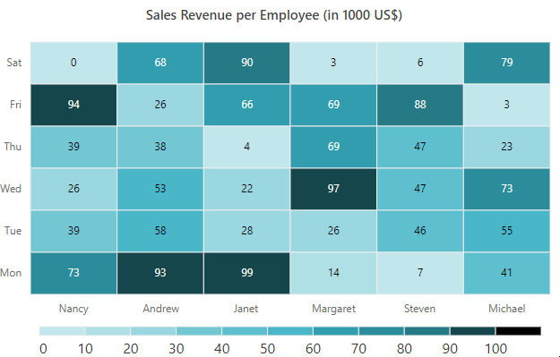
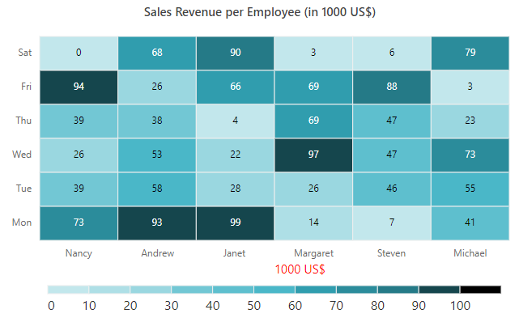

# Legend in Blazor HeatMap Chart Component

The legend is used to provide the information about the heat map cell. You can enable the legend by setting the [Visible](https://help.syncfusion.com/cr/blazor/Syncfusion.Blazor.HeatMap.HeatMapLegendSettings.html#Syncfusion_Blazor_HeatMap_HeatMapLegendSettings_Visible) property to **true**.

```cshtml

@using Syncfusion.Blazor.HeatMap

<SfHeatMap DataSource="@HeatMapData">
    <HeatMapTitleSettings Text="Sales Revenue per Employee (in 1000 US$)">
    </HeatMapTitleSettings>
    <HeatMapXAxis Labels="@XAxisLabels"></HeatMapXAxis>
    <HeatMapYAxis Labels="@YAxisLabels"></HeatMapYAxis>
    <HeatMapCellSettings ShowLabel="true" TileType="CellType.Rect"></HeatMapCellSettings>
    <HeatMapPaletteSettings Type="PaletteType.Gradient">
        <HeatMapPalettes>
            <HeatMapPalette Value="0" Color="#C2E7EC"></HeatMapPalette>
            <HeatMapPalette Value="10" Color="#AEDFE6"></HeatMapPalette>
            <HeatMapPalette Value="20" Color="#9AD7E0"></HeatMapPalette>
            <HeatMapPalette Value="30" Color="#72C7D4"></HeatMapPalette>
            <HeatMapPalette Value="40" Color="#5EBFCE"></HeatMapPalette>
            <HeatMapPalette Value="50" Color="#4AB7C8"></HeatMapPalette>
            <HeatMapPalette Value="60" Color="#309DAE"></HeatMapPalette>
            <HeatMapPalette Value="70" Color="#2B8C9B"></HeatMapPalette>
            <HeatMapPalette Value="80" Color="#257A87"></HeatMapPalette>
            <HeatMapPalette Value="90" Color="#15464D"></HeatMapPalette>
            <HeatMapPalette Value="100" Color="#000000"></HeatMapPalette>
        </HeatMapPalettes>
    </HeatMapPaletteSettings>
    <HeatMapLegendSettings Visible="true"></HeatMapLegendSettings>
</SfHeatMap>

@code{
    int[,] GetDefaultData()
    {
        int[,] dataSource = new int[,]
        {
            {73, 39, 26, 39, 94, 0},
            {93, 58, 53, 38, 26, 68},
            {99, 28, 22, 4, 66, 90},
            {14, 26, 97, 69, 69, 3},
            {7, 46, 47, 47, 88, 6},
            {41, 55, 73, 23, 3, 79}
        };
        return dataSource;
    }
    string[] XAxisLabels = new string[] {"Nancy", "Andrew", "Janet", "Margaret", "Steven", "Michael" };
    string[] YAxisLabels = new string[] { "Mon", "Tue", "Wed", "Thu", "Fri", "Sat" };
    public object HeatMapData { get; set; }
    protected override void OnInitialized()
    {
        HeatMapData = GetDefaultData();
    }
}


```


## Legend types

Heat map supports two legend types: **Gradient** and **Fixed** type.

* **Gradient** - This is a continuous color legend with smooth color transition between palette color values.
* **Fixed** - The fixed color legend is a list. Each palette color information is shown separately in the list item.

You can change the legend type by using the [Type](https://help.syncfusion.com/cr/blazor/Syncfusion.Blazor.HeatMap.HeatMapPaletteSettings.html#Syncfusion_Blazor_HeatMap_HeatMapPaletteSettings_Type) property in the [HeatMapPaletteSettings](https://help.syncfusion.com/cr/blazor/Syncfusion.Blazor.HeatMap.HeatMapPaletteSettings.html#Syncfusion_Blazor_HeatMap_HeatMapPaletteSettings) property.

```cshtml

@using Syncfusion.Blazor.HeatMap

<SfHeatMap DataSource="@HeatMapData">
    <HeatMapTitleSettings Text="Sales Revenue per Employee (in 1000 US$)">
    </HeatMapTitleSettings>
    <HeatMapXAxis Labels="@XAxisLabels"></HeatMapXAxis>
    <HeatMapYAxis Labels="@YAxisLabels"></HeatMapYAxis>
    <HeatMapCellSettings ShowLabel="true" TileType="CellType.Rect"></HeatMapCellSettings>
    <HeatMapPaletteSettings Type="PaletteType.Fixed"></HeatMapPaletteSettings>
    <HeatMapLegendSettings ShowLabel="true"></HeatMapLegendSettings>
</SfHeatMap>

@code{
    int[,] GetDefaultData()
    {
        int[,] dataSource = new int[,]
        {
            {73, 39, 26, 39, 94, 0},
            {93, 58, 53, 38, 26, 68},
            {99, 28, 22, 4, 66, 90},
            {14, 26, 97, 69, 69, 3},
            {7, 46, 47, 47, 88, 6},
            {41, 55, 73, 23, 3, 79}
        };
        return dataSource;
    }
    string[] XAxisLabels = new string[] {"Nancy", "Andrew", "Janet", "Margaret", "Steven", "Michael" };
    string[] YAxisLabels = new string[] { "Mon", "Tue", "Wed", "Thu", "Fri", "Sat" };
    public object HeatMapData { get; set; }
    protected override void OnInitialized()
    {
        HeatMapData = GetDefaultData();
    }
}

```


## Placement

You can place the legend at **Left**, **Right**, **Top**, or **Bottom** to the heat map layout by using the [Position](https://help.syncfusion.com/cr/blazor/Syncfusion.Blazor.HeatMap.HeatMapLegendSettings.html#Syncfusion_Blazor_HeatMap_HeatMapLegendSettings_Position) property. The legend is positioned at the **Right** to the heat map by default.

```cshtml

@using Syncfusion.Blazor.HeatMap

<SfHeatMap DataSource="@HeatMapData">
    <HeatMapTitleSettings Text="Sales Revenue per Employee (in 1000 US$)">
    </HeatMapTitleSettings>
    <HeatMapXAxis Labels="@XAxisLabels"></HeatMapXAxis>
    <HeatMapYAxis Labels="@YAxisLabels"></HeatMapYAxis>
    <HeatMapCellSettings ShowLabel="true" TileType="CellType.Rect"></HeatMapCellSettings>
    <HeatMapLegendSettings ShowLabel="true" Position="LegendPosition.Top"></HeatMapLegendSettings>
</SfHeatMap>

@code{
    int[,] GetDefaultData()
    {
        int[,] dataSource = new int[,]
        {
            {73, 39, 26, 39, 94, 0},
            {93, 58, 53, 38, 26, 68},
            {99, 28, 22, 4, 66, 90},
            {14, 26, 97, 69, 69, 3},
            {7, 46, 47, 47, 88, 6},
            {41, 55, 73, 23, 3, 79}
        };
        return dataSource;
    }
    string[] XAxisLabels = new string[] {"Nancy", "Andrew", "Janet", "Margaret", "Steven", "Michael" };
    string[] YAxisLabels = new string[] { "Mon", "Tue", "Wed", "Thu", "Fri", "Sat" };
    public object HeatMapData { get; set; }
    protected override void OnInitialized()
    {
        HeatMapData = GetDefaultData();
    }
}


```


## Alignment

You can align the legend as **Center**, **Far**, or **Near** to the heat map using the [Alignment](https://help.syncfusion.com/cr/blazor/Syncfusion.Blazor.HeatMap.HeatMapLegendSettings.html#Syncfusion_Blazor_HeatMap_HeatMapLegendSettings_Alignment) property.

```cshtml

@using Syncfusion.Blazor.HeatMap

<SfHeatMap DataSource="@HeatMapData">
    <HeatMapTitleSettings Text="Sales Revenue per Employee (in 1000 US$)">
    </HeatMapTitleSettings>
    <HeatMapXAxis Labels="@XAxisLabels"></HeatMapXAxis>
    <HeatMapYAxis Labels="@YAxisLabels"></HeatMapYAxis>
    <HeatMapCellSettings ShowLabel="true" TileType="CellType.Rect"></HeatMapCellSettings>
    <HeatMapLegendSettings ShowLabel="true" Position="LegendPosition.Right" Height="150px" Alignment="Alignment.Near"></HeatMapLegendSettings>
</SfHeatMap>

@code{
    int[,] GetDefaultData()
    {
        int[,] dataSource = new int[,]
        {
            {73, 39, 26, 39, 94, 0},
            {93, 58, 53, 38, 26, 68},
            {99, 28, 22, 4, 66, 90},
            {14, 26, 97, 69, 69, 3},
            {7, 46, 47, 47, 88, 6},
            {41, 55, 73, 23, 3, 79}
        };
        return dataSource;
    }
    string[] XAxisLabels = new string[] {"Nancy", "Andrew", "Janet", "Margaret", "Steven", "Michael" };
    string[] YAxisLabels = new string[] { "Mon", "Tue", "Wed", "Thu", "Fri", "Sat" };
    public object HeatMapData { get; set; }
    protected override void OnInitialized()
    {
        HeatMapData = GetDefaultData();
    }
}

```


## Legend dimensions

You can change the legend dimensions with values in pixels or percentage by using the [Width](https://help.syncfusion.com/cr/blazor/Syncfusion.Blazor.HeatMap.HeatMapLegendSettings.html#Syncfusion_Blazor_HeatMap_HeatMapLegendSettings_Width) and [Height](https://help.syncfusion.com/cr/blazor/Syncfusion.Blazor.HeatMap.HeatMapLegendSettings.html#Syncfusion_Blazor_HeatMap_HeatMapLegendSettings_Height) properties.

```cshtml

@using Syncfusion.Blazor.HeatMap

<SfHeatMap DataSource="@HeatMapData">
    <HeatMapTitleSettings Text="Sales Revenue per Employee (in 1000 US$)">
    </HeatMapTitleSettings>
    <HeatMapXAxis Labels="@XAxisLabels"></HeatMapXAxis>
    <HeatMapYAxis Labels="@YAxisLabels"></HeatMapYAxis>
    <HeatMapCellSettings ShowLabel="true" TileType="CellType.Rect"></HeatMapCellSettings>
    <HeatMapLegendSettings ShowLabel="true" Position="LegendPosition.Right" Width="200px" Height="150px"></HeatMapLegendSettings>
</SfHeatMap>

@code{
    int[,] GetDefaultData()
    {
        int[,] dataSource = new int[,]
        {
            {73, 39, 26, 39, 94, 0},
            {93, 58, 53, 38, 26, 68},
            {99, 28, 22, 4, 66, 90},
            {14, 26, 97, 69, 69, 3},
            {7, 46, 47, 47, 88, 6},
            {41, 55, 73, 23, 3, 79}
        };
        return dataSource;
    }
    string[] XAxisLabels = new string[] {"Nancy", "Andrew", "Janet", "Margaret", "Steven", "Michael" };
    string[] YAxisLabels = new string[] { "Mon", "Tue", "Wed", "Thu", "Fri", "Sat" };
    public object HeatMapData { get; set; }
    protected override void OnInitialized()
    {
        HeatMapData = GetDefaultData();
    }
}

```


<!-- ## Paging for legend

Paging is available only for the list type legend in the heat map, and it can be enabled by default, when the legend items exceed the legend bounds. You can view each legend items by navigating between the pages using navigation buttons.

```cshtml

@using Syncfusion.Blazor.HeatMap

<SfHeatMap DataSource="@HeatMapData">
    <HeatMapTitleSettings Text="Sales Revenue per Employee (in 1000 US$)">
    </HeatMapTitleSettings>
    <HeatMapXAxis Labels="@XAxisLabels"></HeatMapXAxis>
    <HeatMapYAxis Labels="@YAxisLabels"></HeatMapYAxis>
    <HeatMapCellSettings ShowLabel="true" TileType="CellType.Rect"></HeatMapCellSettings>
    <HeatMapPaletteSettings Type="PaletteType.Fixed">
        <HeatMapPalettes>
            <HeatMapPalette Value="0" Color="#C2E7EC"></HeatMapPalette>
            <HeatMapPalette Value="10" Color="#AEDFE6"></HeatMapPalette>
            <HeatMapPalette Value="20" Color="#9AD7E0"></HeatMapPalette>
            <HeatMapPalette Value="30" Color="#72C7D4"></HeatMapPalette>
            <HeatMapPalette Value="40" Color="#5EBFCE"></HeatMapPalette>
            <HeatMapPalette Value="50" Color="#4AB7C8"></HeatMapPalette>
            <HeatMapPalette Value="60" Color="#309DAE"></HeatMapPalette>
            <HeatMapPalette Value="70" Color="#2B8C9B"></HeatMapPalette>
            <HeatMapPalette Value="80" Color="#257A87"></HeatMapPalette>
            <HeatMapPalette Value="90" Color="#15464D"></HeatMapPalette>
            <HeatMapPalette Value="100" Color="#000000"></HeatMapPalette>
        </HeatMapPalettes>
    </HeatMapPaletteSettings>
    <HeatMapLegendSettings ShowLabel="true" Position="LegendPosition.Right" Alignment="Alignment.Center" Height="150px"></HeatMapLegendSettings>
</SfHeatMap>

@code{
    int[,] GetDefaultData()
    {
        int[,] dataSource = new int[,]
        {
            {73, 39, 26, 39, 94, 0},
            {93, 58, 53, 38, 26, 68},
            {99, 28, 22, 4, 66, 90},
            {14, 26, 97, 69, 69, 3},
            {7, 46, 47, 47, 88, 6},
            {41, 55, 73, 23, 3, 79}
        };
        return dataSource;
    }
    string[] XAxisLabels = new string[] {"Nancy", "Andrew", "Janet", "Margaret", "Steven", "Michael" };
    string[] YAxisLabels = new string[] { "Mon", "Tue", "Wed", "Thu", "Fri", "Sat" };
    public object HeatMapData { get; set; }
    protected override void OnInitialized()
    {
        HeatMapData = GetDefaultData();
    }
}

```

 -->

<!-- ## Smart legend

Smart legend is another way of showing list type legend with responsiveness and readability, when the palette has more number of items. You can enable this smart legend by using the [EnableSmartLegend](https://help.syncfusion.com/cr/blazor/Syncfusion.Blazor.HeatMap.HeatMapLegendSettings.html#Syncfusion_Blazor_HeatMap_HeatMapLegendSettings_EnableSmartLegend) property when the palette type is set to **Fixed**.

In smart legend, you can change the display type of legend labels by using the [LabelDisplayType](https://help.syncfusion.com/cr/blazor/Syncfusion.Blazor.HeatMap.HeatMapLegendSettings.html#Syncfusion_Blazor_HeatMap_HeatMapLegendSettings_LabelDisplayType) property.

The following are the legend label display types:
* **All**: Displays all labels in the legend.
* **Edge**: Displays the legend labels only at extreme ends.
* **None**: None of the labels are displayed. The tooltip will appear for this type of label display when hovering over the legend item.

```cshtml

@using Syncfusion.Blazor.HeatMap

<SfHeatMap DataSource="@HeatMapData">
    <HeatMapTitleSettings Text="Sales Revenue per Employee (in 1000 US$)">
    </HeatMapTitleSettings>
    <HeatMapXAxis Labels="@XAxisLabels"></HeatMapXAxis>
    <HeatMapYAxis Labels="@YAxisLabels"></HeatMapYAxis>
    <HeatMapCellSettings ShowLabel="true" TileType="CellType.Rect"></HeatMapCellSettings>
    <HeatMapPaletteSettings Type="PaletteType.Fixed">
        <HeatMapPalettes>
            <HeatMapPalette Value="0" Color="#C2E7EC"></HeatMapPalette>
            <HeatMapPalette Value="10" Color="#AEDFE6"></HeatMapPalette>
            <HeatMapPalette Value="20" Color="#9AD7E0"></HeatMapPalette>
            <HeatMapPalette Value="30" Color="#72C7D4"></HeatMapPalette>
            <HeatMapPalette Value="40" Color="#5EBFCE"></HeatMapPalette>
            <HeatMapPalette Value="50" Color="#4AB7C8"></HeatMapPalette>
            <HeatMapPalette Value="60" Color="#309DAE"></HeatMapPalette>
            <HeatMapPalette Value="70" Color="#2B8C9B"></HeatMapPalette>
            <HeatMapPalette Value="80" Color="#257A87"></HeatMapPalette>
            <HeatMapPalette Value="90" Color="#15464D"></HeatMapPalette>
            <HeatMapPalette Value="100" Color="#000000"></HeatMapPalette>
        </HeatMapPalettes>
    </HeatMapPaletteSettings>
    <HeatMapLegendSettings ShowLabel="true" Position="LegendPosition.Right" EnableSmartLegend="true" Alignment="Alignment.Center"></HeatMapLegendSettings>
</SfHeatMap>

@code{
    int[,] GetDefaultData()
    {
        int[,] dataSource = new int[,]
        {
            {73, 39, 26, 39, 94, 0},
            {93, 58, 53, 38, 26, 68},
            {99, 28, 22, 4, 66, 90},
            {14, 26, 97, 69, 69, 3},
            {7, 46, 47, 47, 88, 6},
            {41, 55, 73, 23, 3, 79}
        };
        return dataSource;
    }
    string[] XAxisLabels = new string[] {"Nancy", "Andrew", "Janet", "Margaret", "Steven", "Michael" };
    string[] YAxisLabels = new string[] { "Mon", "Tue", "Wed", "Thu", "Fri", "Sat" };
    public object HeatMapData { get; set; }
    protected override void OnInitialized()
    {
        HeatMapData = GetDefaultData();
    }
}

``` -->


## Legend selection

In the HeatMap, the legend selection is used to toggle the visibility of cell for viewing the specific range value. You can enable the legend selection using the [ToggleVisibility](https://help.syncfusion.com/cr/blazor/Syncfusion.Blazor.HeatMap.HeatMapLegendSettings.html#Syncfusion_Blazor_HeatMap_HeatMapLegendSettings_ToggleVisibility) property.

```cshtml

@using Syncfusion.Blazor.HeatMap

<SfHeatMap DataSource="@HeatMapData">
    <HeatMapTitleSettings Text="Sales Revenue per Employee (in 1000 US$)">
    </HeatMapTitleSettings>
    <HeatMapXAxis Labels="@XAxisLabels"></HeatMapXAxis>
    <HeatMapYAxis Labels="@YAxisLabels"></HeatMapYAxis>
    <HeatMapCellSettings ShowLabel="true" TileType="CellType.Rect"></HeatMapCellSettings>
    <HeatMapPaletteSettings Type="PaletteType.Fixed">
        <HeatMapPalettes>
            <HeatMapPalette Value="0" Color="#C2E7EC"></HeatMapPalette>
            <HeatMapPalette Value="10" Color="#AEDFE6"></HeatMapPalette>
            <HeatMapPalette Value="20" Color="#9AD7E0"></HeatMapPalette>
            <HeatMapPalette Value="30" Color="#72C7D4"></HeatMapPalette>
            <HeatMapPalette Value="40" Color="#5EBFCE"></HeatMapPalette>
            <HeatMapPalette Value="50" Color="#4AB7C8"></HeatMapPalette>
            <HeatMapPalette Value="60" Color="#309DAE"></HeatMapPalette>
            <HeatMapPalette Value="70" Color="#2B8C9B"></HeatMapPalette>
            <HeatMapPalette Value="80" Color="#257A87"></HeatMapPalette>
            <HeatMapPalette Value="90" Color="#15464D"></HeatMapPalette>
            <HeatMapPalette Value="100" Color="#000000"></HeatMapPalette>
        </HeatMapPalettes>
    </HeatMapPaletteSettings>
    <HeatMapLegendSettings ShowLabel="true" Position="LegendPosition.Right" EnableSmartLegend="true" ToggleVisibility="true"></HeatMapLegendSettings>
</SfHeatMap>

@code{
    int[,] GetDefaultData()
    {
        int[,] dataSource = new int[,]
        {
            {73, 39, 26, 39, 94, 0},
            {93, 58, 53, 38, 26, 68},
            {99, 28, 22, 4, 66, 90},
            {14, 26, 97, 69, 69, 3},
            {7, 46, 47, 47, 88, 6},
            {41, 55, 73, 23, 3, 79}
        };
        return dataSource;
    }
    string[] XAxisLabels = new string[] {"Nancy", "Andrew", "Janet", "Margaret", "Steven", "Michael"};
    string[] YAxisLabels = new string[] { "Mon", "Tue", "Wed", "Thu", "Fri", "Sat" };
    public object HeatMapData { get; set; }
    protected override void OnInitialized()
    {
        HeatMapData = GetDefaultData();
    }
}

```



## Legend title

The legend title displays a specific information about the legend. You can enable the legend title by setting the [Title](https://help.syncfusion.com/cr/blazor/Syncfusion.Blazor.HeatMap.HeatMapLegendTitle.html#Syncfusion_Blazor_HeatMap_HeatMapLegendTitle_Text) property by providing the text and customizing the legend title text style using the [TextStyle](https://help.syncfusion.com/cr/blazor/Syncfusion.Blazor.HeatMap.HeatMapLegendTitleTextStyle.html) property.

```cshtml

@using Syncfusion.Blazor.HeatMap

<SfHeatMap DataSource="@HeatMapData">
    <HeatMapTitleSettings Text="Sales Revenue per Employee (in 1000 US$)">
    </HeatMapTitleSettings>
    <HeatMapXAxis Labels="@XAxisLabels"></HeatMapXAxis>
    <HeatMapYAxis Labels="@YAxisLabels"></HeatMapYAxis>
    <HeatMapCellSettings ShowLabel="true" TileType="CellType.Rect"></HeatMapCellSettings>
    <HeatMapPaletteSettings Type="PaletteType.Fixed">
        <HeatMapPalettes>
            <HeatMapPalette Value="0" Color="#C2E7EC"></HeatMapPalette>
            <HeatMapPalette Value="10" Color="#AEDFE6"></HeatMapPalette>
            <HeatMapPalette Value="20" Color="#9AD7E0"></HeatMapPalette>
            <HeatMapPalette Value="30" Color="#72C7D4"></HeatMapPalette>
            <HeatMapPalette Value="40" Color="#5EBFCE"></HeatMapPalette>
            <HeatMapPalette Value="50" Color="#4AB7C8"></HeatMapPalette>
            <HeatMapPalette Value="60" Color="#309DAE"></HeatMapPalette>
            <HeatMapPalette Value="70" Color="#2B8C9B"></HeatMapPalette>
            <HeatMapPalette Value="80" Color="#257A87"></HeatMapPalette>
            <HeatMapPalette Value="90" Color="#15464D"></HeatMapPalette>
            <HeatMapPalette Value="100" Color="#000000"></HeatMapPalette>
        </HeatMapPalettes>
    </HeatMapPaletteSettings>
    <HeatMapLegendSettings ShowLabel="true" Position="LegendPosition.Bottom" EnableSmartLegend="true" ToggleVisibility="true">
    <HeatMapLegendTitle Text="1000 US$"></HeatMapLegendTitle>
    </HeatMapLegendSettings>
</SfHeatMap>

@code{
    int[,] GetDefaultData()
    {
        int[,] dataSource = new int[,]
        {
            {73, 39, 26, 39, 94, 0},
            {93, 58, 53, 38, 26, 68},
            {99, 28, 22, 4, 66, 90},
            {14, 26, 97, 69, 69, 3},
            {7, 46, 47, 47, 88, 6},
            {41, 55, 73, 23, 3, 79}
        };
        return dataSource;
    }
    string[] XAxisLabels = new string[] {"Nancy", "Andrew", "Janet", "Margaret", "Steven", "Michael"};
    string[] YAxisLabels = new string[] { "Mon", "Tue", "Wed", "Thu", "Fri", "Sat" };
    public object HeatMapData { get; set; }
    protected override void OnInitialized()
    {
        HeatMapData = GetDefaultData();
    }
}

```

