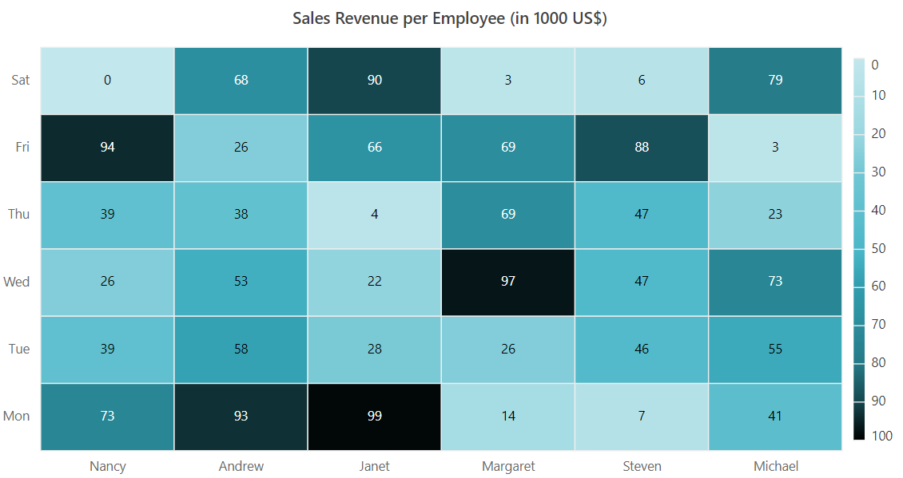
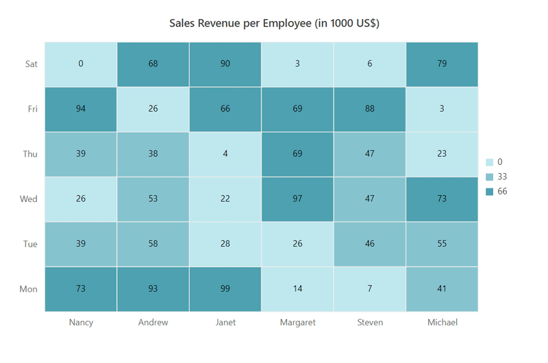
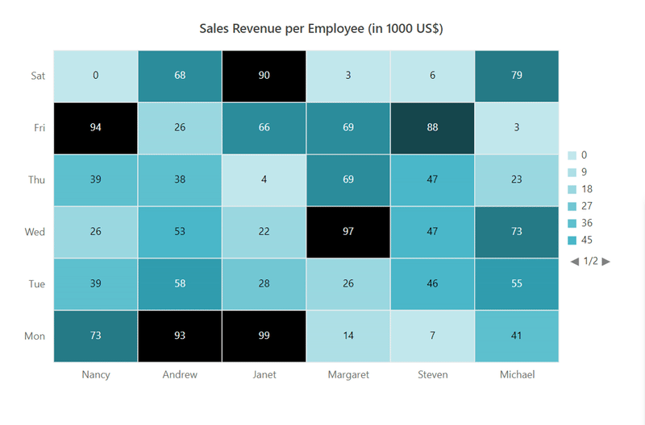
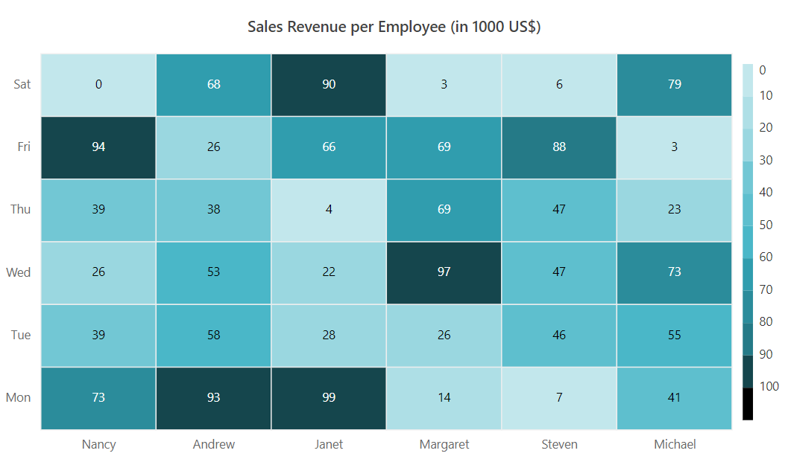

# Legend in Blazor HeatMap Chart Component

The legend provides information about the HeatMap Chart cells. Enable the legend by setting the `Visible` property to true.

```cshtml

@using Syncfusion.Blazor.HeatMap

<SfHeatMap DataSource="@HeatMapData">
    <HeatMapTitleSettings Text="Sales Revenue per Employee (in 1000 US$)">
    </HeatMapTitleSettings>
    <HeatMapXAxis Labels="@XAxisLabels"></HeatMapXAxis>
    <HeatMapYAxis Labels="@YAxisLabels"></HeatMapYAxis>
    <HeatMapCellSettings ShowLabel="true" TileType="CellType.Rect"></HeatMapCellSettings>
    <HeatMapPaletteSettings Type="PaletteType.Gradient">
        <HeatMapPalettes>
            <HeatMapPalette Value="0" Color="#C2E7EC"></HeatMapPalette>
            <HeatMapPalette Value="10" Color="#AEDFE6"></HeatMapPalette>
            <HeatMapPalette Value="20" Color="#9AD7E0"></HeatMapPalette>
            <HeatMapPalette Value="30" Color="#72C7D4"></HeatMapPalette>
            <HeatMapPalette Value="40" Color="#5EBFCE"></HeatMapPalette>
            <HeatMapPalette Value="50" Color="#4AB7C8"></HeatMapPalette>
            <HeatMapPalette Value="60" Color="#309DAE"></HeatMapPalette>
            <HeatMapPalette Value="70" Color="#2B8C9B"></HeatMapPalette>
            <HeatMapPalette Value="80" Color="#257A87"></HeatMapPalette>
            <HeatMapPalette Value="90" Color="#15464D"></HeatMapPalette>
            <HeatMapPalette Value="100" Color="#000000"></HeatMapPalette>
        </HeatMapPalettes>
    </HeatMapPaletteSettings>
    <HeatMapLegendSettings Visible="true"></HeatMapLegendSettings>
</SfHeatMap>

@code {
    public object HeatMapData { get; set; }

    string[] XAxisLabels = new string[] {"Nancy", "Andrew", "Janet", "Margaret", "Steven", "Michael" };
    string[] YAxisLabels = new string[] { "Mon", "Tue", "Wed", "Thu", "Fri", "Sat" };

    int[,] GetDefaultData()
    {
        int[,] dataSource = new int[,]
        {
            {73, 39, 26, 39, 94, 0},
            {93, 58, 53, 38, 26, 68},
            {99, 28, 22, 4, 66, 90},
            {14, 26, 97, 69, 69, 3},
            {7, 46, 47, 47, 88, 6},
            {41, 55, 73, 23, 3, 79}
        };
        return dataSource;
    }

    protected override void OnInitialized()
    {
        HeatMapData = GetDefaultData();
    }
}


```



## Legend types

The HeatMap Chart supports two legend types:

- **Gradient**: A continuous color legend with smooth transitions between palette values.
- **List**: A fixed color legend, where each palette color is shown as a separate list item.

Change the legend type using the `Type` property in `HeatMapPaletteSettings`.

```cshtml

@using Syncfusion.Blazor.HeatMap

<SfHeatMap DataSource="@HeatMapData">
    <HeatMapTitleSettings Text="Sales Revenue per Employee (in 1000 US$)">
    </HeatMapTitleSettings>
    <HeatMapXAxis Labels="@XAxisLabels"></HeatMapXAxis>
    <HeatMapYAxis Labels="@YAxisLabels"></HeatMapYAxis>
    <HeatMapCellSettings ShowLabel="true" TileType="CellType.Rect"></HeatMapCellSettings>
    <HeatMapPaletteSettings Type="PaletteType.Fixed"></HeatMapPaletteSettings>
    <HeatMapLegendSettings ShowLabel="true"></HeatMapLegendSettings>
</SfHeatMap>

@code {
    public object HeatMapData { get; set; }

    string[] XAxisLabels = new string[] {"Nancy", "Andrew", "Janet", "Margaret", "Steven", "Michael" };
    string[] YAxisLabels = new string[] { "Mon", "Tue", "Wed", "Thu", "Fri", "Sat" };

    int[,] GetDefaultData()
    {
        int[,] dataSource = new int[,]
        {
            {73, 39, 26, 39, 94, 0},
            {93, 58, 53, 38, 26, 68},
            {99, 28, 22, 4, 66, 90},
            {14, 26, 97, 69, 69, 3},
            {7, 46, 47, 47, 88, 6},
            {41, 55, 73, 23, 3, 79}
        };
        return dataSource;
    }

    protected override void OnInitialized()
    {
        HeatMapData = GetDefaultData();
    }
}

```



## Placement

Position the legend to the left, right, top, or bottom of the HeatMap Chart using the `Position` property. The default position is **Right**.

```cshtml

@using Syncfusion.Blazor.HeatMap

<SfHeatMap DataSource="@HeatMapData">
    <HeatMapTitleSettings Text="Sales Revenue per Employee (in 1000 US$)">
    </HeatMapTitleSettings>
    <HeatMapXAxis Labels="@XAxisLabels"></HeatMapXAxis>
    <HeatMapYAxis Labels="@YAxisLabels"></HeatMapYAxis>
    <HeatMapCellSettings ShowLabel="true" TileType="CellType.Rect"></HeatMapCellSettings>
    <HeatMapLegendSettings ShowLabel="true" Position="LegendPosition.Top"></HeatMapLegendSettings>
</SfHeatMap>

@code {
    public object HeatMapData { get; set; }

    string[] XAxisLabels = new string[] {"Nancy", "Andrew", "Janet", "Margaret", "Steven", "Michael" };
    string[] YAxisLabels = new string[] { "Mon", "Tue", "Wed", "Thu", "Fri", "Sat" };

    int[,] GetDefaultData()
    {
        int[,] dataSource = new int[,]
        {
            {73, 39, 26, 39, 94, 0},
            {93, 58, 53, 38, 26, 68},
            {99, 28, 22, 4, 66, 90},
            {14, 26, 97, 69, 69, 3},
            {7, 46, 47, 47, 88, 6},
            {41, 55, 73, 23, 3, 79}
        };
        return dataSource;
    }

    protected override void OnInitialized()
    {
        HeatMapData = GetDefaultData();
    }
}


```


## Alignment

Align the legend as center, far, or near using the `Alignment` property.

```cshtml

@using Syncfusion.Blazor.HeatMap

<SfHeatMap DataSource="@HeatMapData">
    <HeatMapTitleSettings Text="Sales Revenue per Employee (in 1000 US$)">
    </HeatMapTitleSettings>
    <HeatMapXAxis Labels="@XAxisLabels"></HeatMapXAxis>
    <HeatMapYAxis Labels="@YAxisLabels"></HeatMapYAxis>
    <HeatMapCellSettings ShowLabel="true" TileType="CellType.Rect"></HeatMapCellSettings>
    <HeatMapLegendSettings ShowLabel="true" Position="LegendPosition.Right" Height="150px" Alignment="Alignment.Center"></HeatMapLegendSettings>
</SfHeatMap>

@code {
    public object HeatMapData { get; set; }

    string[] XAxisLabels = new string[] {"Nancy", "Andrew", "Janet", "Margaret", "Steven", "Michael" };
    string[] YAxisLabels = new string[] { "Mon", "Tue", "Wed", "Thu", "Fri", "Sat" };

    int[,] GetDefaultData()
    {
        int[,] dataSource = new int[,]
        {
            {73, 39, 26, 39, 94, 0},
            {93, 58, 53, 38, 26, 68},
            {99, 28, 22, 4, 66, 90},
            {14, 26, 97, 69, 69, 3},
            {7, 46, 47, 47, 88, 6},
            {41, 55, 73, 23, 3, 79}
        };
        return dataSource;
    }

    protected override void OnInitialized()
    {
        HeatMapData = GetDefaultData();
    }
}

```


## Legend dimensions

Change the legend's width and height using the `Width` and `Height` properties (in pixels or percentage).

```cshtml

@using Syncfusion.Blazor.HeatMap

<SfHeatMap DataSource="@HeatMapData">
    <HeatMapTitleSettings Text="Sales Revenue per Employee (in 1000 US$)">
    </HeatMapTitleSettings>
    <HeatMapXAxis Labels="@XAxisLabels"></HeatMapXAxis>
    <HeatMapYAxis Labels="@YAxisLabels"></HeatMapYAxis>
    <HeatMapCellSettings ShowLabel="true" TileType="CellType.Rect"></HeatMapCellSettings>
    <HeatMapLegendSettings ShowLabel="true" Position="LegendPosition.Right" Width="200px" Height="150px"></HeatMapLegendSettings>
</SfHeatMap>

@code {
    public object HeatMapData { get; set; }

    string[] XAxisLabels = new string[] {"Nancy", "Andrew", "Janet", "Margaret", "Steven", "Michael" };
    string[] YAxisLabels = new string[] { "Mon", "Tue", "Wed", "Thu", "Fri", "Sat" };

    int[,] GetDefaultData()
    {
        int[,] dataSource = new int[,]
        {
            {73, 39, 26, 39, 94, 0},
            {93, 58, 53, 38, 26, 68},
            {99, 28, 22, 4, 66, 90},
            {14, 26, 97, 69, 69, 3},
            {7, 46, 47, 47, 88, 6},
            {41, 55, 73, 23, 3, 79}
        };
        return dataSource;
    }

    protected override void OnInitialized()
    {
        HeatMapData = GetDefaultData();
    }
}

```


<!-- ## Paging for legend

Paging is available for the list type legend when legend items exceed the legend bounds. Navigate between pages using navigation buttons.

```cshtml

@using Syncfusion.Blazor.HeatMap

<SfHeatMap DataSource="@HeatMapData">
    <HeatMapTitleSettings Text="Sales Revenue per Employee (in 1000 US$)">
    </HeatMapTitleSettings>
    <HeatMapXAxis Labels="@XAxisLabels"></HeatMapXAxis>
    <HeatMapYAxis Labels="@YAxisLabels"></HeatMapYAxis>
    <HeatMapCellSettings ShowLabel="true" TileType="CellType.Rect"></HeatMapCellSettings>
    <HeatMapPaletteSettings Type="PaletteType.Fixed">
        <HeatMapPalettes>
            <HeatMapPalette Value="0" Color="#C2E7EC"></HeatMapPalette>
            <HeatMapPalette Value="10" Color="#AEDFE6"></HeatMapPalette>
            <HeatMapPalette Value="20" Color="#9AD7E0"></HeatMapPalette>
            <HeatMapPalette Value="30" Color="#72C7D4"></HeatMapPalette>
            <HeatMapPalette Value="40" Color="#5EBFCE"></HeatMapPalette>
            <HeatMapPalette Value="50" Color="#4AB7C8"></HeatMapPalette>
            <HeatMapPalette Value="60" Color="#309DAE"></HeatMapPalette>
            <HeatMapPalette Value="70" Color="#2B8C9B"></HeatMapPalette>
            <HeatMapPalette Value="80" Color="#257A87"></HeatMapPalette>
            <HeatMapPalette Value="90" Color="#15464D"></HeatMapPalette>
            <HeatMapPalette Value="100" Color="#000000"></HeatMapPalette>
        </HeatMapPalettes>
    </HeatMapPaletteSettings>
    <HeatMapLegendSettings ShowLabel="true" Position="LegendPosition.Right" Alignment="Alignment.Center" Height="150px"></HeatMapLegendSettings>
</SfHeatMap>

@code {
    public object HeatMapData { get; set; }

    string[] XAxisLabels = new string[] {"Nancy", "Andrew", "Janet", "Margaret", "Steven", "Michael" };
    string[] YAxisLabels = new string[] { "Mon", "Tue", "Wed", "Thu", "Fri", "Sat" };

    int[,] GetDefaultData()
    {
        int[,] dataSource = new int[,]
        {
            {73, 39, 26, 39, 94, 0},
            {93, 58, 53, 38, 26, 68},
            {99, 28, 22, 4, 66, 90},
            {14, 26, 97, 69, 69, 3},
            {7, 46, 47, 47, 88, 6},
            {41, 55, 73, 23, 3, 79}
        };
        return dataSource;
    }

    protected override void OnInitialized()
    {
        HeatMapData = GetDefaultData();
    }
}

```



## Smart legend

Smart legend improves responsiveness and readability for list type legends with many items. Enable with the `EnableSmartLegend` property when the palette type is `Fixed`.

Change the display type of legend labels using the `LabelDisplayType` property:
- **All**: Displays all labels.
- **Edge**: Displays labels only at the ends.
- **None**: No labels are displayed; tooltips appear on hover.

```cshtml

@using Syncfusion.Blazor.HeatMap

<SfHeatMap DataSource="@HeatMapData">
    <HeatMapTitleSettings Text="Sales Revenue per Employee (in 1000 US$)">
    </HeatMapTitleSettings>
    <HeatMapXAxis Labels="@XAxisLabels"></HeatMapXAxis>
    <HeatMapYAxis Labels="@YAxisLabels"></HeatMapYAxis>
    <HeatMapCellSettings ShowLabel="true" TileType="CellType.Rect"></HeatMapCellSettings>
    <HeatMapPaletteSettings Type="PaletteType.Fixed">
        <HeatMapPalettes>
            <HeatMapPalette Value="0" Color="#C2E7EC"></HeatMapPalette>
            <HeatMapPalette Value="10" Color="#AEDFE6"></HeatMapPalette>
            <HeatMapPalette Value="20" Color="#9AD7E0"></HeatMapPalette>
            <HeatMapPalette Value="30" Color="#72C7D4"></HeatMapPalette>
            <HeatMapPalette Value="40" Color="#5EBFCE"></HeatMapPalette>
            <HeatMapPalette Value="50" Color="#4AB7C8"></HeatMapPalette>
            <HeatMapPalette Value="60" Color="#309DAE"></HeatMapPalette>
            <HeatMapPalette Value="70" Color="#2B8C9B"></HeatMapPalette>
            <HeatMapPalette Value="80" Color="#257A87"></HeatMapPalette>
            <HeatMapPalette Value="90" Color="#15464D"></HeatMapPalette>
            <HeatMapPalette Value="100" Color="#000000"></HeatMapPalette>
        </HeatMapPalettes>
    </HeatMapPaletteSettings>
    <HeatMapLegendSettings ShowLabel="true" Position="LegendPosition.Right" EnableSmartLegend="true" Alignment="Alignment.Center"></HeatMapLegendSettings>
</SfHeatMap>

@code {
    public object HeatMapData { get; set; }

    string[] XAxisLabels = new string[] {"Nancy", "Andrew", "Janet", "Margaret", "Steven", "Michael" };
    string[] YAxisLabels = new string[] { "Mon", "Tue", "Wed", "Thu", "Fri", "Sat" };

    int[,] GetDefaultData()
    {
        int[,] dataSource = new int[,]
        {
            {73, 39, 26, 39, 94, 0},
            {93, 58, 53, 38, 26, 68},
            {99, 28, 22, 4, 66, 90},
            {14, 26, 97, 69, 69, 3},
            {7, 46, 47, 47, 88, 6},
            {41, 55, 73, 23, 3, 79}
        };
        return dataSource;
    }

    protected override void OnInitialized()
    {
        HeatMapData = GetDefaultData();
    }
}

```


## Legend selection

Legend selection toggles the visibility of cells for specific value ranges. Enable with the `ToggleVisibility` property.

```cshtml

@using Syncfusion.Blazor.HeatMap

<SfHeatMap DataSource="@HeatMapData">
    <HeatMapTitleSettings Text="Sales Revenue per Employee (in 1000 US$)">
    </HeatMapTitleSettings>
    <HeatMapXAxis Labels="@XAxisLabels"></HeatMapXAxis>
    <HeatMapYAxis Labels="@YAxisLabels"></HeatMapYAxis>
    <HeatMapCellSettings ShowLabel="true" TileType="CellType.Rect"></HeatMapCellSettings>
    <HeatMapPaletteSettings Type="PaletteType.Fixed">
        <HeatMapPalettes>
            <HeatMapPalette Value="0" Color="#C2E7EC"></HeatMapPalette>
            <HeatMapPalette Value="10" Color="#AEDFE6"></HeatMapPalette>
            <HeatMapPalette Value="20" Color="#9AD7E0"></HeatMapPalette>
            <HeatMapPalette Value="30" Color="#72C7D4"></HeatMapPalette>
            <HeatMapPalette Value="40" Color="#5EBFCE"></HeatMapPalette>
            <HeatMapPalette Value="50" Color="#4AB7C8"></HeatMapPalette>
            <HeatMapPalette Value="60" Color="#309DAE"></HeatMapPalette>
            <HeatMapPalette Value="70" Color="#2B8C9B"></HeatMapPalette>
            <HeatMapPalette Value="80" Color="#257A87"></HeatMapPalette>
            <HeatMapPalette Value="90" Color="#15464D"></HeatMapPalette>
            <HeatMapPalette Value="100" Color="#000000"></HeatMapPalette>
        </HeatMapPalettes>
    </HeatMapPaletteSettings>
    <HeatMapLegendSettings ShowLabel="true" Position="LegendPosition.Right" EnableSmartLegend="true" ToggleVisibility="true"></HeatMapLegendSettings>
</SfHeatMap>

@code {
    public object HeatMapData { get; set; }

    string[] XAxisLabels = new string[] {"Nancy", "Andrew", "Janet", "Margaret", "Steven", "Michael"};
    string[] YAxisLabels = new string[] { "Mon", "Tue", "Wed", "Thu", "Fri", "Sat" };

    int[,] GetDefaultData()
    {
        int[,] dataSource = new int[,]
        {
            {73, 39, 26, 39, 94, 0},
            {93, 58, 53, 38, 26, 68},
            {99, 28, 22, 4, 66, 90},
            {14, 26, 97, 69, 69, 3},
            {7, 46, 47, 47, 88, 6},
            {41, 55, 73, 23, 3, 79}
        };
        return dataSource;
    }

    protected override void OnInitialized()
    {
        HeatMapData = GetDefaultData();
    }
}

```

 -->
