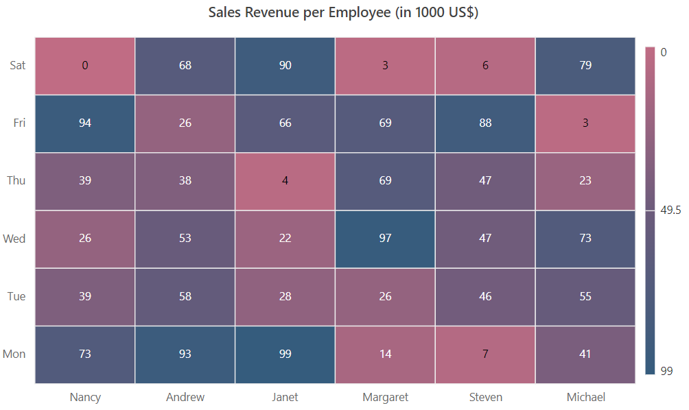
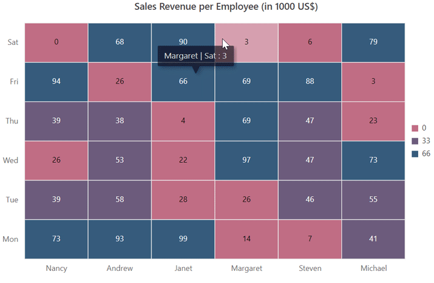

# Palette in Blazor HeatMap Chart Component

In the HeatMap Chart, each data point is displayed as a cell with a color applied based on its value. The palette defines the color range for cells and the gradient type for colors. Colors can be specified in RGB or hex codes using the `Color` property in `HeatMapPalette`. The defined colors are applied to cell backgrounds according to the palette type and cell value.

## Palette types

Heat map cells can be displayed using either gradient or fixed colors.

### Gradient

A smooth transition between palette colors is applied to cells based on their values. The HeatMap Chart calculates all gradient colors between the start and end colors for distinct data values. If colors are not defined, default start and end colors are used. Set the palette type to `Gradient` for the `Type` property in `HeatMapPaletteSettings`.

```cshtml

@using Syncfusion.Blazor.HeatMap

<SfHeatMap DataSource="@HeatMapData">
    <HeatMapTitleSettings Text="Sales Revenue per Employee (in 1000 US$)">
    </HeatMapTitleSettings>
    <HeatMapXAxis Labels="@XAxisLabels"></HeatMapXAxis>
    <HeatMapYAxis Labels="@YAxisLabels"></HeatMapYAxis>
    <HeatMapCellSettings ShowLabel="true" TileType="CellType.Rect"></HeatMapCellSettings>
    <HeatMapPaletteSettings Type="PaletteType.Gradient">
        <HeatMapPalettes>
            <HeatMapPalette Color="#C06C84"></HeatMapPalette>
            <HeatMapPalette Color="#6C5B7B"></HeatMapPalette>
            <HeatMapPalette Color="#355C7D"></HeatMapPalette>
        </HeatMapPalettes>
    </HeatMapPaletteSettings>
</SfHeatMap>

@code {
    public object HeatMapData { get; set; }

    string[] XAxisLabels = new string[] {"Nancy", "Andrew", "Janet", "Margaret", "Steven", "Michael" };
    string[] YAxisLabels = new string[] { "Mon", "Tue", "Wed", "Thu", "Fri", "Sat" };

    int[,] GetDefaultData()
    {
        int[,] dataSource = new int[,]
        {
            {73, 39, 26, 39, 94, 0},
            {93, 58, 53, 38, 26, 68},
            {99, 28, 22, 4, 66, 90},
            {14, 26, 97, 69, 69, 3},
            {7, 46, 47, 47, 88, 6},
            {41, 55, 73, 23, 3, 79}
        };
        return dataSource;
    }

    protected override void OnInitialized()
    {
        HeatMapData = GetDefaultData();
    }
}

```



### Fixed

In the fixed palette type, solid colors are applied to cells. Data values are grouped based on the number of defined colors. Set the palette type to `Fixed` for the `Type` property in `HeatMapPaletteSettings`.

```cshtml

@using Syncfusion.Blazor.HeatMap

<SfHeatMap DataSource="@HeatMapData">
    <HeatMapTitleSettings Text="Sales Revenue per Employee (in 1000 US$)">
    </HeatMapTitleSettings>
    <HeatMapXAxis Labels="@XAxisLabels"></HeatMapXAxis>
    <HeatMapYAxis Labels="@YAxisLabels"></HeatMapYAxis>
    <HeatMapCellSettings ShowLabel="true" TileType="CellType.Rect"></HeatMapCellSettings>
    <HeatMapPaletteSettings Type="PaletteType.Fixed">
        <HeatMapPalettes>
            <HeatMapPalette Color="#C06C84"></HeatMapPalette>
            <HeatMapPalette Color="#6C5B7B"></HeatMapPalette>
            <HeatMapPalette Color="#355C7D"></HeatMapPalette>
        </HeatMapPalettes>
    </HeatMapPaletteSettings>
</SfHeatMap>

@code {
    public object HeatMapData { get; set; }

    string[] XAxisLabels = new string[] {"Nancy", "Andrew", "Janet", "Margaret", "Steven", "Michael" };
    string[] YAxisLabels = new string[] { "Mon", "Tue", "Wed", "Thu", "Fri", "Sat" };

    int[,] GetDefaultData()
    {
        int[,] dataSource = new int[,]
        {
            {73, 39, 26, 39, 94, 0},
            {93, 58, 53, 38, 26, 68},
            {99, 28, 22, 4, 66, 90},
            {14, 26, 97, 69, 69, 3},
            {7, 46, 47, 47, 88, 6},
            {41, 55, 73, 23, 3, 79}
        };
        return dataSource;
    }

    protected override void OnInitialized()
    {
        HeatMapData = GetDefaultData();
    }
}

```



<!-- ## Defining color stops

You can define color ranges or stops for data values in both gradient and fixed palette types. Specify the data value in the `Value` property for `HeatMapPalette` to calculate color stops. The HeatMap Chart automatically calculates color stops if the `Value` property is not defined. The `Label` property provides additional information for the legend. If the label is not provided, the value is displayed in the legend. Labels can be automatically calculated based on data values if both values and labels are not defined.

```cshtml

@using Syncfusion.Blazor.HeatMap

<SfHeatMap DataSource="@HeatMapData">
    <HeatMapTitleSettings Text="Sales Revenue per Employee (in 1000 US$)">
    </HeatMapTitleSettings>
    <HeatMapXAxis Labels="@XAxisLabels"></HeatMapXAxis>
    <HeatMapYAxis Labels="@YAxisLabels"></HeatMapYAxis>
    <HeatMapCellSettings ShowLabel="true" TileType="CellType.Rect"></HeatMapCellSettings>
    <HeatMapPaletteSettings Type="PaletteType.Fixed">
        <HeatMapPalettes>
            <HeatMapPalette Color="#C06C84" Label="Low" Value=3></HeatMapPalette>
            <HeatMapPalette Color="#6C5B7B" Label="Moderate" Value=33.3></HeatMapPalette>
            <HeatMapPalette Color="#355C7D" Label="High" Value=75></HeatMapPalette>
        </HeatMapPalettes>
    </HeatMapPaletteSettings>
</SfHeatMap>

@code {
    public object HeatMapData { get; set; }

    string[] XAxisLabels = new string[] {"Nancy", "Andrew", "Janet", "Margaret", "Steven", "Michael" };
    string[] YAxisLabels = new string[] { "Mon", "Tue", "Wed", "Thu", "Fri", "Sat" };

    int[,] GetDefaultData()
    {
        int[,] dataSource = new int[,]
        {
            {73, 39, 26, 39, 94, 0},
            {93, 58, 53, 38, 26, 68},
            {99, 28, 22, 4, 66, 90},
            {14, 26, 97, 69, 69, 3},
            {7, 46, 47, 47, 88, 6},
            {41, 55, 73, 23, 3, 79}
        };
        return dataSource;
    }

    protected override void OnInitialized()
    {
        HeatMapData = GetDefaultData();
    }
}

```
 -->
