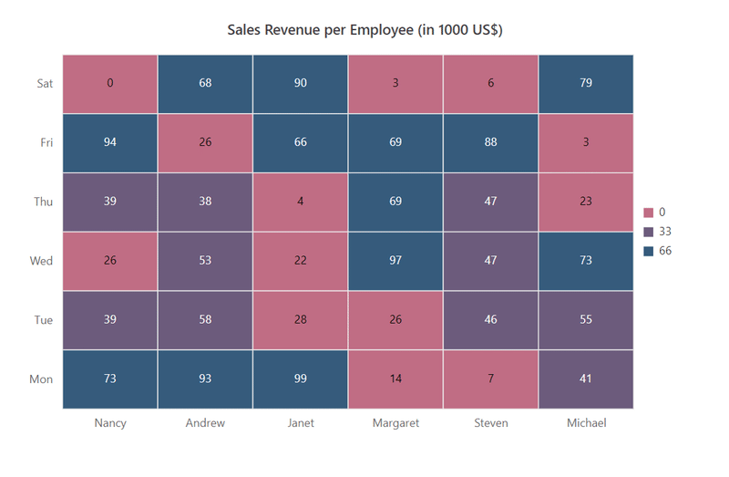

# Palette

In heat map, each data point is displayed as a cell with applied color based on the data value. The palette in the heat map is used to define the color range for cells and gradient type for colors. You can define the colors either in RGB or hex codes using the `Color` property in the `HeatMapPalette`. The defined colors are applied to the cell background based on the palette type and cell value.

## Palette types

You can display the heat map cells either in gradient colors or fixed colors.

### Gradient

The smooth transition between the given palette colors can be applied for the heat map cells based on value. The heat map calculates all the gradient colors between the start and end colors for all distinct data values. Default start color and end color will be considered for gradient calculation, if the colors are not defined. The palette type must be defined as `Gradient` for the `Type` property in the `HeatMapPaletteSettings` property.

```csharp

@using Syncfusion.Blazor.HeatMap

<SfHeatMap DataSource="@HeatMapData" RenderingMode="DrawType.SVG">
    <HeatMapTitleSettings Text="Sales Revenue per Employee (in 1000 US$)">
    </HeatMapTitleSettings>
    <HeatMapXAxis Labels="@XAxisLabels"></HeatMapXAxis>
    <HeatMapYAxis Labels="@YAxisLabels"></HeatMapYAxis>
    <HeatMapCellSettings ShowLabel="true" TileType="CellType.Rect"></HeatMapCellSettings>
    <HeatMapPaletteSettings Type="PaletteType.Gradient">
        <HeatMapPalettes>
            <HeatMapPalette Color="#C06C84"></HeatMapPalette>
            <HeatMapPalette Color="#6C5B7B"></HeatMapPalette>
            <HeatMapPalette Color="#355C7D"></HeatMapPalette>
        </HeatMapPalettes>
    </HeatMapPaletteSettings>
</SfHeatMap>

@code{
    int[,] GetDefaultData()
    {
        int[,] dataSource = new int[,]
        {
            {73, 39, 26, 39, 94, 0},
            {93, 58, 53, 38, 26, 68},
            {99, 28, 22, 4, 66, 90},
            {14, 26, 97, 69, 69, 3},
            {7, 46, 47, 47, 88, 6},
            {41, 55, 73, 23, 3, 79}
        };
        return dataSource;
    }
    string[] XAxisLabels = new string[] {"Nancy", "Andrew", "Janet", "Margaret", "Steven", "Michael" };
    string[] YAxisLabels = new string[] { "Mon", "Tue", "Wed", "Thu", "Fri", "Sat" };
    public object HeatMapData { get; set; }
    protected override void OnInitialized()
    {
        HeatMapData = GetDefaultData();
    }
}

```


### Fixed

In fixed palette type, solid colors are applied to the heat map cells. The data values can be grouped based on the number of colors defined for the heat map. The palette type should be defined as `Fixed` for the `Type` property in the `HeatMapPaletteSettings` property.

```csharp

@using Syncfusion.Blazor.HeatMap

<SfHeatMap DataSource="@HeatMapData" RenderingMode="DrawType.SVG">
    <HeatMapTitleSettings Text="Sales Revenue per Employee (in 1000 US$)">
    </HeatMapTitleSettings>
    <HeatMapXAxis Labels="@XAxisLabels"></HeatMapXAxis>
    <HeatMapYAxis Labels="@YAxisLabels"></HeatMapYAxis>
    <HeatMapCellSettings ShowLabel="true" TileType="CellType.Rect"></HeatMapCellSettings>
    <HeatMapPaletteSettings Type="PaletteType.Fixed">
        <HeatMapPalettes>
            <HeatMapPalette Color="#C06C84"></HeatMapPalette>
            <HeatMapPalette Color="#6C5B7B"></HeatMapPalette>
            <HeatMapPalette Color="#355C7D"></HeatMapPalette>
        </HeatMapPalettes>
    </HeatMapPaletteSettings>
</SfHeatMap>

@code{
    int[,] GetDefaultData()
    {
        int[,] dataSource = new int[,]
        {
            {73, 39, 26, 39, 94, 0},
            {93, 58, 53, 38, 26, 68},
            {99, 28, 22, 4, 66, 90},
            {14, 26, 97, 69, 69, 3},
            {7, 46, 47, 47, 88, 6},
            {41, 55, 73, 23, 3, 79}
        };
        return dataSource;
    }
    string[] XAxisLabels = new string[] {"Nancy", "Andrew", "Janet", "Margaret", "Steven", "Michael" };
    string[] YAxisLabels = new string[] { "Mon", "Tue", "Wed", "Thu", "Fri", "Sat" };
    public object HeatMapData { get; set; }
    protected override void OnInitialized()
    {
        HeatMapData = GetDefaultData();
    }
}

```



<!-- ## Defining color stops

You can define the colors ranges or color stops for data values in both gradient and fixed palette types. You need to define the data value in the `Value` property for `HeatMapPalette` property to calculate the color stops. The heat map automatically calculates the color stops if the `Value` property is not defined. The `Label` property is used to provide the additional information about the color that is to be displayed in the legend. If the label is not provided, the value will be displayed in the legend. The labels can be automatically calculated based on data values, if both the values and labels are not defined.

```csharp

@using Syncfusion.Blazor.HeatMap

<SfHeatMap DataSource="@HeatMapData" RenderingMode="DrawType.SVG">
    <HeatMapTitleSettings Text="Sales Revenue per Employee (in 1000 US$)">
    </HeatMapTitleSettings>
    <HeatMapXAxis Labels="@XAxisLabels"></HeatMapXAxis>
    <HeatMapYAxis Labels="@YAxisLabels"></HeatMapYAxis>
    <HeatMapCellSettings ShowLabel="true" TileType="CellType.Rect"></HeatMapCellSettings>
    <HeatMapPaletteSettings Type="PaletteType.Fixed">
        <HeatMapPalettes>
            <HeatMapPalette Color="#C06C84" Label="Low" Value=3></HeatMapPalette>
            <HeatMapPalette Color="#6C5B7B" Label="Moderate" Value=33.3></HeatMapPalette>
            <HeatMapPalette Color="#355C7D" Label="High" Value=75></HeatMapPalette>
        </HeatMapPalettes>
    </HeatMapPaletteSettings>
</SfHeatMap>

@code{
    int[,] GetDefaultData()
    {
        int[,] dataSource = new int[,]
        {
            {73, 39, 26, 39, 94, 0},
            {93, 58, 53, 38, 26, 68},
            {99, 28, 22, 4, 66, 90},
            {14, 26, 97, 69, 69, 3},
            {7, 46, 47, 47, 88, 6},
            {41, 55, 73, 23, 3, 79}
        };
        return dataSource;
    }
    string[] XAxisLabels = new string[] {"Nancy", "Andrew", "Janet", "Margaret", "Steven", "Michael" };
    string[] YAxisLabels = new string[] { "Mon", "Tue", "Wed", "Thu", "Fri", "Sat" };
    public object HeatMapData { get; set; }
    protected override void OnInitialized()
    {
        HeatMapData = GetDefaultData();
    }
}

```

 -->